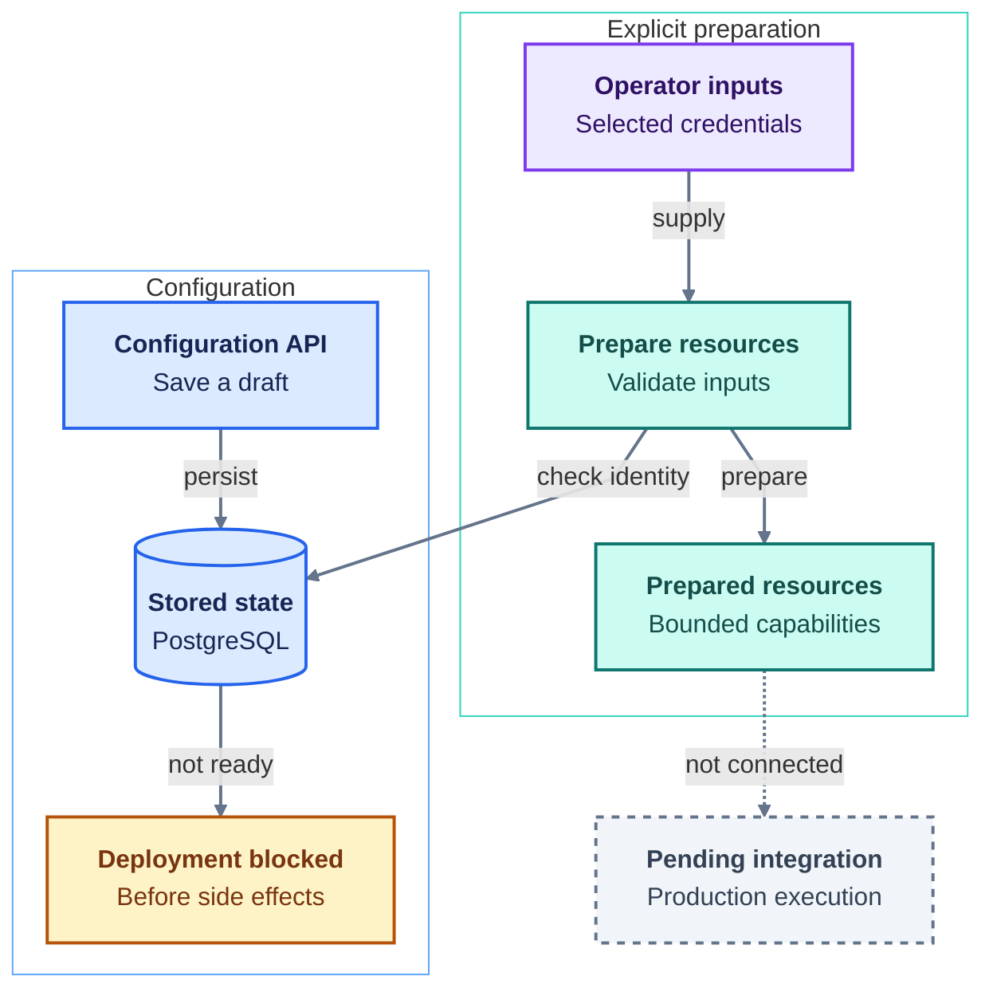

# Flowchart template

This is an illustrative example, not a claim about any implementation. Replace
its nodes and edges with the subject being explained. In this example, solid
arrows show implemented connections; the dashed arrow marks pending integration.

