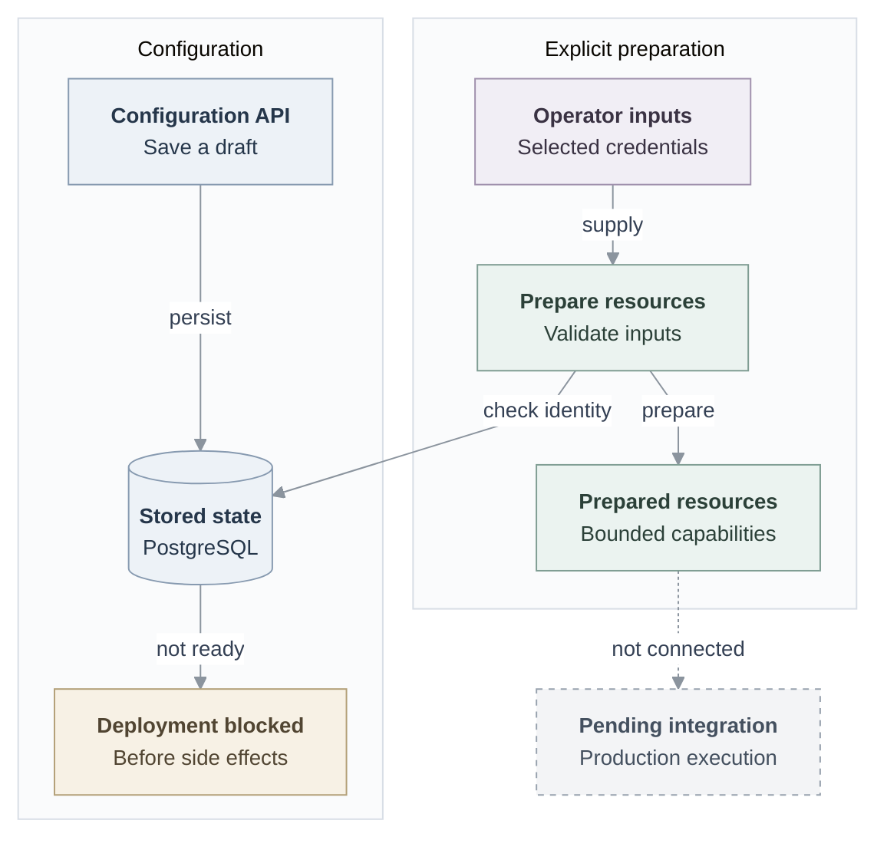

# Flowchart template

This is an illustrative example, not a claim about any implementation. Replace
its nodes and edges with the subject being explained. In this example, solid
arrows show implemented connections; the dashed arrow marks pending integration.

Treat these values as a starting point. The longer `persist` arrow aligns the
phase starts; it remains one implemented connection. Keep the phase-title margin
separate from node padding, and inspect the result at its intended display width.
See Mermaid's [flowchart configuration](https://mermaid.js.org/config/schema-docs/config-defs-flowchart-diagram-config.html)
for spacing options.
