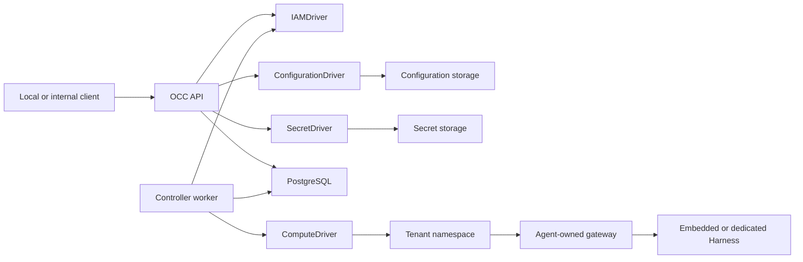
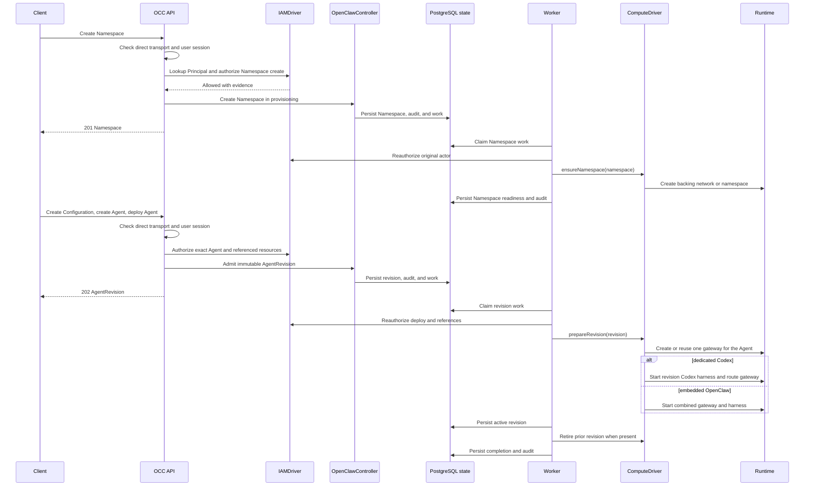

# OpenClaw Enterprise architecture

OpenClaw Enterprise provides an OpenClaw Control Center (OCC) that manages
Agents, tenant isolation, workload execution, authorization, and audit evidence.

This document describes the current implementation. The
[platform design](design.md) defines the authoritative target architecture;
capabilities described there are not necessarily implemented. Current supported
behavior is owned by the [feature reference](reference/README.md), procedures by
the [guides](README.md#start-and-deploy), and source execution by
[flow docs](README.md#understand-the-code).

## System overview

The control plane consists of an API, an independent controller worker,
PostgreSQL-backed state, and Installation-selected Drivers. The API also serves
the [read-only platform console](reference/console.md) at `/console/`. Its static
browser module uses same-origin sessions and the existing authorized APIs; it
adds no frontend service or resource persistence.



OCC owns platform resources and desired state. The worker realizes that state
through the selected Compute Driver; Drivers do not own platform resources or
bypass OCC authorization.

## Platform resources

```text
Installation
└── Namespace
    ├── Configuration
    ├── ServiceAccount
    ├── Secret
    └── Agent
        └── AgentRevision
```

- **Installation:** The singleton platform boundary that configures Providers and selects its Drivers.
- **Provider:** Installation-owned client and related Driver configuration; not an OCC resource.
- **Namespace:** A tenant boundary that isolates its resources and workloads.
- **Configuration:** A Namespace-owned native OpenClaw configuration document.
- **ServiceAccount:** A Namespace-owned provider account with an opaque
  credential reference; credential values are not returned through the API.
- **Agent:** A Namespace-owned Agent referencing one Configuration and,
  optionally, one ServiceAccount in the same Namespace and one configured Provider.
- **Secret:** A Namespace-owned value stored by the selected SecretDriver and
  returned through OCC as metadata only.
- **AgentRevision:** An immutable snapshot of the Agent's Configuration,
  Harness, Secret references, credentials, nullable Provider reference, and selected Compute implementation.

Creating an Agent does not start a workload. Deployment creates an immutable
revision, which the controller worker provisions asynchronously.

## Control plane

The API authenticates requests, resolves caller identity, authorizes access to
exact resources, and records resource changes. PostgreSQL stores platform
state, IAM policy, controller work, and attributable audit evidence.

Compose and Helm run one shared initializer after database migration and before
API/worker startup. Both processes load initialized state; only the initializer
mounts credential output. Fresh native-IAM bootstrap creates human and non-Agent service administrators
with separate bindings to the same Role. Better Auth owns their credentials;
bootstrap delivers the initial service key through protected storage. Auth
persistence and the Installation/IAM commit are separate. Any bootstrap failure
preserves created artifacts and requires operator verification and manual repair. Existing Installations receive no backfill. See
[authentication](reference/authentication.md#installation-and-account-ownership)
and the [bootstrap flow](flows/local-password-authentication.md).

The controller worker claims pending Namespace and AgentRevision work,
reauthorizes the original operation, and invokes the selected Compute Driver.
Resource changes, queued work, and audit evidence are committed together.

The main implementation boundaries are:

| Component            | Responsibility                                              |
| -------------------- | ----------------------------------------------------------- |
| `apps/controller`    | HTTP API, admission, composition, and controller worker.    |
| `packages/contracts` | Platform resources, Driver contracts, and API schemas.      |
| `packages/occ`       | Platform ownership, lifecycle, persistence, and work queue. |
| `packages/iam`       | Identity lookup and exact-resource authorization.           |
| `packages/audit`     | Attributable audit events and sensitive-value sanitization. |

See the [controller worker](reference/controller.md), [authentication](reference/authentication.md),
and [API reference](reference/api.md) for operational details.

## Drivers

OCC selects the Drivers used by its Installation:

| Driver                 | Responsibility                                                  | Available implementations                             |
| ---------------------- | --------------------------------------------------------------- | ----------------------------------------------------- |
| `IAMDriver`            | Resolve identities and authorize exact-resource access.         | Bundled native IAM or an installed Driver.            |
| `ComputeDriver`        | Provision tenant infrastructure and Agent workloads.            | Bundled Docker, Kubernetes, SSH, or installed Driver. |
| `ConfigurationDriver`  | Store Namespace-owned OpenClaw configuration documents.         | Filesystem, Kubernetes ConfigMaps, or installed.      |
| `SecretDriver`         | Store Namespace-owned Secret values and validate delivery refs. | Bundled Kubernetes Secrets.                           |
| `ServiceAccountDriver` | Provision upstream provider accounts and their credentials.     | Optional ChatGPT Provider member.                     |

A configured [Provider](reference/providers.md) owns a client and its related
Driver membership. Only the API constructs the ChatGPT client and injects its
Provider into the bundled ServiceAccount Driver; the worker validates nonsecret
metadata. Agent and revision `providerId` references are nullable. Managed
access tokens require exact Provider, Driver, workspace, and account binding.

Compute owns workload provisioning, readiness, activation, and retirement.
Other selected Drivers can participate through bounded lifecycle hooks without
assuming workload ownership.

See the [ComputeDriver contract](reference/drivers/compute.md),
[Driver installation guide](reference/drivers/selection.md), and
[Kubernetes Secret Driver](reference/drivers/kubernetes-secret.md).

## Agent execution

Every deployed Agent has its own OpenClaw gateway. The selected Harness
determines its execution topology:

- **Embedded OpenClaw:** The gateway and Harness run in one workload.
- **Dedicated Codex:** The gateway and Harness run in separate workloads with
  separate identities, authenticated transport, and an Agent-owned shared
  workspace.

Only an active AgentRevision receives traffic. Updating an Agent or its
Configuration does not change an existing workload until a new revision is
deployed and activated.

### Agent provisioning sequence

Agent runtime provisioning is asynchronous. Agent creation records resource
state only; `deploy` admits an immutable `AgentRevision`, and the worker later
invokes the selected Compute Driver for runtime effects.



See [Agent management](reference/agents.md) and the
[Harness execution topology](flows/harness-execution-topology.md).

## Security boundaries

- Controller API access uses authenticated sessions; IAM authorizes each
  operation against its exact Installation, Namespace, Agent, or revision.
- Namespace isolation prevents access to another tenant's resources or
  workloads.
- Agent revisions, workload identity, configuration, and credentials remain
  scoped to their owning Agent.
- Namespace-owned Secret values are stored by the selected SecretDriver; OCC
  responses, audit records, ConfigMaps, and consumers without an admitted binding
  for that Secret carry only metadata or references.
- Production Kubernetes workloads use restricted Pod security, NetworkPolicies,
  least-privilege ServiceAccounts, and projected workload identity.
- Dedicated gateway and Harness workloads receive only the credentials required
  for their respective responsibilities.
- Mutations and authorization denials produce attributable audit evidence;
  missing authorization or audit dependencies fail closed.

See [identity and access management](reference/authorization.md), [security](reference/security.md), and
[Secret storage and delivery](flows/secret-storage-and-delivery.md).

## Deployment modes

**Local development** runs the API, controller worker, and PostgreSQL through
Docker Compose. The default Compute Driver provisions Agent workloads as Docker
containers; the API is available only through loopback.

**Production Kubernetes** runs the API and worker as separate Pods backed by
PostgreSQL. The selected Kubernetes Compute Driver creates isolated tenant
namespaces, Agent-owned gateways, and embedded or dedicated Agent workloads.
The production API is internal-only.

**SSH host execution** selects `compute-ssh` in trusted Installation YAML in
development or production. The Compute Driver manages embedded OpenClaw on
operator-provisioned Linux hosts through SSH, with one systemd unit per Agent,
immutable snapshots, and persistent Agent state. Each Agent receives a distinct
Unix user and group. Revision preparation stages its snapshot; activation
switches the systemd gateway after OCC commits the active revision. The existing
control plane remains responsible for admission and activation. Host networking
remains an operator responsibility; dedicated Codex,
SandboxDriver composition, and OCC Secret delivery are unsupported. Local proof
uses transport/systemd fixtures; the opt-in real-host integration is the host
proof.

Reviewed installed Drivers can be selected in both development and production.
See [Docker development](reference/drivers/docker-compute.md),
[Kubernetes deployment](guides/deploy.md), and the
[Kubernetes Compute Driver](reference/drivers/kubernetes-compute.md), plus
[SSH Compute](reference/drivers/ssh-compute.md) and its
[real-host test rig](testing.md#ssh-raw-hosts).

## Current limitations

The current implementation does not provide:

- Public ingress, external identity federation, or console resource management.
  The console currently lists Agents, Providers, and Namespaces; creation,
  editing, deployment, and resource details remain outside its scope.
- A general, verified pre-execution sandbox policy barrier for every runtime.
  Optional SandboxDriver facets and delegated OpenShell Harness provisioning
  exist, but upstream compatibility and enforcement limitations remain; see
  the [SandboxDriver reference](reference/drivers/sandbox.md).
- SecretBroker substitution, brokered model credentials, or an approved
  restricted model-egress proxy.
- Service-principal API authentication, token exchange, or production workload
  token verification.
- Secret value history, automatic Secret rotation, automatic workload restart
  after Secret update, or automatic provider credential refresh.
- Shared Kubernetes clusters or multi-replica Agent gateways.

The [platform design](design.md) describes target capabilities beyond the
current implementation.

## Related documentation

- [Platform design](design.md)
- [Documentation index](README.md)
- [Configuration reference](reference/settings.md)
- [Controller worker](reference/controller.md)
- [Identity and access management](reference/authorization.md)
- [Security model](reference/security.md)
- [ComputeDriver contract](reference/drivers/compute.md)
- [Docker Compute Driver](reference/drivers/docker-compute.md)
- [Kubernetes Compute Driver](reference/drivers/kubernetes-compute.md)
- [Production Kubernetes deployment](guides/deploy.md)
