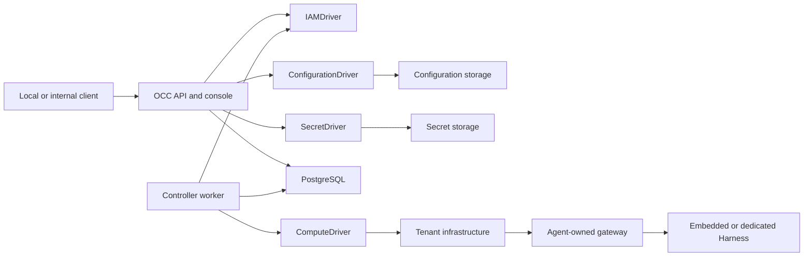
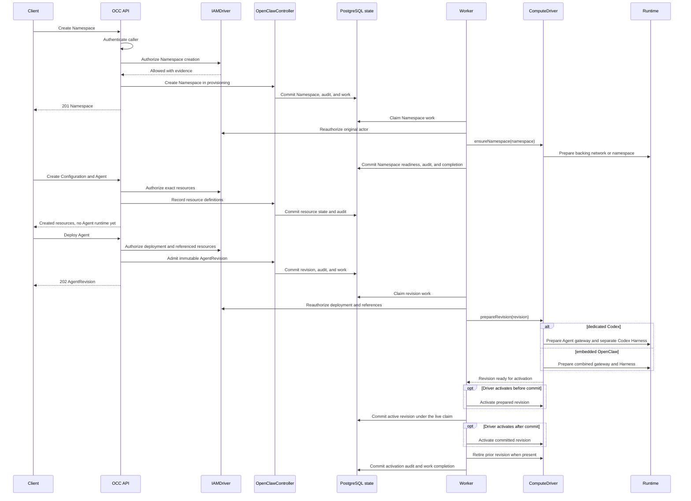

# OpenClaw Enterprise architecture

OpenClaw Control Plane (OCC) stores desired Agent state and runs a worker that
turns it into workloads through selected Drivers. This page describes the current
implementation; the [platform design](design.md) defines the authoritative target,
including capabilities that have not shipped.

## System overview

The control plane contains an API, an independent worker, PostgreSQL, and
Installation-selected Drivers. The API also serves the [platform console](reference/console.md)
at `/console/`; browser actions use the same authorized APIs.

OCC owns platform resources and desired state. Drivers operate the backing
infrastructure; they do not bypass OCC authorization or become resource owners.

## Platform resources

Each deployment has one Installation. Its Namespaces contain Configurations,
ServiceAccounts, Secrets, and Agents. Each Agent owns immutable AgentRevisions.
References must stay within their admitted scope.

[Concepts](guides/concepts.md) defines these resources and distinguishes platform
identities from Kubernetes identities. [Feature reference](reference/README.md)
owns their fields, permissions, and lifecycle rules.

[Agent plugins](reference/agent-plugins.md) defines the optional Agent-owned
plugin map. AgentRevision snapshots record the requested plugin IDs and policy;
startup resolves them through the selected PluginDriver.

## Control plane

The API authenticates callers, authorizes exact resource operations, and records
changes. PostgreSQL stores platform state, IAM policy, controller work, and audit
evidence. Resource mutations, queued work, and audit records commit together.

Compose and Helm initialize the Installation after database migration and before
starting the API and worker. Only the initializer mounts bootstrap credential
output. See [startup](flows/platform-startup.md) and
[bootstrap recovery](guides/deploy/service-keys.md#recover-an-incomplete-bootstrap)
for initialization ordering and failure handling.

| Component            | Responsibility                                                |
| -------------------- | ------------------------------------------------------------- |
| `apps/controller`    | API, console, admission, composition, and worker entrypoints. |
| `packages/contracts` | Resource models, Driver interfaces, and API schemas.          |
| `packages/occ`       | Resource ownership, lifecycle, persistence, and work queue.   |
| `packages/iam`       | Identity lookup and authorization.                            |
| `packages/audit`     | Audit events and sensitive-value sanitization.                |

## Drivers

Installation configuration selects infrastructure implementations for compute,
configuration, identity, Secrets, optional provider service accounts, and optional
Agent plugin translation.
[Driver reference](reference/README.md#drivers) owns available implementations
and contracts; [selection](reference/drivers/selection.md) explains trusted package loading.

Compute owns workload provisioning, readiness, activation, and retirement.
Other Drivers may participate through bounded
[Compute lifecycle hooks](flows/compute-driver-lifecycle-hooks.md).
[Providers](reference/providers.md) supply authenticated clients to related Drivers.
[PluginDriver](reference/drivers/plugin.md) resolves curated Agent plugin
selections and renders native runtime policy during revision startup.

## Agent execution

An Agent's gateway serves client connections. Embedded OpenClaw runs the gateway
and Harness together; dedicated Codex uses separate workloads with separate
identities and an Agent-owned shared workspace. See
[Harness execution](reference/harness-execution.md) for topology and credential boundaries.

### Agent provisioning sequence

Agent creation records a definition; deployment admits an immutable
AgentRevision for the worker to provision asynchronously. The sequence below
shows successful provisioning and activation.

Editing a draft does not change the running revision. Admission alone does not
prove runtime readiness. The [controller reference](reference/controller.md)
defines lifecycle and retry behavior; the [worker flow](flows/controller-worker.md)
traces persistence and Driver calls.

## Security boundaries

IAM authorizes each operation against its exact resource. Namespace isolation,
Agent-scoped identities, and explicit Secret bindings constrain access. OCC
responses and audit records contain Secret metadata or references, not values.
Missing authorization or audit dependencies fail closed.

Production Kubernetes uses restricted Pod security, scoped ServiceAccounts, and
NetworkPolicies. [Security reference](reference/security.md) owns these controls
and their enforcement limits.

## Deployment modes

- **Local development:** Compose runs the API, worker, and PostgreSQL on Docker
  Engine or Podman; the API binds to loopback and Docker Compute provisions
  Agent containers through the selected engine's Docker-compatible API. Podman
  verification covers control-plane startup, worker API access, authenticated
  Installation access, Namespace isolation, and an embedded provider-backed
  model turn. Dedicated Codex and interactive TUI execution remain
  Docker-verified.
- **Production Kubernetes:** the API and worker run separately; Kubernetes Compute
  provisions tenant infrastructure and Agent workloads. The API remains internal.
- **SSH execution:** SSH Compute runs embedded OpenClaw on preprovisioned Linux
  hosts. Host networking remains the operator's responsibility; consult the
  [SSH reference](reference/drivers/ssh-compute.md) for supported composition.

Follow [Deploy](guides/deploy.md) for operator procedures.

## Current limitations

Supported capabilities and limits live with their owning features:
[authentication](reference/authentication.md), [console](reference/console.md),
[security](reference/security.md), and [sandbox execution](reference/drivers/sandbox.md).
The target design does not establish that a capability is implemented.

## Related documentation

- [Documentation map](README.md)
- [Platform design](design.md)
- [Testing](testing/README.md)
