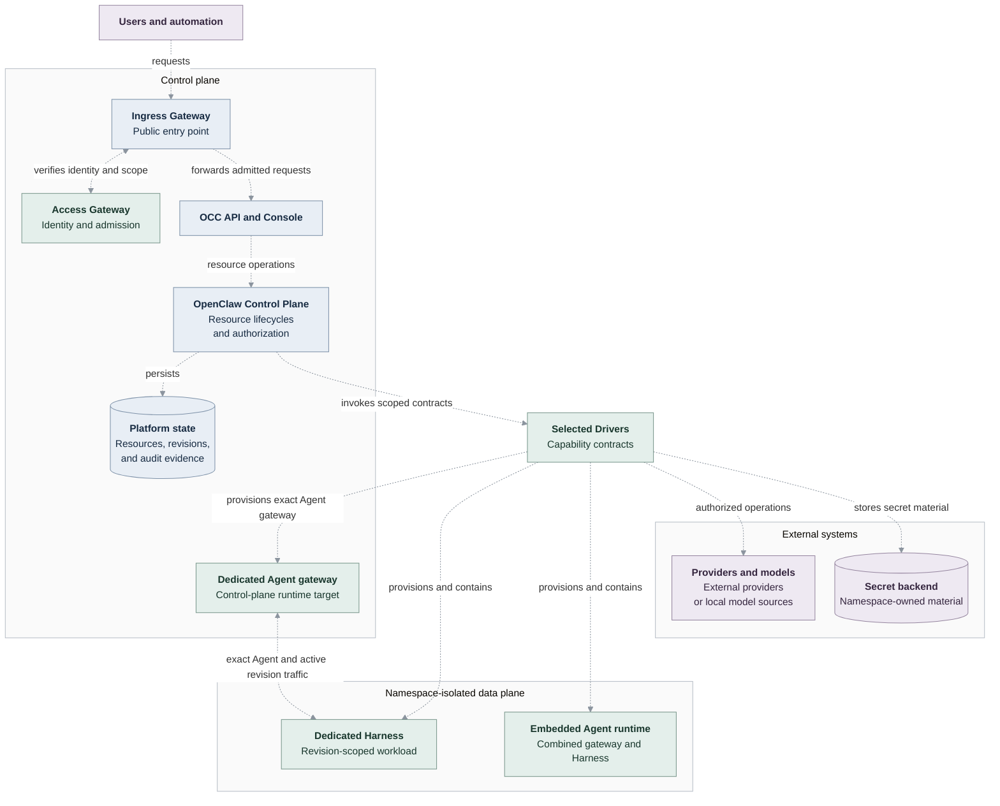

# OpenClaw as the Open Enterprise Agent Platform

## Implementation status

This page and its design chapters, including their diagrams, define the normative
**target architecture**, not a record of implemented capabilities. At commit
`ea6a7d56`, the Kubernetes dedicated gateway and Harness still run in the same
tenant namespace and share an Agent-owned workspace PVC.
[Control-plane gateway placement (#75)](https://github.com/openclaw/openclaw-enterprise/issues/75)
and [removal of the common PVC requirement (#76)](https://github.com/openclaw/openclaw-enterprise/issues/76)
remain unimplemented. These statements reflect source and test assertions, not
a live deployment verification.

See [current architecture](ARCHITECTURE.md) and
[Kubernetes execution modes](reference/drivers/kubernetes-compute.md#execution-modes)
for implemented behavior, and verify current code and tests before relying on a
target-design capability. Update this note as these gaps close.

## Summary

OpenClaw Enterprise provides a multi-tenant control plane for configuring,
deploying, and operating agents. Each deployment owns exactly one Installation
containing multiple isolated Namespaces.

Enterprise functionality is mediated by OpenClaw Control Plane (OCC). Its
controller is responsible for provisioning and orchestrating agents.

The platform introduces a small set of resource primitives for managing agents.
OCC owns these platform resources and their lifecycles; external systems own
the underlying infrastructure, external provider resources, and local model
sources accessed through one common Driver abstraction.

The bundled platform deployment uses Kubernetes. An Installation can select its
bundled or an installed Driver implementation in development and production.

## Motivation

The existing OpenClaw gateway serves a single tenant. Operating agents for an
organization currently requires separate deployments, manually maintained
configuration, and application-specific integration work. Organizations lack a
shared way to manage tenant isolation, access, policy, deployment, and audit.

The platform needs one resource model for an agent, its configuration, the
version being deployed, and the infrastructure that runs it. Compute, model
inference, external identity, policy, messaging, and secret integrations need
explicit ownership boundaries without introducing a separate resource for each
runtime detail.

## Goals

- Provide a multi-tenant OpenClaw control plane with exactly one server-owned
  Installation and explicit Namespace and authorization boundaries.
- Validate externally authenticated identity and admit requests to the exact
  Installation and, when applicable, Namespace.
- Manage one isolated OpenClaw gateway per Agent, allowing multiple gateways
  in the same Namespace.
- Define the v1 resources used to configure, deploy, constrain, and operate an
  Agent.
- Preserve exact-resource authorization, immutable deployment snapshots, stable
  workload identity, fail-closed behavior, and audit evidence.
- Provision each Agent-owned gateway and its Agent workload through the same
  operator-selected `ComputeDriver`, whether bundled or installed.
- Support model inference from an external provider or local model source
  without introducing either as a platform resource.
- Enforce admitted sandbox policies and, in the future brokered design, keep
  secret values, backend credentials, and provider credentials outside agent
  workloads. The approved KubernetesSecretDriver path stores Namespace-owned
  material before Agent creation and may deliver it by env only to explicitly
  selected consuming gateways; embedded OpenClaw and dedicated Codex production retain the
  explicitly scoped, topology-specific model-credential boundaries described in [Secret access](design/safeguards.md#secret-access).
- Extend the platform through capability-specific contracts on one common
  Driver abstraction.
- Allow an Agent to own optional desired plugin selections while preserving
  immutable revision snapshots and selected Driver ownership.

## Non-Goals

- Making the existing OpenClaw gateway multi-tenant.
- Hosting multiple Installations in one OpenClaw Enterprise deployment.
- Introducing an execution resource between an Agent and its workload.
- Specifying the OCC API or OCC Console beyond naming their surfaces.
- Specifying integration wire protocols, database schemas, audit storage,
  directory synchronization, or external policy internals.
- Performing identity-provider authentication, login, token exchange, or
  credential issuance in the access gateway.
- Defining connector or plugin resources, tool actions, or approval workflows.
- Delegating human identity or authentication to an Agent.
- Supporting cross-Namespace references.

## Proposal

1. Introduce OCC as the owner of the multi-tenant control plane, platform
   resources, authorization, deployment, integration dispatch, and audit.
   `OCC API` and `OCC Console` name product surfaces; production API and console
   contracts remain outside this architecture specification.
2. Use an Ingress Gateway as the public control-plane boundary. It forwards
   protected requests only after the OpenClaw Access Gateway (OAG) verifies
   externally authenticated identity and admits the exact requested scope.
3. Have OCC independently authorize every requested OpenClaw operation against
   the exact action, resource, and Namespace.
4. Define the v1 platform resources: `Namespace`, `Configuration`,
   `ServiceAccount`, `Agent`, `AgentRevision`, `Harness`, `Channel`, `Secret`,
   `SecretBroker`, `SandboxPolicy`, and `Restriction`.
5. Have OCC manage one OpenClaw gateway for each deployed Agent. The selected
   `ComputeDriver` places a dedicated gateway in the control-plane runtime
   target and its revision-scoped Harness in the selected tenant data-plane
   target. Embedded execution keeps gateway and Harness together in the tenant
   data plane. Namespace isolation and Agent ownership apply across both
   targets; gateway lifecycle follows its owning Agent.
6. Provision an Agent workload from an admitted immutable `AgentRevision`
   through the selected `ComputeDriver` and enforce its exact `SandboxPolicy`
   through the selected `SandboxDriver`.
7. Keep authorization, service accounts, model inference, compute,
   sandboxing, secrets, messaging, and plugin translation behind bounded Driver
   contracts.
   Installing a Driver does not grant it resource ownership or permission to
   select itself; only server-owned selection gives an `IAMDriver` authority
   for its assigned resource kinds.
8. Provide durable platform state, exact-resource authorization, and audit
   evidence without selecting internal storage or wire formats.

## Architecture

This overview shows the target architecture. Dashed arrows describe target
relationships, not verified implementation or deployment status. Runtime targets show the two alternative execution modes; each Agent selects
one. Placement preserves the owning Namespace and Agent across targets.

**Access and ownership.** An external identity provider authenticates the caller.
The Ingress Gateway forwards protected requests only after OAG verifies that
identity and admits the exact Installation and Namespace. OCC independently
authorizes each exact resource operation through `IAMDriver` and owns resource
and deployment lifecycles. OCC API and Console are named surfaces, not process
or deployment boundaries. One Installation contains multiple isolated Namespaces;
the diagram shows one representative Namespace and Agent.

**Agent runtime.** Each deployed Agent owns exactly one OpenClaw gateway. Its
Harness runs either inside that gateway (`embedded`) or in a distinct Codex
workload (`dedicated`); a dedicated gateway routes only its owner's runtime
traffic and does not receive the Codex workload's identity or model credential.
A Namespace can contain multiple independently owned Agent runtimes. The selected
`ComputeDriver` reconciles the dedicated gateway in the control-plane runtime
target and its Harness in the selected tenant data-plane target from an immutable
`AgentRevision`. Embedded execution keeps both in the tenant data plane. Targets
initially share a Kubernetes cluster but may later occupy separate clusters or
other Compute-backed locations. Physical separation does not change Namespace
isolation or Agent ownership. The implementation-status note above distinguishes
this target from the current same-namespace Kubernetes implementation. `SandboxDriver` verifies the admitted
containment policy before Agent turns can execute. See [execution topologies and
activation](design/workloads.md).

**Integration and storage.** The Driver box groups capability contracts, not a
shared service. Installation configuration selects each implementation;
Drivers do not acquire platform-resource ownership or authorization authority
outside their assigned role. `ServiceAccountDriver` manages authorized upstream
accounts and credentials, `InferenceDriver` invokes approved provider or local
models, and `PluginDriver` translates Agent-owned plugin selections at revision
startup. Platform state retains resources, immutable revisions, and audit
evidence; secret material belongs in the selected Secret backend, with references
in OCC state. Explicit delivery and topology-specific credential boundaries remain
as defined in [Secret access](design/safeguards.md#secret-access). `SecretBroker`
and broker/substitution delivery are deferred. Required authorization, isolation,
or dependency failures block the operation; there is no unauthorized fallback.

## Design chapters

This page and the following chapters define the authoritative target design.
Each chapter owns its detailed sections; [current architecture](ARCHITECTURE.md)
and [feature references](README.md) describe implementation and supported behavior.

- [Resources and tenant boundaries](design/resources.md): Installation, Namespace lifecycle, and platform resource contracts.
- [Access and authorization](design/access.md): admission, identities, authority selection, and exact-resource decisions.
- [Agent gateways and deployment](design/workloads.md): runtime ownership, execution topologies, and immutable revision activation.
- [Drivers and Providers](design/drivers.md): capability contracts, external integration ownership, and target repository layout.
- [Platform safeguards](design/safeguards.md): secret delivery, failure behavior, audit, and platform invariants.

## Near Term Future work

- Production OCC API contracts and admission.
- OCC Console design and implementation.
- Agent and Plugin Directories.
- Plugin invocation, authorization, and approvals
- Production Installation-wide administration and access-gateway admission.
- Audit export, retention, and operational integrations.
- Additional primitives: Budges, Routers
