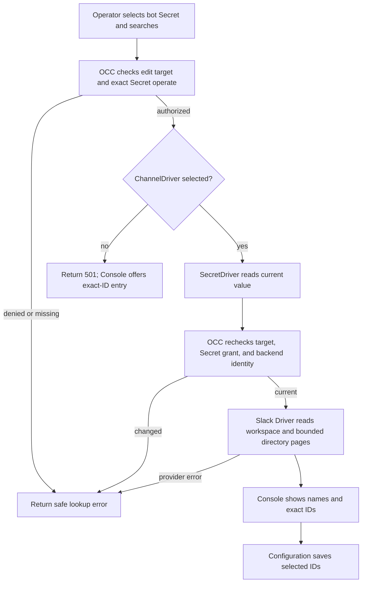

# Agent Channel Directory Lookup Flow

## Overview

An operator searches Slack users or channels while creating or editing an
Agent. The Console uses the selected bot Secret to show names and workspace
identity, then saves only the selected IDs in channel Configuration. OpenClaw
Control Plane (OCC) authorizes and reads the Secret; the selected ChannelDriver
owns provider calls. This flow ends when the Console displays candidates or an
actionable error.

## Entry Points

- Trigger: the Console Slack editor searches or resolves saved IDs, or an
  authorized caller posts to the Namespace channel directory route.
- Assumptions: the caller can create an Agent or update the exact Agent or
  Configuration, and can operate the selected same-Namespace Secret.
- Source: `apps/controller/src/console/agents/slack-directory.mjs:createSlackDirectoryField`,
  `packages/occ/src/index.ts:OpenClawController.lookupChannelDirectory`,
  and `apps/controller/src/drivers/channel/slack.ts:SlackChannelDriver.lookupDirectory`.

## Flow

## Execution Trace

### 1. Authorize the selected Secret

`packages/occ/src/index.ts:OpenClawController.channelDirectorySecret`

The request names a same-Namespace Secret and optionally an Agent or
Configuration being edited. OCC checks the matching create or exact update
permission and Secret `operate`, then reads the resource and Secret from
platform state. A missing or foreign target is rejected before provider I/O.

### 2. Read and use the current value

`packages/occ/src/index.ts:OpenClawController.lookupChannelDirectory`

Production composition selects the bundled Slack ChannelDriver only when the
API has an approved `OCC_CHANNEL_DIRECTORY_PROXY_URL`. Without it, an authorized
lookup returns `501` before the Secret value is read. Development selects the
Driver directly. In production the Driver tunnels requests to `slack.com:443`
through the configured proxy; the chart grants the API Pod egress only to that
proxy IP and port.
The selected SecretDriver invokes `withValue` and verifies backend ownership.
OCC rechecks grants and Secret backend identity after the read. It passes the
token only in process to the ChannelDriver. The bundled Slack implementation
requires a bot identity from `auth.test` and pages through `users.list` or
`conversations.list`. Exact-ID searches and saved IDs use `users.info` or `conversations.info`.
The response contains bounded candidates and pagination state, never the token.
An incomplete page cannot establish that a name is absent or unique.

### 3. Display names and save IDs

`apps/controller/src/console/channels/slack.mjs:appendFields`,
`apps/controller/src/console/agents/slack-directory.mjs:createSlackDirectoryField`

The Console debounces typing and shows each candidate's name, exact ID, and
workspace. It buffers the provider's complete returned batch and divides it into
[display pages](../reference/drivers/slack-channel.md). Previous and Next reuse
those pages before Next follows the provider cursor. An empty provider page with
a continuation still offers Next. New input, dismissal, or a changed Secret
cancels the queued search and its browser request; generation checks also discard
obsolete responses. Browser cancellation does not guarantee cancellation of
provider work already started by the API.

Selecting a result or confirming pasted IDs adds removable chips to the field; search text remains separate from committed IDs. Arrow keys
and Enter select results, and Escape closes the list. It resolves saved IDs again
when the editor opens or the selected Secret changes. A denied or failed lookup leaves manual
exact-ID entry available; no directory result changes the saved Configuration
until the operator saves the channel edit.

## Debugging and Verification

- A denied lookup requires checking the exact edit permission and Secret
  `operate` grant. A token, scope, rate limit, or provider error returns a
  safe code without the token or upstream payload.
- A `501` lookup in production means the API has no directory proxy configured.
  Set the approved proxy IP and port in Helm `api.channelDirectoryProxyUrl`, and
  verify that the proxy permits CONNECT to `slack.com:443`.
- Directory conformance tests cover provider pagination and safe errors. The
  OCC API integration test covers both authorization checks and response
  projection. Browser checks cover name display and exact-ID saving.
- Fixture and simulated provider tests do not prove a live Slack token, bot
  visibility, or channel message delivery.

## Related docs

- [ChannelDriver contract](../reference/drivers/channel.md)
- [Bundled Slack Channel Driver](../reference/drivers/slack-channel.md)
- [SecretDriver contract](../reference/drivers/secret.md)
- [Agent plugin deployment flow](agent-plugins.md)

## Manual Notes

[keep this for the user to add notes. do not change between edits]

## Changelog

- 2026-09-27 21:52: Buffer directory results for compact pages and cancel superseded browser searches. (01a0e4d2-4f51-7780-b0fc-2352cb99078f - 1e1628335710f7bcb66e0c3d0d6bdc35b6a0baaf)

- 2026-09-27 21:03: Replace modal lookup with inline search and selected chips. (01a0e49c-a051-7df2-9689-3bc1e0ac51c8 - ab70527a70201544d29b72c60ced7b9133910e92)

- 2026-09-27 08:51: Document production Slack directory proxy selection and egress. (01a0df20-f340-7810-bb59-b1df6c0bbbd3 - 1a2764952c421bfee00ed6892714366292c2741a)
- 2026-09-27 06:41: Describe authorized Slack directory lookup. (01a0df20-f340-7810-bb59-b1df6c0bbbd3 - 1d7b0b3b4e419cb8e085996be873ec233eeabf6d)
