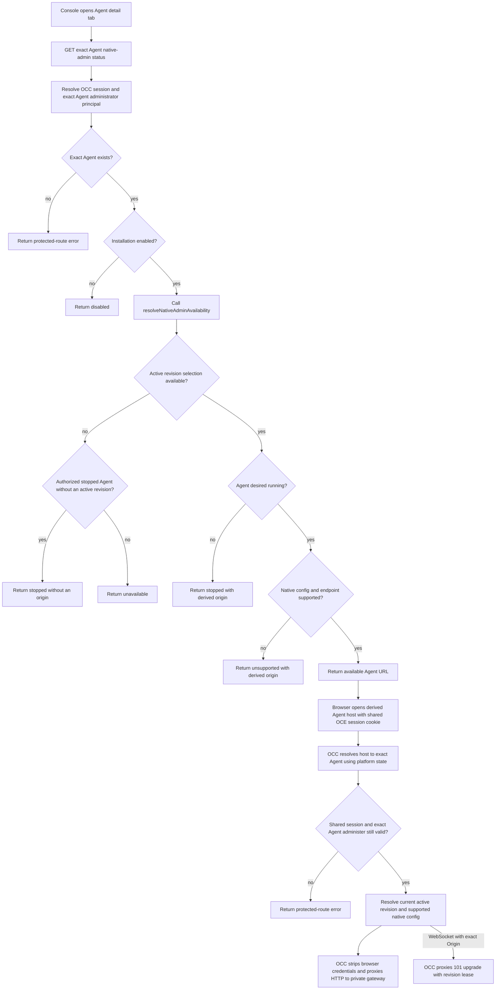

# Agent Native Admin UI Flow

## Overview

This flow traces Agent native admin UI access. A console user opens an Agent
detail tab, OCC checks the user's exact Agent administrator grant, selects
the active gateway revision, returns a stable per-Agent URL, and the Agent host
reuses the same OCE session cookie as the console. OCC resolves the requested
host to the exact Agent, rechecks authorization, and proxies native HTTP and
WebSocket traffic through the API process. Live runtime proof remains separate.

## Entry Points

- Trigger: Console renders an Agent detail tab, calls the native admin availability API, and opens the returned Agent URL.
- Source: `apps/controller/src/console/agents/native-admin.mjs:renderNativeAdminAccess`
- Source: `apps/controller/src/index.ts:resolveNativeAdminAvailability`
- Source: `apps/controller/src/index.ts:handleNativeAdminUpgrade`
- Assumptions: The API has a valid controller session, `agentNativeAdmin.enabled` is true, `agentNativeAdmin.domain` and `agentNativeAdmin.sharedCookieDomain` are configured, Better Auth emits the shared session cookie at that parent domain, and private Agent gateway routing can return a `ComputeDriver.getGatewayEndpoint` value.

## Flow

## Execution Trace

### 1. Console renders native admin availability

`apps/controller/src/console/agents/native-admin.mjs:renderNativeAdminAccess`

The Agent detail page inserts the native admin panel on its tabs, including Configuration and Workspace files. The panel starts hidden while it requests `${path}/native-admin`. The UI hides disabled and denied states, reports stopped, unavailable, or unsupported states, and shows the **Open native admin UI** link only when the API returns `status: "available"` with an Agent URL. The link opens that URL in a new tab with `noopener noreferrer`; opening it makes no additional availability or launch request.

The warning text tells operators that native admin access can change gateway state outside OCE and that durable configuration should remain in OCE.

### 2. OCC protects the availability route

`apps/controller/src/index.ts:nativeAdminStatusOperation`

The route is `GET /namespaces/:namespaceId/agents/:agentId/native-admin`. Its operation metadata requires Agent `administer`, targets the exact Agent, and runs through the same `admit` and `resolveIdentity` middleware as other protected OCC routes. A caller with only `read` or `operate` does not reach the handler as an administrator. The disabled feature state is still behind OCC exact-Agent `administer` authorization and existence checks; `disabled` is not an unauthenticated discovery result and does not add a separate Agent `read` permission path.

### 3. Shared availability resolver checks feature and active revision state

`apps/controller/src/index.ts:getNativeAdminStatus`
`apps/controller/src/index.ts:resolveNativeAdminAvailability`
`packages/occ/src/index.ts:getAdministerableActiveAgentRevision`

The status handler validates the human session, preserves the OCC exact-Agent `administer` authorization and existence boundary, then delegates to `resolveNativeAdminAvailability`. The resolver returns `disabled` only after that protected boundary succeeds. When enabled, it requires a configured public origin and native admin domain, then calls `controller.getAdministerableActiveAgentRevision`. That controller method authorizes exact Agent `administer` and loads the Agent before inspecting its state. If the Agent is stopped and has no `activeRevisionId`, it raises `ResourceConflictError`; the resolver returns only `status: "stopped"`. This covers new Agents and completed stops. If active-revision selection instead raises `DependencyUnavailableError`, as for a desired-running Agent awaiting activation, the resolver returns `unavailable` in a successful status envelope. The console asks the operator to check the Agent's deployment and refresh access; private gateway routing has not been evaluated. The panel always reports the Agent's active revision, independently of the viewed snapshot. Authorization denial remains a protected-route `403` and preserves the human IAM denial audit.

After active revision selection succeeds, OCC derives the native target. If the Agent's desired runtime state is not `running`, the resolver returns `stopped` with the derived host and origin. If `nativeAdminConfigurationSupported` rejects trusted-proxy auth, admin identity scopes, admin device auto-approval, `controlUi.enabled`, exact `allowedOrigins`, or host-header fallback/device-auth settings, the resolver returns `unsupported` with the same derived target. If the selected Compute Driver cannot provide a gateway endpoint or the endpoint is not a clean private `wss:` URL, it also returns `unsupported`. Only the `available` result carries the private `gatewayBase`; `nativeAdminAvailabilityData` omits that value from the browser API response.

### 4. OCC derives the isolated Agent host

`apps/controller/src/gateway/native-admin.ts:nativeAdminTarget`

`deriveNativeAdminHost` hashes Installation ID, Namespace ID, and Agent ID into an opaque label under the configured domain. `nativeAdminTarget` replaces the hostname of `publicOrigin` with that derived Agent host and returns `/` as the browser entrypoint for that Agent.

The host hash is not reversible. Native-host admission resolves the host back to an exact Agent by checking existing Installation, Namespace, and Agent state for the derived host. Unknown hosts, wrong suffixes, deleted Agents, and non-unique matches fail closed. This flow does not add a persistent host registry.

`nativeAdminGatewayHttpBase` accepts only a `wss:` endpoint without username, password, query, or hash, then converts it to `https:` while preserving authority and the Agent base path. This keeps workspace-file WSS behavior unchanged while defining the private HTTP base needed by the native UI bridge.

### 5. Shared cookie admits the Agent host

`apps/controller/src/auth/index.ts:createControllerAuth`

When native admin is enabled, startup passes `nativeAdmin.sharedCookieDomain` to
Better Auth as `OCC_AUTH_COOKIE_DOMAIN`, and Better Auth emits the ordinary OCE
session cookie at that configured shared cookie parent domain. The controller
validates that the console host and Agent host suffix fit that parent on
DNS-label boundaries and rejects public suffixes, malformed domains, or values
outside the parent. It does not infer a broader parent domain from the console
or Agent hostname. When native admin is disabled, leftover shared-cookie-domain
configuration is ignored and the console keeps the legacy host-only
`openclaw_occ` cookie prefix and scope.

A domain-scoped session cookie cannot use a host-only `__Host-` prefix. The controller keeps one canonical cookie name and scope so the browser does not choose between duplicate host-only and domain cookies during migration.

### 6. OCC intercepts native-host HTTP requests

`apps/controller/src/index.ts:interceptNativeAdminHttp`

The `onRequest` hook calls `interceptNativeAdminHttp` before normal OCC route
handling. For hosts beneath the configured native admin domain, that early
intercept prevents the Agent origin from exposing console or controller API
routes. For Agent hosts, OCC authenticates the shared session cookie, resolves
the selected IAM identity, resolves the requested host to the exact Agent,
revalidates exact Agent `administer`, selects the current active revision, and
validates native configuration support before proxying. Attributable IAM denials
during proxy admission preserve an IAM denial audit for the human session and
exact Agent instead of becoming unaudited dependency failures.

Admission reads Better Auth once and returns the verified session metadata with
the caller identity. The status and proxy paths reuse that result to check
expiry and attribute access, without a second session lookup. Each WebSocket
lease runs admission again against current session state.

`apps/controller/src/gateway/native-admin-proxy.ts:proxyNativeAdminHttp`

The HTTP proxy canonicalizes a bounded path suffix, rejects missing or nonmatching `Origin` on non-GET/HEAD requests, strips browser cookies, service keys, forwarding headers, native identity, native scopes, and upstream `Set-Cookie`, rejects service-worker script requests, rewrites same-upstream `Location` values to the Agent origin, appends `worker-src 'none'` to proxied Content Security Policy, and forwards to the private `https:` gateway base. The native gateway never receives the OCE session cookie.

### 7. OCC proxies native WebSocket upgrades

`apps/controller/src/index.ts:handleNativeAdminUpgrade`

The API process intercepts `upgrade` before Fastify routing. It accepts only derived Agent hosts, reuses the shared-session admission path, captures the current active revision at connection admission, and builds the same private proxy transport context. Active sockets are tracked so `preClose` destroys them during API shutdown.

`apps/controller/src/gateway/native-admin-proxy.ts:proxyNativeAdminWebSocket`

The WebSocket proxy requires a non-null exact Agent `Origin`, forwards a sanitized upgrade request to the private `https:` gateway base, and only connects the browser after the upstream returns `101`. `onConnect` appends `openclaw.agents.native_admin.websocket.connect`; `onClose` appends `openclaw.agents.native_admin.websocket.close`. The `websocket.connect` audit record includes `connectionId`; the matching `websocket.close` audit record reuses that `connectionId` and includes `closeReason`, whose value distinguishes lifecycle, revocation, dependency, client, upstream, and shutdown paths. A timer rechecks the shared-session admission path every 25 seconds, with each lease bounded to 5 seconds. Failed, denied, timed-out, or revision-changed lease checks close both sockets and preserve the IAM denial audit when authorization is the reason. An authorized reconnect uses the current active revision. Native chat does not renew the OCE session.

## Debugging and Verification

- `AGENT_NATIVE_ADMIN_INVALID` at startup points to invalid native admin enablement, missing public origin, invalid Agent domain, invalid shared cookie parent domain, invalid Better Auth cookie scope, or insufficient auth secret material.
- `disabled` means the Installation has not enabled the feature.
- `stopped` means the exact Agent is not desired running. Its response has no origin or revision after stop reconciliation clears the active revision, or before the first deployment.
- `unavailable` means active revision selection raised `DependencyUnavailableError` before OCC could derive the Agent target.
- `unsupported` means the selected Compute Driver, gateway endpoint, or native trusted-proxy/control UI configuration cannot support the active revision.
- Wrong or unknown Agent hosts fail before gateway proxying. Check the derived host calculation, Agent lifecycle state, and `agentNativeAdmin.domain`.
- Browser requests should not contain native-admin exchange, bootstrap, callback, launch-code, state, verifier, or Agent-specific session-cookie traffic.
- The native gateway should never observe the OCE session cookie; inspect sanitized proxy inputs when testing this boundary.
- IAM denial audits should appear for attributable denied status checks, proxy admission, and WebSocket lease renewal, with the human principal and exact Agent target preserved.
- `openclaw.agents.native_admin.websocket.connect` audits should include `connectionId`; matching `openclaw.agents.native_admin.websocket.close` audits should reuse `connectionId` and include `closeReason` with one of the expected categories: lifecycle, revocation, dependency, client, upstream, or shutdown.
- Service-worker registration failure is expected: the HTTP proxy rejects `Service-Worker: script` requests and adds `worker-src 'none'` to proxied responses.
- Browser tests cover panel visibility, warning copy, available status, and opening the returned URL. Integration proof should cover shared-cookie admission, denied service API keys, unknown host denial, proxied asset loads, WebSocket reconnect, the 25-second authorization lease, revision-change closure and reconnect, and a reversible native admin edit on a disposable Agent.
- The flow is source-backed only here. Live runtime proof remains separate.

## Related docs

- [Agent native admin UI](../reference/agent-native-admin.md)
- [Platform console](../reference/console.md#open-the-native-admin-ui)
- [Gateway routing with Envoy](../reference/gateway-routing.md#native-admin-ui-routing)
- [Deploy native admin UI access](../guides/deploy/native-admin.md)
- [Workspace files flow](workspace-files.md)

## Manual Notes

[keep this for the user to add notes. do not change between edits]

## Changelog

- 2026-09-21 21:20: Distinguished authorized stopped Agents with no active revision from unavailable running deployments. (01a0c750-0c10-7492-97eb-f4124cded820 - 156dd67b7bd280a380d96b5c34a64e402fe3b96b)
- 2026-09-21 21:17: Clarified the console's active-revision dependency message and its independence from the viewed configuration snapshot. (01a0c750-0c10-7492-97eb-f4124cded820 - f3dbdd41c8f3b49573d1353a4b06ce510ee43a56)
- 2026-09-20 09:45: Reused session metadata from admission and replaced launch bookkeeping with a direct browser link; socket lifecycle state remains owned by the proxy. (01a0b7fd-13fa-7dc2-8653-5c5814b59305 - bbb864aadc709dcc4f7b95d4b42b74823c18363a)
- 2026-09-20 08:53: Replaced the native-admin exchange flow with shared OCE session cookie admission, host-to-Agent resolution, credential stripping, and current-revision reconnect behavior. (cody/01a0b7fd-13fa-7dc2-8653-5c5814b59305 - 5e5f12f37842ae7239d73432e00609547627ded8)
- 2026-09-19 22:27: Documented exact-Agent disabled-status gating, IAM denial audit preservation, and WebSocket `connectionId`/`closeReason` audit fields. (01a0b7fd-13fa-7dc2-8653-5c5814b59305 - 9621ce4e)
- 2026-09-19 21:14: Updated the flow for the shared availability resolver names and service-worker blocking behavior. (01a0b7fd-13fa-7dc2-8653-5c5814b59305 - 06c23b9c)
- 2026-09-19 21:07: Added the `DependencyUnavailableError` to `unavailable` status branch and clarified derived-origin status payloads. (01a0b7fd-13fa-7dc2-8653-5c5814b59305 - 06c23b9c)
- 2026-09-19 20:19: Added the source-backed native admin UI availability, launch, cookie redemption, HTTP proxy, and WebSocket proxy flow. (01a0b7fd-13fa-7dc2-8653-5c5814b59305 - 06c23b9c)
