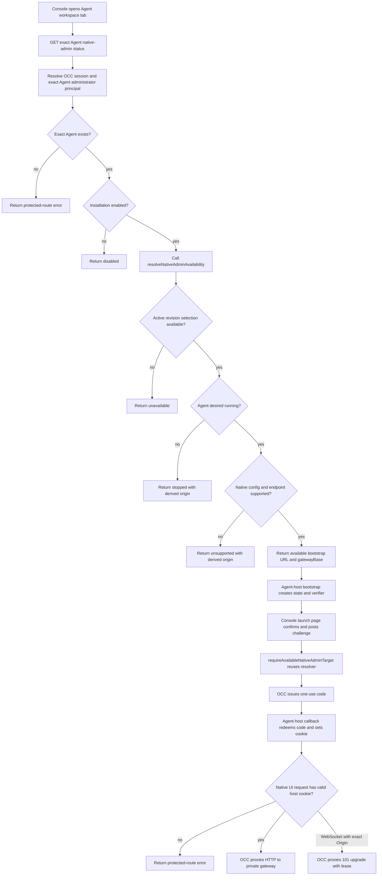

# Agent Native Admin UI Flow

## Overview

This flow traces the current Agent native admin UI launch path. A console user opens an Agent workspace tab, OCC checks the user's exact Agent administrator grant, selects the active gateway revision, returns a per-Agent bootstrap URL, issues a one-use exchange code, redeems it into a host-bound cookie, and proxies native HTTP and WebSocket traffic through the API process. This document describes source behavior; it does not claim live runtime proof has passed.

## Entry Points

- Trigger: Console renders the Agent detail workspace tab, calls the native admin availability API, and opens the returned bootstrap URL.
- Source: `apps/controller/src/console/agents/native-admin.mjs:renderNativeAdminAccess`
- Source: `apps/controller/src/index.ts:resolveNativeAdminAvailability`
- Source: `apps/controller/src/index.ts:handleNativeAdminUpgrade`
- Assumptions: The API has a valid controller session, `agentNativeAdmin.enabled` is true, `agentNativeAdmin.domain` is configured, and private Agent gateway routing can return a `ComputeDriver.getGatewayEndpoint` value.

## Flow

## Execution Trace

### 1. Console renders native admin availability

`apps/controller/src/console/agents/native-admin.mjs:renderNativeAdminAccess`

The Agent detail page inserts the native admin panel on the Workspace files tab. The panel starts hidden while it requests `${path}/native-admin`. The UI hides disabled and denied states, reports stopped or unsupported states, and enables **Open native admin UI** only when the API returns `status: "available"` with a `bootstrapUrl`.

The warning text tells operators that native admin access can change gateway state outside OCE and that durable configuration should remain in OCE.

### 2. OCC protects the availability route

`apps/controller/src/index.ts:nativeAdminStatusOperation`

The route is `GET /namespaces/:namespaceId/agents/:agentId/native-admin`. Its operation metadata requires Agent `administer`, targets the exact Agent, and runs through the same `admit` and `resolveIdentity` middleware as other protected OCC routes. A caller with only `read` or `operate` does not reach the handler as an administrator. The disabled feature state is still behind OCC exact-Agent `administer` authorization and existence checks; `disabled` is not an unauthenticated discovery result and does not add a separate Agent `read` permission path.

### 3. Shared availability resolver checks feature and active revision state

`apps/controller/src/index.ts:getNativeAdminStatus`
`apps/controller/src/index.ts:resolveNativeAdminAvailability`
`apps/controller/src/index.ts:nativeAdminAvailabilityData`

The status handler validates the human session, preserves the OCC exact-Agent `administer` authorization and existence boundary, then delegates to `resolveNativeAdminAvailability`. The resolver returns `disabled` only after that protected boundary succeeds. When enabled, it requires a configured public origin and native admin domain, then calls `controller.getAdministerableActiveAgentRevision`. That controller method authorizes exact Agent `administer`, loads the Agent, requires `activeRevisionId`, and returns the selected active revision. If that active-revision selection raises `DependencyUnavailableError`, the resolver returns `unavailable` in a successful status envelope instead of the protected-route error envelope. If authorization denial bubbles out of the selection path, the resolver maps it to a protected-route `403` and preserves the human IAM denial audit.

After active revision selection succeeds, OCC derives the native target. If the Agent's desired runtime state is not `running`, the resolver returns `stopped` with the derived host and origin. If `nativeAdminConfigurationSupported` rejects trusted-proxy auth, admin identity scopes, admin device auto-approval, `controlUi.enabled`, exact `allowedOrigins`, or host-header fallback/device-auth settings, the resolver returns `unsupported` with the same derived target. If the selected Compute Driver cannot provide a gateway endpoint or the endpoint is not a clean private `wss:` URL, it also returns `unsupported`. Only the `available` result carries the private `gatewayBase`; `nativeAdminAvailabilityData` omits that value from the browser API response.

### 4. OCC derives the isolated Agent host

`apps/controller/src/gateway/native-admin.ts:nativeAdminTarget`

`deriveNativeAdminHost` hashes Installation ID, Namespace ID, and Agent ID into an opaque label under the configured domain. `nativeAdminTarget` replaces the hostname of `publicOrigin` with that derived Agent host and builds `/__occ/native-admin/bootstrap?namespace=...&agent=...&revision=...`.

`nativeAdminGatewayHttpBase` accepts only a `wss:` endpoint without username, password, query, or hash, then converts it to `https:` while preserving authority and the Agent base path. This keeps workspace-file WSS behavior unchanged while defining the private HTTP base needed by the native UI bridge.

### 5. Bootstrap redirects through console confirmation

`apps/controller/src/index.ts:serveNativeAdminBootstrap`

The console opens the returned bootstrap URL in a new tab with `noopener,noreferrer`. The Agent-host bootstrap page generates `state` and a verifier, stores the verifier in browser session storage, derives a SHA-256 challenge, and redirects to `/console/native-admin-launch` on the console origin.

`apps/controller/src/console/native-admin-launch.mjs:launch`

The console-origin launch page asks the operator to confirm the same warning shown in the Agent detail panel. It posts `revisionId`, `host`, `state`, and `challenge` to `/namespaces/:namespaceId/agents/:agentId/native-admin/launch` using same-origin credentials.

### 6. OCC issues a one-use code

`apps/controller/src/index.ts:launchNativeAdmin`

The launch route uses the same protected-route identity context, requires a human session, requires the workspace-file CSRF boundary, resolves the current Better Auth session without cache, then calls `requireAvailableNativeAdminTarget`. That helper reuses `resolveNativeAdminAvailability`, requires an `available` result, checks the expected host and active revision, and carries the private `gatewayBase` forward for proxy admission. Authorization denial in this path remains an IAM denial audit for the human and exact Agent. The route issues a code that expires within 60 seconds and no later than the parent session, audits the launch mutation, then returns an Agent-origin callback URL containing the code and state.

`apps/controller/src/auth/native-admin-exchange.ts:PostgresNativeAdminExchangeStore.issue`

The PostgreSQL store validates bounded launch records, stores only a digest identifier in `occ.verification`, removes expired native-admin records, and enforces a per-parent-session active-code limit under an advisory lock.

### 7. Agent callback redeems the code

`apps/controller/src/index.ts:serveNativeAdminCallback`

The callback page reads the verifier from session storage and POSTs `code`, `state`, and `verifier` back to `/__occ/native-admin/callback` on the Agent origin.

`apps/controller/src/index.ts:redeemNativeAdmin`

The redemption path atomically consumes the code, checks state and verifier challenge, reloads the parent session by ID, resolves the actor through the selected IAM driver, revalidates exact Agent access, revision, native configuration support, request authority, and request `Origin`, and sets `__Host-occ_native_admin` as an `HttpOnly`, `Secure`, `SameSite=Lax` cookie. The cookie carries signed parent session, actor issuer/subject, Agent, revision, host, and parent-session expiry claims.

### 8. OCC intercepts native-host HTTP requests

`apps/controller/src/index.ts:interceptNativeAdminHttp`

The not-found handler gives native-host HTTP proxying first chance after explicit OCC routes. It only handles hosts beneath the configured native admin domain. Reserved `/__occ/native-admin/*` endpoints stay in OCC, and other reserved-prefix requests are denied. For Agent hosts, OCC accepts only requests with a valid signed native admin cookie whose host matches the request host, whose parent session still exists, whose selected IAM identity still resolves, and whose Agent/revision access still resolves. Attributable IAM denials during proxy admission preserve an IAM denial audit for the human session and exact Agent instead of becoming unaudited dependency failures.

`apps/controller/src/gateway/native-admin-proxy.ts:proxyNativeAdminHttp`

The HTTP proxy canonicalizes a bounded path suffix, rejects missing or nonmatching `Origin` on non-GET/HEAD requests, strips browser credentials, service keys, forwarding headers, native identity, native scopes, and upstream `Set-Cookie`, rejects service-worker script requests, rewrites same-upstream `Location` values to the Agent origin, appends `worker-src 'none'` to proxied Content Security Policy, and forwards to the private `https:` gateway base.

### 9. OCC proxies native WebSocket upgrades

`apps/controller/src/index.ts:handleNativeAdminUpgrade`

The API process intercepts `upgrade` before Fastify routing. It accepts only derived Agent hosts, rejects reserved native-admin endpoints and prefixes, reuses the signed-cookie admission path, and builds the same private proxy transport context. Active sockets are tracked so `preClose` destroys them during API shutdown.

`apps/controller/src/gateway/native-admin-proxy.ts:proxyNativeAdminWebSocket`

The WebSocket proxy requires a non-null exact Agent `Origin`, forwards a sanitized upgrade request to the private `https:` gateway base, and only connects the browser after the upstream returns `101`. `onConnect` appends `openclaw.agents.native_admin.websocket.connect`; `onClose` appends `openclaw.agents.native_admin.websocket.close`. The `websocket.connect` audit record includes `connectionId`; the matching `websocket.close` audit record reuses that `connectionId` and includes `closeReason`, whose value distinguishes lifecycle, revocation, dependency, client, upstream, and shutdown paths. A timer rechecks the signed-cookie admission path every 25 seconds, with each lease bounded to 5 seconds. Failed, denied, or timed-out lease checks close both sockets and preserve the IAM denial audit when authorization is the reason.

## Debugging and Verification

- `AGENT_NATIVE_ADMIN_INVALID` at startup points to invalid native admin enablement, missing public origin, missing domain, missing exchange store, or insufficient cookie secret.
- `disabled` means the Installation has not enabled the feature.
- `stopped` means the selected Agent is not desired running.
- `unavailable` means active revision selection raised `DependencyUnavailableError` before OCC could derive the Agent target.
- `unsupported` means the selected Compute Driver, gateway endpoint, or native trusted-proxy/control UI configuration cannot support the active revision.
- IAM denial audits should appear for attributable denied status checks, launch attempts, proxy admission, and WebSocket lease renewal, with the human principal and exact Agent target preserved.
- `openclaw.agents.native_admin.websocket.connect` audits should include `connectionId`; matching `openclaw.agents.native_admin.websocket.close` audits should reuse `connectionId` and include `closeReason` with one of the expected categories: lifecycle, revocation, dependency, client, upstream, or shutdown.
- Service-worker registration failure is expected: the HTTP proxy rejects `Service-Worker: script` requests and adds `worker-src 'none'` to proxied responses.
- Browser tests cover panel visibility, warning copy, available status, and opening the returned URL. Integration proof should cover the bootstrap, launch, callback, native cookie, proxied asset loads, WebSocket reconnect, the 25-second authorization lease, and a reversible native admin edit on a disposable Agent.
- The flow is source-backed only here. Live runtime proof remains separate.

## Related docs

- [Agent native admin UI](../reference/agent-native-admin.md)
- [Platform console](../reference/console.md#open-the-native-admin-ui)
- [Gateway routing with Envoy](../reference/gateway-routing.md#native-admin-ui-routing)
- [Deploy native admin UI access](../guides/deploy/native-admin.md)
- [Workspace files flow](workspace-files.md)

## Manual Notes

[keep this for the user to add notes. do not change between edits]

## Changelog

- 2026-09-19 22:27: Documented exact-Agent disabled-status gating, IAM denial audit preservation, and WebSocket `connectionId`/`closeReason` audit fields. (01a0b7fd-13fa-7dc2-8653-5c5814b59305 - 9621ce4e)
- 2026-09-19 21:14: Updated the flow for the shared availability resolver names and service-worker blocking behavior. (01a0b7fd-13fa-7dc2-8653-5c5814b59305 - 06c23b9c)
- 2026-09-19 21:07: Added the `DependencyUnavailableError` to `unavailable` status branch and clarified derived-origin status payloads. (01a0b7fd-13fa-7dc2-8653-5c5814b59305 - 06c23b9c)
- 2026-09-19 20:19: Added the source-backed native admin UI availability, launch, cookie redemption, HTTP proxy, and WebSocket proxy flow. (01a0b7fd-13fa-7dc2-8653-5c5814b59305 - 06c23b9c)
