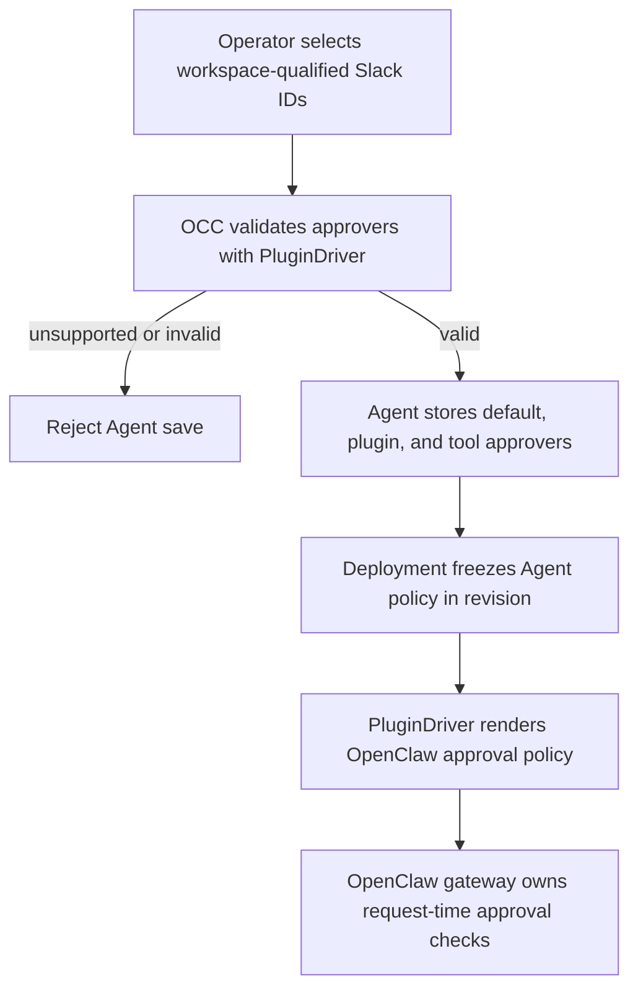

# Agent Plugin Approvals Flow

## Overview

An operator selects Slack users for an Agent's plugin approvals. OpenClaw
Control Plane (OCC) stores workspace-qualified IDs, freezes the policy in a
deployment revision, and passes it to the selected PluginDriver. OpenClaw
owns authorization of each later plugin approval request. The optional
name lookup is described in the [channel directory flow](agent-channel-directory.md).

## Entry Points

- Trigger: the Console Plugins editor or an authorized caller creates, updates,
  or deploys an Agent with plugin approvers.
- Assumptions: the actor has Agent create or exact Agent update permission, and
  the selected PluginDriver supports approvers.
- Source: `apps/controller/src/console/agents/slack-approvers.mjs:createSlackApproverField`,
  `packages/occ/src/index.ts:OpenClawController.updateAgent`, and
  `apps/controller/src/drivers/plugin/runtime-translator.ts:pluginApprovalOverlay`.

## Flow

## Execution Trace

### 1. Save and freeze approver policy

`packages/occ/src/index.ts:OpenClawController.updateAgent`

Agent `pluginApprovers` supplies the default. A plugin's `approvers` replaces
the default; a tool's `approvers` replaces the plugin list. Omission inherits
and `[]` denies Slack approvers at that scope. The selected PluginDriver
validates supported identities before OCC saves the Agent. Deploying the Agent
records the current default and selection map in an immutable AgentRevision.
Later edits do not change the admitted revision.
An Agent update sends `pluginApprovers: null` to remove a previously saved
default and return to omitted-policy behavior.

### 2. Hand off runtime enforcement

`apps/controller/src/drivers/plugin/runtime-translator.ts:pluginApprovalOverlay`

The PluginDriver renders workspace-qualified Slack selectors into the
OpenClaw plugin approval configuration. It preserves unrelated approval
settings and rejects native lists that conflict with an inherited managed list.
An omitted Agent default leaves the runtime's legacy Slack account
approval destinations in effect for scopes without an override; an explicit
empty list denies them. The prepared gateway receives this configuration only
for the admitted revision. A compatible OpenClaw runtime then evaluates each
approval against the request's plugin and tool identity. This handoff does not
prove that an older runtime image understands the policy.

## Debugging and Verification

- Compare `Agent.pluginApprovers`, nested selection overrides, and the admitted
  AgentRevision. A successful save does not prove the running gateway applies
  the new policy; check deployment status and use a real plugin approval request
  to verify the runtime image.
- The channel directory flow describes Secret permissions and lookup failures.
  Approval enforcement needs a compatible runtime and an authorized test bot.

## Related docs

- [Agent plugin deployment flow](agent-plugins.md)
- [Agent plugin policy](../reference/agent-plugins.md#slack-approver-users)
- [Channel directory flow](agent-channel-directory.md)

## Manual Notes

[keep this for the user to add notes. do not change between edits]

## Changelog

- 2026-09-27 02:03: Describe Agent plugin approval handoff. (01a0df20-f340-7810-bb59-b1df6c0bbbd3 - b2de165412191a4c9d124acf59fa1efb25cc29d6)
