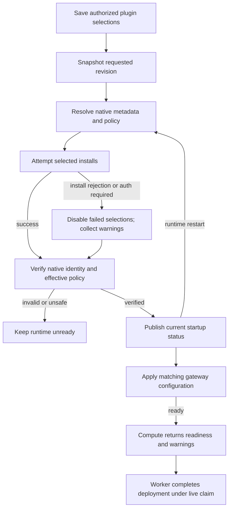

# Agent Plugin Deployment Flow

## Overview

An authorized caller stores one Agent's desired plugin selections through Agent
create/update, then deploys that Agent. OCC snapshots the requested selections
and selected Driver; Agent startup resolves current curated metadata, translates
native policy, and prepares the revision's isolated runtime. This flow ends at
successful reconciliation or a failed/incomplete revision. The active revision
pointer can change before runtime cutover finishes. Native tool invocation and
approval internals remain the Harness's responsibility.

## Entry Points

`apps/controller/src/index.ts:createFastifyApp`

- Trigger: Agent create/update with `plugins`, followed by Agent deployment.
- Assumptions: exact Agent create/update authorization, structurally valid plugin
  configuration, a compatible trusted PluginDriver selection by deployment time,
  and the existing deployment prerequisites.
- Source: [HTTP handlers](../../apps/controller/src/index.ts),
  [OpenClawController](../../packages/occ/src/index.ts), and
  [bundled PluginDrivers](../../apps/controller/src/drivers/plugin/index.ts).

## Flow

## Execution Trace

### 1. Validate desired state under exact-Agent authority

`apps/controller/src/index.ts:createFastifyApp`

HTTP route contracts validate input shape before
[OpenClawController](../../packages/occ/src/index.ts) checks the exact Namespace
and Agent. Agent reads use Agent `read`; Agent create/update stores
the `plugins` map through the ordinary Agent mutation path. Shared contract
validators check plugin selection shape at OCC boundaries. Catalog membership,
native app mapping, release metadata, and policy representability are not
validated before save. A successful Agent mutation stores Agent-owned desired
state and appends audit evidence in the same transaction. It does not modify
the reusable Configuration or active runtime. On update, omission preserves the
existing map, `{}` clears it, and any supplied nonempty map replaces it completely.

### 2. Admit an immutable plugin deployment

`packages/occ/src/index.ts:OpenClawController.deployAgent`

A separate deploy request reads a consistent Agent selection set and referenced
Configuration. OCC records the selected Driver identity and requested
policy-only plugin map in AgentRevision. It does not resolve native Codex app
mapping, release metadata, or rendered plugin configuration during admission.
The existing reconciliation queue receives that revision; subsequent Agent
updates cannot change it.

### 3. Deliver requested state through Compute preparation

`apps/controller/src/drivers/compute/plugin-runtime.ts:pluginRuntimeSpecForRevision`

Compute validates the admitted requested state with the shared contract
validator and confirms its Driver and Harness match. Kubernetes projects the
nonsecret runtime request into the revision workload; Docker uses bounded
runtime environment delivery. The existing Compute lifecycle owns both paths.
No controller package installation, new worker, or external catalog service
runs here.

SSH Compute is a fail-closed exception in this release: any nonempty requested
plugin map is rejected before SSH host effects. Plugin-free SSH revisions
continue to use the ordinary SSH lifecycle.

For an initial embedded Kubernetes gateway, preparation applies the existing
exact-Agent HTTPS egress policy before startup installation needs the registry.
For an existing embedded gateway, `prepareRevision` does not start a second
candidate process against the Agent-owned state database.
`KubernetesComputeDriver.activateRevision` uses the existing `Recreate`
Deployment replacement: the old gateway stops before the new process installs.
Revision package files/configuration stay private; the native installation
registry remains in the Agent-owned database. Docker instead keeps native state
in its container's private temporary home.

### 4. Prepare native runtime state and hand off readiness

`apps/controller/src/drivers/compute/kubernetes/runtime-entrypoints.ts:installOpenClawPlugins`

For embedded OpenClaw, the entrypoint resolves the requested selection against
the bundled OpenClaw catalog and rejects conflicts with native plugin policy
before installation. It merges generated tool grants into an existing nonempty
`tools.allow`, otherwise `tools.alsoAllow`, preserving tool denies and profiles.
The resulting configuration is private to the revision. Installation uses
`--pin --force --no-enable` so native installation cannot change enablement or
plugin allow/deny lists; preparation then refreshes the registry and verifies the
admitted configuration. The runtime image must first gain the required native
flag; the pinned release does not support it.
Native inspection verifies plugin ID, package name, runtime/install version,
recorded integrity, and the runtime source's containment in the install path.
Verification failure stops startup before the replacement gateway becomes ready.
A confirmed install rejection instead disables that optional selection and
removes its managed tool allowance before the gateway starts.

Dedicated Codex uses one of two fixed bootstrap configurations in its isolated
`CODEX_HOME`: empty selections disable the apps/plugins/remote-plugin features;
nonempty selections enable those features. Both set `apps._default.enabled:false`.
For nonempty selections, Compute applies the shared selected-only OpenClaw
bridge renderer during gateway configuration construction: `codexPlugins.enabled:true`,
`allow_all_plugins:false`, and one entry per selected plugin. Disabled or `never`
entries remain selected but cannot execute through that bridge.

At startup, native `plugin/list` discovers the `openai-curated-remote` marketplace;
`plugin/read` resolves each selection using the summary's opaque remote identity.
The shared translator validates the entire selection set before Compute writes
native app configuration with `config/batchWrite`, including optional
`approvals_reviewer`. Compute then calls `plugin/install` for each enabled selection, collecting confirmed
install rejections and missing app authentication as warnings. It rereads native
metadata for successful selections and checks installed/enabled identity, release
version, and app mapping against the resolved selection. Failed-only app bindings
are explicitly disabled; shared bindings needed by successful selections retain
their admitted policy. Disabled selections remain denied in configuration and
do not contribute install attempts or startup results. Finally,
`config/read` verifies the effective configuration overlay before readiness.
Codex owns its private cache layout and integrity; Enterprise does not inspect
private cache files. The Driver does not install packages in OCC. The normal
Codex readiness path remains responsible for runtime health.

For Compute-owned Kubernetes workloads, a selected OpenClaw install command's
normal nonzero exit, a matching Codex `plugin/install` error response, or a
successful Codex install response with apps needing authentication contributes
only an admitted `{pluginId, code}` warning. Transport loss, timeouts, signals,
malformed responses, discovery failures, and policy failures retain their
ordinary startup failure behavior. Provider-owned Harnesses retain their
existing startup path.

The runtime exposes a private current-startup status response after verifying
effective configuration. Kubernetes Compute validates the exact workload,
revision, startup instance, selection keys, and closed warning codes before
returning readiness and warnings. The status is recomputed after restart; it is
not a durable record of the first failure.

Dedicated Codex runs separately from its gateway. The gateway blocks each failed
bridge selection before serving, preventing native bridge activation from
retrying that plugin during a turn. It must refresh its effective configuration
when the Agent startup result changes. Missing or untrusted status cannot
establish readiness. Requested revision selections remain unchanged.

Compute installs the narrow status NetworkPolicies before starting the first
dedicated gateway that requires plugin status. It creates that gateway only after the
Agent and its plugin status are ready and the Agent Service selects that revision.
Existing gateways and full runtime NetworkPolicies retain their normal revision
activation boundary.

The Agent and gateway derive an app-server credential from the existing transport
Secret, revision ID, and Agent startup ID. The gateway receives that credential
only after reading the matching status and rendering its exclusions. After an
Agent restart, the previous gateway process cannot authenticate with its old
credential while its supervisor waits for the next status poll. The supervisor
publishes non-ready status before stopping a gateway whose peer result changed.

### 5. Complete revision reconciliation

`apps/controller/src/worker.ts:finalizeRevision`

Preparation failure before the worker commits `activeRevisionId` leaves the
prior pointer unchanged. After that commit, activation/finalization failure
retains the candidate pointer and records `REVISION_FINALIZATION_INCOMPLETE` for
retry. Existing embedded Kubernetes replacement runs in this after-commit phase;
the old gateway may already be stopped. The previous revision record remains
stored, but there is no pointer rollback or guarantee of availability during
cutover. See the [controller worker flow](controller-worker.md).

Successful worker completion reports `REVISION_ACTIVATED` or, on the idempotent
already-active path, `REVISION_ALREADY_ACTIVE`. A candidate pointer alone
is not installation/readiness evidence. Normal Agent turns use native policy;
old workload state follows ordinary retirement. The persistent Agent workspace
and Kubernetes gateway state database retain their Agent-owned lifecycle.

The worker stores current plugin warnings in the successful work result under its
live claim; the [worker flow](controller-worker.md#7-defer-retry-or-stop-and-hand-off-the-next-iteration)
explains persistence and the deployment status projection. Claim loss prevents a stale completion write; a later worker reads
current readiness again. There is no receipt acknowledgment, failed-plugin
shutdown, or permanent failure latch. Saved deployment warnings describe the
completed deployment attempt rather than ongoing runtime health.

## Debugging and Verification

- Compare `Agent.plugins` with the active revision snapshot and deployment status.
  A successful Agent write alone is not runtime installation evidence.
- Structurally invalid Agent writes leave desired state unchanged. Catalog
  membership, metadata, and unsupported policy are failed or unready candidate
  outcomes.
- Check missing native packages, release drift, connector authentication, and
  effective policy when readiness fails; preserve credential values in protected
  runtime state rather than copying them into logs.
- With SSH Compute, any nonempty requested plugin map should fail before host
  effects. Clear the Agent's plugin map or deploy through a compatible
  Kubernetes runtime.
- For plugin warnings, check deployment status for `PLUGIN_INSTALL_FAILED` or
  `PLUGIN_AUTH_REQUIRED` and the admitted `pluginId`. Confirm the corresponding
  runtime and gateway entries are disabled. Do not infer plugin attribution
  from arbitrary native logs.
- Prove behavior with a model-chosen plugin call during a normal Agent turn,
  then disable/remove on a later deployment and verify another Agent is unchanged.
  Source or fixture tests alone do not establish native runtime compatibility.
- Use the opt-in real-runtime lane in [Agent plugin testing](../testing/plugins.md)
  for Kubernetes, database, credential, native-runtime, and historical proof
  details. A skipped native lane is not proof.

## Related docs

- [Agent plugin reference](../reference/agent-plugins.md).
- [PluginDriver selection and limits](../reference/drivers/plugin-bundled.md).
- [Controller worker](controller-worker.md).
- [Harness execution topology](harness-execution-topology.md).
- [Deployment guide](../guides/deploy.md).
- [Agent plugin testing](../testing/plugins.md).

## Manual Notes

[keep this for the user to add notes. do not change between edits]

## Changelog

- 2026-09-21 21:23: Reconciled policy composition and installation without enablement changes with optional-plugin warnings and the bundled Driver reference; runtime release and Kubernetes proof remain pending (codex/01a0b17c-68b6-7e11-bedc-f74de7d606ed - 9405e20)

- 2026-09-18 17:38: Documented plugin policy conflict rejection, tool allowlist composition, and installation without enablement changes; runtime release and Kubernetes proof remain pending (codex/01a0b17c-68b6-7e11-bedc-f74de7d606ed - 724dcb5)

- 2026-09-18 17:17: Linked plugin warning persistence to the generalized controller work result. (codex/01a0b0fc-4a24-76c0-8fb7-f3a3a434d464 - 6a582ce9)

- 2026-09-17 20:28: Replaced terminal plugin receipts with verified optional-plugin exclusion, current startup status, and successful deployment warnings; runtime verification in progress. (codex/01a0b0fc-4a24-76c0-8fb7-f3a3a434d464 - 7771526d)
- 2026-09-17: Verified native OpenClaw and Codex plugin turns, successful warning persistence, failed selection exclusion, and Agent-only restart recovery. Ordered initial dedicated gateway startup after its Agent status dependency. (codex/01a0b0fc-4a24-76c0-8fb7-f3a3a434d464 - a5a11ad1)
- 2026-09-17 20:28: Removed the first-failure receipt and acknowledgment lifecycle under the approved best-effort plugin decision. (NOT_IN_SPEC)

- 2026-09-17 15:02: Added the Kubernetes receipt and terminal plugin-failure path for Compute-owned plugin startup without claiming native proof completion. (codex/01a0b0fc-4a24-76c0-8fb7-f3a3a434d464 - 58ead994)

- 2026-09-08 16:05: Corrected Codex Linear support to the existing bridge path and kept live local-Kubernetes proof pending (codex/01a08228-c3ec-7ab2-b0c0-74f49a8ec8a7 - 79021fa)
- 2026-09-08 17:02: Recorded current Codex Linear proof boundary: native install/readiness passed, bridge app batch request passed, force-refresh app state showed Linear enabled/callable, and a normal turn invoked Linear `list_teams` before timing out in native `waitingOnApproval` without a result (codex/01a08228-c3ec-7ab2-b0c0-74f49a8ec8a7 - 79021fa)
- 2026-09-08 17:34: Recorded the native diagnostic blocker: direct Linear execution requires app reauthentication, the diagnostic native model turn emitted a Codex Apps URL elicitation that was declined, and normal OCC proof remains pending reconnection and rerun (codex/01a08228-c3ec-7ab2-b0c0-74f49a8ec8a7 - b4fa273)
- 2026-09-08 18:05: User substituted Google Calendar for the required Codex live proof; Calendar curated metadata and normal-turn `list_calendars(max_results:1)` proof remain pending, while Linear remains historical connector evidence (codex/01a08228-c3ec-7ab2-b0c0-74f49a8ec8a7 - b4fa273)
- 2026-09-08 18:12: Verified Google Calendar curated metadata from live Agent cache after native install: `google-calendar@openai-curated-remote` version `1.2.7`, app `connector_947e0d954944416db111db556030eea6`, `required:true`; Calendar normal-turn proof remains pending (codex/01a08228-c3ec-7ab2-b0c0-74f49a8ec8a7 - b4fa273)
- 2026-09-08 15:30: Added opt-in Kubernetes and test-only Docker plugin proof prerequisites without claiming live proof completion (codex/01a08228-c3ec-7ab2-b0c0-74f49a8ec8a7 - 1471b4c)
- 2026-09-08 14:30: Documented plugin admission, the Codex 501 boundary, and serialized OpenClaw replacement (codex/01a082a0-aa05-7af0-af28-5568d12d623f - 1471b4c217e4879a6b430890ac216b2026e9bd46)

- 2026-09-08 18:18: Google Calendar 1.2.7 normal-Agent acceptance passed with the designated service account, matching tool/result evidence, and zero skips (codex/01a08228-c3ec-7ab2-b0c0-74f49a8ec8a7 - ef51e45).
- 2026-09-09 13:39: Updated the flow for Agent-owned plugin maps, full-map replacement, startup catalog resolution, and revision snapshots that freeze requested state rather than native release artifacts (codex/01a08228-c3ec-7ab2-b0c0-74f49a8ec8a7 - 237dd0a).
- 2026-09-09 14:50: Simplified bootstrap and catalog projection, kept native metadata/configuration readiness, and standardized both native plugin proofs on Kubernetes (codex/01a08228-c3ec-7ab2-b0c0-74f49a8ec8a7 - 44f80f2).
- 2026-09-09 15:49: Aligned bootstrap/install ordering, replacement semantics, and pre-commit versus post-commit failure and worker completion with current implementation (codex/01a08228-c3ec-7ab2-b0c0-74f49a8ec8a7 - 08abf9c).

- 2026-09-11: Removed the per-Agent plugin inventory GET and its inferred installation query. Read desired selections from Agent configuration and deployment outcomes from existing revision/status surfaces; native catalog discovery remains available to the PluginDriver. (NOT_IN_SPEC)
