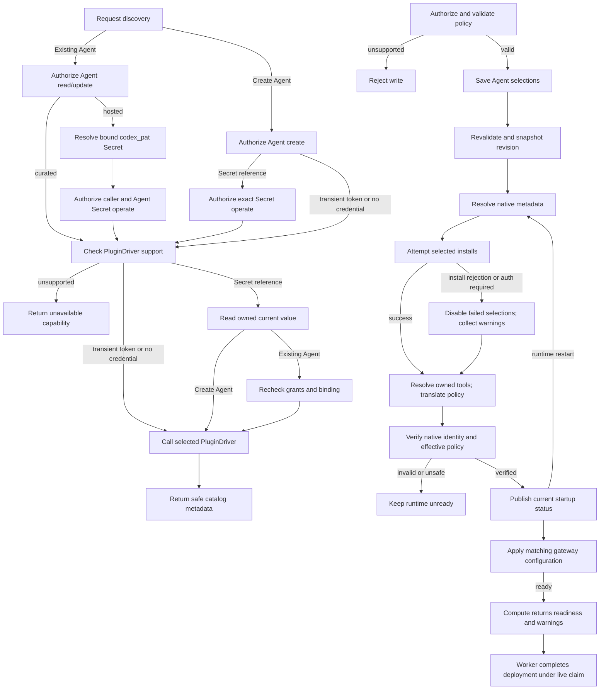

# Agent Plugin Deployment Flow

## Overview

An authorized caller saves plugin selections, then deploys. OCC validates and
snapshots policy, selections, and Driver. Startup resolves metadata, translates
policy, and prepares the revision. Revision selection may precede cutover; the
Harness owns tools and approvals.

## Entry Points

`apps/controller/src/index.ts:createFastifyApp`

- Trigger: Agent create/update with `plugins`, including a Console new-revision
  plugin save, followed by Agent deployment.
- Assumptions: exact Agent permission, valid selections, compatible trusted
  PluginDriver, and deployment prerequisites.
- Source: [HTTP handlers](../../apps/controller/src/index.ts),
  [OpenClawController](../../packages/occ/src/index.ts), and
  [bundled PluginDrivers](../../apps/controller/src/drivers/plugin/index.ts).

## Flow

## Execution Trace

### Credential-scoped discovery

[Create discovery](../reference/drivers/plugin.md#selection-and-catalogs) accepts
transient PATs, same-Namespace Secrets, or supported credential-free access.
OCC checks Namespace Agent `create` and caller Secret `operate` before Driver
support; unsupported discovery reads no Secret.

Existing-Agent discovery requires active Agent `read`/`update`; inputs are queries,
cursors, or plugin IDs. Hosted discovery resolves bound `codex_pat` and rechecks
binding and caller/Agent Secret `operate` inside
[`SecretDriver.withValue`](../reference/drivers/secret.md). Curated discovery needs
no Secret. Missing, denied, or unavailable Secrets fail before discovery.
Nontransactional reads may precede rotation; discovery persists neither state nor
credentials.

The [Codex Driver](../../apps/controller/src/drivers/plugin/index.ts) hydrates
hosted identity, searches `q`, and pages GLOBAL entries with opaque cursors.
[Console discovery](../../apps/controller/src/console/agents/plugin-discovery.mjs)
preloads page one for Create Agent PATs and bound PATs in editable Agent Plugins
tabs. The picker reuses prefetch; credential changes clear discovery, preserving
selections. Search marks loading and invalidates old responses before the
[delay](../reference/drivers/plugin-bundled.md#selection-and-catalogs).
Enter/paging bypass the delay. Closing, configured view, credential changes, and
view cancellation abort requests.
Tools (`null`: unknown) show loading on demand; supported entries become selectable
afterward. Unsupported releases remain unavailable.
Curated catalogs filter bundled entries without verifying tools/account access.

Bounded hosted reads forbid redirects. OCC returns `no-store` metadata, rejects
credential echoes, and suppresses upstream errors/artifacts. Selections exclude
Driver links/setup guidance. Connections remain unverified; HTTPS logos omit
referrers and default to initials.

### 1. Validate desired state under exact-Agent authority

`apps/controller/src/index.ts:createFastifyApp`

HTTP contracts validate input before
[OpenClawController](../../packages/occ/src/index.ts) checks the exact Namespace
and Agent. Reads require Agent `read`; create/PATCH stores the `plugins` map.
Shared validators check the nested selection shape.
`OpenClawController.validatePluginPolicies` calls the selected Driver's
`validatePolicies` before Agent create/update and provisioning writes. Unsupported
controls, reviewer scopes, and combinations return `400 INVALID_REQUEST`;
a missing selected Driver returns `501 NOT_IMPLEMENTED`. Validation is static: native app mapping,
authentication, and release/tool metadata remain startup checks. Agent mutations store desired state and audit evidence atomically without changing
the reusable Configuration or active runtime. On update, omission preserves the
map, `{}` clears it, and a nonempty map replaces it.

Installation readers use `GET /installation`; Agent editors use
`GET .../plugins/capabilities` with Agent read/update. Both return policy capabilities.

### 2. Admit an immutable plugin deployment

`packages/occ/src/index.ts:OpenClawController.deployAgent`

Deployment revalidates selections and Configuration, records the Driver and
policy-only plugin map in AgentRevision, and queues the revision. Native app
mapping, release metadata, and configuration are resolved later.

### 3. Deliver requested state through Compute preparation

`apps/controller/src/drivers/compute/plugin-runtime.ts:pluginRuntimeSpecForRevision`

Compute validates admitted state, Driver, and Harness. Kubernetes projects the
nonsecret request; Docker uses bounded environment delivery.

SSH Compute rejects nonempty plugin maps and Agent default plugin approver
policies before host effects.

Initial embedded Kubernetes gateway preparation applies exact-Agent HTTPS
egress before installation. For existing gateways, `prepareRevision` avoids
duplicate access to the Agent-owned database. `activateRevision` uses `Recreate`:
the old gateway stops before installation. Revision files remain private and the
native registry stays in the Agent-owned database. Docker keeps native state in
the container's private temporary home.

### 4. Prepare native runtime state and hand off readiness

`apps/controller/src/drivers/compute/kubernetes/runtime-entrypoints.ts:installOpenClawPlugins`

Embedded OpenClaw validates selections against its bundled catalog and policy. Grants enter nonempty `tools.allow`,
otherwise `tools.alsoAllow`, preserving denies and profiles. A tool's `enabled`
override precedes `toolDefaults.enabled`; disabled tools emit native denies.
Master disable and operator denies prevail; `provider_default` and `none` add no
Diffs review step. Revision-private configuration uses `--pin --force --no-enable`,
preserving enablement and allow/deny lists during installation. Preparation
refreshes the registry and verifies admitted configuration. The runtime image
must gain this flag; the pinned release lacks it.
Native inspection verifies plugin ID, package name, runtime/install version,
recorded integrity, and the runtime source's containment in the install path.
Verification failure prevents gateway readiness. Confirmed install rejection
disables the optional selection and removes its managed tool allowance before startup.

For nonempty selections, dedicated Codex enables apps, plugins, and remote plugins
in isolated `CODEX_HOME`; Compute configures its OpenClaw bridge with
`codexPlugins.enabled:true`, `allow_all_plugins:false`, and an entry per selection.
`apps._default.enabled:false` always applies. Disabled selections cannot execute
hosted app tools.

`plugin/list` discovers the marketplace; `plugin/read` resolves selections.
`codexRuntimeArtifact` uses concrete `detail.apps`, excluding `appTemplates`.
`codexInstallPlan` validates policy and [component support](../reference/drivers/plugin-bundled.md)
before `plugin/install`. Codex loads bundled skills. Account-wide skill
restrictions require native default enablement and OCE integration.
Install rejections or missing app authentication warn. Explicit tool policies
require `mcpServerStatus/list`'s `codex_apps` inventory; `codexAppToolSettings`
binds catalog action IDs through `_meta._codex_apps.resource_uri`. Native IDs
work. Unknown, unowned, ambiguous, or duplicate IDs fail startup.

`codexRuntimeArtifact` writes defaults and explicit tools:
`provider_default`/`all_actions`/`write_actions`/`none` map to Codex
`auto`/`prompt`/`writes`/`approve`. Defaults cover future actions; overrides
require owned IDs. `driverPolicy.destructiveEnabled`
maps to `destructive_enabled` independently. `toolDefaults.reviewer` maps
`human`/`auto` to app `approvals_reviewer` values `user`/`auto_review`;
omission inherits the Harness reviewer. Unsupported scopes fail at save.
`config/batchWrite` replaces managed app subtrees, clearing stale tool/link
settings; installation readback checks identity, version, and app mapping.
Failed-only bindings disable apps; disabled selections skip installation/status.
`config/read` loads workspace layers. Before readiness,
`verifyCodexAppConfiguration` rejects app/tool/account conflicts and unselected
enabled apps. Disabled failed apps may retain inherited fields. Category defaults
resolve app → global → native `true`; equivalent values and nulls pass. Tool
enablement stays strict because it bypasses categories; omitted reviewers inherit.

`runtime-entrypoints.ts:verifyCodexReviewerConfiguration` checks explicit app/link
reviewers and `configRequirements/read`, rejecting forbidden reviewers, incompatible
automatic-review settings, or conflicting model requirements. Startup checks do not
cover later workspace/session/model changes or strict review. Codex 0.156 readback
omits managed app/tool requirements applied during execution; native effective-policy
introspection remains required. See [remaining proof](../testing/plugins.md#current-proof-notes).
Codex owns cache integrity and health.

For Compute-owned Kubernetes workloads, a selected OpenClaw install command's
normal nonzero exit, a matching Codex `plugin/install` error response, or a
successful Codex install response with apps needing authentication contributes
only an admitted `{pluginId, code}` warning. Transport loss, timeouts, signals,
malformed responses, discovery failures, and policy failures retain their
ordinary startup failure behavior. Provider-owned Harnesses retain their
existing startup path.

After configuration verification, the runtime exposes private startup status.
Kubernetes Compute validates workload, revision, startup instance, selection keys,
and warning codes before returning readiness. Status is recomputed on restart.

Dedicated Codex runs separately. Startup symlinks
`/home/node/.openclaw/plugin-skills` to
`/home/node/openclaw-runtime-assets/plugin-skills`, preserving relative files
without gateway state/credentials.

Gateway blocks failed bridge selections before serving and prevents retry during
turns. It refreshes effective configuration when Agent startup changes;
untrusted status cannot establish readiness. Requested revision selections remain
unchanged.

Compute installs status NetworkPolicies before the first dedicated gateway and
creates it only when the Agent and plugin status are ready and its Service selects
the revision. Existing gateways and full runtime policies retain their activation
boundary.

The Agent and gateway derive an app-server credential from the transport Secret,
revision ID, and Agent startup ID. The gateway receives it after reading matching
status and rendering exclusions. After restart, the old gateway cannot
authenticate while its supervisor awaits the next status poll. The supervisor
publishes non-ready status before stopping a gateway whose peer result changed.

### 5. Complete revision reconciliation

`apps/controller/src/worker.ts:finalizeRevision`

Preparation failure before the worker commits `activeRevisionId` leaves the
prior pointer unchanged. After that commit, activation/finalization failure
retains the candidate pointer and records `REVISION_FINALIZATION_INCOMPLETE` for
retry. Existing embedded Kubernetes replacement runs in this after-commit phase;
the old gateway may already be stopped. The previous revision record remains
stored, but there is no pointer rollback or guarantee of availability during
cutover. See the [controller worker flow](controller-worker.md).

Successful completion reports `REVISION_ACTIVATED` or `REVISION_ALREADY_ACTIVE`.
A candidate pointer alone is not readiness evidence. Agent turns use native
policy; the workspace and gateway database remain Agent-owned.

The worker stores current plugin warnings in the successful work result under its
live claim; the [worker flow](controller-worker.md#7-defer-retry-or-stop-and-hand-off-the-next-iteration)
explains persistence and the deployment status projection. Claim loss prevents a stale completion write; a later worker reads
current readiness again. There is no receipt acknowledgment, failed-plugin
shutdown, or permanent failure latch. Saved deployment warnings describe the
completed deployment attempt rather than ongoing runtime health.

## Debugging and Verification

- Compare `Agent.plugins` with the active revision snapshot and deployment status.
  A successful Agent write alone is not runtime installation evidence.
- Invalid or unsupported policy leaves Agent desired state unchanged. Catalog
  membership, authenticated metadata, ownership, and effective native configuration
  are checked during startup; failure keeps the candidate unready.
- Check missing native packages, release drift, connector authentication, and
  effective policy when readiness fails; preserve credential values in protected
  runtime state rather than copying them into logs.
- With SSH Compute, any nonempty requested plugin map or Agent default plugin
  approver policy should fail before host effects. Clear both on the Agent or
  deploy through a compatible Kubernetes runtime.
- For plugin warnings, check deployment status for `PLUGIN_INSTALL_FAILED` or
  `PLUGIN_AUTH_REQUIRED` and the admitted `pluginId`. Confirm the corresponding
  runtime and gateway entries are disabled. Do not infer plugin attribution
  from arbitrary native logs.
- Prove behavior with a model-chosen plugin call in a normal Agent turn, then
  disable or remove the plugin and verify another Agent is unchanged. Source or
  fixture tests are not native runtime proof.
- Use the opt-in real-runtime lane in [Agent plugin testing](../testing/plugins.md)
  for Kubernetes, database, credential, native-runtime, and historical proof
  details. A skipped native lane is not proof.

## Related docs

- [Agent plugin reference](../reference/agent-plugins.md).
- [Agent plugin approvals and channel directory flow](agent-plugin-approvals.md).
- [PluginDriver selection and limits](../reference/drivers/plugin-bundled.md).
- [Controller worker](controller-worker.md).
- [Harness execution topology](harness-execution-topology.md).
- [Deployment guide](../guides/deploy.md).
- [Agent plugin testing](../testing/plugins.md).

## Manual Notes

[keep this for the user to add notes. do not change between edits]

## Changelog

- 2026-09-28 00:02: Reconciled Codex startup policy verification with approval scopes. (01a0b17c-68b6-7e11-bedc-f74de7d606ed - b96eadc1)

- 2026-09-27 23:40: Catalog prefetch and loading feedback. (01a0e53a-f2be-7bd1-a9c1-36e827b2ee47 - b38554ac)

- 2026-09-27 22:17: Document native Codex bundled skill support and pending account-plugin activation restriction. (01a0d4f7-8085-70e0-9d0c-69a465a81fe3 - 19f72841c3aed621137bd438ae91fa016c39b292)

- 2026-09-27 21:52: Debounced catalog searches and canceled obsolete requests. (01a0e4d2-4f51-7780-b0fc-2352cb99078f - a599db7e)

- 2026-09-27 20:21: Documented approval mapping. (01a0e3cf-cfd3-7c02-91ac-19a0efbd7645 - 0663fa97ed5c0fcabc680241dbe7fbde9fde3562)

- 2026-09-27 06:07: Expanded the curated catalog and marked unsupported releases unavailable. (01a0e176-b1ee-7641-85e8-c167f10c6a66 - eb3d6c4c0b8881e5f7efe17c03cc05357e7c7734)

- 2026-09-27 05:49: Added selected token-free curated catalog discovery and preserved runtime credential checks. (01a0e164-ee0e-7c51-a28f-b1179d5917dd - 7812d81bce78a415b7a47b4e335812304caf98ea)

- 2026-09-27 05:38: Resolve catalog IDs through owned runtime metadata. (01a0d4f7-8085-70e0-9d0c-69a465a81fe3 - 6f7534fa)

- 2026-09-27 02:41: Authorize the selected Secret before reporting unsupported plugin discovery. (01a0e099-da9d-78f1-8e79-ea4a919edf7d - 36cb6d6a4a515ad7328eb596b3da174f262f6d18)

- 2026-09-27 02:03: Link the Agent approval and channel directory flow. (01a0df20-f340-7810-bb59-b1df6c0bbbd3 - b2de165412191a4c9d124acf59fa1efb25cc29d6)

- 2026-09-27 02:08: Added exact-Secret-authorized transient plugin discovery and current-value reads. (01a0e099-da9d-78f1-8e79-ea4a919edf7d - 41aae7750e33b8739efc5f7c6a0ebd160f42f711)

- 2026-09-26 21:38: Added Agent skill paths. (c5a050f1-e44a-48c1-9c18-f7661d50623f - 41aae775)

- 2026-09-26 19:16: Saved-Secret discovery. (authoring-run/828a8a37-a9f6-4bb5-9eed-912780152d5c - e5867bcd)

- 2026-09-26 17:42: Document Console new-revision plugin editing and read-only revision snapshots in the accompanying change. (authoring-run/3aa63184-7716-4d27-90ed-33974110d0f5 - cdd6e3c8413f7cca4909f98d2d4c5f6bd17dbe54)

- 2026-09-24 23:36: Normalize equivalent Codex category defaults during verification. (01a0b17c-68b6-7e11-bedc-f74de7d606ed - 8ce00a84)

- 2026-09-24 23:09: Clarified disabled-app verification and shortened startup readback prose. (01a0b17c-68b6-7e11-bedc-f74de7d606ed - 27d44ac0)

- 2026-09-24 19:44: Added Driver-owned setup and recovery links. (01a0d1dd-aa36-7622-9f43-8376f6ff935e - ef89ded5)

- 2026-09-24 08:00: Added transient PAT discovery through the selected PluginDriver before Agent creation. (01a0d1dd-aa36-7622-9f43-8376f6ff935e - f62e17c)
- 2026-09-24 07:50: Verify nested tool and account/link policy before readiness; retain session and live-enforcement gates (codex/01a0b17c-68b6-7e11-bedc-f74de7d606ed - 073bb5c1)

- 2026-09-24 07:02: Aligned the common reviewer contract and scoped capabilities with the accepted specification; runtime reviewer/session checks remain draft gates (codex/01a0b17c-68b6-7e11-bedc-f74de7d606ed - 3606f2e9)

- 2026-09-24 06:19: Documented nested policy validation, capabilities, owned-tool discovery, and native configuration translation; compatible session/runtime enforcement and live proof remain required (codex/01a0b17c-68b6-7e11-bedc-f74de7d606ed - d39727589)

- 2026-09-21 21:23: Reconciled policy composition and installation without enablement changes with optional-plugin warnings and the bundled Driver reference; runtime release and Kubernetes proof remain pending (codex/01a0b17c-68b6-7e11-bedc-f74de7d606ed - 9405e20)

- 2026-09-21 19:15: Ignore template metadata while retaining concrete app policy and startup mapping checks. (codex/01a0b632-4907-7362-9c51-28129db5a3b9 - aa6dd741)

- 2026-09-18 17:38: Documented plugin policy conflict rejection, tool allowlist composition, and installation without enablement changes; runtime release and Kubernetes proof remain pending (codex/01a0b17c-68b6-7e11-bedc-f74de7d606ed - 724dcb5)

- 2026-09-18 17:17: Linked plugin warning persistence to the generalized controller work result. (codex/01a0b0fc-4a24-76c0-8fb7-f3a3a434d464 - 6a582ce9)

- 2026-09-17 20:28: Replaced terminal plugin receipts with verified optional-plugin exclusion, current startup status, and successful deployment warnings; runtime verification in progress. (codex/01a0b0fc-4a24-76c0-8fb7-f3a3a434d464 - 7771526d)
- 2026-09-17: Verified native OpenClaw and Codex plugin turns, successful warning persistence, failed selection exclusion, and Agent-only restart recovery. Ordered initial dedicated gateway startup after its Agent status dependency. (codex/01a0b0fc-4a24-76c0-8fb7-f3a3a434d464 - a5a11ad1)
- 2026-09-17 20:28: Removed the first-failure receipt and acknowledgment lifecycle under the approved best-effort plugin decision. (NOT_IN_SPEC)

- 2026-09-17 15:02: Added the Kubernetes receipt and terminal plugin-failure path for Compute-owned plugin startup without claiming native proof completion. (codex/01a0b0fc-4a24-76c0-8fb7-f3a3a434d464 - 58ead994)

- 2026-09-08 16:05: Corrected Codex Linear support to the existing bridge path and kept live local-Kubernetes proof pending (codex/01a08228-c3ec-7ab2-b0c0-74f49a8ec8a7 - 79021fa)
- 2026-09-08 17:02: Recorded current Codex Linear proof boundary: native install/readiness passed, bridge app batch request passed, force-refresh app state showed Linear enabled/callable, and a normal turn invoked Linear `list_teams` before timing out in native `waitingOnApproval` without a result (codex/01a08228-c3ec-7ab2-b0c0-74f49a8ec8a7 - 79021fa)
- 2026-09-08 17:34: Recorded the native diagnostic blocker: direct Linear execution requires app reauthentication, the diagnostic native model turn emitted a Codex Apps URL elicitation that was declined, and normal OCC proof remains pending reconnection and rerun (codex/01a08228-c3ec-7ab2-b0c0-74f49a8ec8a7 - b4fa273)
- 2026-09-08 18:05: User substituted Google Calendar for the required Codex live proof; Calendar curated metadata and normal-turn `list_calendars(max_results:1)` proof remain pending, while Linear remains historical connector evidence (codex/01a08228-c3ec-7ab2-b0c0-74f49a8ec8a7 - b4fa273)
- 2026-09-08 18:12: Verified Google Calendar curated metadata from live Agent cache after native install: `google-calendar@openai-curated-remote` version `1.2.7`, app `connector_947e0d954944416db111db556030eea6`, `required:true`; Calendar normal-turn proof remains pending (codex/01a08228-c3ec-7ab2-b0c0-74f49a8ec8a7 - b4fa273)
- 2026-09-08 15:30: Added opt-in Kubernetes and test-only Docker plugin proof prerequisites without claiming live proof completion (codex/01a08228-c3ec-7ab2-b0c0-74f49a8ec8a7 - 1471b4c)
- 2026-09-08 14:30: Documented plugin admission, the Codex 501 boundary, and serialized OpenClaw replacement (codex/01a082a0-aa05-7af0-af28-5568d12d623f - 1471b4c217e4879a6b430890ac216b2026e9bd46)

- 2026-09-08 18:18: Google Calendar 1.2.7 normal-Agent acceptance passed with the designated service account, matching tool/result evidence, and zero skips (codex/01a08228-c3ec-7ab2-b0c0-74f49a8ec8a7 - ef51e45).
- 2026-09-09 13:39: Updated the flow for Agent-owned plugin maps, full-map replacement, startup catalog resolution, and revision snapshots that freeze requested state rather than native release artifacts (codex/01a08228-c3ec-7ab2-b0c0-74f49a8ec8a7 - 237dd0a).
- 2026-09-09 14:50: Simplified bootstrap and catalog projection, kept native metadata/configuration readiness, and standardized both native plugin proofs on Kubernetes (codex/01a08228-c3ec-7ab2-b0c0-74f49a8ec8a7 - 44f80f2).
- 2026-09-09 15:49: Aligned bootstrap/install ordering, replacement semantics, and pre-commit versus post-commit failure and worker completion with current implementation (codex/01a08228-c3ec-7ab2-b0c0-74f49a8ec8a7 - 08abf9c).

- 2026-09-11: Removed the per-Agent plugin inventory GET and its inferred installation query. Read desired selections from Agent configuration and deployment outcomes from existing revision/status surfaces; native catalog discovery remains available to the PluginDriver. (NOT_IN_SPEC)
