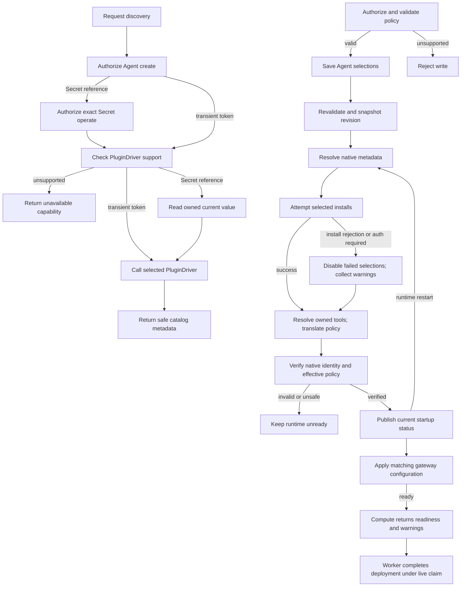

# Agent Plugin Deployment Flow

## Overview

An authorized caller saves Agent plugin selections and deploys the Agent. OCC
validates policy and snapshots selections and Driver at deployment. Startup
resolves metadata, translates policy, and prepares the isolated revision. This
flow ends at reconciliation or failure. The active revision pointer can change
before runtime cutover finishes; the Harness owns tool invocation and approvals.

## Entry Points

`apps/controller/src/index.ts:createFastifyApp`

- Trigger: Agent create/update with `plugins`, followed by Agent deployment.
- Assumptions: exact Agent create/update authorization, structurally valid plugin
  configuration, a compatible trusted PluginDriver selected before saving plugins,
  and the existing deployment prerequisites.
- Source: [HTTP handlers](../../apps/controller/src/index.ts),
  [OpenClawController](../../packages/occ/src/index.ts), and
  [bundled PluginDrivers](../../apps/controller/src/drivers/plugin/index.ts).

## Flow

## Execution Trace

### Credential-scoped discovery

The [discovery routes](../reference/drivers/plugin.md#selection-and-catalogs) accept
an ephemeral PAT or an exact Secret reference. `apps/controller/src/index.ts:createFastifyApp`
passes the selected source to `packages/occ/src/index.ts:OpenClawController.discoverAgentPlugins`
or `discoverAgentPluginDetails`. OCC authorizes Namespace Agent creation. For a
reference, it rejects cross-Namespace scope and authorizes `operate` on the exact
Secret before checking PluginDriver support. Unsupported discovery returns without
reading a Secret value. Otherwise OCC reads its metadata, and the selected
`SecretDriver.withValue` verifies backend ownership and passes its current value
to the selected PluginDriver.
No platform transaction is held during backend or provider I/O. Each request
reads again, so rotation affects later requests; an already-started request can
use the value it read before rotation. Missing, denied, and unavailable Secrets
fail before provider discovery. No discovery state or value is stored.

[Codex discovery](../../apps/controller/src/drivers/plugin/hosted-catalog.ts) hydrates identity,
pages 20 GLOBAL entries, and loads tools (`null`: unknown). Filtering stays local.
Bounded, redirect-free reads return `no-store` metadata without credentials; OCC
rejects a result that echoes the supplied value. They return no artifacts or
upstream errors. Driver-owned links, unavailable reasons, and
[setup guidance](../reference/drivers/plugin-bundled.md#selection-and-catalogs) remain outside selections. App connections stay unverified.
HTTPS logos use no referrers and fall back to initials.

### 1. Validate desired state under exact-Agent authority

`apps/controller/src/index.ts:createFastifyApp`

HTTP contracts validate input before
[OpenClawController](../../packages/occ/src/index.ts) checks the exact Namespace
and Agent. Reads require Agent `read`; create/update stores the `plugins` map.
Shared validators check the nested selection shape.
`OpenClawController.validatePluginPolicies` calls the selected Driver's
`validatePolicies` before Agent create/update and provisioning writes. Unsupported
controls, reviewer scopes, and combinations return `400 INVALID_REQUEST`;
a missing selected Driver returns `501 NOT_IMPLEMENTED`. Validation is static: native app mapping,
authentication, and release/tool metadata remain startup checks. Agent mutations store desired state and audit evidence atomically without changing
the reusable Configuration or active runtime. On update, omission preserves the
map, `{}` clears it, and a nonempty map replaces it.

Authorized `GET /installation` reads expose the selected Driver's
`policyCapabilities` through `OpenClawController.getInstallation`. This is policy
capability discovery; it does not list available plugins or tools.

### 2. Admit an immutable plugin deployment

`packages/occ/src/index.ts:OpenClawController.deployAgent`

Deployment revalidates Agent selections and Configuration, records the Driver
identity and policy-only plugin map in AgentRevision, and queues the immutable
revision. Native app mapping, release metadata, and configuration are resolved later.

### 3. Deliver requested state through Compute preparation

`apps/controller/src/drivers/compute/plugin-runtime.ts:pluginRuntimeSpecForRevision`

Compute validates the admitted state, Driver, and Harness. Kubernetes projects
the nonsecret request into the revision workload; Docker uses bounded runtime
environment delivery. Both follow the existing Compute lifecycle.

SSH Compute rejects nonempty plugin maps before host effects; plugin-free
revisions use the ordinary SSH lifecycle.

For an initial embedded Kubernetes gateway, preparation applies exact-Agent HTTPS
egress before installation. For an existing gateway, `prepareRevision` avoids a
second process on the Agent-owned database. `activateRevision` uses `Recreate`:
the old gateway stops before installation. Revision files remain private and the
native registry stays in the Agent-owned database. Docker keeps native state in
the container's private temporary home.

### 4. Prepare native runtime state and hand off readiness

`apps/controller/src/drivers/compute/kubernetes/runtime-entrypoints.ts:installOpenClawPlugins`

For embedded OpenClaw, the entrypoint resolves the requested selection against
the bundled OpenClaw catalog and rejects conflicts with native plugin policy
before installation. It merges generated tool grants into an existing nonempty
`tools.allow`, otherwise `tools.alsoAllow`, preserving tool denies and profiles.
The translator resolves each known tool's `enabled` override before its
`toolDefaults.enabled` value, then emits native denies for disabled tools. A
plugin master disable wins over tool exceptions; operator denies remain effective.
`native` and `approve` add no review step for Diffs. The resulting configuration
is private to the revision. Installation uses
`--pin --force --no-enable` so native installation cannot change enablement or
plugin allow/deny lists; preparation then refreshes the registry and verifies the
admitted configuration. The runtime image must first gain the required native
flag; the pinned release does not support it.
Native inspection verifies plugin ID, package name, runtime/install version,
recorded integrity, and the runtime source's containment in the install path.
Verification failure stops startup before the replacement gateway becomes ready.
A confirmed install rejection instead disables that optional selection and
removes its managed tool allowance before the gateway starts.

Dedicated Codex uses one of two fixed bootstrap configurations in its isolated
`CODEX_HOME`: empty selections disable the apps/plugins/remote-plugin features;
nonempty selections enable those features. Both set `apps._default.enabled:false`.
For nonempty selections, Compute applies the shared selected-only OpenClaw
bridge renderer during gateway configuration construction: `codexPlugins.enabled:true`,
`allow_all_plugins:false`, and one entry per selected plugin. Disabled entries
remain selected but cannot execute through that bridge.

At startup, native `plugin/list` discovers the `openai-curated-remote` marketplace;
`plugin/read` resolves each selection using the summary's opaque remote identity.
`runtime-translator.ts:codexRuntimeArtifact` derives policy only from concrete
`detail.apps` and ignores `appTemplates`; template-only IDs do not receive an
app grant. See the [bundled Driver limits](../reference/drivers/plugin-bundled.md#selection-and-catalogs).
`runtime-translator.ts:codexInstallPlan` validates policy and native detail before
Compute calls `plugin/install` for each enabled selection. Confirmed install
rejections or missing app authentication produce warnings. For explicit tool policies,
`readCodexToolStatuses` reads `codex_apps` inventory through `mcpServerStatus/list`.
`runtime-translator.ts:codexAppToolSettings` binds catalog action IDs to native names
using connector-matched `_meta._codex_apps.resource_uri` metadata. Native IDs remain
supported. Unknown, unowned, ambiguous, or duplicate targets fail startup.

`codexRuntimeArtifact` writes app defaults and supplied tool fields independently;
it does not expand category rules or copy defaults to every tool. `native` maps to
Codex `auto`; `driverPolicy.destructiveEnabled` maps to `destructive_enabled`.
`toolDefaults.reviewer` maps `human`/`auto` to app `approvals_reviewer` values
`user`/`auto_review`; omission inherits the effective Harness reviewer. Both
Drivers reject explicit reviewers at unsupported scopes before save.
`writeCodexAppConfiguration` replaces each managed app
subtree with `config/batchWrite`, removing stale per-app tool/link settings. It
then rereads successful installations to check identity, version, and app mapping.
Failed-only bindings are disabled; successful bindings retain admitted policy.
Disabled selections do not contribute install attempts or startup results.
`config/read` verifies the effective overlay before readiness, including every
nested tool's enablement and approval against its requested override or app
default. Absent/null fields inherit. Unexpected explicit tool enablement is
rejected when OCE omitted the default, because it can bypass category restrictions.
Account/link approval defaults must match the requested app approval.

`runtime-entrypoints.ts:verifyCodexReviewerConfiguration` checks explicit app
reviewers against effective app/link settings and `configRequirements/read`.
It rejects forbidden reviewers, incompatible automatic-review approval settings,
and human review conflicting with current-model requirements. These startup
checks do not establish later session/model routing, strict review, workspace
configuration, or managed requirements beyond reviewer checks. See the [remaining proof](../testing/plugins.md#current-proof-notes).
Codex owns cache integrity and runtime health.

For Compute-owned Kubernetes workloads, a selected OpenClaw install command's
normal nonzero exit, a matching Codex `plugin/install` error response, or a
successful Codex install response with apps needing authentication contributes
only an admitted `{pluginId, code}` warning. Transport loss, timeouts, signals,
malformed responses, discovery failures, and policy failures retain their
ordinary startup failure behavior. Provider-owned Harnesses retain their
existing startup path.

After configuration verification, the runtime exposes private startup status.
Kubernetes Compute validates workload, revision, startup instance, selection keys,
and warning codes before returning readiness. Status is recomputed on restart.

Dedicated Codex runs separately. Startup symlinks
`/home/node/.openclaw/plugin-skills` to
`/home/node/openclaw-runtime-assets/plugin-skills`, preserving relative files
without gateway state/credentials.

Gateway blocks failed bridge selections before serving and prevents retry during
turns. It refreshes effective configuration when Agent startup changes;
untrusted status cannot establish readiness. Requested revision selections remain
unchanged.

Compute installs status NetworkPolicies before the first dedicated gateway and
creates it only when the Agent and plugin status are ready and its Service selects
the revision. Existing gateways and full runtime policies retain their activation
boundary.

The Agent and gateway derive an app-server credential from the existing transport
Secret, revision ID, and Agent startup ID. The gateway receives that credential
only after reading the matching status and rendering its exclusions. After an
Agent restart, the previous gateway process cannot authenticate with its old
credential while its supervisor waits for the next status poll. The supervisor
publishes non-ready status before stopping a gateway whose peer result changed.

### 5. Complete revision reconciliation

`apps/controller/src/worker.ts:finalizeRevision`

Preparation failure before the worker commits `activeRevisionId` leaves the
prior pointer unchanged. After that commit, activation/finalization failure
retains the candidate pointer and records `REVISION_FINALIZATION_INCOMPLETE` for
retry. Existing embedded Kubernetes replacement runs in this after-commit phase;
the old gateway may already be stopped. The previous revision record remains
stored, but there is no pointer rollback or guarantee of availability during
cutover. See the [controller worker flow](controller-worker.md).

Successful completion reports `REVISION_ACTIVATED` or `REVISION_ALREADY_ACTIVE`.
A candidate pointer alone is not readiness evidence. Agent turns use native
policy; the workspace and gateway database remain Agent-owned.

The worker stores current plugin warnings in the successful work result under its
live claim; the [worker flow](controller-worker.md#7-defer-retry-or-stop-and-hand-off-the-next-iteration)
explains persistence and the deployment status projection. Claim loss prevents a stale completion write; a later worker reads
current readiness again. There is no receipt acknowledgment, failed-plugin
shutdown, or permanent failure latch. Saved deployment warnings describe the
completed deployment attempt rather than ongoing runtime health.

## Debugging and Verification

- Compare `Agent.plugins` with the active revision snapshot and deployment status.
  A successful Agent write alone is not runtime installation evidence.
- Invalid or unsupported policy leaves Agent desired state unchanged. Catalog
  membership, authenticated metadata, ownership, and effective native configuration
  are checked during startup; failure keeps the candidate unready.
- Check missing native packages, release drift, connector authentication, and
  effective policy when readiness fails; preserve credential values in protected
  runtime state rather than copying them into logs.
- With SSH Compute, any nonempty requested plugin map should fail before host
  effects. Clear the Agent's plugin map or deploy through a compatible
  Kubernetes runtime.
- For plugin warnings, check deployment status for `PLUGIN_INSTALL_FAILED` or
  `PLUGIN_AUTH_REQUIRED` and the admitted `pluginId`. Confirm the corresponding
  runtime and gateway entries are disabled. Do not infer plugin attribution
  from arbitrary native logs.
- Prove behavior with a model-chosen plugin call in a normal Agent turn, then
  disable or remove the plugin and verify another Agent is unchanged. Source or
  fixture tests are not native runtime proof.
- Use the opt-in real-runtime lane in [Agent plugin testing](../testing/plugins.md)
  for Kubernetes, database, credential, native-runtime, and historical proof
  details. A skipped native lane is not proof.

## Related docs

- [Agent plugin reference](../reference/agent-plugins.md).
- [PluginDriver selection and limits](../reference/drivers/plugin-bundled.md).
- [Controller worker](controller-worker.md).
- [Harness execution topology](harness-execution-topology.md).
- [Deployment guide](../guides/deploy.md).
- [Agent plugin testing](../testing/plugins.md).

## Manual Notes

[keep this for the user to add notes. do not change between edits]

## Changelog

- 2026-09-27 05:38: Resolve catalog IDs through owned runtime metadata. (01a0d4f7-8085-70e0-9d0c-69a465a81fe3 - 6f7534fa)

- 2026-09-27 02:41: Authorize the selected Secret before reporting unsupported plugin discovery. (01a0e099-da9d-78f1-8e79-ea4a919edf7d - 36cb6d6a4a515ad7328eb596b3da174f262f6d18)

- 2026-09-27 02:08: Added exact-Secret-authorized transient plugin discovery and current-value reads. (01a0e099-da9d-78f1-8e79-ea4a919edf7d - 41aae7750e33b8739efc5f7c6a0ebd160f42f711)

- 2026-09-26 21:38: Added Agent skill paths. (c5a050f1-e44a-48c1-9c18-f7661d50623f - 41aae775)

- 2026-09-24 19:44: Added Driver-owned setup and recovery links. (01a0d1dd-aa36-7622-9f43-8376f6ff935e - ef89ded5)

- 2026-09-24 08:00: Added transient PAT discovery through the selected PluginDriver before Agent creation. (01a0d1dd-aa36-7622-9f43-8376f6ff935e - f62e17c)
- 2026-09-24 07:50: Verify nested tool and account/link policy before readiness; retain session and live-enforcement gates (codex/01a0b17c-68b6-7e11-bedc-f74de7d606ed - 073bb5c1)

- 2026-09-24 07:02: Aligned the common reviewer contract and scoped capabilities with the accepted specification; runtime reviewer/session checks remain draft gates (codex/01a0b17c-68b6-7e11-bedc-f74de7d606ed - 3606f2e9)

- 2026-09-24 06:19: Documented nested policy validation, capabilities, owned-tool discovery, and native configuration translation; compatible session/runtime enforcement and live proof remain required (codex/01a0b17c-68b6-7e11-bedc-f74de7d606ed - d39727589)

- 2026-09-21 21:23: Reconciled policy composition and installation without enablement changes with optional-plugin warnings and the bundled Driver reference; runtime release and Kubernetes proof remain pending (codex/01a0b17c-68b6-7e11-bedc-f74de7d606ed - 9405e20)

- 2026-09-21 19:15: Ignore template metadata while retaining concrete app policy and startup mapping checks. (codex/01a0b632-4907-7362-9c51-28129db5a3b9 - aa6dd741)

- 2026-09-18 17:38: Documented plugin policy conflict rejection, tool allowlist composition, and installation without enablement changes; runtime release and Kubernetes proof remain pending (codex/01a0b17c-68b6-7e11-bedc-f74de7d606ed - 724dcb5)

- 2026-09-18 17:17: Linked plugin warning persistence to the generalized controller work result. (codex/01a0b0fc-4a24-76c0-8fb7-f3a3a434d464 - 6a582ce9)

- 2026-09-17 20:28: Replaced terminal plugin receipts with verified optional-plugin exclusion, current startup status, and successful deployment warnings; runtime verification in progress. (codex/01a0b0fc-4a24-76c0-8fb7-f3a3a434d464 - 7771526d)
- 2026-09-17: Verified native OpenClaw and Codex plugin turns, successful warning persistence, failed selection exclusion, and Agent-only restart recovery. Ordered initial dedicated gateway startup after its Agent status dependency. (codex/01a0b0fc-4a24-76c0-8fb7-f3a3a434d464 - a5a11ad1)
- 2026-09-17 20:28: Removed the first-failure receipt and acknowledgment lifecycle under the approved best-effort plugin decision. (NOT_IN_SPEC)

- 2026-09-17 15:02: Added the Kubernetes receipt and terminal plugin-failure path for Compute-owned plugin startup without claiming native proof completion. (codex/01a0b0fc-4a24-76c0-8fb7-f3a3a434d464 - 58ead994)

- 2026-09-08 16:05: Corrected Codex Linear support to the existing bridge path and kept live local-Kubernetes proof pending (codex/01a08228-c3ec-7ab2-b0c0-74f49a8ec8a7 - 79021fa)
- 2026-09-08 17:02: Recorded current Codex Linear proof boundary: native install/readiness passed, bridge app batch request passed, force-refresh app state showed Linear enabled/callable, and a normal turn invoked Linear `list_teams` before timing out in native `waitingOnApproval` without a result (codex/01a08228-c3ec-7ab2-b0c0-74f49a8ec8a7 - 79021fa)
- 2026-09-08 17:34: Recorded the native diagnostic blocker: direct Linear execution requires app reauthentication, the diagnostic native model turn emitted a Codex Apps URL elicitation that was declined, and normal OCC proof remains pending reconnection and rerun (codex/01a08228-c3ec-7ab2-b0c0-74f49a8ec8a7 - b4fa273)
- 2026-09-08 18:05: User substituted Google Calendar for the required Codex live proof; Calendar curated metadata and normal-turn `list_calendars(max_results:1)` proof remain pending, while Linear remains historical connector evidence (codex/01a08228-c3ec-7ab2-b0c0-74f49a8ec8a7 - b4fa273)
- 2026-09-08 18:12: Verified Google Calendar curated metadata from live Agent cache after native install: `google-calendar@openai-curated-remote` version `1.2.7`, app `connector_947e0d954944416db111db556030eea6`, `required:true`; Calendar normal-turn proof remains pending (codex/01a08228-c3ec-7ab2-b0c0-74f49a8ec8a7 - b4fa273)
- 2026-09-08 15:30: Added opt-in Kubernetes and test-only Docker plugin proof prerequisites without claiming live proof completion (codex/01a08228-c3ec-7ab2-b0c0-74f49a8ec8a7 - 1471b4c)
- 2026-09-08 14:30: Documented plugin admission, the Codex 501 boundary, and serialized OpenClaw replacement (codex/01a082a0-aa05-7af0-af28-5568d12d623f - 1471b4c217e4879a6b430890ac216b2026e9bd46)

- 2026-09-08 18:18: Google Calendar 1.2.7 normal-Agent acceptance passed with the designated service account, matching tool/result evidence, and zero skips (codex/01a08228-c3ec-7ab2-b0c0-74f49a8ec8a7 - ef51e45).
- 2026-09-09 13:39: Updated the flow for Agent-owned plugin maps, full-map replacement, startup catalog resolution, and revision snapshots that freeze requested state rather than native release artifacts (codex/01a08228-c3ec-7ab2-b0c0-74f49a8ec8a7 - 237dd0a).
- 2026-09-09 14:50: Simplified bootstrap and catalog projection, kept native metadata/configuration readiness, and standardized both native plugin proofs on Kubernetes (codex/01a08228-c3ec-7ab2-b0c0-74f49a8ec8a7 - 44f80f2).
- 2026-09-09 15:49: Aligned bootstrap/install ordering, replacement semantics, and pre-commit versus post-commit failure and worker completion with current implementation (codex/01a08228-c3ec-7ab2-b0c0-74f49a8ec8a7 - 08abf9c).

- 2026-09-11: Removed the per-Agent plugin inventory GET and its inferred installation query. Read desired selections from Agent configuration and deployment outcomes from existing revision/status surfaces; native catalog discovery remains available to the PluginDriver. (NOT_IN_SPEC)
