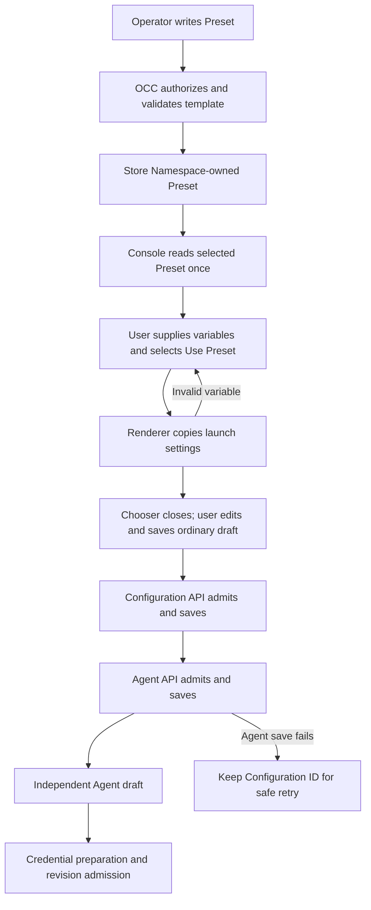

# Agent Presets flow

## Overview

The console reads a Namespace-owned Preset, renders its variables, and saves an
independent Configuration and Agent through the existing APIs. This flow starts
with Preset CRUD or selection and stops at a saved Agent draft. Deployment
continues through [revision admission](configuration-driver/persistence-and-revisions.md).

## Entry Points

- Source: `packages/contracts/src/api/routes.ts:occApiRoutes`.
- [Preset routes](../../packages/contracts/src/api/routes.ts): authenticated
  collection and exact-resource operations in a Namespace.
- [OCC Preset methods](../../packages/occ/src/index.ts): `createPreset`,
  `updatePreset`, `listPresets`, `getPreset`, and `deletePreset` own lifecycle.
- [Console selector](../../apps/controller/src/console/agents/presets.mjs):
  `createPresetFields` requires a selected Namespace and an authenticated user.
  Saving also needs the existing Configuration, Agent, and credential grants.

## Flow

## Execution Trace

Before serving requests, [migration 0024](../../migrations/0024_agent_presets.sql)
creates Preset storage and adds Preset CRUD grants to the unchanged built-in
administrator Role. Its guarded update preserves customized Roles; the exact
[eligibility rules](../reference/presets.md#crud-and-permissions) belong to the Preset contract.

### 1. Admit and store a template

`packages/occ/src/index.ts:OpenClawController.createPreset`

[`OpenClawController.createPreset` and `admitPresetTemplate`](../../packages/occ/src/index.ts)
lock the Namespace, check the exact collection grant and ready state, then call
[`normalizePresetTemplate`](../../packages/contracts/src/presets.ts).
Template structure, variable declarations, default types, and credential
references are checked without requiring unfilled variables. Ordinary Agent
field validation is deferred to the creation APIs. When native values exist,
the selected Configuration Driver's
`validateValues` checks their native credential rules; missing capability fails
closed. Core owns no native configuration interpretation.

The [repository](../../packages/occ/src/state/postgres-state.ts) stores the whole
template in `occ.presets`. PATCH locks the resource and replaces an included
template atomically. DELETE removes its exact IAM bindings in the transaction.
Presets prevent Namespace deletion while present. The controller's normal audit
path records mutations and denials without template or variable contents.

### 2. Read and render the selected copy

`apps/controller/src/console/agents/presets.mjs:createPresetFields`

[`createPresetFields`](../../apps/controller/src/console/agents/presets.mjs)
lists only readable Presets, then reads the selected resource once. The user
fills typed inputs and selects **Use Preset**. The shared
[`renderPresetTemplate`](../../packages/contracts/src/preset-variables.mjs)
walks JSON once, rejects missing or mistyped inputs and duplicate rendered native
keys, and preserves runtime placeholders and unresolved SecretRefs.

Rendering makes no requests and fetches no credentials. On success, the chooser
is replaced by the ordinary Agent form; the form keeps only the rendered
settings. Preset updates or deletion cannot alter them. Before saving,
**Start over** discards the unsaved draft after confirmation and opens a fresh
chooser. After a save succeeds or its outcome becomes uncertain, restart is
disabled so the user follows ordinary creation recovery.

### 3. Save an independent draft

`apps/controller/src/console/agents/create.mjs:renderCreateAgent`

[The creation form](../../apps/controller/src/console/agents/create.mjs) copies
rendered settings into editable fields and checks their form representation.
Save creates a Configuration first, then an Agent that refers to it. Each server
request owns full schema, native credential, and authorization admission before
its persistence boundary; browser validation is not that boundary.

If Configuration creation succeeds but Agent creation fails, the form retains
the Configuration ID and locks Configuration-affecting controls. A safe retry
reuses the saved Configuration. An uncertain response requires inspection before
another creation attempt. See [creation recovery](../reference/console/create-and-deploy.md#create-an-agent).

### 4. Hand off to deployment

`packages/occ/src/index.ts:OpenClawController.deployAgent`

The saved Agent has a new identity and no Preset reference. Variable inputs are
not stored as a separate map. Rendered values are ordinary Agent/Configuration
settings. Credential preparation and [revision admission](configuration-driver/persistence-and-revisions.md)
read those resources, not the Preset. Later Preset changes cannot change a draft
or an immutable admitted revision.

## Debugging and Verification

- A missing selector entry can mean missing exact Preset `read` permission;
  compare the Namespace and the authenticated list response.
- Chooser errors identify variable or form-field problems before any save. Save errors
  come from existing Configuration or Agent admission; retain request and saved
  Configuration IDs when investigating partial or uncertain outcomes.
- [Controller integration coverage](../../tests/integration/presets-controller.test.mjs)
  exercises the HTTP workflow, admission, isolation, and copy independence.
  [PostgreSQL coverage](../../tests/integration/postgres-presets.test.mjs) exercises
  persistence; [browser coverage](../../tests/browser/console-agents.test.mjs)
  exercises the real selection form. Coverage names are not proof of a live model response.
- The local cluster attempt for this implementation stopped at a cgroup v2
  startup failure. A Kubernetes deployment and real model response remain
  unverified; use the [Kubernetes testing guide](../testing/kubernetes.md) on a
  supported host for that proof.

## Related docs

- [Preset contract](../reference/presets.md) and [usage guide](../guides/topics/agent-presets.md)
- [Configuration Driver](../reference/drivers/configuration.md)
- [Console creation and recovery](../reference/console/create-and-deploy.md)

## Manual Notes

## Changelog

- 2026-09-21 22:00: Simplify Preset selection to one-time prefill and defer ordinary launch-field validation to creation (codex/01a0b1f2-e696-7232-a439-5b668154bcd9 - f997fca7e7f739a460274c74396afbcfda63f53a)

- 2026-09-21 19:58: Link the guarded administrator grant upgrade and its eligibility contract (codex/01a0b1f2-e696-7232-a439-5b668154bcd9 - aa6dd7415d65ffba5fa40098b2142eb2a7d73df4)

- 2026-09-21 19:48: Document Preset storage, rendering, and independent Agent creation (codex/01a0b1f2-e696-7232-a439-5b668154bcd9 - aa6dd7415d65ffba5fa40098b2142eb2a7d73df4)
