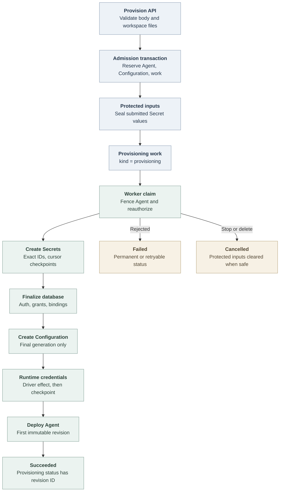

# Agent provisioning flow

## Overview

Agent provisioning starts when an authorized caller posts inline Agent Configuration, optional new Secret values, and existing Secret references to `POST /namespaces/:namespaceId/agents/provision`. The Console uses this route for supported first-time Dedicated Agent creation; ordinary create paths still save a Configuration first and create a draft Agent. OCC admits one new stopped Agent, protects submitted secret values, reserves Configuration metadata, and queues durable provisioning work. The controller worker creates any requested Secrets, finalizes Secret access and Configuration metadata, materializes Configuration, prepares runtime credentials, and deploys the first revision.

This trace follows current source from API admission through the first deployment handoff. It stops after `deployAgent` admits the revision; normal revision reconciliation continues in the [controller worker flow](controller-worker.md), and runtime activation details remain owned by the [Harness execution topology](harness-execution-topology.md) and related Compute Driver flows.

## Entry Points

- Trigger: `POST /namespaces/:namespaceId/agents/provision`
- Source: `packages/contracts/src/api/routes.ts:provisionAgent`, `apps/controller/src/index.ts:createFastifyApp`, and `packages/occ/src/index.ts:OpenClawController.provisionAgent`
- Assumptions: the Namespace is ready, the selected Drivers support provisioning recovery and transactional IAM policy, the caller has the exact Agent, Configuration, Secret, Installation, and deployment permissions checked by admission, and API and worker mount the same operator-provisioned versioned input keyring at `OCC_PROVISIONING_KEYS_PATH`. The keyring must retain every key ID needed by pending provisioning records.

## Flow

## Execution Trace

### 1. API admits one provisioning request

`apps/controller/src/index.ts:createFastifyApp`

The HTTP route validates initial workspace files and workspace defaults, then calls `OpenClawController.provisionAgent`. The response is `202` with an Agent and provisioning status. Status reads and retries use `GET /namespaces/:namespaceId/agents/:agentId/provisioning` and bodyless `POST /namespaces/:namespaceId/agents/:agentId/provisioning/retry`, which also returns `202`. Console keeps masked submitted values only in memory until admission is acknowledged; after a page reload, it reconciles through Agent and provisioning status instead of resubmitting new Secret values.

`packages/occ/src/index.ts:OpenClawController.provisionAgent` validates the stable `requestId`, inline Configuration, local Secret inputs, local or existing Secret bindings, Harness authentication, workspace setup, execution mode, plugin choices, and repository bindings. It computes a keyed request fingerprint over the canonical request. Reusing the same request ID with the same fingerprint returns the existing work; changing the plan conflicts.

Admission reserves a generation-1 Agent Configuration metadata row, creates a stopped Agent, records initial workspace setup when supplied, seals each submitted Secret value with `ProvisioningInputProtector.protect`, creates `agent_provisioning_work`, and queues `controller_work` with `work_kind = 'provisioning'`. The record stores immutable plan data and protected inputs; API responses expose only `status`, `phase`, `attemptCount`, `updatedAt`, `url`, optional `revisionId`, and safe `{ code, message }` errors.

### 2. The worker claims and fences the Agent

`apps/controller/src/worker.ts:ControllerWorker.process`

The worker claim loop routes `kind: provisioning` work to `OpenClawController.processAgentProvisioning`. The controller marks the record `running`, then before every external effect calls `fenceAgentProvisioning`. That fence locks the Namespace and Agent, requires the Namespace to be ready, requires the Agent to remain active and stopped, re-runs `authorizeProvisioningRecord`, and checks that the accepted Driver IDs still match the selected Compute, Configuration, Secret, and IAM Drivers.

Provisioning requires PostgreSQL-backed state. The in-memory platform state intentionally rejects provisioning writes because protected inputs and monotonic checkpoints need durable storage.

### 3. The worker creates submitted Secrets

`packages/occ/src/index.ts:processAgentProvisioningSecrets`

The Secret phase walks from `secretCursor` through the accepted local Secret inputs. Before each driver call, it checkpoints a `pendingEffect` with the target Secret ID. If metadata for that exact Secret already exists after recovery, the worker reuses its backend reference. If a previous write may have succeeded but the result was lost, the worker calls `SecretDriver.inspectExact` on the recorded target and accepted value. Only a fresh pending item calls `SecretDriver.createExact`; that call is a single create and conflicts on an existing or mismatched backend Secret.

After the effect result is known, the worker stores an `effectReceipt` beside `pendingEffect`. The next checkpoint records Secret metadata, advances the cursor, and removes the completed input from `protected_inputs` in one transaction. Failed work retains only pending inputs needed for an authorized retry. Cancellation disables retry; unresolved creates retain their recovery material until inspection proves the outcome and owned cleanup completes.

### 4. The worker finalizes Configuration and access

`packages/occ/src/index.ts:processAgentProvisioningDatabaseSetup`

The database setup phase resolves request-local Secret sources to exact Secret references, reauthorizes existing references, and validates Harness authentication. It grants the Agent service principal exact `secret:operate` access for the accepted model auth and final Configuration bindings through the selected IAM policy transaction.

The same transaction finalizes the reserved Configuration metadata. If Secret bindings exist, OCC advances the Configuration generation and records those bindings; otherwise generation 1 remains the final generation. The Agent is updated with the finalized Harness auth and the same provider, plugin, repository, and execution-mode choices. This checkpoint records `configurationGeneration`.

### 5. The worker materializes Configuration and transport

`packages/occ/src/index.ts:processAgentProvisioningConfiguration`

After database setup, OCC builds the final Configuration object from reserved metadata and the inline values. A fresh materialization calls `ConfigurationDriver.createExact` once for that final generation; recovery from a lost result calls `ConfigurationDriver.inspectExact` on the recorded target. Generation 2 is used when bindings were resolved; generation 1 is used when no bindings were submitted. The worker checkpoints `configuration` after the driver effect is known, not while holding a database transaction across the external wait.

The transport phase shares the existing runtime-credential path without a loopback HTTP request. `processAgentProvisioning` calls `admitAgentRuntimeCredentialProvisioning`, then the selected Compute Driver's `provisionAgentRuntimeCredentials` with an empty input. After that effect, the worker checkpoints `transport`.

### 6. Handoff admits the first revision

`packages/occ/src/index.ts:processAgentProvisioning`

The final transaction rereads the provisioning record, rejects cancelled or failed work, fences the Agent again, and runs `deployAgent` inside the provisioning context. `guardAgentProvisioning` allows this exact handoff while the same work claim is running, but other edits, reads that require mutable Configuration, and ordinary deploys remain blocked before Configuration materialization is safe.

After `deployAgent` returns, provisioning checkpoints `handoff`, marks the record `succeeded`, and stores the revision ID. The worker returns success; subsequent activation, readiness observation, maintenance, Stop, and redeploy behavior use the normal Agent revision workflow.

### 7. Failure, retry, cancellation, and deletion preserve ownership

`packages/occ/src/state/postgres-state.ts:provisioning`

`recordFailure` stores a safe error on the provisioning record and either retries the queued work or marks it failed permanently after retry exhaustion. `retryAgentProvisioning` only requeues failed, pre-handoff work for the initiating actor after fresh authorization and lifecycle checks. Duplicate retry on already pending work returns current status without resetting attempts or admitting another execution. Stop and delete call `cancelByAgent`; deletion also removes workspace setup immediately. Terminal Stop/Delete recovery first inspects any pending effect, records an `effectReceipt` when the backend object exists, runs owned cleanup from that receipt, and only finalizes the Agent row after pending effects have settled, quiesced, or been marked safe.

`migrations/0029_agent_provisioning_work.sql` enforces exact ownership, unique `(namespace_id, actor_id, request_id)`, one provisioning record per Agent and Configuration, monotonic phase progress, immutable accepted plans, immutable finalized Configuration generation, and revision IDs only at `handoff`.

## Debugging and Verification

- Check the public status with `GET /namespaces/:namespaceId/agents/:agentId/provisioning`. The status reports `queued`, `running`, `failed`, or `succeeded`, `phase`, `attemptCount`, `updatedAt`, `url`, optional `revisionId`, and optional safe error.
- If admission or recovery fails with protected-input availability errors, verify that both API and worker mount `OCC_PROVISIONING_KEYS_PATH` and that the keyring still includes the key ID recorded by the provisioning request.
- Inspect worker logs for `worker.completed`, `worker.error`, and work operation fields. Metrics classify provisioning work as `agent_provisioning`.
- PostgreSQL evidence lives in `occ.controller_work` with `work_kind = 'provisioning'` and `occ.agent_provisioning_work` for request fingerprint, phase, cursor, generation, revision, protected-input, and progress state.
- Relevant integration coverage includes `tests/integration/postgres-agent-provisioning.test.mjs` for admission replay, generic Secret creation, Configuration finalization, transport handoff, cancellation, and revoked-authority behavior.

## Related docs

- [Controller worker and durable reconciliation](controller-worker.md)
- [Configuration Driver flow](configuration-driver.md)
- [Secret storage and delivery](secret-storage-and-delivery.md)
- [Harness execution topology](harness-execution-topology.md)
- [Workspace files](workspace-files.md)
- [Asynchronous Agent provisioning spec](../../specs/35-agent-provisioning.md)

## Manual Notes

[keep this for the user to add notes. do not change between edits]

## Changelog

- 2026-09-23 01:25: Corrected provisioning effect recovery to use inspect-first recovery and clarified terminal cleanup ownership. (cody/01a0cd23-4e0e-7a92-ab33-32a667859782 - 5886094b)
- 2026-09-23 00:51: Restored concrete status, exact-create recovery, generation, external-effect, retry, and cleanup details from the accepted spec. (cody/01a0cd23-4e0e-7a92-ab33-32a667859782 - 79ca801d)
- 2026-09-23 00:45: Clarified Console first-time provisioning, ordinary create separation, and versioned provisioning keyring prerequisites. (cody/01a0cd23-4e0e-7a92-ab33-32a667859782 - 79ca801d)
- 2026-09-23 00:22: Added the source-backed Agent provisioning flow. (cody/01a0cd23-4e0e-7a92-ab33-32a667859782 - 79ca801d)
