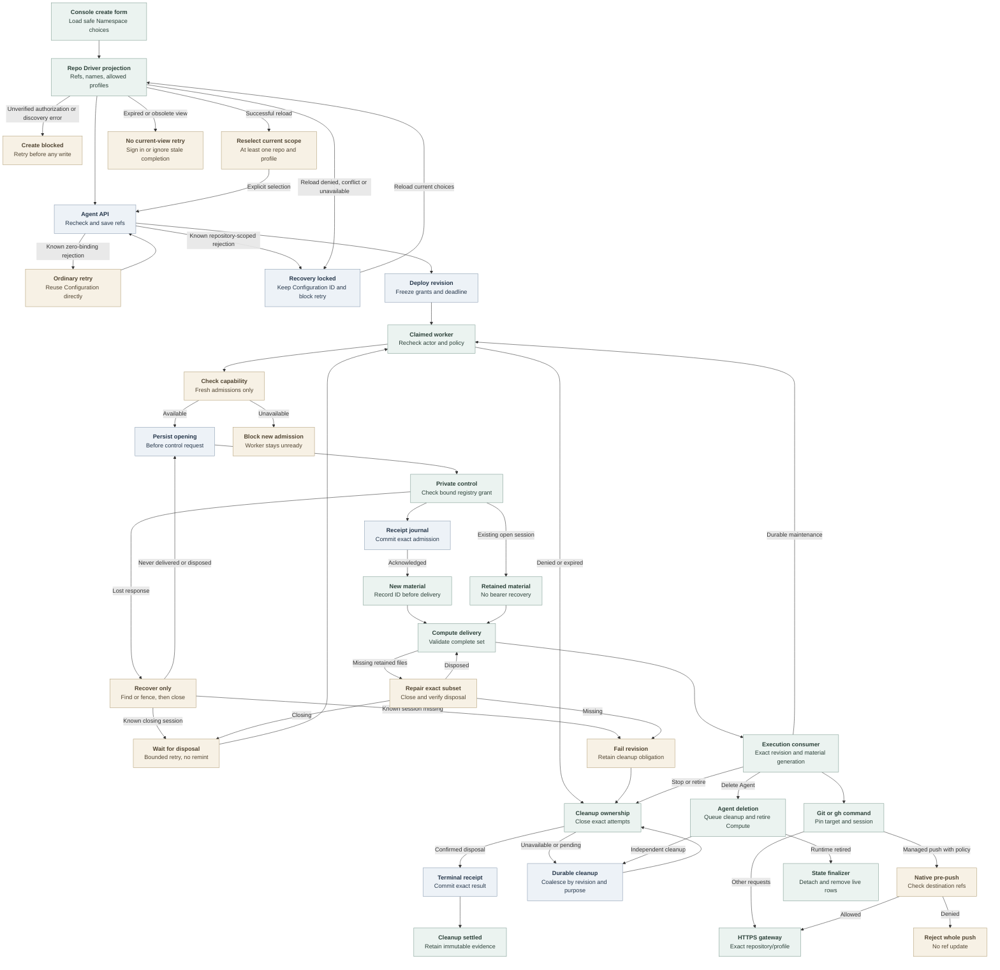

# Agent repository credential flow

## Overview

The Console lists approved repositories; admission saves selections and deployment
freezes grants. The worker delivers sessions to Kubernetes embedded OpenClaw
or dedicated Codex with compatible Harness authentication and no Sandbox Driver.
See [service forwarding and retirement](repository-credentials.md) and
[runtime qualification](../testing/repository-credentials.md).

### Sandbox consumer preparation

Provisional `apps/controller/src/drivers/compute/kubernetes/sandbox-repository-material.ts` derives original session/generation/deadline
expectations. Its unwired port checks validated private Memory/read-only material
and Agent Pod UID, then rechecks current selection after inspection. Withdrawal,
replacement, expiry and unknown outcomes deny readiness.

Controlled-port tests cover components only. OpenShell delivery,
currentness and cleanup remain unqualified; the repository guard stays closed.

## Entry Points

- `apps/controller/src/index.ts:createFastifyApp` registers repository-option and
  Agent lifecycle routes. Options and creation share Namespace-scoped Agent-create
  authorization.
- `apps/controller/src/console/agents/repositories.mjs:createRepositoryFields`
  renders repository and access-level selection.
- `apps/controller/src/worker.ts:ControllerWorker.prepareRevision` prepares
  repository sessions before invoking Compute.

The Installation selects a repository Driver and Backend. API, worker and service
share an immutable registry; the Namespace is ready. Unbound Agents bypass this.

## Flow

## Execution Trace

### 1. Project choices and resolve Namespace policy during Agent admission

`OpenClawController.listRepositoryOptions` authorizes Namespace-scoped Agent
creation, checks Compute-owned availability, then projects opaque references,
names and profiles through `GitHubRepoDriver.listOptions`. Exact Harness validation
remains at deployment. No approvals yields an empty list; a closed Namespace conflicts.
Only classified optional discovery failure after authorization becomes
`RepositoryOptionsUnavailableError`, mapped by the options route to
`503 REPOSITORY_OPTIONS_UNAVAILABLE`. Generic failures do not establish authorization.

`createRepositoryFields` permits 16 selections with one explicit `git-read`,
`git-write` or `git-full` profile. Discovery success or that optional-outage code
permits creation. Transport, malformed, throttled and generic failures block both
writes; denial and lifecycle conflict remain distinct. Model selection is independent; toggles preserve focus.

The form saves Configuration first and preserves it after known Agent rejections.
Retries reuse it; repository retries require successful reload, nonempty reselection
and explicit profile. Empty selections cannot downgrade the attempt. Failed reloads
block creation, expiry signs out, and obsolete completions cannot mutate the view.
Unknown outcomes require stored Agent and Configuration reads.

`packages/occ/src/index.ts:OpenClawController.repositoryBindingSelections`
uses `resolveRepositoryBindings` after existing authorization. Inputs contain distinct opaque references and optional profiles, never provider tokens
or caller-selected grant identities. The concrete
`apps/controller/src/drivers/repo/github/driver.ts:GitHubRepoDriver.resolve`
uses local registry policy, defaulting to Contributor (`git-write`), without
control-socket or GitHub calls.

`apps/controller/src/drivers/repo/github/credentials/registry.ts:resolveGitHubRepositoryBinding`
requires the exact Namespace/reference/profile combination. Its fingerprint
binds provider/App/installation/repository identity, duration policy and the
Namespace's complete profile policy, exact permissions and optional normalized
push-ref allowlist. Each binding has one grant; installations can supply several repositories. OCC stores normalized Agent selections; an omitted update array
preserves them and an empty array clears them.

### 2. Freeze a deployable revision

`packages/occ/src/index.ts:OpenClawController.admitRepositoryCredentials`
re-resolves the draft, validates topology through Compute and freezes Driver
identity, exact grants and an absolute deadline unaffected by renewal or recovery.
Duration `86400` allows 24 hours from admission. The public `clientRevision`
serializer in `apps/controller/src/index.ts` returns only Driver identity,
references, profiles and deadline.

`apps/controller/src/composition/repository-credentials/platform.ts:composeRepoDriver`
constructs `GitHubRepoDriver` for capability `repo` from a Backend-owned Unix
client, validated registry and public CA. Installation and Backend membership
must select the same Driver ID. The API and worker never load the token engine or
App key. The [production startup flow](production-startup.md) owns composition and
sidecar launch; the service validates protected inputs before listening.

### 3. Record ownership before opening a session

`apps/controller/src/worker/repository-credentials.ts:RepositoryCredentialLifecycle.prepare`
rechecks actor, Namespace, Agent, revision, Driver, grant and deadline. Before a
fresh attempt, `GitHubRepoDriver.checkAdmissionReady` checks the broker capability
with a bounded request. The worker also checks it before refreshing readiness.
An unavailable capability blocks fresh admission, but not recovery or cleanup.
Under the live claim and Namespace/Agent locks, State records the attempt and
immutable cleanup context before the Driver call. It rejects stopped or deleting
owners and stores identifiers and phases, never bearers or client files.

`apps/controller/src/backends/repository-credentials/control-client.ts:UnixRepositoryCredentialControlClient`
sends the bound request over the private socket. The service independently
resolves and compares the grant through
`apps/controller/src/drivers/repo/github/credentials/registry-factory.ts:createGitHubRegistryDriverFactory`.
The client validates each status before projection. `DISPOSED` permits historical
revoked or expired counts, but no active, pending or uncertain obligations.

Only a created response contains the bearer. The Driver encodes transient files with
`apps/controller/src/drivers/repo/github/credentials/client/config.ts:encodeRepositoryCredentialSessionFiles`
and returns status with that closed file map. The worker records the
session ID before passing files through
`ComputeRevisionContext.repositoryCredentials`.

A confirmed open session yields a `retained` binding without files. `recoverOnly`
finds or fences unfinished admissions and closes recovered sessions.
Fresh material requires confirmed disposal or a missing opening without a recorded
session ID; invalidated known sessions block automatic same-revision replacement.
Closing sessions raise `REPOSITORY_CLEANUP_PENDING` until disposal, subject to Work
bounds and the revision deadline. Validated `DISPOSED` observations survive service pruning.
`apps/controller/src/drivers/repo/credentials/control.ts:createControlAdmission`
reserves before releasing material. The worker's
`apps/controller/src/backends/repository-credentials/receipt-store.ts:RepositoryReceiptStore`
commits exact admission fences and original-broker terminal observations. Failure
before terminal commit remains unknown; transport failure cannot establish absence.

### 4. Deliver and retain one complete runtime generation

`apps/controller/src/drivers/compute/kubernetes/repository-material.ts:repositoryMaterialSpec`
validates `new | retained` bindings against the revision and hashes sorted
reference/session pairs.
`apps/controller/src/drivers/compute/kubernetes/repository-material-store.ts:RepositoryMaterialStore.prepare`
validates ownership and contents before creating immutable
Agent/revision/session-owned Secrets. It reports missing retained bindings. The worker's `RepositoryCredentialLifecycle.repair` closes that subset
and requires disposal before replacement, then retries Compute once. Missing
inventory fails the revision. Pending closure blocks replacement until bounded
retry or active-revision continuation confirms disposal.

`apps/controller/src/drivers/compute/kubernetes/repository-material.ts:repositoryMaterialDeployment`
mounts Secrets only in the first init container. Sorted projection items prevent
key-order changes from triggering rollouts; session replacement still does.
`apps/controller/src/drivers/compute/kubernetes/repository-material-init.ts:REPOSITORY_MATERIAL_INIT_ENTRYPOINT`
validates a complete projection, then writes mode-0700 directories and mode-0600
files into memory-backed storage. `REPOSITORY_NATIVE_GIT_INIT_ENTRYPOINT` mounts
that private subPath at `/run/oce/repository-credentials`, avoiding the
fsGroup-writable volume root. It calls
`apps/controller/src/drivers/repo/github/credentials/client/native-git.ts:prepareNativeGitConfiguration`
with unchanged private-file checks. Retry removes only a validated private
`gitconfig`. Both init completions gate consumer startup; the consumer mounts
material read-only. Public metadata and gateway bearers remain separate files.

`apps/controller/src/drivers/compute/kubernetes/index.ts:KubernetesComputeDriver.activateRevision`
replaces the consumer when material changes, including within one revision.
Readiness requires role, revision and generation. Dedicated replacement preserves enrollment and revision-private storage. `KubernetesComputeDriver.prepareRevision` rechecks material after plugin,
gateway and node observations, including for successors; changed generation or
lost readiness returns incomplete.
The gateway receives neither repository material nor repository-gateway egress.
Compute grants consumer egress; Helm admits consumers through
[credential-sidecar ingress selectors](../reference/drivers/kubernetes-compute/networking-and-isolation.md#networking). Native preparation
writes aggregate `gitconfig` without reading bearers. System Git includes
`/run/oce/repository-credentials/gitconfig`, preserving HOME/global configuration.
Embedded `repositoryNativeConfiguration` keeps the `gh` router first in
`tools.exec.pathPrepend`. `AGENT_RUNTIME_ENTRYPOINT` sets Codex's
`allow_login_shell=false` and `shell_environment_policy.set.PATH`. The Harness
model environment remains intact. App keys, JWTs, installation tokens and the
control socket never enter this material set. Selected Codex plugins can read `/app/node_modules/openclaw`,
`/home/node/.openclaw/plugin-skills` and `/home/node/openclaw-runtime-assets/plugin-skills`
for the stock app-server and published skills inside sandboxed Codex tools. Repository-bound Codex consumers additionally receive stock Codex
`allow_local_binding = true`, `mode = "full"`, and the exact broker hostname
allowance; explicit denies prevail. That repository profile also grants
read-only access to `/opt/oce/repository-credentials` and
`/run/oce/repository-credentials` so the native binary, Git helper, and generated
session material remain reachable inside sandboxed Codex tools. The
[networking contract](../reference/drivers/kubernetes-compute/networking-and-isolation.md#networking)
defines dedicated/embedded eligibility. Unbound policy and broker authorization remain unchanged.
Compute supplies CA trust; TLS verification stays enabled.

### 5. Authenticate native Git and route GitHub CLI commands

Stock Git owns commands, remotes, push URLs, worktrees and settings. Configuration
rewrites canonical HTTPS hosts to their gateway origin. The scoped helper checks
host/path, generation and deadline before supplying the bearer. `OCE_REPOSITORY_REF`
disambiguates bindings, not destinations. Local identity, hooks, aliases, overrides
and other helpers remain available; there is no whole-command preflight or egress
confinement.
See the [routing limits](../reference/repository-credentials.md#client-routing-and-limits).
`pushRefAllowlist` selects image-owned hooks.
`apps/controller/src/drivers/repo/github/credentials/client/hook-dispatch.ts:checkPush`
matches the actual destination, normalizing trailing slashes and validating
usernames after binding selection; duplicate grants remain ambiguous. It checks
every destination ref and rejects the whole push before updates, though discovery
may contact the service. It delegates original arguments and input to ordinary
common-directory hooks. `commonDirectory` uses Git-supplied directories before
initial `HEAD`; linked worktrees resolve their shared directory through Git.
Custom hook paths and
API writes remain outside this [best-effort guardrail](../reference/repository-credentials/push-ref-guardrail.md).

`apps/controller/src/drivers/repo/github/credentials/client/router.ts:routeRepositoryClient`
routes supported `gh` commands using explicit targets or effective Git remotes.
It pins generation, reference and session, selects private `gh` configuration
and preserves HOME without mutating shared selection.

`apps/controller/src/drivers/repo/github/credentials/profiles.ts` owns the exact
Reader, Contributor and Collaborator permission maps. The GitHub route classifier
admits selected REST operations for that profile and token-bounded GraphQL for
all three. Every GraphQL POST remains a possible write; Reader's token, not a
query parser, enforces its read-only grant. See
[access levels](../reference/repository-credentials/access-levels.md).

The [service exchange flow](repository-credentials.md#4-reserve-acquire-and-dispatch)
enforces bearer, immutable repository/profile, capacity and deadlines, acquiring
fresh installation tokens under the same grant until the revision deadline.

### 6. Maintain, recover and retire ownership

`apps/controller/src/worker.ts:ControllerWorker.completeActivatedRevision`
commits completion and maintenance together, preserving the original actor.
Repository revisions use the Driver's 30-second interval or a shorter Compute
interval. Restart resumes queued work without inventing actors. A committed terminal
receipt survives broker restart; a missing known session remains invalidated.
`REPOSITORY_SESSION_RECOVERY_UNSAFE` permanently fails observation and queues
runtime retirement; later workers cannot remint for that revision. An authorized user can
deploy a new revision without settling old cleanup.

`apps/controller/src/worker.ts:ControllerWorker.finalizeActiveRevision`
atomically fails bounded observations and enqueues successors while the active revision remains authorized. Stop, policy drift, expiry and revoked authority
cannot use this continuation to reopen sessions.

`packages/occ/src/state/postgres-work-queue.ts:PostgresWorkQueue.enqueueRepositoryCleanup`
and terminal queue transitions persist exact revision-owned obligations. Registration checks claim and owner; recovery transfers eligible failures.
Work coalesces by revision and purpose, retaining its creating actor and source failure evidence. Queued or claimed Work keeps its
schedule and claim; later obligations requeue succeeded Work. Previously queued
cleanup remains eligible.
`RepositoryCredentialLifecycle.closeRevision` records session-only cleanup with
the attempts it marks closing. Cleanup retries at the Driver interval without consuming Work retries.

`ControllerWorker.processRepositoryCleanup` consumes validated owner-bound Work
without policy resolution, admission or material delivery, even after the actor
loses ordinary permissions. Terminal-runtime Work fences attempts, closes sessions
and calls Compute's `stopRevision` for that revision. Compute mismatch or stop
failure remains retryable beyond foreground limits. Completion requires settled
sessions and runtime retirement. Session-only repair/rotation never stops healthy
workloads. `CLOSED` denies local use but awaits disposal; missing inventory or
invalidation does not prove provider settlement. Retained attempts support
cleanup after revision deletion.

`ControllerWorker.processAgentDeletion` queues cleanup and retires Compute without
waiting for sessions. After owner detachment, cleanup Work uses its revision key
for dispatch and audits. Under the current claim,
`PostgresWorkQueue.completeAgentDeletion` calls `occ.finalize_agent_deletion` to
detach attempts, delete live rows and audit deletion atomically. Attempts and cleanup Work survive without fabricated disposal. Sessions block
neither admission nor completion. Unresolved provisioning effects
still defer completion without consuming retries.

Compute retirement waits for owned Pods to stop before removing their material.
It preserves Secrets referenced by actual Pods and current Deployments, and
limits deletion to exact ownership with UID preconditions. Stop removes only
the stopped revision's route and preserves newer shared resources. Route and
Deployment deletion require the observed resourceVersion. Shared cleanup remains
retryable after partial failure. Service restart cannot prove remote token revocation.

## Debugging and Verification

Compare `occ agent get AGENT_ID --output json` with the admitted `activeRevisionId`.
Inspect worker events for
`REPOSITORY_BINDING_CHANGED`, `REPOSITORY_CREDENTIAL_DEADLINE_EXCEEDED`,
`REPOSITORY_SESSION_RECOVERY_UNSAFE`, `REPOSITORY_CLEANUP_PENDING` or
`REPOSITORY_CLEANUP_COMPLETE`. Check registry
identity and deadline before retrying.

`repository-not-admitted` means an unselected target; `name-one-repository-target`
or `name-one-repository-ref` requires explicit selection. Inspect material metadata
and Pod generation without printing bearers or Secrets.

The [test guide](../testing/repository-credentials.md) distinguishes lifecycle,
installed-runtime and live-provider proof. The
[image volume case](../testing/images.md#repository-runtime-volume-test-environment)
checks Docker mounts; Helm checks rendered ingress. Neither proves CNI enforcement.
Console recordings cover fixture/API behavior, not model, Slack or GitHub execution.
Ready Pods and local commands do not prove live writes.

## Related docs

- [Repository credential reference](../reference/repository-credentials.md)
- [Install repository access](../guides/repository-credentials/installation.md)
- [Create and use a repository Agent](../guides/repository-credentials.md)
- [Controller worker lifecycle](controller-worker.md)
- [Credential service execution](repository-credentials.md)

## Manual Notes

[keep this for the user to add notes. do not change between edits]

## Changelog

- 2026-09-29 20:54: Document provisional material consumer. (authoring-run/76e5e2f0-b49d-4695-bed2-3faa276a1211 - afb96eec06558462eade80c95924ce6bc262d3f6)

- 2026-09-28 21:24: Stabilize retained projection order. (public authoring-run/75044c27-6c5b-4cff-a6cf-9e31fd688ac2 - 8352c0932bcbde43e88b44c6975496ca5431ff55)

- 2026-09-28 17:25: Separate Agent deletion and repository-session cleanup. (authoring-run/df373b87-44bc-442f-bce4-03ca8ab4e3f7 - 33a2528163d5bbff311bb685345e60aadb24a70a)

- 2026-09-28 12:09: Check broker capability before fresh admission and worker readiness. (01a0e6ca-0480-79a1-ab5d-31a7cfb42228 - 5b66ac97aa3b805099aeebfaadeb846eb957707d)

- 2026-09-28 08:12: durable broker terminal receipts and admission fencing. (authoring-run/41ba3c72-c44a-4a26-8285-7d4724f24352 - e06ff9625e72ff5ab3483a504a2f02a69a370cbb)

- 2026-09-28 07:05: coalesced revision cleanup registration and preserved claim ownership. (authoring-run/80088bb7-240e-42d0-bae9-9420d6eac9f9 - e06ff9625e72ff5ab3483a504a2f02a69a370cbb)

- 2026-09-26 09:07: Replace custom private-endpoint capability with stock Codex networking; retain independent authorization boundaries. (authoring-run/c29b3860-d1f0-4a14-a264-49090586cb20 - 20123a3aa96021391616e918deee0ce60b009fa3)
  Removed custom Codex private-endpoint requirement. (NOT_IN_SPEC)

- 2026-09-23 08:33: Condense combined flow preserving contracts. (public-pr/295 - acd86266)

- 2026-09-23 08:16: initialization-safe hook delegation and equivalent native HTTPS destination matching. (authoring-run/fca0cd1e-2248-4139-aae8-d12423b5667e - 45c4cf5584b631c9ae5018c56a579d4bafa79ca5)

- 2026-09-23 06:44: Align successor readiness and access-level UI. (public-pr/295 - 9613bb6082e703eb13258c3e976326895297ca4b)

- 2026-09-23 06:29: Join Console recovery, Dedicated material readiness, access-level permissions and optional native push guardrail. (public-pr/295 - c0b9ce5b4ef36de65c3119fe2bc97cb29c30c184)

- 2026-09-23 06:18: access-level permissions and grant fingerprint changes. (authoring-run/0dffba8f-d16f-4f90-8fe2-893368f6926a - a2e94cf8ac2d94306f0701cee5457d1a9797e50a)

- 2026-09-23 06:11: successor-readiness correction while prior gateway serves. (public-pr/295 - fd5c5814e87585533a1f56127cf7eee9589b69ac)

- 2026-09-23 04:47: Document late material readiness checks, preserved workspace node, dedicated ingress and required installed-client volume coverage. (public-pr/295 - da14a882312fc7d88a047353bde2c76f19b2e2ee)

- 2026-09-23 04:15: optional push-ref guardrail and ordinary hook delegation. (48c7cd3a-4677-44e0-b710-c39ada9d4f48 - cbf1851308a2db398820ae9e1000f57837703ace)

- 2026-09-22 18:19: Dedicated support, two-step private initialization, authorization-safe discovery and persistent retry intent. (public-pr/295 - 2607afb5829937a0b3110d0f9409fea373def428)

- 2026-09-22 10:13: safe repository choices, focused selection, pre-write conflicts, ordinary retry and fail-closed repository recovery. (public-pr/295 - 4c2e9e37f18d01878a47083505fab656172008a1)

- 2026-09-21 17:15: Distinguish pending disposal from irrecoverable session loss. (authoring-run/7ba8b1a5-628b-45f2-9ec9-25ce904b82d9 - 47995c58a5f9d267040e510110ca28ffa3d3a226)

- 2026-09-21 15:48: refusal of unsafe same-revision replacement and canonical retention registration. (authoring-run/f4034e1f-9090-4f83-87c7-189e172017e2 - 08a9b693de5fe959d26e698435017e0114e3e46e)

- 2026-09-21 07:32: retained cleanup evidence and pending Agent deletion. (authoring-run/5657fc4b-0f7a-423e-9c54-1cf174f5d6c2 - d2b31887be1d114c9147e2ed6f07c1f38e765c6f)

- 2026-09-21 05:32: Align platform credential docs, source history and native Git boundaries. (authoring-run/fba2d7fa-6603-465e-a7c8-df0375ad202d - a051a2406eec7cafde2e0dd5e2ec63dba6ce1581)

- 2026-09-19 23:54: Reconcile RepoDriver ownership, private status projection, and separate emitted service/client paths. (public authoring-run/73c80a5e-4d0c-4e72-b989-0cf9963c6593 - e5b5a5489f078d08272523476bdbcd0b9162c946)

- 2026-09-18 04:55: native exec PATH projection for repository material, with per-agent overrides. (e3012a8cee0c5ea60bc02943ebed88a1c88eb0d2)
- 2026-09-18 03:04: Agent admission, durable session lifecycle, Kubernetes material generation and concurrent client integration. (8500b2da103063b4503b62e5529f3910513e84a9)
