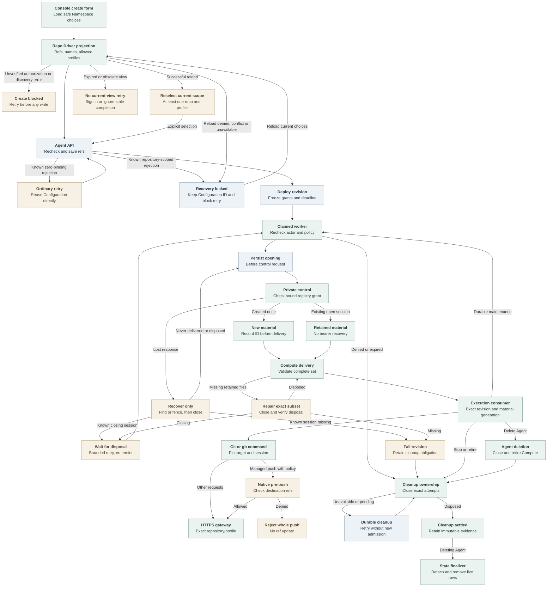

# Agent repository credential flow

## Overview

The Console lists approved repositories, admission saves selections, and deployment
freezes grants. The worker delivers sessions to Kubernetes-owned embedded OpenClaw
or dedicated Codex workloads that use compatible Harness authentication and no Sandbox Driver.
See [service forwarding and retirement](repository-credentials.md) and
[runtime qualification](../testing/repository-credentials.md).

## Entry Points

- `apps/controller/src/index.ts:createFastifyApp` registers repository-option and
  Agent lifecycle routes. Options and creation share Namespace-scoped Agent-create
  authorization.
- `apps/controller/src/console/agents/repositories.mjs:createRepositoryFields`
  renders optional repository selection and a common access level.
- `apps/controller/src/worker.ts:ControllerWorker.prepareRevision` prepares
  repository sessions before invoking the selected Compute Driver.

The Installation selects a repository Driver and Backend. API, worker and service
share one immutable registry; the Namespace is ready. Unbound Agents bypass this
capability.

## Flow

## Execution Trace

### 1. Project choices and resolve Namespace policy during Agent admission

`OpenClawController.listRepositoryOptions` authorizes Namespace-scoped Agent
creation, checks Compute-owned availability, then projects opaque references,
names and profiles through `GitHubRepoDriver.listOptions`. Exact Harness validation
remains at deployment. No approvals yields an empty list; a closed Namespace conflicts.
Only classified optional discovery failure after authorization becomes
`RepositoryOptionsUnavailableError`, mapped by the options route to
`503 REPOSITORY_OPTIONS_UNAVAILABLE`. Generic failures do not establish authorization.

`createRepositoryFields` permits 16 selections with an explicit common
`git-read`, `git-write` or `git-full` profile. Discovery success or that optional-outage
code permits ordinary creation. Transport, malformed, throttled and generic failures
block both writes; denial and lifecycle conflict remain distinct. Model selection
is independent; toggles preserve focus.

The form saves Configuration first. Known Agent rejections preserve it. Ordinary
retries reuse it; repository-scoped retries require a successful reload, nonempty
reselection, and an explicit profile. Empty selections cannot downgrade the
attempt. Failed reloads block creation, expiry signs out, and obsolete completions
cannot mutate the view. Unknown outcomes require stored Agent and Configuration reads.

`packages/occ/src/index.ts:OpenClawController.repositoryBindingSelections`
uses `resolveRepositoryBindings` after existing authorization. The public input
contains distinct opaque references and optional profiles, not provider tokens
or caller-selected grant identities. The concrete
`apps/controller/src/drivers/repo/github/driver.ts:GitHubRepoDriver.resolve`
uses local registry policy, defaulting to Contributor (`git-write`), without
control-socket or GitHub calls.

`apps/controller/src/drivers/repo/github/credentials/registry.ts:resolveGitHubRepositoryBinding`
requires the exact Namespace/reference/profile combination. Its fingerprint
binds provider/App/installation/repository identity, duration policy and the
Namespace's complete profile policy, exact permissions and optional normalized
push-ref allowlist. Each binding has one grant; an installation can supply several
repositories. OCC stores normalized Agent selections; an omitted update array
preserves them and an empty array clears them.

### 2. Freeze a deployable revision

`packages/occ/src/index.ts:OpenClawController.admitRepositoryCredentials`
re-resolves the draft, validates topology through Compute and freezes Driver
identity, exact grants and an absolute deadline unaffected by renewal or recovery.
Duration `86400` allows 24 hours from admission. The public `clientRevision`
serializer in `apps/controller/src/index.ts` returns only Driver identity,
references, profiles and deadline.

`apps/controller/src/composition/repository-credentials/platform.ts:composeRepoDriver`
constructs `GitHubRepoDriver` for capability `repo` from a Backend-owned Unix
client, validated registry and public CA. Installation and Backend membership
must select the same Driver ID. The API and worker never load the token engine or
App key. The [production startup flow](production-startup.md) owns composition and
sidecar launch; the service validates protected inputs before listening.

### 3. Record ownership before opening a session

`apps/controller/src/worker/repository-credentials.ts:RepositoryCredentialLifecycle.prepare`
rechecks the original actor, ready Namespace, running Agent, exact revision,
selected Driver, unchanged grant and deadline. Each fresh attempt commits its
request identity in State under the live work claim and Namespace/Agent locks before
dispatch. State derives immutable cleanup context from the admitted Driver and
binding, and rejects new attempts for stopped or deleting owners.
`RepositoryCredentialLifecycle.open` calls the Driver outside the transaction.
State stores recovery identifiers and phases, never bearers or client files.

`apps/controller/src/backends/repository-credentials/control-client.ts:UnixRepositoryCredentialControlClient`
sends the bound request over the private socket. The service independently
resolves and compares the grant through
`apps/controller/src/drivers/repo/github/credentials/registry-factory.ts:createGitHubRegistryDriverFactory`.
The client validates cleanup counts and terminal-state consistency before
projecting private status and binding objects. `DISPOSED` permits historical
revoked or expired counts, but no active uses, active/pending/uncertain
credentials, or pending auxiliary work. Created-open, recovered-open, status and
close all require validation before projection.

Only a created control response contains the bearer. The concrete Driver encodes
transient files with
`apps/controller/src/drivers/repo/github/credentials/client/config.ts:encodeRepositoryCredentialSessionFiles`
and returns status with that closed file map. The worker records the
session ID before passing files through
`ComputeRevisionContext.repositoryCredentials`.

A confirmed open session yields a `retained` binding without files. Unfinished
openings use `recoverOnly` to find or fence admission and close recovered sessions.
Fresh material requires confirmed disposal or a missing opening without a recorded
session ID. Invalidated known sessions block automatic same-revision replacement.
Closing sessions raise retryable
`REPOSITORY_CLEANUP_PENDING`; replacement awaits disposal within Work bounds and
the revision deadline. The admission transaction rechecks retained attempts under
Namespace/Agent locks. Validated `DISPOSED` observations persist without another
close request, surviving service pruning.
`apps/controller/src/drivers/repo/credentials/control.ts:createControlAdmission`
never reissues a bearer and records a cancellation fence for a missing fresh ID.
Transport failure or overload cannot establish absence.

### 4. Deliver and retain one complete runtime generation

`apps/controller/src/drivers/compute/kubernetes/repository-material.ts:repositoryMaterialSpec`
checks the complete `new | retained` binding set against the revision and derives
a generation from sorted reference/session pairs.
`apps/controller/src/drivers/compute/kubernetes/repository-material-store.ts:RepositoryMaterialStore.prepare`
validates exact ownership and file contents before creating immutable
Agent/revision/session-owned Secrets. It reports the precise missing retained
subset. The worker's `RepositoryCredentialLifecycle.repair` closes that subset
and requires disposal before replacement, then retries Compute once. Missing
inventory fails the revision. Pending closure blocks replacement until bounded
retry or active-revision continuation confirms disposal.

`apps/controller/src/drivers/compute/kubernetes/repository-material.ts:repositoryMaterialDeployment`
mounts Secret projections only in the first init container.
`apps/controller/src/drivers/compute/kubernetes/repository-material-init.ts:REPOSITORY_MATERIAL_INIT_ENTRYPOINT`
validates a complete projection, then writes mode-0700 directories and mode-0600
files into memory-backed storage. `REPOSITORY_NATIVE_GIT_INIT_ENTRYPOINT` mounts
that private subPath at `/run/oce/repository-credentials`, avoiding the
fsGroup-writable volume root. It calls
`apps/controller/src/drivers/repo/github/credentials/client/native-git.ts:prepareNativeGitConfiguration`
with unchanged private-file checks. Retry removes only a validated private
`gitconfig`. Both init completions gate consumer startup; the consumer mounts
material read-only. Public metadata and gateway bearers remain separate files.

`apps/controller/src/drivers/compute/kubernetes/index.ts:KubernetesComputeDriver.activateRevision`
replaces the consumer when material changes, including within one revision.
Readiness requires its role, revision and generation. Dedicated replacement
preserves workspace-node enrollment and revision-private storage.
`KubernetesComputeDriver.prepareRevision` rechecks material after plugin status,
gateway and node observations, including during successor preparation. A changed
generation or lost readiness returns incomplete.
The gateway receives neither repository material nor repository-gateway egress.
Compute grants consumer egress; Helm admits consumers through
[credential-sidecar ingress selectors](../reference/drivers/kubernetes-compute/networking-and-isolation.md#networking). Native preparation
writes aggregate `gitconfig` without reading bearers. System Git includes
`/run/oce/repository-credentials/gitconfig`, preserving HOME/global configuration.
Embedded `repositoryNativeConfiguration` keeps the `gh` router first in
`tools.exec.pathPrepend`. `AGENT_RUNTIME_ENTRYPOINT` sets Codex's
`allow_login_shell=false` and `shell_environment_policy.set.PATH`. The Harness
model environment remains intact. App keys, JWTs, installation tokens and the
control socket never enter this material set. Repository-bound Codex consumers receive
stock Codex `allow_local_binding = true`, `mode = "full"`, and the exact broker
hostname allowance; explicit denies prevail. The generated stock profile also
grants read-only access to `/app/node_modules/openclaw`,
`/opt/oce/repository-credentials`, and `/run/oce/repository-credentials` so the
stock app-server package, native binary, Git helper, and generated session
material remain reachable inside sandboxed Codex tools. The
[networking contract](../reference/drivers/kubernetes-compute/networking-and-isolation.md#networking)
defines dedicated/embedded eligibility. Unbound policy and broker authorization remain unchanged.
Compute supplies CA trust; TLS verification stays enabled.

### 5. Authenticate native Git and route GitHub CLI commands

Stock Git resolves commands, remotes, push URLs, worktrees and settings.
Configuration rewrites canonical HTTPS hosts to their admitted gateway origin.
The scoped helper checks effective host/path, pinned generation and deadline,
then supplies the selected gateway bearer. `OCE_REPOSITORY_REF` disambiguates
bindings, not connection destinations. Local identity, hooks, aliases, native
overrides and additional helpers remain available; there is no whole-command
preflight or egress confinement.
See the [routing limits](../reference/repository-credentials.md#client-routing-and-limits).
`pushRefAllowlist` selects image-owned hooks.
`apps/controller/src/drivers/repo/github/credentials/client/hook-dispatch.ts:checkPush`
matches the actual destination, normalizing trailing slashes and validating
usernames after binding selection; duplicate grants remain ambiguous. It checks
every destination ref and rejects the whole push before updates, though discovery
may contact the service. It delegates original arguments and input to ordinary
common-directory hooks. `commonDirectory` uses Git-supplied directories before
initial `HEAD`; linked worktrees resolve their shared directory through Git.
Custom hook paths and
API writes remain outside this [best-effort guardrail](../reference/repository-credentials/push-ref-guardrail.md).

`apps/controller/src/drivers/repo/github/credentials/client/router.ts:routeRepositoryClient`
routes supported `gh` commands using explicit targets or effective Git remotes.
It pins generation, reference and session for Git children, selects private `gh`
configuration and preserves HOME. Concurrent commands never mutate shared selection.

`apps/controller/src/drivers/repo/github/credentials/profiles.ts` owns the exact
Reader, Contributor and Collaborator permission maps. The GitHub route classifier
admits selected REST operations for that profile and token-bounded GraphQL for
all three. Every GraphQL POST remains a possible write; Reader's token, not a
query parser, enforces its read-only grant. See
[access levels](../reference/repository-credentials/access-levels.md).

The [service exchange flow](repository-credentials.md#4-reserve-acquire-and-dispatch)
enforces bearer, immutable repository/profile, capacity and deadlines, acquiring
fresh installation tokens under the same grant until the revision deadline.

### 6. Maintain, recover and retire ownership

`apps/controller/src/worker.ts:ControllerWorker.completeActivatedRevision`
commits completion and maintenance together, preserving the original actor.
Repository revisions use the Driver's 30-second interval or a shorter Compute
interval. Restart resumes queued work without inventing actors. After service
restart, a missing known session is invalidated and cleanup Work remains.
`REPOSITORY_SESSION_RECOVERY_UNSAFE` permanently fails observation and queues
runtime retirement; later workers cannot remint for that revision. An authorized user can
deploy a new revision without settling old cleanup.

`apps/controller/src/worker.ts:ControllerWorker.finalizeActiveRevision`
can atomically fail one bounded observation and enqueue its successor while the
same active revision remains authorized. Stop, policy drift, expiry and revoked
authority cannot use that continuation to reopen sessions.

`packages/occ/src/state/postgres-work-queue.ts:PostgresWorkQueue.enqueueRepositoryCleanup`
and terminal queue transitions persist exact revision-owned obligations.
`RepositoryCredentialLifecycle.closeRevision` records session-only cleanup with
the attempts it marks closing. Cleanup retries at the Driver interval without consuming Work retries.

`ControllerWorker.processRepositoryCleanup` consumes validated owner-bound Work
without policy resolution, admission or material delivery, even after the actor
loses ordinary permissions. Terminal-runtime Work fences attempts, closes sessions
and calls Compute's `stopRevision` for that revision. Compute mismatch or stop
failure remains retryable beyond foreground limits. Completion requires settled
sessions and runtime retirement. Session-only repair/rotation never stops healthy
workloads. `CLOSED` denies local use but awaits disposal; missing inventory or
invalidation does not prove provider settlement.

`ControllerWorker.processAgentDeletion` closes and registers each revision's
attempts, then retires Compute even while service cleanup is pending. Deleted-Agent
Work covers only its exact owner and admitted revisions; the same boundary governs failed and stale Work transfer.
`PostgresWorkQueue.completeAgentDeletion` calls `occ.finalize_agent_deletion` under
the current claim. The function locks Namespace, Agent and attempts and returns a
distinct pending outcome unless every attempt is disposed. The worker defers that
outcome without consuming its retry budget. Once settled, the finalizer detaches
live revision pointers, removes live rows and records deletion atomically.

Compute retirement waits for owned Pods to stop before removing their material.
It preserves Secrets referenced by actual Pods and current Deployments, and
limits deletion to exact ownership with UID preconditions. Stop removes only
the stopped revision's route and preserves newer shared resources. Route and
Deployment deletion require the observed resourceVersion. Shared cleanup remains
retryable after partial failure. Service restart cannot prove remote token revocation.

## Debugging and Verification

Compare `occ agent get AGENT_ID --output json` with the admitted `activeRevisionId`.
Inspect worker events for
`REPOSITORY_BINDING_CHANGED`, `REPOSITORY_CREDENTIAL_DEADLINE_EXCEEDED`,
`REPOSITORY_SESSION_RECOVERY_UNSAFE`, `REPOSITORY_CLEANUP_PENDING` or
`REPOSITORY_CLEANUP_COMPLETE`. Check registry
identity and deadline before retrying.

`repository-not-admitted` means an unselected target; `name-one-repository-target`
or `name-one-repository-ref` requires explicit selection. Inspect material metadata
and Pod generation without printing bearers or Secrets.

The [test guide](../testing/repository-credentials.md) separates browser recovery,
Driver lifecycle, State/worker, installed-runtime and live-provider proof. The
required [image volume case](../testing/images.md#repository-runtime-volume-test-environment)
checks installed-client Docker mounts; Helm checks rendered ingress. Neither proves
live CNI enforcement. Console recordings prove their fixture/API path, not model,
Slack or GitHub execution; Ready Pods and local commands do not prove live writes.

## Related docs

- [Repository credential reference](../reference/repository-credentials.md)
- [Install repository access](../guides/repository-credentials/installation.md)
- [Create and use a repository Agent](../guides/repository-credentials.md)
- [Controller worker lifecycle](controller-worker.md)
- [Credential service execution](repository-credentials.md)

## Manual Notes

[keep this for the user to add notes. do not change between edits]

## Changelog

- 2026-09-26 09:07: Replace the custom private-endpoint capability with stock Codex network settings and retain independent authorization boundaries. (authoring-run/c29b3860-d1f0-4a14-a264-49090586cb20 - 20123a3aa96021391616e918deee0ce60b009fa3)
  Removed the custom Codex private-endpoint requirement. (NOT_IN_SPEC)

- 2026-09-23 08:33: Condense the combined flow without changing its contracts. (public-pr/295 - acd86266)

- 2026-09-23 08:16: Trace accompanying initialization-safe hook delegation and equivalent native HTTPS destination matching. (authoring-run/fca0cd1e-2248-4139-aae8-d12423b5667e - 45c4cf5584b631c9ae5018c56a579d4bafa79ca5)

- 2026-09-23 06:44: Reconcile published successor readiness with access-level UI. (public-pr/295 - 9613bb6082e703eb13258c3e976326895297ca4b)

- 2026-09-23 06:29: Compose Console recovery and Dedicated material readiness with access-level permissions and the optional native push guardrail. (public-pr/295 - c0b9ce5b4ef36de65c3119fe2bc97cb29c30c184)

- 2026-09-23 06:18: Trace the accompanying access-level permissions and grant fingerprint changes. (authoring-run/0dffba8f-d16f-4f90-8fe2-893368f6926a - a2e94cf8ac2d94306f0701cee5457d1a9797e50a)

- 2026-09-23 06:11: Trace accompanying successor-readiness correction while the prior gateway serves. (public-pr/295 - fd5c5814e87585533a1f56127cf7eee9589b69ac)

- 2026-09-23 04:47: Document accompanying late material readiness checks, preserved workspace node, dedicated ingress and required installed-client volume coverage. (public-pr/295 - da14a882312fc7d88a047353bde2c76f19b2e2ee)

- 2026-09-23 04:15: Trace the accompanying optional push-ref guardrail and ordinary hook delegation. (48c7cd3a-4677-44e0-b710-c39ada9d4f48 - cbf1851308a2db398820ae9e1000f57837703ace)

- 2026-09-22 18:19: Trace Dedicated support, two-step private initialization, authorization-safe discovery and persistent retry intent. (public-pr/295 - 2607afb5829937a0b3110d0f9409fea373def428)

- 2026-09-22 10:13: Trace safe repository choices, focused selection, pre-write conflicts, ordinary retry and fail-closed repository recovery. (public-pr/295 - 4c2e9e37f18d01878a47083505fab656172008a1)

- 2026-09-21 17:15: Distinguish pending disposal from irrecoverable session loss in the accompanying worker correction. (authoring-run/7ba8b1a5-628b-45f2-9ec9-25ce904b82d9 - 47995c58a5f9d267040e510110ca28ffa3d3a226)

- 2026-09-21 15:48: Trace refusal of unsafe same-revision replacement and canonical retention registration in the accompanying changes. (authoring-run/f4034e1f-9090-4f83-87c7-189e172017e2 - 08a9b693de5fe959d26e698435017e0114e3e46e)

- 2026-09-21 07:32: Trace retained cleanup evidence and pending Agent deletion in the accompanying State and worker changes. (authoring-run/5657fc4b-0f7a-423e-9c54-1cf174f5d6c2 - d2b31887be1d114c9147e2ed6f07c1f38e765c6f)

- 2026-09-21 05:32: Reconcile accompanying platform credential documentation with current source history and native Git boundaries. (authoring-run/fba2d7fa-6603-465e-a7c8-df0375ad202d - a051a2406eec7cafde2e0dd5e2ec63dba6ce1581)

- 2026-09-19 23:54: Reconcile RepoDriver ownership, private status projection, and separate emitted service/client paths. (public authoring-run/73c80a5e-4d0c-4e72-b989-0cf9963c6593 - e5b5a5489f078d08272523476bdbcd0b9162c946)

- 2026-09-18 04:55: Trace the accompanying native exec PATH projection for repository material, including per-agent overrides. (e3012a8cee0c5ea60bc02943ebed88a1c88eb0d2)
- 2026-09-18 03:04: Trace the accompanying Agent admission, durable session lifecycle, Kubernetes material generation and concurrent client integration. (8500b2da103063b4503b62e5529f3910513e84a9)
