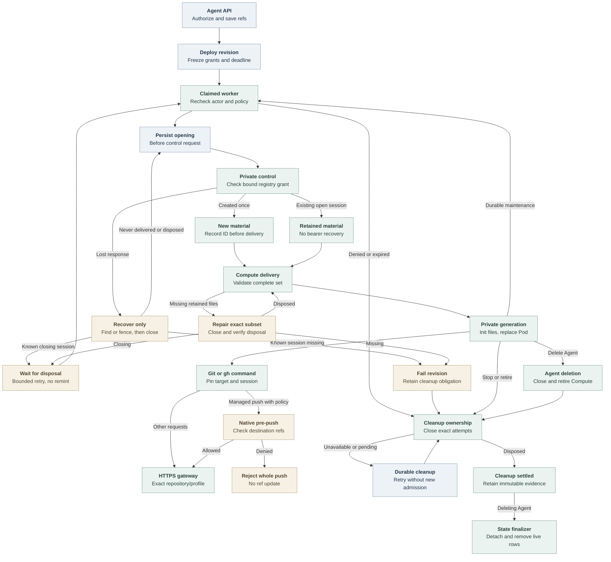

# Agent repository credential flow

## Overview

An authorized Agent creation or update selects approved repository references.
Deployment freezes those grants into a revision; durable worker reconciliation
opens bounded sessions and hands private client files to Compute. The embedded
OpenClaw Agent then runs ordinary Git and selected GitHub CLI commands. This
flow ends at command dispatch to the credential service or revision cleanup;
the [service flow](repository-credentials.md) owns token acquisition, forwarding
and provider retirement.

The bundled path uses Kubernetes Compute-owned embedded OpenClaw, `api_key`
Harness authentication and no Sandbox Driver. This trace describes current
source. Installed-runtime, model-turn and live-provider evidence are separate
checks in the [testing guide](../testing/repository-credentials.md).

## Entry Points

- `apps/controller/src/index.ts:createFastifyApp` registers Agent creation,
  update and deployment routes. Existing exact Agent/configuration IAM checks
  apply before repository selection is persisted.
- `packages/occ/src/index.ts:OpenClawController.deployAgent` admits an immutable
  revision and queues work under its original actor.
- `apps/controller/src/worker.ts:ControllerWorker.prepareRevision` prepares
  repository sessions before invoking the selected Compute Driver.

The Installation selects a repository Driver and Provider, all three control
processes use the same immutable registry, and the Namespace is ready. Agents
without repository bindings bypass this capability.

## Flow

## Execution Trace

### 1. Resolve Namespace policy during Agent admission

`packages/occ/src/index.ts:OpenClawController.repositoryBindingSelections`
uses `resolveRepositoryBindings` after existing authorization. The public input
contains distinct opaque references and optional profiles, not provider tokens
or caller-selected grant identities. The concrete
`apps/controller/src/drivers/repo/github/driver.ts:GitHubRepoDriver.resolve`
uses local registry policy and defaults an omitted profile to Contributor
(`git-write`).
It performs no control-socket or GitHub call.

`apps/controller/src/drivers/repo/github/credentials/registry.ts:resolveGitHubRepositoryBinding`
requires the exact Namespace/reference/profile combination. Its fingerprint
binds provider/App/installation/repository identity, duration policy and the
Namespace's complete profile policy, exact permissions and normalized push-ref
allowlist, if set.
The same registry supports several
repositories under one App installation, with one grant per selected binding.
OCC stores normalized selections on the Agent; an update's omitted array
preserves them and an empty array clears future selection.

### 2. Freeze a deployable revision

`packages/occ/src/index.ts:OpenClawController.admitRepositoryCredentials`
resolves the draft again, asks Compute to validate the supported topology, and
freezes Driver identity, exact grants and an absolute deadline. With duration
`86400`, the deadline is 24 hours after admission. Renewals and recovery cannot
move it. The public `clientRevision` serializer in
`apps/controller/src/index.ts` returns only Driver identity, references, profiles
and deadline from that snapshot.

`apps/controller/src/composition/repository-credentials/platform.ts:composeRepoDriver`
constructs `GitHubRepoDriver` for capability `repo` around a Provider-owned Unix
client, validated registry and public CA. Installation and Provider membership
must select the same opaque Driver ID. The existing
`AgentRevision.repositoryCredentials` and persisted
`admitted_spec.repository_credentials` fields are unchanged. The API and worker do not load the token engine or private App
key. The [production startup flow](production-startup.md) owns composition and
sidecar launch; the service validates its own protected inputs before listening.

### 3. Record ownership before opening a session

`apps/controller/src/worker/repository-credentials.ts:RepositoryCredentialLifecycle.prepare`
rechecks the original actor, ready Namespace, running Agent, exact revision,
selected Driver, unchanged grant and deadline. Each fresh attempt commits its
request identity in State under the live work claim and Namespace/Agent locks
before dispatch. State derives the immutable cleanup context from the admitted
Driver and binding, and rejects new attempts for stopped or deleting owners.
`RepositoryCredentialLifecycle.open` calls the Driver outside the transaction.
State stores recovery identifiers and phases, never bearers or client files.

`apps/controller/src/providers/repository-credentials/control-client.ts:UnixRepositoryCredentialControlClient`
sends the bound request over the private socket. The service independently
resolves and compares the grant through
`apps/controller/src/drivers/repo/github/credentials/registry-factory.ts:createGitHubRegistryDriverFactory`.
The configured client validates the complete private response, including cleanup
counts and terminal-state consistency. `DISPOSED` permits historical revoked and
expired counts, but no active uses, active/pending/uncertain credentials or pending
auxiliary work. The Driver explicitly constructs a fresh four-field status and
three-field binding for created-open, recovered-open, status and close. Validation
still precedes projection; narrowing the public object cannot hide malformed
private state.

Only a created control response contains the bearer. The concrete Driver encodes
transient files with
`apps/controller/src/drivers/repo/github/credentials/client/config.ts:encodeRepositoryCredentialSessionFiles`
and returns session status plus that closed file map. The worker records the
session ID before passing files solely through
`ComputeRevisionContext.repositoryCredentials`.

A confirmed open session produces a `retained` binding without new files. An
unfinished opening attempt uses `recoverOnly` to find or fence the original
admission and closes any recovered session. Fresh material requires confirmed
disposal of a known session, or a missing opening with no recorded session ID:
that opening never delivered material through the worker. An invalidated known
session blocks automatic replacement in the same revision. A known closing
session raises retryable `REPOSITORY_CLEANUP_PENDING`; replacement waits for
confirmed disposal within the existing Work bounds and revision deadline. The worker checks
retained attempts again under its admission transaction's Namespace/Agent locks.
Validated `DISPOSED` observations are persisted without another close request;
later service pruning cannot erase that confirmed settlement.
`apps/controller/src/drivers/repo/credentials/control.ts:createControlAdmission`
never reissues a bearer and records a cancellation fence for a missing fresh ID.
Transport failure or overload cannot establish absence.

### 4. Deliver and retain one complete runtime generation

`apps/controller/src/drivers/compute/kubernetes/repository-material.ts:repositoryMaterialSpec`
checks the complete `new | retained` binding set against the revision and derives
a generation from sorted reference/session pairs.
`apps/controller/src/drivers/compute/kubernetes/repository-material-store.ts:RepositoryMaterialStore.prepare`
validates exact ownership and file contents before creating immutable
Agent/revision/session-owned Secrets. It reports the precise missing retained
subset. The worker's `RepositoryCredentialLifecycle.repair` closes that subset
and requires disposal before replacement, then retries Compute once. Missing
inventory fails the revision. Pending closure keeps replacement blocked while
the existing bounded retry or active-revision continuation waits for disposal.

`apps/controller/src/drivers/compute/kubernetes/repository-material.ts:repositoryMaterialDeployment`
mounts Secret projections only in the init container. The init entrypoint in
`apps/controller/src/drivers/compute/kubernetes/repository-material-init.ts:REPOSITORY_MATERIAL_INIT_ENTRYPOINT`
validates a complete projection, then writes mode-0700 directories and mode-0600
files into memory-backed storage. The serving container mounts the resulting
private directory read-only. Its manifest contains public routing metadata and
session identifiers; separate files contain gateway bearers.

`apps/controller/src/drivers/compute/kubernetes/index.ts:KubernetesComputeDriver.activateRevision`
compares material generations as well as revision identity. A changed generation
replaces the actual embedded gateway Pod, even for the same revision. The runtime
uses stock Git and the image-owned `gh` router. Before publishing a complete
generation, the init entrypoint calls
`apps/controller/src/drivers/repo/github/credentials/client/native-git.ts:prepareNativeGitConfiguration`
with the staging and final paths. It writes the private aggregate `gitconfig`
without reading bearer contents. The runtime image adds the fixed
`/run/oce/repository-credentials/gitconfig` include to system Git configuration,
preserving normal HOME/global configuration and routing for `gh` child Git.
`repositoryNativeConfiguration` keeps the `gh` router first in native
`tools.exec.pathPrepend`, preserving other paths and per-agent exec settings.
The Harness's model environment remains intact. App keys, JWTs, installation
tokens and the control socket never enter this material set.

### 5. Authenticate native Git and route GitHub CLI commands

Stock Git resolves commands, remotes, push URLs, worktrees and local settings.
The aggregate configuration rewrites canonical HTTPS hosts to their admitted
gateway origin. Its scoped helper reads the effective credential host and path,
validates the pinned generation and binding deadline, then supplies the selected
gateway bearer. `OCE_REPOSITORY_REF` can disambiguate admitted bindings for one
repository; it cannot change the connection destination. Git keeps normal local
identity, hooks and aliases. Native overrides and additional credential helpers
remain possible; there is no whole-command preflight or egress confinement.
See the [routing limits](../reference/repository-credentials.md#client-routing-and-limits).

For a binding with `pushRefAllowlist`, the preparer selects image-owned hooks.
`apps/controller/src/drivers/repo/github/credentials/client/hook-dispatch.ts:checkPush`
matches the actual push destination and binding, then checks every destination
ref from Git's pre-push input. Destination matching normalizes trailing slashes
and checks a supplied username after selecting the binding, preserving duplicate
grant ambiguity. A denied ref stops the whole push before ref
updates, though discovery may already have contacted the service. The dispatcher
then passes the original arguments and input to the repository's ordinary hook.
Other hooks also resolve through Git's common directory. `commonDirectory` uses
Git's supplied directory environment during initialization before `HEAD` exists;
linked worktrees still resolve their shared directory through Git. Custom hook paths and
API writes remain outside this [best-effort guardrail](../reference/repository-credentials/push-ref-guardrail.md).

`apps/controller/src/drivers/repo/github/credentials/client/router.ts:routeRepositoryClient`
routes only supported `gh` commands. It selects from explicit targets or effective
Git remotes and pins the generation, reference and session for Git children.
Its API environment selects private `gh` configuration while preserving normal HOME.
Concurrent commands do not mutate shared repository-selection state.

`apps/controller/src/drivers/repo/github/credentials/profiles.ts` owns the exact
Reader, Contributor and Collaborator permission maps. The GitHub route classifier
admits selected REST operations for that profile and token-bounded GraphQL for
all three. Every GraphQL POST remains a possible write; Reader's token, not a
query parser, enforces its read-only grant. See
[access levels](../reference/repository-credentials/access-levels.md).

The [service exchange flow](repository-credentials.md#4-reserve-acquire-and-dispatch)
then enforces the bearer, immutable repository/profile, capacity and deadlines.
It acquires fresh installation tokens on demand under the same grant, allowing
continuous use within the revision deadline without a long-lived GitHub token.

### 6. Maintain, recover and retire ownership

`apps/controller/src/worker.ts:ControllerWorker.completeActivatedRevision`
commits completion and the next maintenance work together, preserving the
original actor. Repository-bearing revisions use the selected Driver's
30-second maintenance interval, or a shorter Compute interval. Worker restart
resumes durable queued work; it does not invent actors through a startup scan.
A missing known session after service restart is invalidated and retains cleanup
Work. `REPOSITORY_SESSION_RECOVERY_UNSAFE` permanently fails the observation and
queues exact runtime retirement. A later worker rereads that retained evidence
and cannot automatically remint for the same revision. Worker-only restart can
retain an existing open session and its Compute material. A user can explicitly
deploy a new revision through the existing authorized deployment operation;
that does not settle old cleanup or replay a Git/API command.

`apps/controller/src/worker.ts:ControllerWorker.finalizeActiveRevision`
can atomically fail one bounded observation and enqueue its successor while the
same active revision remains authorized. Stop, policy drift, expiry and revoked
authority cannot use that continuation to reopen sessions.

`packages/occ/src/state/postgres-work-queue.ts:PostgresWorkQueue.enqueueRepositoryCleanup`
and terminal queue transitions persist exact revision-owned obligations. Terminal
revision work records the `terminal-runtime` purpose with its terminal transition,
even when sessions are settled or no admission attempt exists.
`RepositoryCredentialLifecycle.closeRevision` records session-only cleanup with
the attempts it marks closing.

`ControllerWorker.processRepositoryCleanup` consumes validated owner-bound work
without policy resolution, new admission or material delivery, including after
the original actor loses ordinary permissions. Terminal-runtime work fences live
attempts, closes their sessions and calls the selected Compute Driver's
`stopRevision` for that exact revision even while session cleanup remains pending.
A Compute mismatch or stop failure keeps retirement retryable beyond the
foreground attempt limit. Completion requires settled sessions and successful
runtime retirement. Session-only repair or rotation cleanup never stops the
healthy workload. `CLOSED` denies local use but remains pending until disposal.
Missing service inventory and invalidation do not establish provider settlement.

`ControllerWorker.processAgentDeletion` closes and registers each revision's
attempts, then retires Compute even while service cleanup is pending. Deleted-Agent
Work covers only its exact owner and revisions admitted before that Work was created;
the same boundary governs failed and stale Work transfer.
`PostgresWorkQueue.completeAgentDeletion` calls `occ.finalize_agent_deletion` under
the current claim. The function locks Namespace, Agent and attempts and returns a
distinct pending outcome unless every attempt is disposed. The worker defers that
outcome without consuming its retry budget. Once settled, the finalizer detaches
live revision pointers, removes live rows and records deletion atomically. Original
IDs and non-secret cleanup context remain immutable, with no pruning policy.

Compute retirement waits for owned Pods to stop before removing their material.
It preserves Secrets referenced by actual Pods and current Deployments, and
limits deletion to exact ownership with UID preconditions. Stop removes only
the stopped revision's route and preserves a newer gateway Deployment and its
shared resources. Route deletion and the stopped revision's Deployment deletion
also require the observed resourceVersion. Under the single-worker topology,
Deployment deletion precedes shared cleanup, which remains retryable after a
partial failure. Service restart cannot prove remote token revocation.

## Debugging and Verification

Run `occ agent get AGENT_ID --output json` in the selected Namespace and compare
`activeRevisionId` with the admitted revision. Inspect worker events for
`REPOSITORY_BINDING_CHANGED`, `REPOSITORY_CREDENTIAL_DEADLINE_EXCEEDED`,
`REPOSITORY_SESSION_RECOVERY_UNSAFE`, `REPOSITORY_CLEANUP_PENDING` or
`REPOSITORY_CLEANUP_COMPLETE`. Check registry
identity and deadline before treating these as transient failures.

For client errors, `repository-not-admitted` identifies an unselected target;
`name-one-repository-target` or `name-one-repository-ref` requires explicit
selection. Check private material metadata and Pod generation without printing
bearers or Secret data. A ready Pod or a successful local command does not prove
live GitHub writes. Use the [test guide](../testing/repository-credentials.md) for
State/worker, real-client, installed/runtime and live-provider checks.

## Related docs

- [Repository credential reference](../reference/repository-credentials.md)
- [Install repository access](../guides/repository-credentials/installation.md)
- [Create and use a repository Agent](../guides/repository-credentials.md)
- [Controller worker lifecycle](controller-worker.md)
- [Credential service execution](repository-credentials.md)

## Manual Notes

[keep this for the user to add notes. do not change between edits]

## Changelog

- 2026-09-23 08:16: Trace accompanying initialization-safe hook delegation and equivalent native HTTPS destination matching. (authoring-run/fca0cd1e-2248-4139-aae8-d12423b5667e - 45c4cf5584b631c9ae5018c56a579d4bafa79ca5)

- 2026-09-23 06:18: Trace the accompanying access-level permissions and grant fingerprint changes. (authoring-run/0dffba8f-d16f-4f90-8fe2-893368f6926a - a2e94cf8ac2d94306f0701cee5457d1a9797e50a)

- 2026-09-23 04:15: Trace the accompanying optional push-ref guardrail and ordinary hook delegation. (48c7cd3a-4677-44e0-b710-c39ada9d4f48 - cbf1851308a2db398820ae9e1000f57837703ace)

- 2026-09-21 17:15: Distinguish pending disposal from irrecoverable session loss in the accompanying worker correction. (authoring-run/7ba8b1a5-628b-45f2-9ec9-25ce904b82d9 - 47995c58a5f9d267040e510110ca28ffa3d3a226)

- 2026-09-21 15:48: Trace refusal of unsafe same-revision replacement and canonical retention registration in the accompanying changes. (authoring-run/f4034e1f-9090-4f83-87c7-189e172017e2 - 08a9b693de5fe959d26e698435017e0114e3e46e)

- 2026-09-21 07:32: Trace retained cleanup evidence and pending Agent deletion in the accompanying State and worker changes. (authoring-run/5657fc4b-0f7a-423e-9c54-1cf174f5d6c2 - d2b31887be1d114c9147e2ed6f07c1f38e765c6f)

- 2026-09-21 05:32: Reconcile accompanying platform credential documentation with current source history and native Git boundaries. (authoring-run/fba2d7fa-6603-465e-a7c8-df0375ad202d - a051a2406eec7cafde2e0dd5e2ec63dba6ce1581)

- 2026-09-19 23:54: Reconcile RepoDriver ownership, private status projection, and separate emitted service/client paths. (public authoring-run/73c80a5e-4d0c-4e72-b989-0cf9963c6593 - e5b5a5489f078d08272523476bdbcd0b9162c946)

- 2026-09-18 04:55: Trace the accompanying native exec PATH projection for repository material, including per-agent overrides. (e3012a8cee0c5ea60bc02943ebed88a1c88eb0d2)
- 2026-09-18 03:04: Trace the accompanying Agent admission, durable session lifecycle, Kubernetes material generation and concurrent client integration. (8500b2da103063b4503b62e5529f3910513e84a9)
