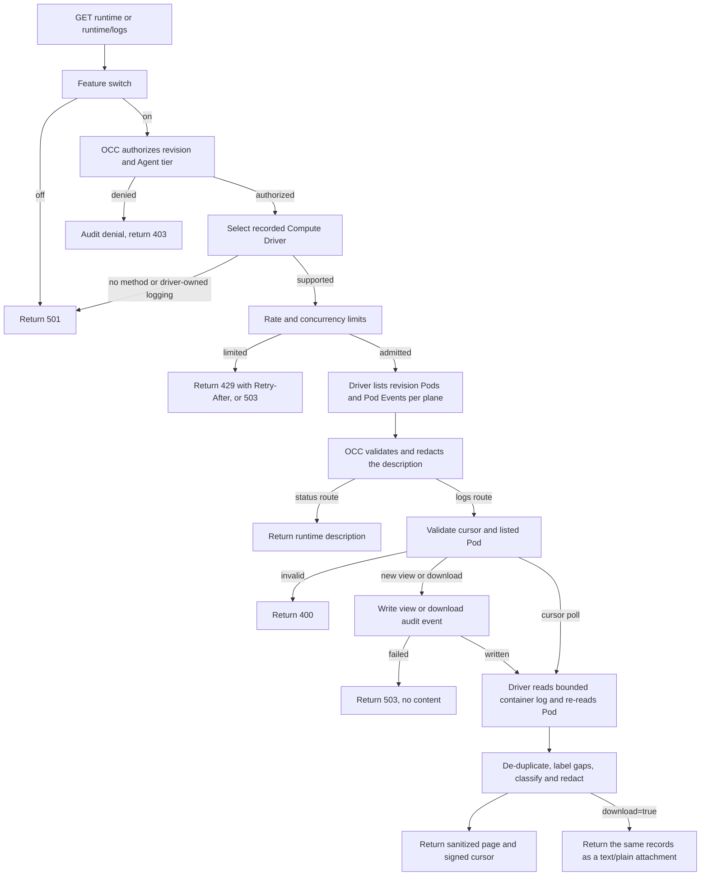

# Agent runtime logs flow

## Overview

For an admitted Agent revision, OpenClaw Control Plane (OCC) authorizes status/log
reads, obtains raw data through its Compute Driver and returns classified,
redacted, bounded records. Logs are not persisted; downloads stay on the reader's device.

## Entry Points

- Trigger: `GET /namespaces/:namespaceId/agents/:agentId/deployments/:deploymentId/runtime`
  and `GET .../runtime/logs` (optionally `download=true`) from the console Logs
  tab, `occ agent runtime|logs` (`internal/occcli/agent_runtime.go`) or the API.
  CLI revision selection uses `agentRevision`/`latestRevisionID`; see the
  [CLI reference](../reference/cli.md#runtime-status-and-logs).
- Source: `apps/controller/src/index.ts:createFastifyApp`,
  `packages/occ/src/index.ts:OpenClawController.describeAgentRuntime` and
  `readAgentRuntimeLogs`, `packages/occ/src/runtime-logs/`, and
  `apps/controller/src/drivers/compute/kubernetes/index.ts:KubernetesComputeDriver.describeAgentRuntime`
  and `readAgentRuntimeLogs`.
- Assumptions: `deploymentId` names an admitted revision of the exact Agent.
  Status requires Agent `operate`/`read` plus revision `read`. Logs require Agent
  `read` and `read_logs` (or `administer`, unless a Restriction denies `read_logs`),
  covering every revision that Agent deploys. `authorizeRuntimeLogRead` checks
  `read_logs` first.

## Flow

## Execution Trace

### 1. Admit and authorize

`packages/contracts/src/api/routes.ts:occApiRoutes` declares both GET routes with
a closed query schema. `apps/controller/src/index.ts:perform` answers `501` when
`agentRuntimeLogs` is disabled. `OpenClawController.runtimeLogTarget` authorizes
the tier action and Agent `read` (plus revision `read` for status only), resolves
the revision within the exact Agent, then rejects a Driver without
`describeAgentRuntime` or with `runtimeLogging: "driver"`. Only then does the
route's `admitRead` callback apply the replica-local
`apps/controller/src/http/runtime-logs.ts:RuntimeLogLimiter` around the Driver
reads, so a denial is always audited and never spends a token.

### 2. Describe the runtime

`KubernetesComputeDriver.describeAgentRuntime` reports the current termination
when terminated, otherwise its prior termination. It resolves the owned Namespace
and lists exact Agent/revision/workload-role labels. Single-cluster Gateways and
Harnesses share the tenant namespace; split clusters place Gateways in the control
target and Harnesses in execution. It lists Events by
`involvedObject.uid`, keeps only that Pod's Events, drops the scheduler's
`FailedScheduling` retry after a lost PVC update race once the Pod has a node,
follows Event-list continuation under the same five-second deadline, retains
the newest 100 eligible Events across all pages, and takes each
Event's `container` from `involvedObject.fieldPath` (`spec.containers{name}` or
the init or ephemeral form; `null` for Pod-level Events such as `Scheduled`). A log
read passes `{ source, events: false }`, so it lists only that source's Pods and
no Events. Each
Kubernetes call has a five-second deadline; a `403` becomes
`RuntimeLogsForbiddenByClusterError`. `runtime-logs/description.ts:validRuntimeDescription`
checks names, UIDs and counts, masks node, image and Secret names in Event
messages (`runtime-logs/redact.ts:maskRuntimeEventText`) and redacts reasons and
Event messages.

### 3. Read one page

`runtime-logs/read.ts:readRuntimeLogPage` verifies the HMAC cursor
(`runtime-logs/cursor.ts`) against the principal, Agent, revision and source,
and accepts only a Pod the description listed. A request without a cursor, or
with one older than an hour, or a cursor whose Pod is gone, starts a view: the controller appends
`openclaw.agents.runtime_logs.view`, an `access` audit event naming the admitting
action, before any log read. The Driver re-checks
Pod ownership, calls `readNamespacedPodLog` with `tailLines`, `sinceSeconds`,
`previous`, a 1 MiB `limitBytes` and timestamps, and re-reads the Pod. Before first start,
zero restarts, no current or previous instance, and kubelet's exact `400`
waiting-to-start Status matching the Pod, container and `PodInitializing` or
`ContainerCreating` reason yield an empty page. Logs are requested first,
so stale waiting status cannot hide available output. Unrelated failures retain
their error mapping.
`kubernetesRuntimeLogLine` separates kubelet's RFC3339 timestamp from each raw
line and converts numeric offsets to UTC while retaining every fractional digit.
Unknown or malformed offset prefixes remain untimed raw text. A cursor
poll derives `sinceSeconds` from the cursor: from its newest delivered line, or,
when the view has delivered nothing yet, from the previous read (a full or
byte-cut tail then emits `window_exceeded`). If every poll stalls because a line cannot fit the 1 MiB read limit, and that
cut line is over about 3 seconds old, the cursor resumes from the current read.
`window_exceeded` dates the lost interval. A carried PEM block loses its time
boundary and stays conservatively masked. Earlier lines are dropped.
For the frontier time, the cursor stores `frontierComplete`, `frontierCount`
and the last 16 hashes. Positional de-duplication requires a complete frontier,
its group's first line in the read (an earlier timestamp or a short uncut page),
ordered valid times and matching suffix hashes. It skips `frontierCount`
occurrences, preserving groups larger than 16. Hash fallback consumes matching
occurrences and invalidates the count when delivering at that frontier. A new
hash is accepted only with complete hash history; extra identical occurrences
also require frontier completeness.

Completeness requires an ordered consumed prefix after the earliest fetched time,
or a short uncut Driver page, and persists while time stays unchanged. Otherwise
matching-time text stays suppressed until time advances; enlarging a cut tail
must not reveal old occurrences as new. Legacy counts are inferred only below
16 hashes. Byte cuts preserve counts for complete frontiers.
It emits `stream_replaced`,
`window_exceeded`, `cursor_expired` or `truncated` gaps, and passes the rest to
`runtime-logs/sanitize.ts:sanitizeRuntimeLogChunk`, the only producer of
`SanitizedRuntimeLogRecord`. `page-budget.ts` measures serialized pages,
signed cursors and the HTTP envelope against 512 KiB. Full candidates precede
bounded prefix builds, which reuse admission and clocks without I/O or audits. Fit is
checked, without maximum filling guarantees. Fetched masking/withholding persist;
state advances through delivered rows.

Signed `pemOpen`/`pemAfterTime` describe delivered boundaries, never fetched overlap.
Timestamp order is validated through the last delivered line; each line is
compared with the prior cursor's reliable boundary, not earlier same-page lines. Only a line strictly
newer than that prior frontier can close a carried open block. Thus an ordered
same-page BEGIN and END at the same newer timestamp can close it. Times at or
before the prior frontier and evicted line hashes do not establish forward
progress; replayed overlap cannot erase a carried later BEGIN. Ordinary non-PEM
text remains visible while ambiguous context stays open.

Missing, invalid or reordered times make the frontier uncertain (`null`); later
timestamped pages alone cannot repair that uncertainty. Empty polls preserve it,
and lines beyond the page or byte cut do not advance it. A new view, expiry,
instance/Pod change or replacement during the read discards the old context.
The paired fields are validated together under the existing cursor MAC; malformed
or inconsistent pairs fail as `cursor_invalid` before a Driver read. Legacy
cursors and initial tails without observed PEM boundaries remain unknown and
best-effort.

`source=sandbox` skips the Compute description. `OpenClawController.readSandboxLogs`
lists the source only when the selected Sandbox Driver provisioned the revision
and implements `readSandboxLogs`, resolves Compute's placement with
`resolveSandboxNamespace`, and runs `runtime-logs/sandbox.ts:readSandboxLogPage`.
`OpenShellSandboxDriver.readSandboxLogs` derives the Sandbox name from the
revision and calls `GetSandboxLogs` through `openShellSandboxLogReader`, which
exposes nothing else. OpenShell stamps supervisor lines when recorded but
batches them, and filters `since_time` by that stamp, so a resume sends a time
`SANDBOX_LOG_OVERLAP_MS` (5 s) behind the newest delivered line; the cursor
keeps one hash per line delivered since then (up to 48), and each re-read line
consumes one. First pages retain the requested window start.
Signed checkpoints retain prefix digest/count, query floor and baseline.
Container retains 2-second overlap. Timed windows resume
from progress; changed tails and ambiguous single-time replacements take
fresh snapshots. Sandbox pins short/unordered windows, untimed rows and overflowing groups.
Full timed groups use counted overlap within its floor; every cut retains
a rollover witness. Ordered overlap retains progress; uncertain context resets
with a gap and replay. Single-time tails retain gaps. Container
recovery retains reset gaps without duplicates.
All-untimed Driver byte cuts retain progress;
mixed cuts advance through time with an explicit reset that may replay untimed rows.
Matching checkpoints retain positional proof. Stable windows drain overflowing groups. UID/restarts reset progress; PEM recovery
keeps masking. Identical replacements remain unobservable; full checkpoints, missing
anchors or overflowing timestamp groups report gaps. gRPC `NOT_FOUND` (absent
Sandbox, or concealed from a non-member) maps to
`RUNTIME_LOGS_SANDBOX_NOT_FOUND`, never to an empty page. Lines naming two
Sandbox IDs are refused; a new Sandbox ID emits `stream_replaced`.
`sanitizeSandboxLogLines` parses the OCSF shorthand into allowlisted fields.

A download (`download=true`) forces `tailLines` to 1000, rejects a `cursor` with
`400`, and always starts a new view; `apps/controller/src/index.ts:auditAction`
names its audit event, and any denial, `openclaw.agents.runtime_logs.download`.

### 4. Return

`apps/controller/src/http/runtime-logs.ts:runtimeLogPageBody` accepts only
sanitized records and fails on the reserved `content` class.
`runtimeLogDownloadBody` serializes the same branded records as text lines with
the same check, and `runtimeLogDownloadFileName` names the attachment
`<agent>-<revision>-<source>-<pod>.log`. A `minLevel` query
(`runtime-logs/read.ts:runtimeLogPageAtLevel`) removes sanitized lines below that
level after the cursor is signed, so polls resume after hidden lines; unknown-level
lines, gaps and withheld counts stay. The console asks for `minLevel=info` unless
**Include debug** is selected; its level chips and text filter
(`apps/controller/src/console/agents/logs.mjs`) run only over loaded rows. The
console caches `403` per operator/page, preventing repeat denial audits on reopen;
another operator retries. Status names log-text grants. Gateway views point to
Harness while it is unready, or Deployment activity while absent. The
CLI's `--follow` loop re-sends the cursor every 2 seconds.
`internal/occcli/agent_runtime.go:runAgentLogs` treats command-context cancellation as a
clean follow exit during both initial revision selection and page polling.
Without `--follow`, a canceled request remains an error. Driver errors map to
fixed `RUNTIME_LOGS_*` codes; the whole request has a ten-second deadline.

## Debugging and Verification

- `go test ./internal/occcli -run '^TestResourceRequestStopsWhenCommandContextIsCanceled$'`
  exercises the real CLI and HTTP client against a loopback server, canceling
  in-flight Agent and revision lookups. Follow exits successfully; one-shot reads
  retain cancellation errors. This proves local CLI cancellation, not deployed OCC.

- `503 RUNTIME_LOGS_CLUSTER_RBAC` means the API ServiceAccount lacks
  `pods/log`, `events` or, on an execution cluster, `pods` reads in that
  namespace. `503 RUNTIME_LOGS_AUDIT_UNAVAILABLE` means no output was read.
- `runtime-logs-content.test.mjs` exercises handler credentials, prompts and
  protocol lines plus synthetic Driver pages for masking, replay/eviction,
  uncertain times, cuts, paired-field validation, resets and serialized cursors.
  `occ-api-security.test.mjs` covers tiers, cursors and failures;
  `kubernetes-compute.test.mjs` covers plane selection, Event filtering and typed
  `403` using in-memory Kubernetes responses. `agent-runtime-logs-k3d-real.test.mjs`
  reads a real cluster. `runtime-logs-sandbox.test.mjs` uses the real handler and
  Driver with a log-only gateway client; `openshell-gateway-wire.test.mjs` checks
  the wire shape. Synthetic responses do not establish real-cluster behavior.

## Related docs

- [Agent logs guide](../guides/topics/agent-logs.md)
- [Console and API runtime log reads](../reference/security.md#console-and-api-runtime-log-reads)
- [Compute Driver runtime status and logs](../reference/drivers/compute.md#optional-runtime-status-and-logs)

## Manual Notes

[keep this for the user to add notes. do not change between edits]

## Changelog

- 2026-10-10 13:17: Resume partial groups; deduplicate gaps. (authoring-run/46f029c3-e915-4829-949b-638e0b2be118 - 59b9c9eec562e50df8e3cbe9669a2e6f697ba37d)

- 2026-10-10 09:27: Follow moving full byte-cut windows through delivered time. (authoring-run/8a9638ae-99ab-4dca-9759-92fe81e8d280 - 8741e9f5e2a915ac5c2dcb076479cc9e23d8c5cb)

- 2026-10-10 08:12: Retain overlap and Sandbox gaps. (authoring-run/e28bad2a-a77a-4033-aa7c-174ac006a870 - a2911f897dfdd9d748f8e65065da5196b7749eff)

- 2026-10-10 07:56: Preserve full-window gaps through final drain. (authoring-run/9cfa5b3b-2ef8-4413-a9ec-458eb1ba7fdd - 5533e03c05db33fdec64574893190f8ec4096bb0)

- 2026-10-10 07:45: Advance mixed byte-cut windows explicitly. (authoring-run/8b207d82-4eff-4478-872a-80762052a959 - 42351dce1d1e1a4faf457edd87da96fa8d6169c4)

- 2026-10-10 07:44: Preserve both histories on main integration. (authoring-run/19081d63-7696-4bb4-9fcd-1d6e0ffce0a0 - 3bfadece19cdbea1a23574549265953f9d0e54fc)

- 2026-10-10 07:32: Preserve drained untimed byte-cut progress. (authoring-run/3dcf8b04-24bd-4739-ac19-fb70f6064952 - f9b208a0ac5e1e5118c2f8dcc9050c27ff23061c)

- 2026-10-10 07:17: Retain validated positional progress as the tail fills. (authoring-run/858ce292-681c-43ab-a4d3-0640d3380971 - a9176a61cf209915e2ccab3f862db9a2bc750754)

- 2026-10-10 05:09: Compact fixed-width hash lists and both private window tuples while retaining legacy hash decoding. (authoring-run/377d6942-f5b9-4c5f-825c-cdfdfeea7501 - 95c76244bcc6f88989993a30730e63dc45b87f65)

- 2026-10-10 05:02: Keep full Sandbox overlap baselines in one cursor location while compacting byte-window observations. (authoring-run/c8de19eb-fe81-4a26-b639-a0cb02360f23 - a0fd14ec40c2e5b8c66537e457ddd2d8202adc6e)

- 2026-10-10 04:37: Compose fetched safety evidence with Event pagination. (authoring-run/39d848cc-a298-48fd-9f82-c39b85089b94 - 8e5a06cec7f622185222a8a7dbafe3b0a7228d9f)

- 2026-10-10 04:19: Preserve fetched masking evidence in delivered prefixes. (authoring-run/d983fb2c-0a98-43db-8690-ddb7f5b43f87 - 9222f0073c951203c5f959bc9382dbb13c605ee9)

- 2026-10-10 04:10: Preserve rounded and empty windows. (authoring-run/b4a36577-a96a-44f4-9600-41b94747c1c9 - d791a48aa0baacfef2dede241c6161ad9c82e89a)

- 2026-10-10 03:27: Keep recovery cursors valid and mark full Sandbox windows. (authoring-run/50fe6eec-f154-4d38-9cb5-8e755a82ded9 - dd55627538daa7b7ae43c431ab9db37ae878cc65)

- 2026-10-10 03:05: Drain container windows across serialized cuts. (authoring-run/b68ecd62-c0d7-4fbf-82ee-0f440d8ae84c - 4e23a961fff52cb453a4114afc922278205d3fec)

- 2026-10-10 02:53: Compose the response budget with current termination status. (authoring-run/2cbbcc37-919d-41ec-bdab-51aa836d92b7 - 880b645f5e5fb5c99c6046c1eac6ca81211be584)

- 2026-10-10 02:47: Keep untimed replacement snapshot progress. (authoring-run/fd5e728e-9e9f-42ea-8ab7-d389f82b973d - f4c9a1b36988d659f8f927825fda4cd838ae832a)

- 2026-10-10 02:43: Retain authenticated Sandbox window progress across serialized cuts and report changed snapshots as gaps. (authoring-run/2edda611-948b-44ae-a3d8-0a011073b719 - 5c7c56b49f16b80c4fcb91fedff0959a5fd733b0)

- 2026-10-10 01:14: Enforce the serialized runtime-log response limit for container and Sandbox pages, including cursors and the API frame. (authoring-run/018d11d8-3699-4e97-945b-c2cfd3088412 - 243b38ba6d951240065e5061e1e4abccdb44410c)
- 2026-10-10 07:06: Merge main; preserve initial continuation, timestamps, Events, termination and histories. (authoring-run/b0c35eb4-2b87-4f3e-aec3-8c416cdef3bb - b744ee6f217d17942cdaacea80cbbd08126aa87f)

- 2026-10-09 23:09: Continue current-container log reads through initial Pod preparation without concealing unrelated failures. (authoring-run/9f37d8ec-6a5b-4676-a134-8a6fb5c54f3a - 21f34928437fb7d6f4391ba4af5d3e15bf9ce480)
- 2026-10-10 02:50: Preserve Event pagination and current termination when merging main; retain both regression groups and histories. (authoring-run/794085ff-b0bd-422e-8fe7-6b6e9846ca0f - 880b645f5e5fb5c99c6046c1eac6ca81211be584)

- 2026-10-10 00:33: Read Pod Event continuation pages before returning the newest 100 diagnostics. (authoring-run-9eade0ab-4aa4-4b21-9faa-e7478c6a8983 - 3e34cc0f4b469d29fc79d2c10a33f87a0921ee47)

- 2026-10-10 02:35: Preserve current termination projection and both flow histories when merging main timestamp parsing changes. (authoring-run/f9b46af2-6bd4-4636-b675-dd9bea82a566 - db4ccbdea96a752cd99a66cf4cf02c195f5fe3ba)

- 2026-10-10 00:51: Report the latest exit details for currently terminated containers while retaining prior exits for running and waiting instances. (authoring-run/3d28a5c1-f0ee-4fbd-97de-52993c05b57d - 4f29773d098d2288a805d0ad80e0c65474e162d9)
- 2026-10-10 00:04: Normalize supported kubelet timestamp offsets without losing nanoseconds, so classification and cursor overlap use the raw message and UTC time. (authoring-run/e25eab96-1110-45ec-b677-916a98b34613 - ba3686748ddf56052dc2717cc2ce6eaa3710c1f0)

- 2026-10-09 15:42: Count container lines delivered at the cursor time, so a timestamp group larger than the 16-hash history neither replays nor hides later lines; a full history without that evidence stays suppressed. (fix-949-950)

- 2026-10-09 22:24: Authenticate frontier completeness and retain conservative suppression for cut or legacy timestamp groups. (authoring-run/ce414344-4cec-4d51-accd-f66b2ece9e0f - f060fefd260b552e44d5549f549436d6147a474c)

- 2026-10-09 22:12: Preserve matching-text suppression when the 16-hash frontier may have forgotten earlier occurrences. (authoring-run/ce414344-4cec-4d51-accd-f66b2ece9e0f - 66845c95cde0c7ef6adf358eb7daa1474c5fd443)

- 2026-10-09 21:59: Count delivered occurrences when de-duplicating container lines at the cursor time. (authoring-run/ce414344-4cec-4d51-accd-f66b2ece9e0f - dc95c2261d4b46cff8aca703e13e43cdd71d153e)

- 2026-10-07 05:26: Point CLI runtime reads and log polling to their dedicated source owner; clarify the existing revision selection. (authoring-run/9ac89b09-043f-44ba-8069-d0a90859ed7b - 61590165cdbb)

- 2026-10-05 11:38: Document clean CLI follow cancellation during initial revision lookup with the accompanying fix. (authoring-run/2afba01b-8db4-41d7-a942-e14bd7f44262 - 0698d533b97dc3abe7bef7ff7907a0f4335c3182)
- 2026-10-05 10:51: Preserve shared tenant placement while incorporating main startup and runtime diagnostics. (01a0fe72-58b2-7cc3-b770-7310f5401deb - 71a1cedb)

- 2026-10-04 07:00: Authorize before the rate and concurrency limits so every denial is audited. (bh11-runtime-log-authz)

- 2026-10-03 22:00: A resumed view moves past a line longer than the 1 MiB read limit instead of re-reading it on every poll. (f349-log-resume)

- 2026-10-03 03:00: A cursor from a page that delivered no line resumes from that page, not the whole tail. (bughunt-1/fix-runtime-logs-quiet-follow)

- 2026-10-02: Describe shared single-cluster runtime placement. (01a0fe72-58b2-7cc3-b770-7310f5401deb)

- 2026-10-01 14:00: Add the server-side `minLevel` floor and the console's **Include debug** control. (fix-d79 - 3d6ce1fdb)

- 2026-09-30 23:44: Clarify the prior cursor frontier and ordered same-page PEM boundaries without changing masking behavior. (authoring-run/2c8a089c-ec67-402d-8cfd-ec8b29c5e3fe - a4cddf26bc462744bfff912b1e1cdb9f1ee60cd2)

- 2026-09-30 20:37: Receive cursor-context masking with current runtime-log guidance and preserve the current view behavior. (authoring-run/e2da7c2d-8080-4dd4-9ce9-d494b890234c - fb22aa07c1613218280cff25d6b62bfb4cff6b5d)

- 2026-09-30 19:43: Carry authenticated PEM context across bounded container polls without closing on ambiguous overlap. (authoring-run/b5fcaf0e-328a-4fe2-b53f-e72268ef70af - affac2bfc1370e590e6da570bcaaad4a207c9f09)

- 2026-09-30 08:30: Document runtime status and container log reads for Kubernetes Compute. (build-1/agent-logs-slice-1 - 0918be781)
- 2026-09-30 11:40: Add downloads, console filters and the `occ agent runtime|logs` callers. (build-2/agent-logs-slice-2)
- 2026-09-30 13:00: Add the OpenShell sandbox source. (build-logs-3/agent-logs-slice-3)
- 2026-09-30 15:30: Overlapping sandbox resume with counted de-duplication; NOT_FOUND is a 503. (fix-3/agent-logs-slice-3)
- 2026-09-30 18:10: Console remembers a runtime status denial per page and points unready-Harness Gateway views to the Harness source. (dogfood3-fix-7)
- 2026-09-30 18:30: Without an active revision the CLI reads the latest revision; a failed deployment links to its version's Logs tab. (fix/dogfood3-5)
- 2026-09-30 20:00: Key remembered denials by operator; the Harness hint ignores a rollout's old Pod and covers a missing Pod. (dogfood3-refix-7)
