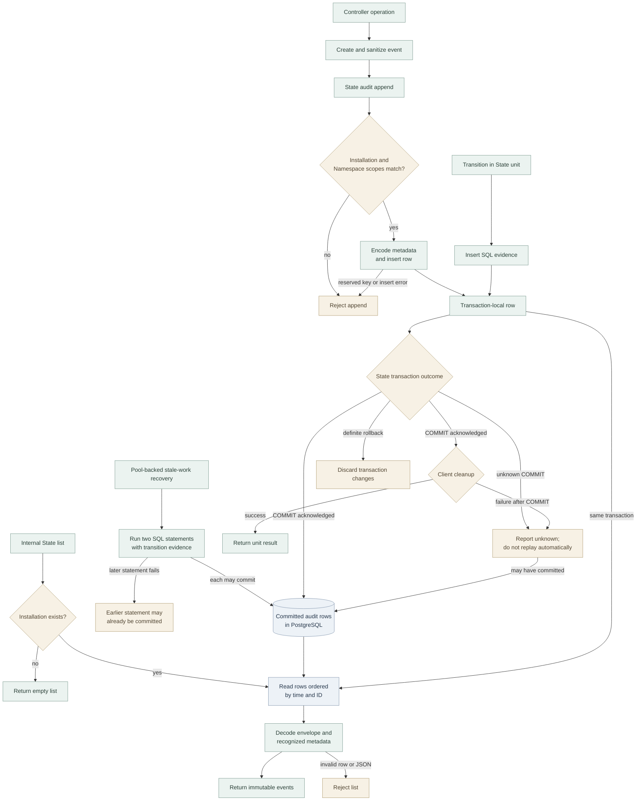

# Audit ledger flow

## Overview

OpenClaw Control Plane (OCC) records audit evidence as controller requests and
reconciliation work run. This flow follows PostgreSQL event append, commit, and
the internal State repository's list operation. It stops at the repository
result; OCC has no public audit browsing API or console view. See the
[audit guide](../guides/topics/audit-log.md) for the operator boundary.

## Entry Points

- Trigger: a controller operation appends an event, or internal code lists audit
  events inside a State unit of work.
- Source: `apps/controller/src/index.ts:event`
- Source: `packages/occ/src/state/postgres-state.ts:PostgresPlatformState`
- Source: `packages/occ/src/state/postgres-work-queue.ts:INSERT_EVIDENCE_CTE_SQL`
- Assumptions: PostgreSQL State has a server-owned Installation; request
  admission and authorization are handled by the calling operation. Repository
  list is an internal operation, not an authorization or public serving boundary.

## Flow

The diagram describes source behavior, not proof of an installed deployment.

## Execution Trace

### 1. A caller constructs evidence

`apps/controller/src/index.ts:event` and `packages/audit/src/index.ts:AuditEventFactory.create`

For example, the controller creates an event for a Namespace mutation and
appends it in the mutation's transaction. The factory supplies an ID, timestamp,
kind and outcome defaults, validates required fields and matching Namespace
scope, sanitizes details and actor fields, and freezes the event. The PostgreSQL
repository does not invoke the factory or sanitize an event passed directly to
append; callers of that repository must supply appropriate evidence.

### 2. State appends a row in the caller's transaction

`packages/occ/src/state/postgres-state.ts:PostgresPlatformState`,
`packages/occ/src/state/postgres-state.ts:auditDetails`, and
`apps/controller/src/worker.ts:ControllerWorker`

Append requires the event's Installation to match the initialized server-owned
Installation and its resource Namespace to equal its event Namespace. It rejects
the reserved `__occAuditMetadata` key in caller details. It copies ordinary
details and stores nine optional fields under that key: `schemaVersion`,
`source`, `requestId`, `admissionDecisionId`, `actor`, `iamDriverId`,
`authorization`, `decisionReason`, and `reasonCode`. It inserts the envelope
columns and JSON details into `occ.audit_events`. Database constraints and query
errors can also reject the insert.

The caller can append alongside resource changes in one unit of work. The
standalone PostgreSQL audit sink opens its own transaction. Separately, the work
queue can write reconciliation evidence directly in SQL with its transition. The
worker uses `transactWithQueue` for some transitions. It also calls pool-backed
stale-work recovery, which issues two separate SQL statements. Each statement is
atomic, but a later failure does not undo an earlier committed statement. A queue
using a caller-supplied client follows that client's transaction boundary. The
queue's `reasonCode` and `attemptCount` are ordinary details, not reserved metadata.

### 3. The transaction owner finishes or fails

`packages/occ/src/state/postgres-state.ts:PostgresPlatformState` and
`packages/occ/src/ports/transaction.ts:RepositoryTransactionLifetime`

After the callback returns, State closes admission to repository operations and
waits for already admitted operations to settle before committing. On failure it
attempts rollback if the transaction remains marked started, closes the lifetime,
and releases or discards the client.
An acknowledged COMMIT persists the transaction, but the unit returns only
after client cleanup. A lost or ambiguous COMMIT response can leave the outcome
unknown: the transaction may have committed or rolled back. A cleanup failure
after acknowledged COMMIT is also reported as unknown, not proof of rollback.
Neither case authorizes an automatic replay. An append or list result within a
unit does not by itself prove that the transaction committed.

### 4. Internal list decodes the ledger

`packages/occ/src/state/postgres-state.ts:auditFromRow`

List returns an empty frozen array when no Installation exists. Otherwise it
reads all visible rows ordered by `occurred_at, id`, attaches the current
server-owned Installation ID, and decodes each row. A list on the same unit can
include its own uncommitted append. The table has no Installation ID column.
The decoder validates resource kind, outcome, kind, timestamp and object-shaped
JSON; invalid persisted data rejects the list. It removes the reserved metadata
object from details, copies only the nine recognized metadata keys, and leaves
other ordinary details in place. Unknown reserved keys cannot replace or extend
the top-level row envelope. Recognized metadata values are copied without
individual type or semantic validation or authentication, and decoding does not
re-sanitize them. The returned event
copies and array are immutable.

## Debugging and Verification

- The [audit guide](../guides/topics/audit-log.md#access-and-limitations) describes
  the approved operator investigation path. The repository list has no filter,
  pagination, or public endpoint; do not treat it as a protected History API.
- `ScopeViolationError` on append can indicate an Installation mismatch, a
  Namespace mismatch, or reserved persistence metadata. Invalid persisted event
  values or JSON can make the entire internal list fail.
- `tests/integration/postgres-repository-transactions.test.mjs` contains
  PostgreSQL append, metadata decoding, rejection, and rollback cases. Those
  cases require the [PostgreSQL test setup](../testing/postgresql.md); their
  presence and this source trace do not prove a test or deployed system passed.

## Related docs

- [Audit log](../guides/topics/audit-log.md)
- [Namespace IAM policy flow](namespace-iam-policy.md)
- [Controller worker and durable reconciliation](controller-worker.md)
- [Logging flow](common-logging.md)

## Manual Notes

[keep this for the user to add notes. do not change between edits]

## Changelog

- 2026-09-26 02:55: Clarify that the initial flow inspection included the uncommitted audit decoder fix from 7966519007124bdf77be78324b3c705cf6980199. (authoring-run/48c2199e-221b-4f32-9f69-2d21e68712ba - a501f64abbd1a5821b6c8f0da7f9466195f7dc6d)
- 2026-09-26 02:38: Prepare the public audit ledger flow from the reviewed source and local draft. (authoring-run/b9f3fb59-fdac-4727-9071-61a19b7d940a - 3b58323f762f5742e8b44be3e269af0696ed7cde)
