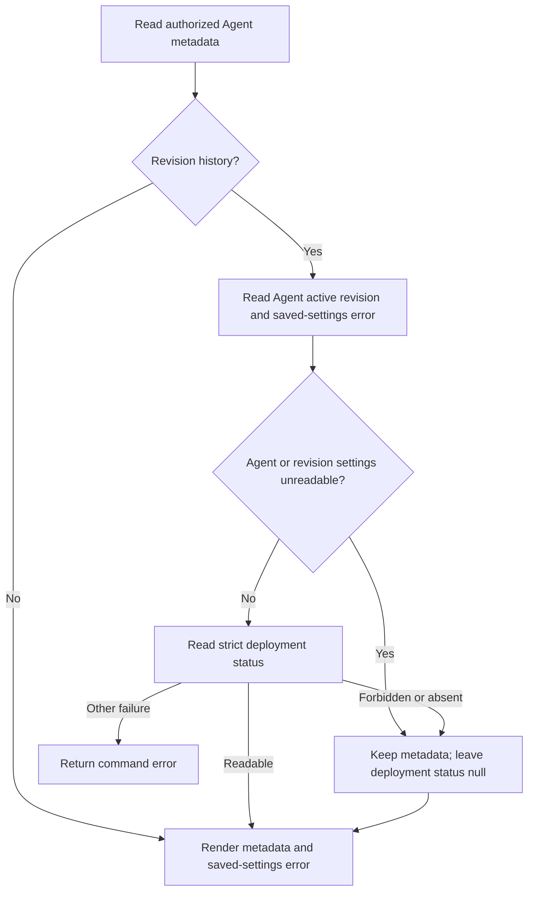

# CLI Agent metadata browsing flow

## Overview

An operator runs `occ agent get`, `occ agent list`, or `occ agent revisions`
to inspect saved Agent identity and history. The CLI reads the authorized OCC
HTTP API and prints metadata, including a scoped error when saved settings
cannot be decoded. Browsing ends at terminal output; it does not repair saved
settings, admit a deployment, or establish runtime health.

This flow covers the API's existing metadata-plus-error response. A retired
saved setting can remain in PostgreSQL after its application contract changes.
OCC keeps the affected record browsable, omits unreadable settings without
substituting defaults, and identifies the affected field. Database outages and
strict operational failures retain their own error semantics.

## Entry Points

- `internal/occcli/cli.go:agentCommand`: the get, list, and revisions commands.
- `internal/occcli/cli.go:describeAgentRevisions`: active-revision and deployment
  status enrichment of authorized revision metadata.
- `internal/occcli/output.go:printBrowsingItems`: conditional error columns for
  table output, with the API's typed fields preserved in JSON and YAML.

The caller supplies an OCC origin, a service-key response file, and a Namespace
ID. Exact Agent/revision reads and list filtering remain the API's responsibility;
CLI presentation does not grant access or make unreadable fields usable.

## Flow

## Execution Trace

### 1. Admit command options and fetch the browsing response

`internal/occcli/cli.go:namespaceClient` checks the Namespace ID and creates an
`occclient.Client`. `internal/occclient/client.go:GetAgent`, `ListAgents`, and
`ListAgentRevisions` select the appropriate GET route. The transport decodes
successful envelopes into resource data and returns a command error for HTTP
failures or invalid envelopes.

`packages/occ/src/state/postgres-state.ts:browseSavedConfiguration` is the
persistence boundary for the special successful response. It catches saved
payload decoding failures and returns identity/lifecycle metadata with
`configurationReadError`, whose code is `SAVED_CONFIGURATION_UNREADABLE` and
whose field identifies the unreadable setting. Query failures and strict reads
remain outside this recovery boundary. The CLI consumes that contract rather
than attempting to decode omitted settings or retrieve them through operational
endpoints.

### 2. Enrich revision history only where strict reads are meaningful

`internal/occcli/cli.go:describeAgentRevisions` reads the Agent to determine its
active revision, clones each revision row, sets its `active` marker, and starts
with `deploymentStatus: null`. A readable Agent and readable revision can be
enriched through `occclient.Client.GetAgentDeployment`. A missing deployment
or one the caller cannot read leaves the status null. Other failures still end
the command; browsing does not silently turn an outage into missing status.

If the Agent has a saved-settings error, strict deployment reads cannot decode
that Agent. The CLI skips deployment enrichment for the entire history and
prints a notice on stderr naming the affected field. It preserves every
readable revision and metadata-only revision returned by the browsing API.
If the Agent is readable but one historical revision has the error, only that
row skips enrichment. Healthy siblings retain their normal status reads.

Neither branch treats missing settings as empty settings. The command retains
the API error object in structured output. Explicit deployment, editing, and
runtime commands continue to use their existing strict contracts.

### 3. Render the preserved metadata and error

`internal/occcli/output.go:printAgent` uses `printBrowsingItems` for individual
Agents and Agent collections. `printAgentRevisionList` first renders the active
marker for tables and then uses the same helper. Tables add `CONFIGURATION
ERROR` when at least one row has `configurationReadError`; the cell contains
the formal code and field. Healthy rows in a mixed collection have no error
value, and all-healthy tables retain their existing columns.

The helper clones rows before formatting the error so table presentation cannot
alter the response used elsewhere. JSON and YAML bypass this projection and
retain the typed `configurationReadError` object, together with revision active
markers and available deployment status. Stderr notices remain separate from
structured stdout, allowing scripts to parse it normally.

The next owner is the operator. Unreadable saved settings need separate repair
before strict operations can succeed; browsing itself neither repairs the
record nor retries deployment work.

## Debugging and Verification

Run `occ agent get AGENT_ID`, `occ agent list`, and `occ agent revisions AGENT_ID`
with the same Namespace. A saved-settings problem appears as
`SAVED_CONFIGURATION_UNREADABLE (field)` in tables and as the typed object with
`--output json` or `--output yaml`. A revision-history notice explains skipped
deployment status when the Agent's own settings are unreadable. Null status
alone does not prove a deployment failed or succeeded.

The PostgreSQL browsing case in
`tests/integration/postgres-platform-state.test.mjs` creates healthy saved state,
introduces a retired plugin enum using the same legacy-state fixture as the API
contract, and exercises the compiled CLI through the shipped API listener. It
checks list/detail/history output, structured errors, healthy sibling history,
strict mutation refusal, and unchanged stored legacy settings. It does not run
Gateway workloads or model turns. The focused Go command tests additionally
check that healthy deployment enrichment still occurs beside a metadata-only
historical revision. See the PostgreSQL testing guide for owned database setup.

## Related docs

- [CLI command reference](../reference/cli.md)
- [Unreadable Agent saved settings](../reference/agents.md#unreadable-saved-settings)
- [PostgreSQL testing](../testing/postgresql.md)
- [Console Agent editing](platform-console/agent-editing.md)
- [CLI publication](cli-publication.md)

## Manual Notes

[keep this for the user to add notes. do not change between edits]

## Changelog

- 2026-10-10 00:17: Trace CLI metadata browsing and the accompanying saved-settings error consumption fix. (authoring-run/9acffaba-7af3-4c0f-a2ab-f1ac1e7a7afc - bc09216080e8699976a75b778abf256a20388b5d)
