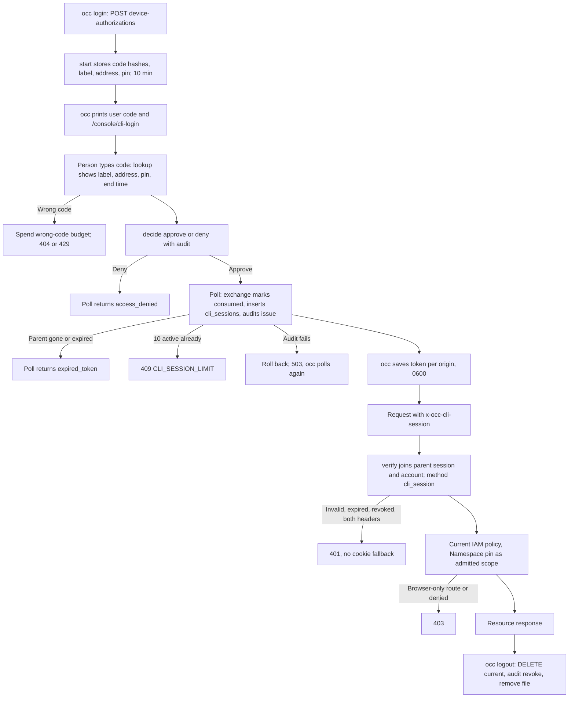

# CLI Sign-in Flow

## Overview

`occ login` turns a person's existing console sign-in into a short-lived CLI
session ([RFC-0019](https://github.com/openclaw/openclaw-enterprise/pull/1235)).
This flow follows one sign-in from the unauthenticated start, through approval
in the console and the token exchange, to an ordinary resource request and
`occ logout`. It stops at the resource response or the session's deletion.
Service API keys for automation are a separate lifecycle
([service API keys flow](service-api-keys.md)).

The controller owns the device authorization, the CLI session row and its
admission. PostgreSQL enforces the binding to the approving browser session.
The IAM Driver authorizes each request with current policy, exactly as for the
person's browser session.

## Entry Points

- `POST /api/auth/cli/device-authorizations` (unauthenticated) and
  `POST /api/auth/cli/token`: `occ login` starts and polls.
  [internal/occcli/login.go:loginCommand](../../internal/occcli/login.go),
  [apps/controller/src/auth/cli-sign-in.ts:createCliSignIn](../../apps/controller/src/auth/cli-sign-in.ts).
- `POST /api/auth/cli/device-authorizations/lookup` and `.../decide`: the
  `/console/cli-login` page, with the browser session, `Origin` and the tab's
  `x-occ-session-key`.
  [apps/controller/src/console/cli-login.mjs](../../apps/controller/src/console/cli-login.mjs).
- Any protected route with `x-occ-cli-session`.
  [apps/controller/src/auth/index.ts:ControllerAdmissionVerifier.verify](../../apps/controller/src/auth/index.ts).
- `GET`/`DELETE /api/auth/cli-sessions[/:id]` (console) and
  `GET`/`DELETE /api/auth/cli-sessions/current` (`occ auth status`, `occ logout`).

## Flow

## Execution Trace

### 1. Start and approve

`start` takes one advisory lock, deletes expired rows, evicts the oldest
pending authorizations beyond 1,000 and inserts the new one with SHA-256 hashes
of the device code and user code
([packages/occ/src/state/cli-sessions.ts:PostgresCliSessions.start](../../packages/occ/src/state/cli-sessions.ts)).
The route limits starts per client address. `lookup` and `decide` resolve the
browser session, normalize the typed code and share a wrong-code budget keyed
on the account and the address. `decide` moves a pending row to `approved`
(naming the user and the approving session) or `denied`, and writes the
`approve` or `deny` audit event in the same transaction.

### 2. Exchange the device code

`exchange` locks the authorization and its parent session, returns
`expired_token` when the parent is gone or expired and `409` when it already
has 10 active CLI sessions, then marks the authorization `consumed` and inserts
the `cli_sessions` row with `expires_at` at the earlier of the parent session's
end and the configured maximum. As a backstop, the `guard_cli_session` trigger
([migrations/0049_cli_sessions.sql](../../migrations/0049_cli_sessions.sql))
refuses a row whose parent is missing, expired or another account's, whose
guarded-profile binding differs from the parent's, or whose parent already has
10 unexpired CLI sessions. The `issue` audit event commits with the insert, so
two pollers consume once and an audit failure leaves the authorization approved.

### 3. Store the token in `occ`

`occ` writes the token, origin, session ID, email, end time and pin to a `0600`
file in a `0700` directory, refusing symlinks and loose modes on read
([internal/occcli/session_store.go:saveSession](../../internal/occcli/session_store.go)).
An explicit service-key file takes precedence.

### 4. Admit and authorize a request

The admission verifier refuses `x-occ-cli-session` together with `x-api-key`,
hashes the token and loads the session with its parent and account. In the
guarded profile it also checks the account, the method and both versions. It
admits method `cli_session` with the account's external identity and the
Namespace pin as admitted scope
([apps/controller/src/admission/admission-verifier.ts](../../apps/controller/src/admission/admission-verifier.ts)).
The controller treats it like `api_key` for workspace-file CSRF and refuses it
on account, service-key, approval, native admin and session routes
([apps/controller/src/index.ts](../../apps/controller/src/index.ts)).

### 5. End the session

`occ logout` and the console's revoke delete the row and write `revoke` audit
([PostgresCliSessions.revoke](../../packages/occ/src/state/cli-sessions.ts)).
Deleting the parent `occ.session` row (sign-out, account disable or revoke)
cascades. A bounded sweep deletes expired rows every 5 minutes.

## Debugging and Verification

- [PostgreSQL store](../../tests/integration/postgres-cli-sessions.test.mjs):
  cascade, cap, expiry bound, concurrent exchange, audit rollback and sweep.
- [HTTP and `occ`](../../tests/integration/postgres-cli-sign-in.test.mjs): the
  browser-only gates, header precedence, the Namespace pin and the real `occ`
  binary from login to logout.
- [Console](../../tests/integration/postgres-cli-login-console.test.mjs): the
  approval page and own-session revoke in Chromium.
- All three run in the `postgres-auth` lane; see the
  [PostgreSQL test environment](../testing/postgresql.md#postgresql-test-environment).
- `401` means the token or both-header check failed; `403` means a browser-only
  route, the pin or IAM policy. Check the `openclaw.auth.cli-sessions.*` audit
  actions by authorization or session ID; never log the token.

## Related docs

- [CLI sign-in reference](../reference/authentication/cli-sessions.md)
- [Human password/session flow](local-password-authentication.md)
- [Service API keys flow](service-api-keys.md)

## Manual Notes

[keep this for the user to add notes. do not change between edits]

## Changelog

- 2026-10-07: First version: device authorization, exchange, admission and logout for `occ login` (RFC-0019).
