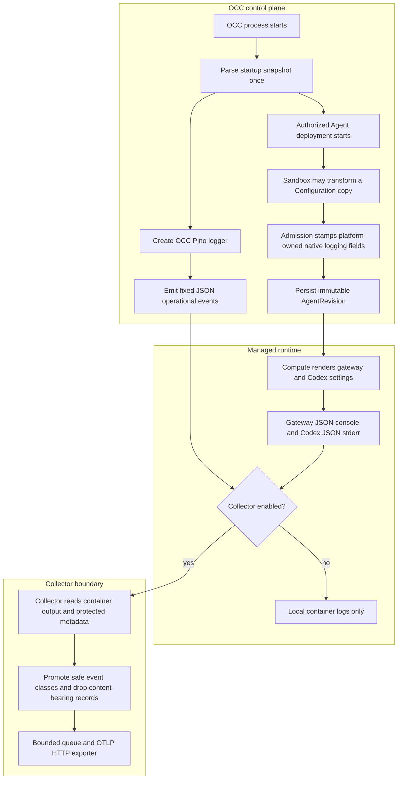

# Common Operational Logging Flow

## Overview

Trusted startup configuration selects one OCC operational logging level for API,
worker, migration, and bootstrap processes. Authorized Agent deployment freezes
that level into the immutable AgentRevision, and Compute renders gateway and
Codex runtime logging from the saved revision. The admitted native Configuration
keeps JSON console levels and native OTLP logs disabled while the runtime owns
console and tool redaction without a `logging.redactSensitive` configuration key.
Optional Docker Compose or Helm Collector configuration exports only reviewed
operational records. This flow ends at the Collector exporter; PostgreSQL audit
remains separate durable evidence.

## Entry Points

- Trigger: start the API, worker, migration, or bootstrap process; deploy an
  Agent; enable the optional Docker Compose or Helm logging Collector.
- Source: `apps/controller/src/composition/installation-config.ts:loadStartupConfigurationSnapshot`
- Source: `packages/occ/src/index.ts:OpenClawController.deployAgent`
- Source: `deploy/helm/openclaw-enterprise/templates/collector.yaml:logging.collector.enabled`
- Assumptions: trusted startup YAML, an authorized deployment request, selected
  Compute Driver support, and operator-owned Collector configuration when remote
  export is enabled.

## Flow

## Execution Trace

### 1. Startup parses one configuration snapshot

`apps/controller/src/composition/installation-config.ts:loadStartupConfigurationSnapshot`

API and worker startup parse the trusted YAML once, derive
`startupConfiguration.logging`, and pass the same snapshot into later driver
composition. Invalid logging configuration fails startup before the process
serves requests or claims work. The settings reference owns the accepted YAML
shape and values.

### 2. Processes log fixed sanitized events

`apps/controller/src/server.mjs:start`

Related startup paths are `apps/controller/src/worker.mjs`,
`scripts/bootstrap-installation.mjs`, `scripts/migrate-production.mjs`, and
`apps/controller/src/logging.ts:emitOccLogEvent`. Each process creates an OCC
Pino logger with the selected level. The API disables Fastify request logging so
OCC owns the HTTP event shape; bootstrap and migration keep success protocol
output separate from structured failure diagnostics. The source sanitizer keeps
reviewed scalar fields and drops unapproved fields, credentials, provider
payloads, request/reply objects, and unsafe strings before Pino writes the
record. This source boundary is distinct from the Collector export filter in
step 7.

### 3. Admission freezes runtime logging

`packages/occ/src/index.ts:OpenClawController.deployAgent`

This stamping step applies to default platform-owned runtime logging. When the
trusted ComputeDriver declares `runtimeLogging: "driver"`, admission instead
validates and freezes the native document without rewriting logging fields;
[the Compute contract](../reference/drivers/compute.md#runtime-logging-ownership)
owns that pipeline's obligations. OCC process logging and audit still follow the
normal path.

Deployment reads the exact Namespace-owned Configuration and allows the selected
SandboxDriver to transform a frozen copy. OCC then stamps platform-owned native
logging fields after sandbox configuration and before validation. The admitted
document keeps `logging.level`, matching `logging.consoleLevel`, JSON console
style, and `diagnostics.otel.logs=false`; it drops the retired
`logging.redactSensitive` key instead of persisting a runtime redaction setting.
The stored source Configuration is unchanged, and the admitted document is
persisted inside the immutable AgentRevision, so later startup restarts or
Configuration edits do not change that revision's runtime logging policy.

### 4. Compute renders settings from the revision

`apps/controller/src/drivers/compute/docker/index.ts:DockerComputeDriver.prepareRevision`

Kubernetes rendering follows
`apps/controller/src/drivers/compute/kubernetes/index.ts:KubernetesComputeDriver.deployment`.
Both Drivers require the admitted native logging fields to agree before they
render gateway and Codex settings. Kubernetes mounts the admitted document
read-only under `/etc/openclaw/openclaw.json`; runtime code must treat that file
as immutable startup input. Gateway receives native JSON console logging.
Dedicated Codex app-servers receive JSON stderr logging and host-owned arguments
that disable Codex OTLP export and prompt logging. Lifecycle hooks and
SecretBindings cannot override those reserved destinations.

### 5. Docker collection is an explicit development override

`apps/controller/src/drivers/compute/docker/index.ts:DockerComputeDriver.prepareRevision`

The normal development stack works without a Collector. Adding
`compose.logging.yaml` starts the pinned Collector and routes OCC, gateway, and
Codex Agent containers through Docker's nonblocking `fluentd` logging driver.
Docker Compute applies the managed runtime `LogConfig` from
`OCC_DOCKER_LOGGING_ADDRESS`; the address must be reachable from the Docker
Engine. The [Docker observability procedure](../guides/observability.md#docker-compose)
owns setup and verification.

### 6. Kubernetes collection is bundled or equivalent

`deploy/helm/openclaw-enterprise/templates/collector.yaml:logging.collector.enabled`

Helm renders a Collector DaemonSet that reads node CRI files and uses Pod metadata
to associate records with managed workloads. The
[Kubernetes observability procedure](../guides/observability.md#kubernetes-and-helm)
owns enablement and existing-Collector reuse; the
[security reference](../reference/security.md#operational-log-collection-boundary)
owns deployment isolation limits.

The `k8sattributes` processor maps identity onto each record before
`transform/kubernetes-resource` removes internal Pod labels. Removing shared
labels in the record loop would discard identity for later records in the same
batch.

The chart's `templates/collector.yaml` validates an exclusive exporter destination:
one IPv4 `/32` or paired namespace/Pod selectors, with a bounded TCP port. It
renders the selected exporter egress alongside DNS/API access. Empty Collector
metrics selectors grant no ingress; paired selectors admit port 8888. Policies
are additive. The independent demo release uses this same Collector pipeline and
provides a private Loki OTLP destination; it does not change source filtering.

### 7. Collector exports only operational classes

`deploy/logging/collector.yaml:transform/operational`

The shared Collector policy keeps transport-derived identity before parsing
untrusted JSON. It promotes fixed OCC event names, gateway records from the
`gateway` subsystem, and Codex stderr records from `codex_app_server`; malformed,
oversized, unclassified, content-bearing, and protocol stdout records are
dropped before remote export. Exporter credentials and TLS settings live in
Collector-only configuration. Finite queues and retry limits make operational
logs best-effort, but outage or overflow cannot block API service, worker
reconciliation, or PostgreSQL audit persistence.

## Debugging and Verification

- Check the startup snapshot first when API, worker, bootstrap, or migration
  logging does not match the expected level; compare admitted AgentRevision
  logging fields with rendered Docker or Kubernetes container settings for
  runtime workloads.
- For delivery checks, Collector metrics, and deployment troubleshooting, use
  the [observability guide](../guides/observability.md#tests).
- Packaging and Collector configuration tests prove rendered configuration,
  filtering, bounded queues, and startup boundaries. Real runtime suites must be
  selected separately before claiming gateway, Codex, model-turn, or OpenShell
  deployment proof.
- If a runtime Pod enters `CrashLoopBackOff` before a model turn and reports a
  configuration lock failure under `/etc/openclaw`, inspect the admitted native
  Configuration for retired fields before treating the run as a completed test
  case.

## Related docs

- [Settings reference](../reference/settings.md)
- [Security controls](../reference/security.md)
- [Observability guide](../guides/observability.md)
- [Deployment guide](../guides/deploy.md)
- [Common OpenTelemetry logging spec](../../specs/20-common-otel-logging.md)

## Manual Notes

[keep this for the user to add notes. do not change between edits]

## Changelog

- 2026-09-23 17:40: Documented private Collector scraping and selected in-cluster export in the accompanying observability change. (authoring-run/8fb2b0ce-9ad1-401c-a9b9-4e3919b5f573 - faf0b0ae467a3bebfd5b5ed0a92f259248e5da74)

- 2026-09-04 21:04: Documented that native logging admission drops the retired redaction key while preserving JSON levels, disabled OTLP logs, runtime redaction ownership and read-only Kubernetes config mounting. (cody/01a06dd0-9fff-7e90-aae3-4e7099a6d154 - 87234e1766e5802b45424523246a52a4b2d45590)

- 2026-09-02 10:42: Added the source-backed common logging flow for startup policy, revision admission, runtime rendering, and Collector export. (cody/01a06333-d27e-7b00-b27d-f4a17262849b - 1242406b6863c8953abe4827c601c2173129ee50)
- 2026-09-03 17:56: Simplified repeated settings and guide detail while preserving the logging lifecycle, admission, Collector filtering, and audit boundaries. (cody/01a05fa0-6720-7f42-891b-c2c0495c8d12 - 61ef68bc61129c90130bb65b0fc48373f0c70866)
