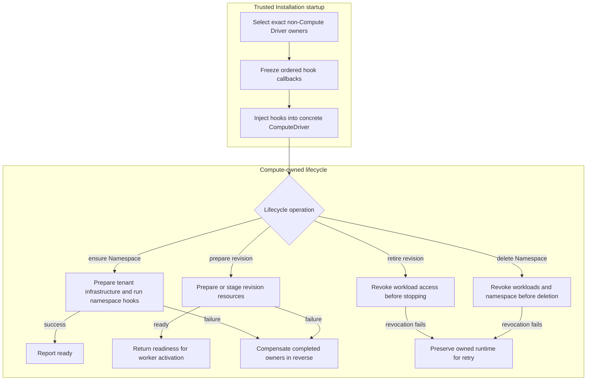

# Compute Driver Lifecycle Hooks Flow

## Overview

Selected non-Compute Drivers can participate in Namespace and workload lifecycles without owning
infrastructure or receiving deployment authority. This flow starts when trusted startup composition
selects hook owners, follows Compute readiness, workload preparation, revocation, and teardown, and
stops when Compute returns its existing lifecycle observation to OCC or the independent worker.

## Entry Points

- Trigger: OCC reconciliation or an independently claimed Namespace/AgentRevision lifecycle job.
- Source: `apps/controller/src/composition/installation-config.ts:loadInstallationConfiguration`,
  `packages/occ/src/index.ts:OpenClawController.selectDriver`, and
  `apps/controller/src/worker.ts:ControllerWorker`.
- Assumptions: one server-owned Installation, exact selected Driver identities, established IAM
  authorization, an immutable Namespace or AgentRevision, and an unchanged concrete ComputeDriver.

## Flow

## Execution Trace

### 1. Attach selected hook owners before Compute starts

`apps/controller/src/composition/installation-config.ts:loadInstallationConfiguration`

The [Driver package loading flow](driver-plugin-loading.md) resolves exact IAM,
Configuration, and Compute identities. OCC and worker startup attach selected
non-Compute lifecycle owners once before the first operation. The selected IAM
Driver remains stable and loads current policy for every authorization decision.

Trusted startup enforces the
[production revision-stage contract](../reference/drivers/compute.md#production-revision-stages).
The worker invokes each stage only when the Harness lifecycle requires it and
fails closed if a required stage or owner is unavailable.

### 2. Snapshot owners and bind cancellation

`apps/controller/src/drivers/compute/lifecycle-hooks.ts:ComputeLifecycleDispatcher`

The [hook dispatcher](../../apps/controller/src/drivers/compute/lifecycle-hooks.ts) snapshots exact
Driver capability, identity, and callbacks once during registration. It preserves controller
selection order for preparation and reverses that order for teardown. Registered callbacks remain
stable even if their trusted owner changes. Hooks receive the worker's existing claim-owned abort
signal; direct Compute calls receive a nonaborted fallback.

### 3. Gate Namespace readiness on completed hooks

`apps/controller/src/drivers/compute/kubernetes/index.ts:KubernetesComputeDriver.ensureNamespace`

Both [Kubernetes](../../apps/controller/src/drivers/compute/kubernetes/index.ts) and
[Docker](../../apps/controller/src/drivers/compute/docker/index.ts) Compute implementations
prepare tenant infrastructure first, then run `afterNamespacePrepared` before reporting ready.
No gateway exists until Agent revision preparation. Failed preparation compensates completed
owners with `beforeNamespaceDelete` in reverse.

### 4. Validate launch contributions before starting a workload

`apps/controller/src/drivers/compute/lifecycle-hooks.ts:ComputeLifecycleDispatcher.beforeWorkloadStart`

Kubernetes `prepareRevision` invokes selected workload hooks for initial embedded gateway creation
and for dedicated Codex workload preparation. Embedded replacement revisions are different: after
staging the immutable configuration, Service, and private claim, `prepareRevision` can return ready
without starting the replacement gateway. After the worker commits the new active revision,
`KubernetesComputeDriver.activateRevision` invokes `beforeWorkloadStart`, updates the `Recreate`
gateway Deployment and Service, then checks gateway readiness.

`runtime.nodeSelector` schedules Harness and embedded Pods. Dedicated real Gateways require
`runtime.gatewayNodeSelector` and run in the logical Namespace's managed control-plane runtime
namespace. The Pod-level selector also schedules the Gateway's private-state initializer there.
Compute owns both targets through the same revision lifecycle; teardown selects each resource's
physical namespace and preserves newer revisions and durable Agent claims.

SSH stages embedded snapshots without starting the candidate gateway. After the
worker commits the active revision, `SshComputeDriver.activateRevision` invokes
`beforeWorkloadStart`, then projects accepted launch placeholders into the
Agent's systemd unit before restart. Failed activation compensates prepared
bindings through `beforeWorkloadStop`.

The dispatcher rejects reserved environment keys and values outside the explicit `opaque-`
placeholder format, then freezes a detached launch snapshot using the shared
[immutability helpers](../../packages/utils/src/index.ts). Kubernetes and Docker Compute project
accepted placeholders only into the combined embedded gateway or separate dedicated Codex container,
never a separate dedicated gateway. A failed launch or activation revokes successfully prepared
workload bindings.

### 5. Revoke access before stopping owned resources

`apps/controller/src/drivers/compute/kubernetes/index.ts:KubernetesComputeDriver.retireRevision`

Workload retirement runs `beforeWorkloadStop` in reverse owner order before stopping the exact
revision. Namespace deletion is limited to empty tenants and runs
`beforeNamespaceDelete` before requesting Kubernetes deletion. A
failed revocation preserves the owned resource for retry; aborted preparation receives a fresh,
bounded cleanup signal so cancellation cannot suppress compensation.

## Debugging and Verification

- Run `node --test tests/conformance/utils.test.mjs tests/conformance/compute-lifecycle-hooks.test.mjs`
  for shared immutable copies, callback capture, preparation/teardown ordering, opaque placeholders,
  cancellation, and rollback.
- Run `node --test --test-name-pattern='Kubernetes lifecycle owners cannot be replaced|Kubernetes lifecycle hooks never run' tests/conformance/kubernetes-compute.test.mjs`
  for concrete Kubernetes owner and lifecycle-boundary behavior.
- Errors include only the failing hook phase and owner. Investigate exact selected identities,
  operation cancellation, unsafe placeholder values, and pending revocation without printing
  credentials or sensitive endpoints.
- PostgreSQL, Docker, live Kubernetes, and OpenShell proof require their real
  dependencies and infrastructure; unavailable integrations must be skipped explicitly.

## Related docs

- [Installation Driver package loading flow](driver-plugin-loading.md)
- [Compute Driver lifecycle implementation specification](../../specs/.archive/04-compute-driver-lifecycle-hooks.md)
- [ComputeDriver contract](../reference/drivers/compute.md)
- [Kubernetes Compute Driver](../reference/drivers/kubernetes-compute.md#selected-driver-lifecycle-hooks)
- [Docker Compute Driver](../reference/drivers/docker-compute.md)
- [Configuration Driver and Agent Revision flow](configuration-driver.md)

## Manual Notes

[keep this for the user to add notes. do not change between edits]

## Changelog

- 2026-09-23 11:31: Separate dedicated Gateway scheduling and lifecycle placement from the Harness target. (01a0cf72-6985-7712-ba92-d8cc32470f24 - b141ba1157c2f28276717d35c8c63028f209a479)

- 2026-09-18 17:15: Document Kubernetes runtime node selector rendering for gateway and Agent Pods. (authoring-run/8e0bc064-817d-47a5-b4fe-eb352ceeb661 - 3bc07ccd2feec9d87c91171354ce1eb850264594)
- 2026-09-08 07:49: Document SSH activation-time workload hooks and compensation. (01a07d92-d866-7731-afe5-abab67d8966c - 4d83087229961f3665b923d2581c0b71b988cc9c)

- 2026-09-01 19:09: Corrected Kubernetes embedded replacement hook ordering so `prepareRevision` stages readiness and `activateRevision` starts the replacement gateway. (01a05f95-dd80-7011-990f-d1c46b5bb3cc - aa366c49c44834d59f74994c5fd37fb8096f169f)
- 2026-08-28 21:20: Updated the lifecycle trace and verification for Docker and Kubernetes. (01a036f4-cf1d-7cc1-bbc1-000879038ac8 - 3ec166eb5fae39ed0f51ffb5ebd93338c4a2db94)
- 2026-08-28 21:20: Removed the local-test Compute Driver, its dedicated tests and docs; trace supported Docker and Kubernetes lifecycle hooks. (01a036f4-cf1d-7cc1-bbc1-000879038ac8 - 3ec166eb5fae39ed0f51ffb5ebd93338c4a2db94) (NOT_IN_SPEC)
- 2026-08-28 17:58: Updated moved feature-reference links for the documentation organization. (01a036f4-cf1d-7cc1-bbc1-000879038ac8 - 4270aa29b7015562049f46c6027962fd85b584a9)
- 2026-08-24 17:12: Documented stable lifecycle-owner selection and current-policy IAM authorization. (01a0352c-debe-73b1-baa6-379855af874f - 4502d7e)
- 2026-08-24 17:12: Removed IAM policy snapshots and refresh; stable lifecycle owners retain IAM Drivers that load current policy for every authorization decision. (01a0352c-debe-73b1-baa6-379855af874f - 4502d7e) (NOT_IN_SPEC)
- 2026-08-21 20:53: Linked the canonical production Compute-stage contract while preserving owner snapshots and fail-closed lifecycle execution. (01a0269c-0551-7f01-9dfc-ffb2a0896c94 - f6491502262d6190c95d2a910ee46283c30244f9)
- 2026-08-21 20:12: Clarified that production validates both revision stages during startup before later fail-closed lifecycle execution. (01a0269c-0551-7f01-9dfc-ffb2a0896c94 - b651c4ae38310032f8cda47c868a9b282fb12ff3)
- 2026-08-21 20:05: Scoped the trace to lifecycle owner attachment, typed optional revision stages, and unchanged Harness topology. (01a0269c-0551-7f01-9dfc-ffb2a0896c94 - b651c4ae38310032f8cda47c868a9b282fb12ff3)
- 2026-08-21 19:28: Extended trusted lifecycle composition to production-capable packaged IAM, Compute, and Configuration while preserving staged hooks and Harness ownership. (01a0269c-0551-7f01-9dfc-ffb2a0896c94 - a45b01d258c6a6b10db2301cad3303e2fa520f09)
- 2026-08-21 17:28: Replaced the removed public startup factory with the single asynchronous Installation-and-Drivers loading entry point. (01a0269c-0551-7f01-9dfc-ffb2a0896c94 - d17a87541cbebc8e333bd00bd90c42e734d91a80)
- 2026-08-20 16:05: Consolidated controller-owned validation, selection-ordered callbacks, final environment checks, and reverse cleanup. (01a01dfc-dbec-79e1-9400-356f32af7d11 - 8bbdcb2)
- 2026-08-20 15:33: Shared immutable snapshots across the workspace and reduced workload launch configuration to opaque environment placeholders. (01a01dfc-dbec-79e1-9400-356f32af7d11 - d1294fc)
- 2026-08-20 07:37: Documented trusted selected-driver startup, ordered lifecycle dispatch, bounded launch validation, cancellation-safe compensation, and revocation-before-teardown. (01a01dfc-dbec-79e1-9400-356f32af7d11 - 875f7a1b47f3ee3645a432c27aa72da57e300f29)
