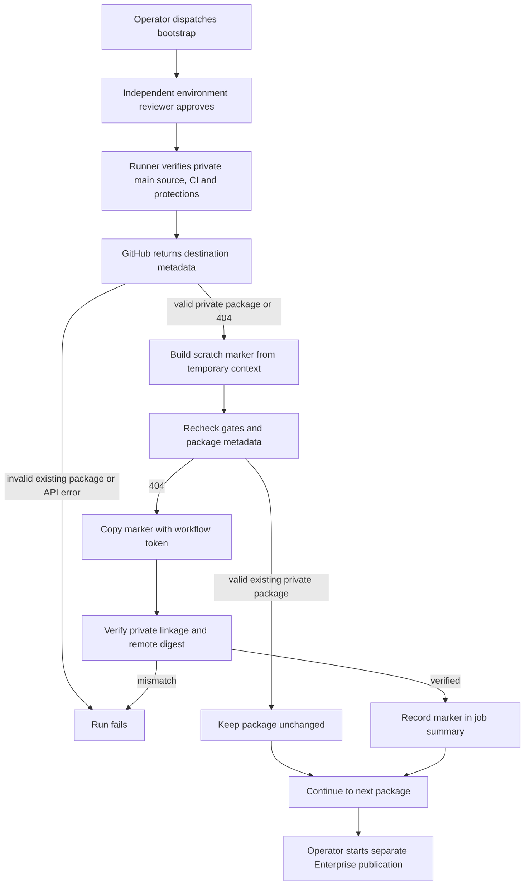

# Container package bootstrap flow

## Overview

A separately approved GitHub Actions run creates private GHCR packages using
harmless marker images. This supplies the existing Enterprise publisher's
pre-existing-package prerequisite. The flow ends after package metadata and
marker digests verify; Enterprise publication needs its own dispatch and approval.

## Entry Points

- `.github/workflows/container-bootstrap.yml:jobs.bootstrap`: manual dispatch on
  `main` with the successful exact-source main-push CI run ID.
- `scripts/ci/container-bootstrap.mjs:main`: protected job with `actions: read`,
  `contents: read`, and `packages: write`; explicit destination variables select
  two different GHCR packages in the `openclaw` organization.

## Flow

The diagram describes implemented control flow; it does not establish that a
hosted bootstrap or subsequent release has succeeded.

## Execution Trace

### 1. Validate the approved source and destinations

`scripts/ci/container-bootstrap.mjs:main` reuses
`scripts/ci/container-release.mjs:verifyMainSource`, `verifyCi`, and
`verifyEnvironment`. Source equals the trusted main workflow revision and
checkout. The repository is private, exact-source main-push CI succeeds, and the
environment requires independent review, disables admin bypass, and permits
only branch `main`. Invalid context fails before a registry write.

Each configured package name passes `ghcrPackageName`. Existing metadata must
pass `validatePackage` for private visibility and exact repository linkage.
Only bootstrap opts into `github`'s 404 result; normal publication still fails
on missing metadata. A 404 can also hide inaccessible packages, so it authorizes
only the non-sensitive marker attempt. Authorization and other API errors fail.

### 2. Build and transfer only marker bytes

`scripts/ci/container-bootstrap.mjs:main` creates a temporary context with a
scratch Dockerfile and fixed text marker. Repository source and revision labels
link the image to Enterprise. Docker exports `linux/amd64` OCI bytes without
copying the checkout, fetching a base image, or receiving registry credentials.
Skopeo authenticates using the workflow token over stdin and a temporary auth file.

Before each transfer, the helper repeats source, CI, environment, and package
checks. Valid existing packages remain unchanged. A 404 permits copying the
marker under a unique run/attempt tag. The helper then requires private linked
metadata and matching remote manifest digest. A failed post-push check fails the
run and leaves the harmless marker for operator inspection; it changes no grants
or visibility and performs no automatic deletion.

### 3. Hand verified packages to release operators

`scripts/ci/container-bootstrap.mjs:main` records each existing or bootstrapped
package in the job summary and removes the temporary context, archive, and auth
file in `finally`. Bootstrap and publication share the same workflow concurrency
lock, which does not constrain external package administrators. Partial success
is possible. The operator follows the existing publication procedure to build,
smoke, independently approve, and publish actual Enterprise images.

## Debugging and Verification

- `node --test tests/integration/container-release.test.mjs` checks shared gate
  behavior and that only explicit bootstrap lookups tolerate API 404 responses.
- Inspect the hosted job summary and authenticated package metadata for both
  destinations. Marker success proves package bootstrap, not Enterprise availability.
- A package or metadata permission failure needs operator access repair. Keep
  self-review prevention and private-package checks enabled.
- Treat `bootstrap-*` as non-deployable markers. Release evidence comes from the
  separate publisher's receipt and authenticated image digest verification.

## Related docs

- [Container publication procedure](../../.github/containers.md)
- [First container release specification](../../specs/32-first-container-release.md)
- [CI execution flow](github-actions-testing.md)

## Manual Notes

[keep this for the user to add notes. do not change between edits]

## Changelog

- 2026-09-21 01:00: Trace protected marker package bootstrap and publication handoff. (01a0c179-19f7-7111-8bb4-fc7680da5545 - 4e056c57390397b89642783fea5f1d19834b0325)
