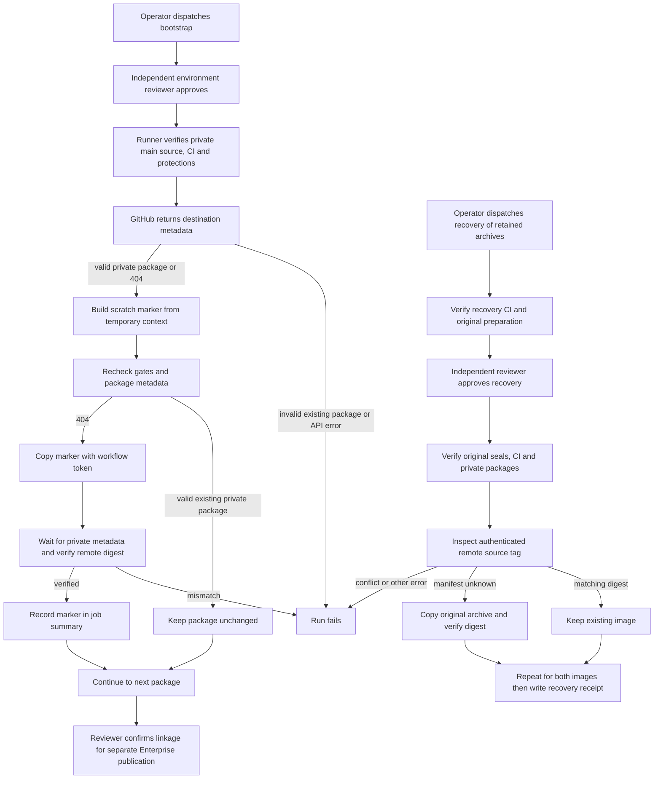

# Container package bootstrap flow

## Overview

A separately approved GitHub Actions run creates private GHCR packages using
harmless marker images. This supplies the existing Enterprise publisher's
pre-existing-package prerequisite. Bootstrap ends after package metadata and
marker digests verify. Enterprise
publication and recovery each need their own dispatch and approval; recovery
reuses retained archives after an interrupted publication.

## Entry Points

- `.github/workflows/container-bootstrap.yml:jobs.bootstrap`: manual dispatch on
  `main` with the successful exact-source main-push CI run ID.
- `scripts/ci/container-bootstrap.mjs:main`: protected job with `actions: read`,
  `contents: read`, and `packages: write`; explicit destination variables select
  two different GHCR packages in the `openclaw` organization.
- `.github/workflows/container-resume.yml:jobs.publish`: separately approved
  recovery using retained archives from an unchanged producer run attempt.

## Flow

The diagram describes implemented control flow; it does not establish that a
hosted bootstrap or subsequent release has succeeded.

## Execution Trace

### 1. Validate the approved source and destinations

`scripts/ci/container-bootstrap.mjs:main` reuses
`scripts/ci/container-release.mjs:verifyMainSource`, `verifyCi`, and
`verifyEnvironment`. Source equals the trusted main workflow revision and
checkout. The repository is private, exact-source main-push CI succeeds, and the
environment requires independent review, disables admin bypass, and permits
only branch `main`. Invalid context fails before a registry write.

Each configured package name passes `ghcrPackageName`. Existing metadata must
pass `validatePackage` for private visibility and, when returned, exact private
repository linkage. GitHub's optional repository field may be absent or null.
Bootstrap allows that omission because it copies only harmless marker bytes;
publication requires separate linkage evidence before copying Enterprise source.
Only bootstrap opts into `github`'s 404 result; normal publication still fails
on missing metadata. A 404 can also hide inaccessible packages, so it authorizes
only the non-sensitive marker attempt. Authorization and other API errors fail.

### 2. Build and transfer only marker bytes

`scripts/ci/container-bootstrap.mjs:main` creates a temporary context with a
scratch Dockerfile and fixed text marker. Repository source and revision labels
link the image to Enterprise. Docker exports `linux/amd64` OCI bytes without
copying the checkout, fetching a base image, or receiving registry credentials.
Skopeo authenticates using the workflow token over stdin and a temporary auth file.

Before each transfer, the helper repeats source, CI, environment, and package
checks. Valid existing packages remain unchanged. A 404 permits copying the
marker under a unique run/attempt tag. The helper retries post-push metadata 404s
up to five times, two seconds apart, then requires private metadata and a matching
remote manifest digest. Other API errors fail immediately. A failed post-push check fails the
run and leaves the harmless marker for operator inspection; it changes no grants
or visibility and performs no automatic deletion.

### 3. Hand verified packages to release operators

`scripts/ci/container-bootstrap.mjs:main` records each existing or bootstrapped
package in the job summary and removes the temporary context, archive, and auth
file in `finally`. Bootstrap and publication share the same workflow concurrency
lock, which does not constrain external package administrators. Partial success
is possible. The operator follows the existing publication procedure to build,
smoke, independently approve, and publish actual Enterprise images.

`scripts/ci/container-release.mjs:verifyGhcr` is shared by publication and promotion.
If package metadata omits the repository, it requires the independent reviewer's
exact linkage confirmation in GitHub's environment approval history. The current
environment ID, package, repository, source, run, and attempt must match; the
reviewer must differ from both the initiator and rerun actor. The reviewer checks
the live package settings using the [approval procedure](../../.github/containers.md#confirm-package-linkage).
This records operator evidence; the API does not independently prove the connection.

### 4. Recover retained publication bytes after a partial failure

`.github/workflows/container-resume.yml` runs validation without registry write
permission, then uses the same protected environment and concurrency lock as
publication. `scripts/ci/container-resume.mjs:verifyPreparation` checks the
current recovery workflow's main-push CI separately from the original image
source. The original producer must be the trusted publication workflow on main,
completed at the unchanged selected attempt, with successful validation and both
prepare/smoke jobs. Exactly named, nonexpired artifacts must belong to that run
and source; the workflow downloads their validated IDs with digest checks.

`scripts/ci/container-resume.mjs:resume` preserves the producer identity in each
seal and rechecks original source CI. It calls
`scripts/ci/container-release.mjs:publishPrepared`, which verifies both archive
hashes and OCI digests before registry writes. Before each image, source, CI,
producer, environment, and private-package/linkage evidence are rechecked. A
matching existing source tag is inspected remotely and left untouched, even if
package metadata has not caught up. Only the registry's explicit manifest-unknown
response permits copying an unlisted tag; authorization and transport failures
stop recovery. A conflicting tag or remote digest fails.
Metadata GET transport failures are bounded and report the endpoint. No archive
is rebuilt and no original seal is rewritten.

Only after both remote digests match does `resume` write the recovery receipt,
separating original image provenance from the current publishing run. The
operator retains that receipt and uses digest references from it. The current
Docker Hub promotion workflow does not consume recovery receipts. A failed
recovery can leave one image published; follow the
[recovery procedure](../../.github/containers.md#recover-a-partial-publication)
without deleting the original archives or rerunning their producer.

## Debugging and Verification

- `node --test tests/integration/container-resume.test.mjs` exercises the recovery
  CLI with HTTP/transport fixtures; a hosted run must prove actual GHCR transfer.

- `node --test tests/integration/container-release.test.mjs` checks shared gate
  behavior and that only explicit bootstrap lookups tolerate API 404 responses.
- Inspect the hosted job summary and authenticated package metadata for both
  destinations. Marker success proves package bootstrap, not Enterprise availability.
- A package or metadata permission failure needs operator access repair. Keep
  self-review prevention and private-package checks enabled.
- Missing repository metadata requires the reviewer's linkage confirmation for
  the current publication or promotion attempt; retrying an unchanged approval
  does not fix it. An explicit wrong repository always fails.
- Treat `bootstrap-*` as non-deployable markers. Release evidence comes from the
  separate publisher's receipt and authenticated image digest verification.

## Related docs

- [Container publication procedure](../../.github/containers.md)
- [First container release specification](../../specs/32-first-container-release.md)
- [CI execution flow](github-actions-testing.md)

## Manual Notes

[keep this for the user to add notes. do not change between edits]

## Changelog

- 2026-09-21 20:25: Trace recovery from retained OCI artifacts with separate preparation and publication identities. (01a0c179-19f7-7111-8bb4-fc7680da5545 - 4ec004dbefd25070ff1bdeb89cfb16d245296ac9)

- 2026-09-21 19:00: Separate marker verification from recorded reviewer linkage evidence and bound metadata propagation retries. (01a0c179-19f7-7111-8bb4-fc7680da5545 - aa6dd7415d65ffba5fa40098b2142eb2a7d73df4)
- 2026-09-21 01:00: Trace protected marker package bootstrap and publication handoff. (01a0c179-19f7-7111-8bb4-fc7680da5545 - 4e056c57390397b89642783fea5f1d19834b0325)
