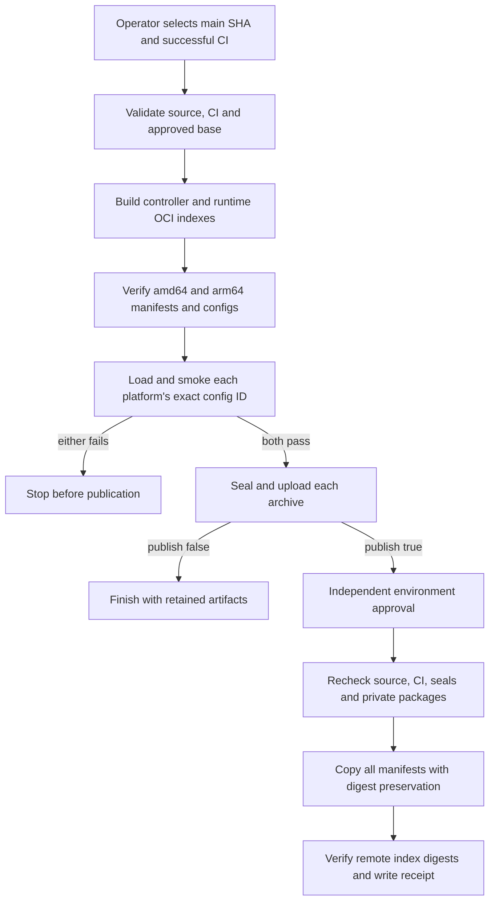

# Container publication flow

## Overview

Manual Enterprise container publication builds controller and runtime OCI archives
for Linux amd64 and arm64, checks both variants, and transfers the approved bytes
to private GHCR packages. Each package receives one multi-platform index digest.
This flow ends with verified remote digests and a publication receipt; it does
not deploy workloads or change package visibility.

## Entry Points

- `.github/workflows/container-publish.yml:jobs.validate`: manual dispatch on
  `main` with its exact source SHA, successful main-push CI run ID, and publish flag.
- `scripts/ci/container-release.mjs:main`: validation, smoke, seal, and publication
  commands called by the workflow.
- Publication requires pre-existing private packages and independent approval
  through the protected `container-publish` environment.

## Flow

The workflow implements these gates; source review alone does not prove that a
particular hosted build or registry transfer succeeded.

## Execution Trace

### 1. Admit the source and initialize preparation

`scripts/ci/container-release.mjs:validate` verifies the trusted workflow, exact
main source and successful CI identity, and approved Node base digest. Publication
also checks environment protections. No-push preparation has no package write
permission or protected-environment credentials.

`.github/workflows/container-publish.yml:jobs.prepare` runs once per image. It
registers ARM64 QEMU support and asks Buildx for `linux/amd64,linux/arm64`, with
provenance disabled, in a single OCI archive. The approved Node base index must
provide both platforms. The controller and runtime use their existing recipes.
After OCI export, the job prunes only its dedicated Buildx builder's cache so
the cache and unpacked smoke images do not exhaust the runner's disk together.

### 2. Verify and execute both platform variants

`scripts/ci/container-release.mjs:readArchivePlatforms` reads blobs directly from
the archive by validated digest and checks their SHA-256 hashes. The root must be
an OCI index with exactly one amd64 and one arm64 Linux image manifest. Each child
config must agree with the index's platform; missing, duplicate, unsupported, or
corrupt entries stop preparation.

`scripts/ci/container-release.mjs:smoke` binds the archive's root digest to the
Buildx output, then uses Skopeo's explicit platform selection to load one variant
at a time. Docker's loaded config ID must match the selected index entry before
the existing controller or runtime startup suite runs against that ID. AMD64 runs
natively and ARM64 under QEMU. Both must pass, and the archive hash must remain
unchanged. A failure prevents sealing and artifact upload for that image.
After each successful platform smoke, the loaded image tag is removed before
the next variant is loaded. The exported archive remains the publication input.

### 3. Seal and await approval

`scripts/ci/container-release.mjs:seal` rechecks the platform contents and records
the archive hash, multi-platform index digest, platform list, source, workflow,
run attempt, CI identity, and approved base. Both prepared artifacts must exist
before `.github/workflows/container-publish.yml:jobs.publish` can start.

No-push runs end with artifacts. Publication waits for independent protected
environment approval. Archive retention and package access requirements are owned
by the [operator instructions](../../.github/containers.md).

### 4. Publish and hand off immutable references

`scripts/ci/container-release.mjs:publishPrepared` checks both seals, archive hashes,
index digests, and destinations before copying either image. It repeats approval,
CI, and package checks during transfer. A matching existing source tag is retained;
a conflicting tag or ambiguous registry error fails. An absent tag receives the
entire index and both child manifests through Skopeo `--all --preserve-digests`.

Each remote index digest must match before the receipt is written. Deployment
uses that index digest, letting the container runtime select its architecture.
A partial failure leaves existing published bytes intact. Recovery consumes the
same retained multi-platform archives and original producer identity; it does
not rebuild them. Old amd64-only seals cannot satisfy this platform contract.

## Debugging and Verification

- Run `node --test tests/integration/container-{release,resume,promote}.test.mjs`
  for platform/archive validation and release gate coverage. The archive case uses
  real OCI blobs and tar; recovery uses transport fixtures, not a live registry.
- Run `actionlint .github/workflows/container-publish.yml` for workflow syntax.
- In a hosted preparation, require smoke output for both architectures of both
  images. A config mismatch, missing platform, or failed startup blocks upload.
- Inspect the published reference with `docker buildx imagetools inspect` and
  require Linux amd64 and arm64 plus the receipt's index digest. Startup checks
  do not establish native ARM64 performance, cluster behavior, or model turns.

## Related docs

- [Publication and recovery instructions](../../.github/containers.md)
- [Package bootstrap flow](container-package-bootstrap.md)
- [Image startup checks](../testing/images.md)

## Manual Notes

## Changelog

- 2026-09-22 01:10: Bound disk use by pruning the job-owned build cache and removing each successfully checked image variant (codex/01a0c179-19f7-7111-8bb4-fc7680da5545 - 1e486bffadbe5f5f9f6437bfc8da2e4176ffefd6)

- 2026-09-21 22:14: Describe multi-platform preparation, per-platform smoke and immutable publication with the accompanying workflow change (codex/01a0c179-19f7-7111-8bb4-fc7680da5545 - b233abec94bce0448768a013f44fcbfab2ce7919)
