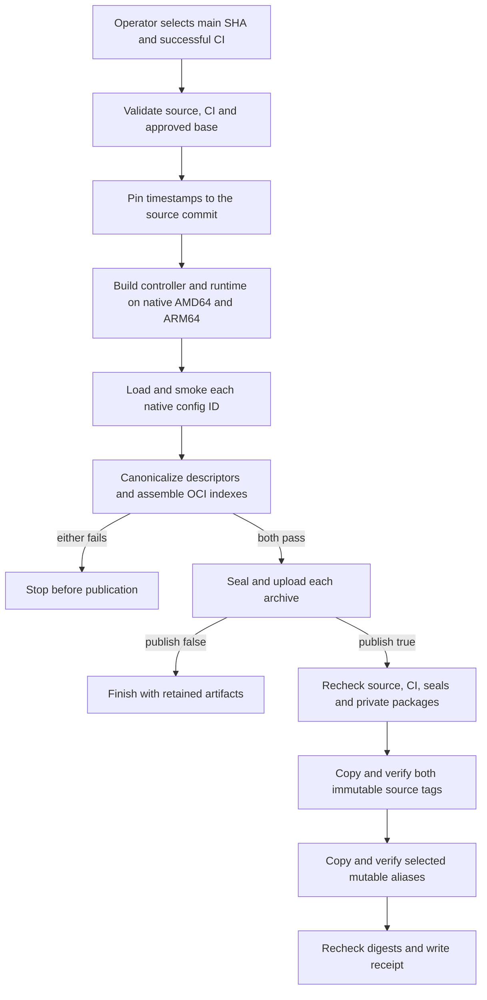

# Container publication flow

## Overview

Manual Enterprise container publication builds controller and runtime OCI archives
for Linux amd64 and arm64, checks both variants, and transfers the tested bytes
to private GHCR packages. Each package receives one multi-platform index digest.
This flow ends with verified remote digests and a publication receipt; it does
not deploy workloads or change package visibility.

## Entry Points

- `.github/workflows/container-publish.yml:jobs.validate`: manual dispatch on
  `main` with its exact source SHA, successful main-push CI run ID, publish flag,
  and optional mutable image tag.
- `scripts/ci/container-release.mjs:main`: validation, smoke, seal, and publication
  commands called by the workflow.
- Publication requires pre-existing private packages. The manual dispatch
  authorizes publication without a separate environment approval. GitHub grants
  manual dispatch to repository writers, including maintainers.

## Flow

The workflow implements these gates; source review alone does not prove that a
particular hosted build or registry transfer succeeded.

## Execution Trace

### 1. Admit the source and initialize preparation

`scripts/ci/container-release.mjs:validate` verifies the trusted workflow, exact
main source and successful CI identity, approved Node base digest, and the optional
image tag. An empty tag selects `latest`; invalid or reserved tags fail before
preparation. Publication also checks the main-only environment branch policy.
No-push preparation has no package write permission or protected-environment
credentials.

`.github/workflows/container-publish.yml:jobs.prepare` calls the reusable
`.github/workflows/container-check.yml:jobs.prepare` image/architecture matrix. Controller and runtime each build on native AMD64 and ARM64 Linux runners.
The defaults are `blacksmith-16vcpu-ubuntu-2404` and
`blacksmith-8vcpu-ubuntu-2404-arm`; `CONTAINER_AMD64_RUNNER` and
`CONTAINER_ARM64_RUNNER` repository variables can select other provisioned labels.
Each job checks its architecture and logs CPU, memory, and available disk.
Jobs require at least four CPUs and 12 GiB RAM; the reported runner label alone
is not evidence of allocated capacity.
The standard AMD64 override retains guarded toolchain cleanup: required roots
are checked, unsafe optional paths are skipped, and 36 GiB free is required.
Larger runners do not depend on deleting preinstalled SDKs.

Each Buildx builder runs at most two steps concurrently. The default Blacksmith
runners retain BuildKit layers on a sticky disk scoped by image and architecture,
so builds do not export the large intermediate cache over the network. A custom
non-Blacksmith runner uses the GitHub Actions cache with the same scope.
The main-only publication gate and read-only build jobs remain unchanged.
Maintainers can also dispatch `container-check.yml` on a branch for native image
verification; manual `CI` dispatches call the same workflow so branches can be
verified before the workflow first lands on main. It has no publication job or
package-write permission.
The build exports
an OCI directory without registry publication or credentials.
Before Buildx runs, the workflow derives `SOURCE_DATE_EPOCH` from the exact
source commit. BuildKit rewrites image and filesystem timestamps to that epoch,
so wall-clock time does not change the image manifests on a cold-cache rebuild.

`deploy/runtime/Dockerfile:openclaw-source` verifies the pinned source archive,
applies the Codex 0.156.0 dependency/lockfile patch, and applies the temporary
OpenClaw read-only-paths compatibility patch. The build verifies the latter's
hash and records it in runtime provenance. The OpenClaw bridge forwards the bound
Agent's stock network settings without modifying the Codex binary. Both installs use
frozen lockfiles and upstream's selected-plugin manifests, retaining required
bundled plugins plus Codex and Slack. The standalone Codex command links to the
plugin's installation. Build tools remain in full Bookworm stages; final images
use a separately pinned Node 24 Bookworm slim base.

`scripts/build-runtime-assets.mjs` removes development/QA source, extension tests,
and documentation media, while retaining runtime templates, skills, and help.
It follows importer-relative runtime dependencies to remove unreachable pnpm
store entries without collapsing distinct package versions. It writes initial
provenance containing source, patch, lockfile, and inventory hashes. The runtime
copies the assembled directory directly; there is no gzip archive or second
Codex installation. After final-stage permission normalization, the inventory
helper rewrites `contents.json` from `/app/node_modules/openclaw` and updates
`runtimeContentsSha256` and the stock `codex` package/binary identity. Provenance
therefore describes the final runtime tree. Upstream
import-closure and native-addon checks remain. See the
[runtime recipe](../../deploy/runtime/README.md).

### 2. Verify and assemble both platform variants

`scripts/ci/container-release.mjs:smoke` requires a native runner matching the
selected platform. It binds the OCI export to the build output digest, loads it
with Skopeo, checks Docker's config ID and architecture, and runs the existing
startup suite with native deadlines. A success receipt binds the platform digest
to the source, workflow, run/attempt, CI evidence, image, and build base. Failed
smokes cannot upload platform artifacts. The temporary loaded image is removed.

`.github/workflows/container-publish.yml:jobs.assemble` downloads both successful
platform artifacts from this exact run/attempt. `container-release.mjs:assemble`
rejects mismatched receipts, platform configs, blob sizes, or hashes before linking
blobs into one OCI layout. It retains only the manifest media type, digest, size,
and platform in each assembled descriptor, excluding exporter-only annotations
such as the build time and local reference name. It writes the multi-platform
index and archive without rebuilding either variant, then removes the temporary layouts.
`readArchivePlatforms` checks the archive contains exactly one AMD64 and one ARM64
Linux manifest with matching config and content digests. Publication still consumes
this sealed archive; registry access is not needed during assembly.

Before runtime smoke, `scripts/ci/prepare.mjs:prepareRuntimeImageSmoke` imports
the loaded config ID into a disposable k3d cluster. It reuses the Images and
Packaging lane's reviewed Codex seccomp derivation and sandbox probes, then passes
the resulting profile and ownership state to the Docker tests. This preparation
does not rebuild the runtime. Cleanup removes the owned cluster and temporary
image tag on success or failure; a workflow cleanup step also runs after an
interrupted smoke command.

### 3. Seal and enter publication

`scripts/ci/container-release.mjs:seal` rechecks the platform contents and records
the archive hash, multi-platform index digest, platform list, source, workflow,
run attempt, CI identity, and approved base. Both prepared artifacts must exist
before `.github/workflows/container-publish.yml:jobs.publish` can start. The
publish job runs only when the operator selected `publish: true`.

No-push runs end with artifacts. Publishing runs proceed directly to automated
validation. Archive retention and package access requirements are owned
by the [operator instructions](../../.github/containers.md).

### 4. Publish and hand off immutable references

`scripts/ci/container-release.mjs:publishPrepared` checks both seals, archive hashes,
index digests, and destinations before copying either image. It repeats source,
CI, environment branch policy, and package checks during transfer. A matching existing source tag is retained;
a conflicting tag or ambiguous registry error fails. An absent tag receives the
entire index and both child manifests through Skopeo `--all --preserve-digests`.
After both source tags verify, ordinary publication copies each sealed archive to
`latest` or the selected custom alias, then checks both source and alias digests.
The custom alias replaces `latest` for that dispatch; recovery does not move an
alias. The two aliases are updated separately, so a failed run can leave them on
different digests. The receipt is written only after both verify.

Package metadata must report the expected name and private visibility. Reported
repository linkage must match the private Enterprise repository. Omitted linkage
is accepted without review-history lookups; package setup owns that connection.

Each remote index digest must match before the receipt is written. Deployment
uses that index digest, letting the container runtime select its architecture.
A partial failure leaves existing published bytes intact. Recovery consumes the
same retained multi-platform archives and original producer identity; it does
not rebuild them. Old amd64-only seals cannot satisfy this platform contract.

## Debugging and Verification

- Run `node --test tests/integration/container-{release,resume,promote}.test.mjs`
  for platform/archive validation and release gate coverage. The archive case uses
  real OCI blobs and tar; recovery uses transport fixtures.
- Run the [registry integration](../testing/images.md#container-publication-registry-proof)
  to check real Skopeo alias replacement against a disposable local registry.
  This does not prove GHCR access.
- Run `actionlint .github/workflows/container-publish.yml` for workflow syntax.
- In a hosted preparation, require smoke output for both architectures of both
  images. A config mismatch, missing platform, or failed startup blocks upload.
- Repeat publication for the same source and CI evidence to prove that the
  registry index identity is stable; the second run must retain the existing
  source tag. Mutable external package inputs can still produce a legitimate
  conflict, which remains fail-closed.
- Use `docker buildx imagetools inspect` on both the source tag and selected alias.
  Require Linux amd64 and arm64 plus the receipt's index digest. Startup checks
  do not establish native ARM64 performance, cluster behavior, or model turns.

## Related docs

- [Publication and recovery instructions](../../.github/containers.md)
- [Package bootstrap flow](container-package-bootstrap.md)
- [Image startup checks](../testing/images.md)

## Manual Notes

## Changelog

- 2026-09-27 20:26: Build the selected upstream commit with a verified temporary read-only-paths compatibility patch and record its hash. (codex/01a0e437-0dda-7ca2-9704-2c37c71f8d11 - 5d906bf9ad82bca1ec4f05d5958250607e185c6d)

- 2026-09-27 19:28: Publish a verified mutable alias after both immutable source tags; keep recovery source-only. (codex/01a0e437-0dda-7ca2-9704-2c37c71f8d11 - 181b0472f9a5a9d422035edf5121d3a15c200cb5)

- 2026-09-26 20:36: Prepare the reviewed Codex seccomp profile for native release smoke using the exact exported runtime image. (codex/01a0b1f2-e696-7232-a439-5b668154bcd9 - 849b2b24)

- 2026-09-26 09:07: Retain final runtime provenance while selecting stock Codex packages and forwarding stock broker network settings. (authoring-run/c29b3860-d1f0-4a14-a264-49090586cb20 - 20123a3aa96021391616e918deee0ce60b009fa3)
  Removed the custom Codex private-endpoint requirement. (NOT_IN_SPEC)

- 2026-09-26 02:37: Recompute runtime contents after final-stage Codex replacement and permission normalization so provenance describes the final OpenClaw package tree. (authoring-run/5396927a-061a-4dda-b2d1-d3975a89c1e8 - 2ba56d35)

- 2026-09-25 00:51: Pin build timestamps to the source commit and exclude exporter-only annotations from registry image identity so same-source publication is idempotent when resolved inputs are unchanged. (authoring-run/79b51ae7-5ded-47f2-bb2f-ebcb115445d0 - 0f3a4789)

- 2026-09-24 17:20: Keep the default native build cache on Blacksmith sticky disks and avoid exporting the same intermediate layers to the GitHub Actions cache. (codex/01a0d171-59c4-7b42-95ab-4050d18eab79 - 6b5c9093)

- 2026-09-24 06:36: Build and smoke on native runners with architecture caches, slim images, and shared Codex 0.156.0. (public-pr/363 - 24ecb94b)

- 2026-09-24 04:45: Keep host emulator registrations mounted and execute an ARM64 container before building. (public-pr/348 - 467bcc83)
- 2026-09-24 03:50: Use the existing Blacksmith runner for runtime preparation after GitHub-hosted builds exhausted disk; keep both platforms and all smoke checks. (public-pr/348 - ee6a5a3d)
- 2026-09-24 05:30: Retain the updated main source and manual-only publication gate while applying sequential platform assembly. (codex/01a0c179-19f7-7111-8bb4-fc7680da5545 - b3469cc4)

- 2026-09-24 04:30: Return Enterprise container builds to reviewed manual dispatch and update the runtime source to OpenClaw `2765f7a3341b8be4835afacbff3d04c6e3c3c79b` with its verified archive checksum. (codex/01a0d171-59c4-7b42-95ab-4050d18eab79 - 0224b638)

- 2026-09-24 04:03: Export architectures sequentially, release build snapshots between them, and assemble validated OCI blobs before startup checks. (codex/01a0c179-19f7-7111-8bb4-fc7680da5545 - bac4602c)

- 2026-09-24 03:01: Limit concurrent BuildKit steps and remove temporary pnpm stores before committing dependency layers. (codex/01a0c179-19f7-7111-8bb4-fc7680da5545 - 1a126137)

- 2026-09-24 00:30: Reclaim unused hosted Android SDK space before the runtime source build, retaining both platforms and all startup checks. (codex/01a0c179-19f7-7111-8bb4-fc7680da5545 - ae96345b)

- 2026-09-24 00:05: Build and smoke PR merge commits without release artifacts or publication; keep manual main release validation. (codex/01a0c179-19f7-7111-8bb4-fc7680da5545 - 75ce7de8)

- 2026-09-23 20:39: Link missing plugin dependencies for shared compiled runtime chunks without replacing core versions. (public-pr/295 - cf486a31)

- 2026-09-23 19:47: Build the runtime from verified public source with matching bundled plugins and retained runtime archive provenance. (public-pr/295 - 7f6d9107)

- 2026-09-22 03:04: Use manual dispatch without an independent approval or linkage comment (codex/01a0c70f-8a8f-7c62-ac81-ee1a3e99f48b - 149ac0fe)

- 2026-09-22 01:34: Record bounded QEMU smoke timeouts while retaining native deadlines and startup assertions (codex/01a0c179-19f7-7111-8bb4-fc7680da5545 - 473d9b45ee5aa8d8a081cca7664973fee5bd7e11)

- 2026-09-22 01:10: Bound disk use by pruning the job-owned build cache and removing each successfully checked image variant (codex/01a0c179-19f7-7111-8bb4-fc7680da5545 - 1e486bffadbe5f5f9f6437bfc8da2e4176ffefd6)

- 2026-09-21 22:14: Describe multi-platform preparation, per-platform smoke and immutable publication with the accompanying workflow change (codex/01a0c179-19f7-7111-8bb4-fc7680da5545 - b233abec94bce0448768a013f44fcbfab2ce7919)
