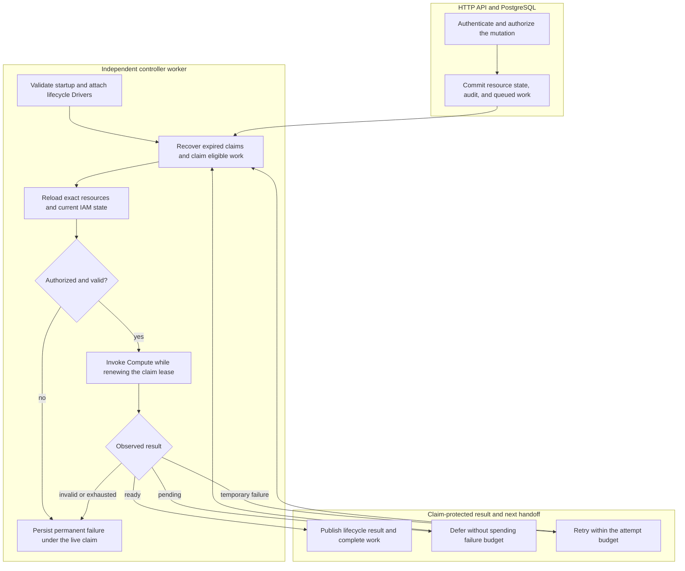

# Controller Worker Flow

## Overview

The worker claims PostgreSQL work committed by the HTTP API, rechecks the
original actor's authorization, invokes Compute, and persists results under its
live claim. This trace follows Namespace and AgentRevision work through
completion, deferral, retry, or permanent failure. The
[controller reference](../reference/controller.md) owns the contract and the
[deployment guide](../guides/deploy.md) owns process setup.

## Entry Points

- Trigger: Compose or Helm starts `apps/controller/src/worker.mjs`; an
  authenticated API mutation commits Namespace or AgentRevision work.
- Source: `apps/controller/src/worker.mjs:configuration`,
  `apps/controller/src/worker.ts:ControllerWorker.start`, and
  `packages/occ/src/state/postgres-state.ts:operations.append`.
- Assumptions: The database is initialized and contains the singleton
  Installation; the API and worker use the same application-role database and
  selected Driver identities. Production supplies trusted Installation YAML.
  Each work record carries its original actor and exact resource ownership.

## Flow

## Execution Trace

### 1. Initialize the independent worker process

`apps/controller/src/worker.mjs:configuration`,
`apps/controller/src/worker.ts:ControllerWorker.start`

The [entrypoint](../../apps/controller/src/worker.mjs) requires development or
production mode, a PostgreSQL URL, and positive worker timing values. It removes
an old readiness marker, loads trusted startup configuration, opens its own
application-role connection pool, and constructs `ControllerWorker`.
Development without `OCC_CONFIG_PATH` selects and preflights the Docker Compute
Driver. Production requires explicit startup configuration.

`start()` loads the already-bootstrapped Installation, validates persisted native
IAM state, and attaches selected Configuration, Sandbox, and IAM lifecycle hooks
to Compute. Shared startup composition supplies the optional Sandbox Driver to
the bundled Kubernetes Compute Driver. A selected hook requires Compute to
support `setLifecycleDrivers`; invalid or unavailable selected capabilities stop
startup. Production then runs Compute preflight before emitting `worker.started`
and starting `run()`.

The worker has no HTTP listener, session service, or provider-admin client;
Compose and Helm run it separately from the API.

### 2. Commit API admission and the durable work record

`apps/controller/src/index.ts:perform`,
`packages/occ/src/index.ts:OpenClawController`,
`packages/occ/src/state/postgres-state.ts:operations.append`

The API authenticates and authorizes the caller before invoking controller
operations such as `createNamespace`, `deleteNamespace`, or `deployAgent`.
`operations.append` verifies exact ownership and calls `PostgresWorkQueue.enqueue`
within the transaction. State, admission audit, and work commit or roll back together.

The queue freezes actor, Namespace owner, lifecycle target, and exact Agent and
immutable AgentRevision for revision work. Its idempotency
key identifies the operation. Reusing that key with a different actor, owner, or
target is rejected. The API returns accepted lifecycle state without waiting for
Compute; the next owner is the independent worker.

### 3. Recover expired claims and claim one eligible operation

`apps/controller/src/worker.ts:ControllerWorker.run`,
`packages/occ/src/state/postgres-work-queue.ts:PostgresWorkQueue.claim`

Each loop first calls `recoverStale()`, then `claim()`. The
[PostgreSQL queue](../../packages/occ/src/state/postgres-work-queue.ts) selects
eligible queued work with `FOR UPDATE SKIP LOCKED`, assigns a fresh claim token
and lease deadline, and increments the attempt count. Another live claim for
the same Agent, or the Namespace for Namespace work, prevents concurrent
ownership of that target.

An empty queue causes a bounded idle delay. After processing or while idle,
`health()` queries pending work, refreshes readiness through `onHealthy`, and emits
`worker.health`. Readiness requires a successful queue-health query.

### 4. Reload ownership and reauthorize before infrastructure effects

`apps/controller/src/worker.ts:ControllerWorker.process`,
`apps/controller/src/worker.ts:ControllerWorker.processRevision`,
`apps/controller/src/worker.ts:ControllerWorker.authorizeRevision`

Namespace work reloads its exact resource and expected `provisioning` or
`deleting` status. Work whose target has already changed completes as
`SUPERSEDED_TARGET`. Otherwise `authorize()` reloads IAM state and checks the
original actor. Provisioning also checks restrictions on the exact Namespace;
placement into an existing Kubernetes namespace requires Installation
administration permission again.

Revision work reloads its Namespace, Agent, admitted revision, and current active
revision. `processRevision()` rejects mismatched owners, an unready Namespace,
an invalid Agent Principal, a changed Harness descriptor, or a different Compute
Driver identity. `authorizeRevision()` checks current `deploy` permission and,
when a ServiceAccount snapshot is present, current `read` permission for that
exact ServiceAccount. Admission-time permission does not substitute for these
checks. The worker then resolves the revision's frozen Provider metadata and
rechecks any managed credential's exact Provider, Driver, workspace, and issued
account binding before Compute effects. It uses a read-only projection and has
no Provider client or admin key. The
[Provider-managed credential delivery flow](service-account-driver-credential-delivery.md) owns these checks.

Revoked actors and denied operations become permanent results before runtime
creation. A revision older than the current active revision completes as
superseded; an already-active revision enters finalization or maintenance rather
than changing the active pointer again.

### 5. Invoke Compute while renewing the live claim

`apps/controller/src/worker.ts:ControllerWorker.observe`,
`apps/controller/src/worker.ts:ControllerWorker.observeRevision`,
`apps/controller/src/worker.ts:ControllerWorker.withClaimHeartbeat`

Namespace dispatch calls `ensureNamespace` or `deleteNamespace`. Revision
dispatch optionally binds the exact Agent, then calls `prepareRevision` with its
immutable snapshot. The worker validates the returned observation's owner and
shape before treating it as ready. A pending observation defers convergence;
an invalid observation fails permanently.

`withClaimHeartbeat()` renews the claim before starting each effect and then
roughly every third of its lease duration while the effect runs. The initial
renewal also keeps a sequence of short effects alive when no individual effect
lasts long enough for its timer to fire. It propagates an abort signal into
Compute. A lost lease, failed
heartbeat, or worker shutdown aborts the operation context and raises
`WorkClaimLostError`. The stale worker cannot publish its result under an expired
or replaced token.

Compute owns infrastructure dispatch and delegation to Sandbox; the worker
cannot create sandbox resources independently. See the
[Kubernetes implementation](../../apps/controller/src/drivers/compute/kubernetes/index.ts)
and [Docker execution flow](docker-compose-development.md).

### 6. Persist the result and finish revision activation

`apps/controller/src/worker.ts:ControllerWorker.finalize`,
`apps/controller/src/worker.ts:ControllerWorker.finalizeRevision`,
`apps/controller/src/worker.ts:ControllerWorker.completeActivatedRevision`

Finalization uses `transactWithQueue()` and renews the exact claim inside the
transaction before publishing state. Namespace success transitions provisioning
to ready or records completed deletion, appends lifecycle evidence, and completes
the queue item atomically. A failed provisioning target can transition to failed;
incomplete deletion does not publish successful deletion.

Revision activation crosses a separate infrastructure boundary. Once preparation
is ready, a Driver selecting `activationOrder: beforeCommit` activates before
the database pointer changes. Otherwise an implemented activation stage runs in both development and
production after the claim-protected compare-and-set of `Agent.activeRevisionId`; the first dedicated
revision is staged inactive until that commit. A changed active pointer causes
`ACTIVE_REVISION_CHANGED` and retry instead of overwriting a concurrent result.

After the pointer commit, the worker finishes required activation and retires
the predecessor. `completeActivatedRevision()` then rechecks the exact active
revision and claim, appends activation evidence, and completes work in a second
transaction. This deliberately does not claim that infrastructure effects and
database state are one atomic transaction. Interrupted finalization is retried;
the already-active branch finishes activation and retirement safely.

### 7. Defer, retry, or stop and hand off the next iteration

`apps/controller/src/worker.ts:ControllerWorker.finalizeActiveRevision`,
`packages/occ/src/state/postgres-work-queue.ts:PostgresWorkQueue.defer`,
`packages/occ/src/state/postgres-work-queue.ts:PostgresWorkQueue.retry`

Pending convergence returns work to the queue with backoff and restores the
attempt consumed by the claim. Real dependency failures retain that attempt and
retry within the configured budget. Permanent failures, exhausted attempts, and
the convergence deadline produce terminal failure instead. See the
[controller reference](../reference/controller.md) for the supported outcomes
and the [settings reference](../reference/settings/operations.md#controller-worker-environment)
for their timing controls.

If Compute declares a maintenance interval, successful activation schedules
another exact-revision observation. An incomplete active-runtime maintenance
observation closes the current bounded item and schedules a new one so that a
provider outage does not abandon reconciliation of an authorized active runtime.
Each new claim reauthorizes its original actor.

`worker.completed` reports the target, outcome, and code; polling then continues.
Lease loss is reported as `worker.error` with `CLAIM_LOST` rather than publishing
stale lifecycle state. On `SIGTERM` or `SIGINT`, shutdown removes readiness,
aborts in-flight work, waits for the loop, closes PostgreSQL, and emits
`worker.stopped`. Expired unfinished claims are recoverable by a later worker.

## Debugging and Verification

- `worker.started` identifies the selected `computeDriverId` and optional
  `sandboxDriverId`. `worker.health` with `status: ready` reports a successful
  pending-work query. Neither event proves an Agent model turn.
- `worker.startup-error` precedes processing when the mode, database,
  Installation, Driver selection, or preflight is invalid. The worker has no
  HTTP health endpoint; packaged probes inspect the private readiness marker.
- When accepted operations stay queued, compare the API and worker database and
  Installation configuration, then inspect `worker.completed` outcomes and
  `worker.error`. `ACTOR_REVOKED` and `AUTHORIZATION_DENIED` require checking
  current IAM state; `DEPENDENCY_UNAVAILABLE` identifies retryable dispatch
  failure; `CLAIM_LOST` means the worker no longer owns publication.
- [Revision](../../tests/integration/postgres-worker-agent-revision.test.mjs) and
  [stale-claim](../../tests/integration/postgres-worker-stale-claim.test.mjs) tests
  require PostgreSQL; neither proves real model execution.
- [Sandbox startup](../../tests/integration/sandbox-driver-startup.test.mjs) tests
  verify composition; [k3d integration](../../tests/integration/sandbox-driver-openshell-k3d-real.test.mjs)
  verifies real infrastructure.

## Related docs

- [Provider-managed credential delivery](service-account-driver-credential-delivery.md)

- [Controller reference](../reference/controller.md)
- [Deployment guide: development and production](../guides/deploy.md)
- [Controller settings](../reference/settings.md)
- [IAM authorization](../reference/authorization.md)
- [Production startup flow](production-startup.md)
- [Docker Compose development flow](docker-compose-development.md)
- [Harness execution topology](harness-execution-topology.md)
- [Compute Driver contract](../reference/drivers/compute.md)
- [Sandbox Driver contract](../reference/drivers/sandbox.md)

## Manual Notes

[keep this for the user to add notes. do not change between edits]

## Changelog

- 2026-09-08 07:53: Include optional development activation and retry in the post-commit handoff. (01a07d92-d866-7731-afe5-abab67d8966c - 4d83087229961f3665b923d2581c0b71b988cc9c)

- 2026-09-01 19:09: Preserve providerless API-key execution and document Provider metadata checks before workload effects. (01a05d97-f2b0-71d0-bfc3-01ee7d6d58f9 - b079c4b755ef336a9c65bb4eb737e3aedbfdaa7d) (01a05f95-dd80-7011-990f-d1c46b5bb3cc - aa366c49c44834d59f74994c5fd37fb8096f169f)
- 2026-08-28 17:56: Converted the worker overview into a source-ordered execution trace covering startup, admission, lease ownership, current authorization, Compute and Sandbox delegation, activation, and retry. (01a036f4-cf1d-7cc1-bbc1-000879038ac8 - 4270aa29b7015562049f46c6027962fd85b584a9)
