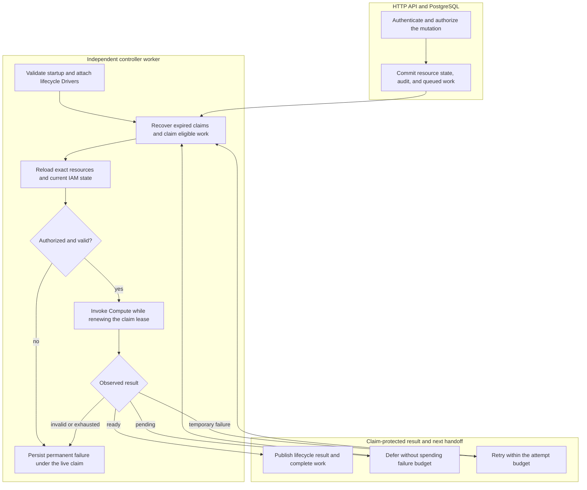

# Controller Worker Flow

## Overview

The worker claims API-admitted PostgreSQL work, rechecks authorization, invokes
Compute, and persists results under its live claim. This trace follows Namespace,
Agent stop/deletion, and AgentRevision work. The
[controller reference](../reference/controller.md) owns the contract and the
[deployment guide](../guides/deploy.md) owns process setup.

## Entry Points

- Trigger: Compose or Helm starts `apps/controller/src/worker.mjs`; an
  authenticated API mutation commits Namespace, Agent lifecycle, or AgentRevision work.
- Source: `apps/controller/src/worker.mjs:configuration`,
  `apps/controller/src/worker.ts:ControllerWorker.start`, and
  `packages/occ/src/state/postgres-state.ts:operations.append`.
- Assumptions: The database is initialized and contains the singleton
  Installation; the API and worker use the same application-role database and
  selected Driver identities. Production supplies trusted Installation YAML.
  Each work record carries its original actor and exact resource ownership.

## Flow

## Execution Trace

### 1. Initialize the independent worker process

`apps/controller/src/worker.mjs:configuration`,
`apps/controller/src/worker.ts:ControllerWorker.start`

The [entrypoint](../../apps/controller/src/worker.mjs) validates mode, PostgreSQL
URL and positive timing values, removes old readiness, loads trusted configuration,
and constructs `ControllerWorker` with its own application-role pool.
Development without `OCC_CONFIG_PATH` selects and preflights the Docker Compute
Driver. Production requires explicit startup configuration.

`start()` loads the already-bootstrapped Installation, validates persisted native
IAM state, and attaches selected Configuration, Sandbox, and IAM lifecycle hooks
to Compute. Shared startup composition supplies the optional Sandbox Driver to
the bundled Kubernetes Compute Driver. A selected hook requires Compute to
support `setLifecycleDrivers`; invalid or unavailable selected capabilities stop
startup. Production then runs Compute preflight before emitting `worker.started`
and starting `run()`.

The worker has no resource API. Its private metrics listener uses one read-only
connection; concurrent scrapes share
`packages/occ/src/state/postgres-metrics.ts:PostgresMetricsSnapshot.collect`
for persisted lifecycle, backlog depth and oldest age, distinguishing stopped
from draft Agents without runtime probes. Pass metrics follow finalization
independently of logging; see the [metrics contract](../reference/metrics.md).

### 2. Commit API admission and the durable work record

`apps/controller/src/index.ts:perform`,
`packages/occ/src/index.ts:OpenClawController`,
`packages/occ/src/state/postgres-state.ts:operations.append`

After caller authentication and authorization, controller operations call
`operations.append`, which verifies exact ownership and invokes
`PostgresWorkQueue.enqueue`. State, admission audit and work commit or roll back
together.

The queue freezes actor, Namespace owner, lifecycle target, and exact Agent and
immutable AgentRevision for revision work. Agent lifecycle work identifies its
Agent and `stopped` or `deleted` target without a revision. Reusing an idempotency
key with a different actor, owner, or target is rejected. The API returns accepted
state without waiting for Compute; the worker takes over.

### 3. Recover expired claims and claim one eligible operation

`apps/controller/src/worker.ts:ControllerWorker.run`,
`packages/occ/src/state/postgres-work-queue.ts:PostgresWorkQueue.claim`

Each loop first calls `recoverStale()`, then `claim()`. The
[PostgreSQL queue](../../packages/occ/src/state/postgres-work-queue.ts) selects
eligible queued work with `FOR UPDATE SKIP LOCKED`, assigns a fresh claim token
and lease deadline, and increments the attempt count. Another live claim for
the same Agent, or the Namespace for Namespace work, prevents concurrent
ownership of that target.

An empty queue causes a bounded idle delay. After processing or while idle,
`health()` queries pending work, calls `onHealthy`, and emits `worker.health`.
Readiness requires both query and callback success. Health updates are serialized;
failures emit `HEALTH_UNAVAILABLE` without consuming work retries.

### 4. Reload ownership and reauthorize before infrastructure effects

`apps/controller/src/worker.ts:ControllerWorker.process`,
`apps/controller/src/worker.ts:ControllerWorker.processRevision`,
`apps/controller/src/worker.ts:ControllerWorker.authorizeRevision`

Namespace work reloads its exact resource and expected `provisioning` or
`deleting` status. Work whose target has already changed completes as
`SUPERSEDED_TARGET`. Otherwise `authorize()` reloads IAM state and checks the
original actor. Provisioning also checks restrictions on the exact Namespace;
placement into an existing Kubernetes namespace requires Installation
administration permission again.

Revision work reloads its Namespace, Agent, admitted revision, and current active
revision. `processRevision()` rejects mismatched owners, an unready Namespace,
an invalid Agent Principal, a changed Harness descriptor, or a different Compute
Driver identity. `authorizeRevision()` checks current `deploy` permission and,
when a ServiceAccount snapshot is present, current `read` permission for that
exact ServiceAccount. Admission-time permission does not substitute for these
checks. The worker then resolves the revision's frozen Backend metadata and
rechecks any managed credential's exact Backend, Driver, workspace, and issued
account binding before Compute effects. It uses a read-only projection and has
no Backend client or admin key. The
[Backend-managed credential delivery flow](service-account-driver-credential-delivery.md) owns these checks.

Revocation and denial fail permanently before runtime creation. Older revisions
complete as superseded; already-active revisions enter finalization or maintenance.
A newer admitted revision for which Compute requires stopped predecessors also
supersedes older active maintenance before any Compute effects. This remains
true after candidate failure; recovery uses a new revision.

Agent-stop work rechecks current exact-Agent `operate`. Superseded desired state
completes without shutdown. An absent active pointer does not prove candidates
have no runtime resources, so stop still checks the captured revision history.

Agent-deletion work requires the Agent to remain `deleting` and stopped, then
rechecks the original actor's exact-Agent `delete`. It loads every owned revision
and rejects ownership or Compute-Driver mismatches before teardown.

### 5. Invoke Compute while renewing the live claim

`apps/controller/src/worker.ts:ControllerWorker.observe`,
`apps/controller/src/worker.ts:ControllerWorker.observeRevision`,
`apps/controller/src/worker.ts:ControllerWorker.withClaimHeartbeat`

Namespace dispatch calls `ensureNamespace` or `deleteNamespace`. Revision
dispatch optionally binds the exact Agent, then calls `prepareRevision` with its
immutable snapshot. The worker validates the returned observation's owner and
shape before treating it as ready. A pending observation defers convergence;
an invalid observation fails permanently.

`apps/controller/src/worker.ts:ControllerWorker.prepareRevision` checks Compute's
`requiresStoppedPredecessors` capability. When selected, it loads all earlier
snapshots, closes their credential sessions, and calls `stopRevision` under the
claim heartbeat before preparing the candidate. This includes failed candidates;
a release failure prevents new preparation. The per-Agent queue serializes these
operations, and the earlier dispatch guard prevents maintenance from recreating
a predecessor between readiness observations. Durable storage remains Driver-owned.
This replacement path accepts downtime and recovers through a new higher revision.

The worker validates Compute's startup plugin warning codes and selection keys
against the immutable revision. Warnings permit deployment only after Compute
verifies failed selections are disabled; missing or malformed startup evidence
cannot establish success.

Agent-stop dispatch captures the Agent's revisions owned by the current Compute
and validates their exact owner. It calls `stopRevision` for the active revision
first, then the remaining captured revisions, including terminal candidates and
predecessors whose retirement failed. Historical revisions pinned to another
Compute are excluded; an active revision pinned elsewhere still fails closed.
Before each shutdown, the worker rechecks the Agent owner and stopped desired
state. Later admissions are not added to this cleanup set. Partial failure retries
the idempotent shutdowns without clearing the active pointer or deleting retained
workspace data.

Before shutdown, the worker binds the server-owned Namespace and Agent. Stopped
revision recovery also binds before shutdown and retirement. IAM and exact
resource checks precede binding.
Revision preparation and maintenance recheck `desiredRuntimeState`; a candidate
that overlaps stop is shut down instead of activated.

Agent-deletion dispatch binds the server-owned Namespace and Agent before calling
`retireRevision` for every owned revision, then invokes the optional Agent
credential-deletion capability. This rebuilds Driver-local ownership after a
worker restart. A Driver that can provision runtime credentials but cannot delete
them fails permanently before binding or retirement. Compute retirement owns
workload termination and Sandbox cleanup; the worker does not invoke either
independently.

`withClaimHeartbeat()` renews before each effect and every third of the lease
duration, protecting sequences of short effects too. Lease loss, heartbeat failure,
or shutdown aborts Compute and raises `WorkClaimLostError`. Expired or replaced
claim tokens cannot publish results.

Successful renewals request throttled health updates without delaying effects
or renewal. Health failure does not imply lease loss; heartbeat failure aborts
Compute.

Compute owns infrastructure and Sandbox dispatch. See the
[Kubernetes implementation](../../apps/controller/src/drivers/compute/kubernetes/index.ts)
and [Docker execution flow](docker-compose-development.md).

### 6. Persist the result and finish revision activation

`apps/controller/src/worker.ts:ControllerWorker.finalize`,
`apps/controller/src/worker.ts:ControllerWorker.finalizeRevision`,
`apps/controller/src/worker.ts:ControllerWorker.completeActivatedRevision`

`transactWithQueue()` renews the exact claim before atomically publishing
Namespace readiness or completed deletion, lifecycle evidence and queue completion.
Failed provisioning can transition to failed; incomplete deletion cannot publish
successful deletion.

After preparation, `activationOrder: beforeCommit` activates before the database
pointer changes. Otherwise, an implemented activation stage runs in development
and production after the claim-protected compare-and-set of `Agent.activeRevisionId`;
the first dedicated revision stays inactive until commit. A changed pointer causes
`ACTIVE_REVISION_CHANGED` and retry.

After the pointer commit, the worker finishes required activation and retires
the predecessor. `completeActivatedRevision()` then rechecks the exact active
revision and claim, appends activation evidence, and completes work in a second
transaction. Infrastructure effects and database state are not atomic. Retried
finalization rechecks the already-active candidate before activation and
retirement, so a retained plugin failure cannot become success after claim loss.

Stop finalization rechecks the live claim, Agent owner, and stopped desired state.
After all captured cleanup succeeds, it clears `activeRevisionId` only when
it still equals the revision Compute stopped. A later deployment supersedes the
stop even if it retains that active pointer while preparing. It appends lifecycle-stop
evidence and completes the same work item. Revision rows and persistent runtime
state are not deleted.

After commit, `completeActivatedRevision()` and `finalizeAgentStop()` record
admission-to-completion duration through `apps/controller/src/metrics/index.ts:createOccMetrics`.
Queue waits and retries count; maintenance and superseded work do not.
Process death before observation can lose a sample.

Deletion finalization uses a restricted database function rather than the
generic queue completion path. In one transaction it validates the live claim,
removes the Agent's revisions, service principal, API keys, and exact IAM
references, records lifecycle-delete success, deletes the Agent, and removes its
work rows. An expired or replaced claim removes nothing; `occ_app` has no direct
table-level delete privilege for these records.
`finalizeAgentDeletion()` records committed `agent_delete` outcomes. Snapshots
count deleting Agents as `stopping`, permanent cleanup failures as `failed`,
and remove completed deletions from inventory.

### 7. Defer, retry, or stop and hand off the next iteration

`apps/controller/src/worker.ts:ControllerWorker.finalizeActiveRevision`,
`packages/occ/src/state/postgres-work-queue.ts:PostgresWorkQueue.defer`,
`packages/occ/src/state/postgres-work-queue.ts:PostgresWorkQueue.retry`

Pending convergence requeues work with backoff and restores the consumed attempt.
Dependency failures consume attempts within the retry budget. Permanent failures,
exhausted attempts, and the convergence deadline terminate work. See the
[controller reference](../reference/controller.md) for the supported outcomes
and the [settings reference](../reference/settings/operations.md#controller-worker-environment)
for their timing controls.

Terminal work rows store the overall `reason_code` and one optional `result_data`
object for success or failure details. Successful revision work stores
`{ warnings: [...] }`; a convergence deadline failure stores required
`timeoutMs` and optional `runtimeFailure` from the exact candidate runtime.
Compute observes cached startup results through its private status path,
including unready Harnesses without plugins, and verifies the Pod/container
incarnation after collection. It does not repeat the model probe. Missing or
invalidated evidence leaves the cause unspecified.

`packages/occ/src/state/controller-work.ts:validateFailureData` validates reads
and writes; the PostgreSQL constraint enforces the matching persisted shape.
Other failure reasons still reject data.
`PostgresWorkQueue.complete` and `PostgresWorkQueue.fail` publish only under the
live claim; deployment status derives `error` and `warnings` from that result.
Completion needs no runtime receipt acknowledgment or post-commit cleanup.
Maintenance cannot rewrite the completed deployment's historical startup warnings.

Deployment GET requires exact revision `read` access and reads only durable
state, surviving Pod deletion and controller restart. Queued, running, and
successful deployments have no failure error. See [deployment status](../reference/agents.md#deployment-status).

Legacy terminal rows derive `reason_code` from audit evidence: `REVISION_ACTIVATED`
requires matching activation evidence between creation and completion. Otherwise,
backfill uses the terminal `reconcile` reason matching resource, actor, attempt,
outcome and completion window, or `LEGACY_OUTCOME_UNKNOWN` without evidence.
Historical `result_data` stays `NULL` because structured timeout/warning data was
not stored; pending rows retain no terminal outcome.

If Compute declares a maintenance interval, successful activation schedules
another exact-revision observation. An incomplete active-runtime observation or
Compute binding closes the bounded item and schedules another so that a provider
outage does not abandon reconciliation of an authorized active runtime.
Each new claim reauthorizes its original actor. The next maintenance key uses a
strictly later time bucket than the current claim, preventing clock skew from
colliding with completed work and silently dropping its successor.

`worker.completed` reports the target, outcome, and code; polling then continues.
Lease loss is reported as `worker.error` with `CLAIM_LOST` rather than publishing
stale lifecycle state. On `SIGTERM` or `SIGINT`, shutdown removes readiness,
aborts in-flight work, waits for the loop, closes PostgreSQL, and emits
`worker.stopped`. Later workers recover expired claims.
Each `PostgresWorkQueue.recoverStale()` statement atomically publishes exhausted
work, failure of a still-provisioning Namespace targeted for `ready`, and audit
evidence. This covers expired claims and exhausted queued work, preventing
final-attempt crashes from stranding provisioning.

## Debugging and Verification

- `worker.started` identifies the selected `computeDriverId` and optional
  `sandboxDriverId`. `worker.health` with `status: ready` reports a successful
  pending-work query. Neither event proves an Agent model turn.
- `worker.startup-error` precedes processing when the mode, database,
  Installation, Driver selection, or preflight is invalid. The worker has no
  HTTP health endpoint; packaged probes inspect the private readiness marker.
- When accepted operations stay queued, compare the API and worker database and
  Installation configuration, then inspect `worker.completed` outcomes and
  `worker.error`. `ACTOR_REVOKED` and `AUTHORIZATION_DENIED` require checking
  current IAM state; `DEPENDENCY_UNAVAILABLE` identifies retryable dispatch
  failure; `CLAIM_LOST` means the worker no longer owns publication.
- [Revision](../../tests/integration/postgres-worker-agent-revision.test.mjs) and
  [stale-claim](../../tests/integration/postgres-worker-stale-claim.test.mjs) tests
  require PostgreSQL; neither proves real model execution.
- [Sandbox startup](../../tests/integration/sandbox-driver-startup.test.mjs) tests
  verify composition; [k3d integration](../../tests/integration/sandbox-driver-openshell-k3d-real.test.mjs)
  verifies real infrastructure.

## Related docs

- [Agent repository session preparation and durable cleanup](agent-repository-credentials.md)
- [Backend-managed credential delivery](service-account-driver-credential-delivery.md)

- [Controller reference](../reference/controller.md)
- [Deployment guide: development and production](../guides/deploy.md)
- [Controller settings](../reference/settings.md)
- [IAM authorization](../reference/authorization.md)
- [Production startup flow](production-startup.md)
- [Docker Compose development flow](docker-compose-development.md)
- [Harness execution topology](harness-execution-topology.md)
- [Compute Driver contract](../reference/drivers/compute.md)
- [Sandbox Driver contract](../reference/drivers/sandbox.md)

## Manual Notes

[keep this for the user to add notes. do not change between edits]

## Changelog

- 2026-09-24 11:28: Document exclusive dedicated preparation and durable RWO workspaces in the accompanying change. (01a0cf72-6985-7712-ba92-d8cc32470f24 - 14a4508baad876d3eea4e6fe6388f8d8a91559b7)

- 2026-09-21 07:24: Tighten the baseline execution trace while preserving lifecycle boundaries and historical notes. (authoring-run/7fb656ee-ae7a-45a8-a160-6d73bc5ae25b - d2b31887be1d114c9147e2ed6f07c1f38e765c6f)

- 2026-09-21 05:32: Reconcile accompanying platform credential documentation with current source history and native Git boundaries. (authoring-run/fba2d7fa-6603-465e-a7c8-df0375ad202d - a051a2406eec7cafde2e0dd5e2ec63dba6ce1581)

- 2026-09-21 00:56: Integrate Agent-deletion metrics. (01a0af6f-d097-7ef0-a2b7-c8ce31703bd9 - 1de0877d28f7c77e6ef4aab97531ad7d56b583d0)

- 2026-09-20 17:23: Document cached startup failure persistence. (codex/01a0bce5-9f29-7110-85fd-6b140674d362 - 1ff76eb2)

- 2026-09-20 10:50: Documented legacy terminal work outcome backfill during migration 0019, including unknown result data and fallback behavior. (authoring-run/a2f901df-d27a-4a05-9468-e1ee895ae89d - 08b1b8fe)

- 2026-09-18 17:17: Generalized terminal details to result_data for success warnings and failure metadata, retaining live-claim fencing and the deployment API projection. (codex/01a0b0fc-4a24-76c0-8fb7-f3a3a434d464 - 6a582ce9)

- 2026-09-17 21:20: Keep maintenance successor buckets monotonic when database and worker clocks differ. (codex/01a0b0fc-4a24-76c0-8fb7-f3a3a434d464 - 7f968f39)

- 2026-09-17 20:28: Replaced terminal plugin receipts with verified optional-plugin exclusion, current startup status, and successful deployment warnings; runtime verification in progress. (codex/01a0b0fc-4a24-76c0-8fb7-f3a3a434d464 - 7771526d)
- 2026-09-17 20:28: Removed the first-failure receipt and acknowledgment lifecycle under the approved best-effort plugin decision. (NOT_IN_SPEC)

- 2026-09-18 03:04: Link the accompanying repository-session preparation, maintenance and cleanup flow. (authoring-run/7e9ee7cd-e36a-4de7-8f67-29f3b03bd94d - 8500b2da103063b4503b62e5529f3910513e84a9)

- 2026-09-17 12:09: Separate health reporting from claim renewal, preserve lease-loss fencing, and restore admitted Agent bindings before stop effects. (01a03526-12b3-7f50-b599-e8414052909d - 683d0e253ad827af7c6098650097fa6a8ad61f57)

- 2026-09-17 07:34: Add lifecycle snapshots, oldest pending age, and post-commit operation timing alongside the accompanying implementation. (authoring-run/7f165131-ca19-465b-a7a6-7138c2065f72 - d4dc39fc8c7f86917387a738fc1d3892c98a46bd)

- 2026-09-17 01:22: Include failed candidates and interrupted retirement in exact Agent-stop cleanup, preserving later deployments and retained state. (01a0acbf-4d5a-7413-9411-dce911f3ad23 - 73c2ef49)

- 2026-09-08 07:53: Include optional development activation and retry in the post-commit handoff. (01a07d92-d866-7731-afe5-abab67d8966c - 4d83087229961f3665b923d2581c0b71b988cc9c)

- 2026-09-01 19:09: Preserve providerless API-key execution and document Provider metadata checks before workload effects. (01a05d97-f2b0-71d0-bfc3-01ee7d6d58f9 - b079c4b755ef336a9c65bb4eb737e3aedbfdaa7d) (01a05f95-dd80-7011-990f-d1c46b5bb3cc - aa366c49c44834d59f74994c5fd37fb8096f169f)
- 2026-08-28 17:56: Converted the worker overview into a source-ordered execution trace covering startup, admission, lease ownership, current authorization, Compute and Sandbox delegation, activation, and retry. (01a036f4-cf1d-7cc1-bbc1-000879038ac8 - 4270aa29b7015562049f46c6027962fd85b584a9)
