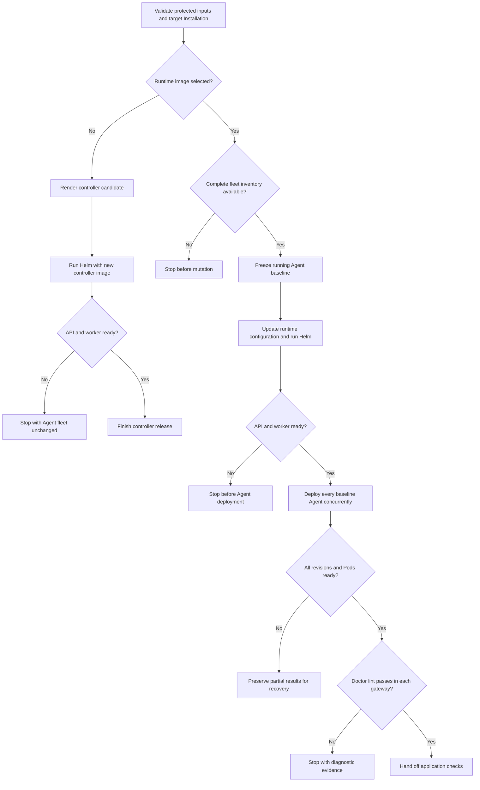

# Production image upgrade flow

## Overview

`scripts/upgrade-production-images` updates the OpenClaw Control Plane (OCC),
Agent runtimes, or both. A controller-only release ends after the OCC API and
worker recover; it does not request Agent deployments. A runtime release deploys
a new revision for every Agent that was running when the command began and ends
after the selected Pods are ready and each replacement gateway passes read-only
Doctor lint. Model and external integration checks remain operator tasks.

## Entry Points

- Trigger: an operator runs `scripts/upgrade-production-images` with one or both
  image options and explicit cluster, release, source, and protected-file inputs.
- Required state: a healthy production Helm release and matching OCC and
  Kubernetes Installation identity. Runtime releases additionally require a
  complete authorized fleet inventory with no deployment in progress.
- Source: `scripts/upgrade-production-images`,
  `packages/occ/src/index.ts:OpenClawController.getInstallationDeploymentInventory`,
  and `packages/occ/src/index.ts:OpenClawController.deployAgent`.

## Flow

## Execution Trace

For repository-enabled releases, `scripts/upgrade-production-images` reads the
worker's broker origin after checking protected/live values and Installation
identity. It validates the origin against the release namespace, Service name,
and cluster domain, then writes the exact hostname and Service name into the
candidate values. Explicit conflicting settings stop the upgrade.
`deploy/helm/openclaw-enterprise/templates/_helpers.tpl` restricts that hostname
to the selected Service's namespace-qualified or cluster-qualified DNS name.
The sidecar uses it for certificate validation and new repository sessions.
See the [repository installation guide](../guides/repository-credentials/installation.md).

### 1. Validate the target and selected ownership

`scripts/upgrade-production-images:110`

The script requires private protected files, at least one immutable image, a full
source SHA, and a new evidence directory. It compares the authenticated OCC
Installation ID with the marker on the live Installation Secret.

Protected configuration must match live state outside fields owned by the
selected operation. A controller release may differ only at
`images.controller`. A runtime release may differ only at the gateway and Agent
image fields. This prevents one release path from silently adopting unrelated
configuration drift.

### 2. Build and validate the candidate

`scripts/upgrade-production-images:241`

The script copies the protected inputs and changes only selected image fields.
A runtime release hashes the candidate Installation document and puts that
checksum on both OCC Pod templates so the API and worker reload configuration
without changing their selected controller image.

`helm template` and Helm server-side dry run validate the chart against the
selected cluster. They do not prove image contents, startup, compatibility, or
application behavior.

### 3. Release the control plane independently

`deploy/helm/openclaw-enterprise/templates/deployments.yaml:159`

When only `--controller-image` is present, the script updates the protected Helm
values and runs Helm without replacing the Installation Secret. Helm runs the
candidate controller's database migrator as a pre-upgrade init container using
the migration role. Bootstrap runs only after migration succeeds, and the API
and worker roll out only after both hooks succeed.

The script verifies both OCC Deployments and authenticated OCC recovery. It does
not request deployment inventory or invoke `occ agent deploy`. Existing gateway
Pods continue using their current revisions and runtime images.

### 4. Freeze the fleet for a runtime release

`packages/occ/src/index.ts:OpenClawController.getInstallationDeploymentInventory`

Runtime releases require Installation `administer`, exact `read` access to every
Namespace, Agent, and selected active revision, and exact `deploy` access to each
eligible running Agent. Any denial or incomplete durable work data fails the
complete inventory.

The baseline includes active Agents that request `running`, have an active
revision, and belong to a ready Namespace. Nonterminal deployment work, a
running Agent without a revision, or a running Agent in an unready Namespace
stops the command. Stopped and deleting Agents are excluded. An empty baseline
is valid.

### 5. Load runtime configuration without changing controller version

`scripts/upgrade-production-images:271`

The script writes the runtime digest to both Kubernetes Compute image fields,
updates the protected Installation and its Secret, and runs Helm. The current
controller image remains selected unless the operator also supplied
`--controller-image`. The checksum causes new API and worker Pods to load the
runtime configuration.

The script waits for both OCC Deployments, verifies the selected controller
image, and retries authenticated OCC access. A failure stops before Agent
fan-out.

### 6. Deploy the recorded fleet

`internal/occcli/cli.go:application.agentCommand`

The script starts one ordinary `occ agent deploy` process for each baseline
Agent before waiting for any process. Each request repeats exact-resource IAM,
creates an immutable revision from the current draft, records durable work, and
emits the normal deployment audit event.

A failed or unknown response is never converted into bulk success or
automatically replayed.

### 7. Wait for durable and runtime readiness

`internal/occclient/client.go:Client.GetAgentDeployment`

The script polls every returned revision until all succeed, one fails, or the
shared deadline expires. It confirms that each Agent selected its returned
revision and that revision-labeled Pods are `Running` and `Ready`. Gateway and
Agent containers must use the candidate runtime digest. Embedded execution
requires one gateway workload; dedicated execution requires both gateway and
Agent workloads.

The evidence directory retains dispatch responses, durable status, Pod state,
Helm status, and before/after workload inventories.

### 8. Run OpenClaw Doctor lint

`scripts/upgrade-production-images:422`

OpenClaw gateway startup performs startup-safe migrations and plugin convergence
before Kubernetes readiness. Because this workflow replaces immutable images
instead of invoking `openclaw update`, the script separately runs
`openclaw doctor --lint --json --severity-min error` inside the gateway container
for each replacement revision.

The command uses the gateway's mounted state and configuration but does not pass
`--fix`. Any error-level finding or command failure stops the release and leaves
the JSON and stderr output in the private `status/` evidence directory.

### 9. Hand off application verification

`docs/guides/deploy/production-upgrade.md:Verify the release`

Controller success proves Helm convergence, image selection, and authenticated
OCC recovery. Runtime success additionally proves durable deployment completion,
active revision selection, Pod readiness, and error-free read-only Doctor lint.
The operator next checks model responses, providers, channels, credential
delivery, workspace continuity, native access, and required restore behavior.

## Debugging and Verification

- Inspect `server-dry-run.txt` for chart or admission failures before mutation.
- For OCC rollout failures, inspect `helm-upgrade.txt`, initialization Job logs,
  and API and worker rollout status.
- For runtime failures, inspect `dispatch/*.error`, revision history, and
  `status/*.json` before retrying anything. Doctor failures are recorded in
  `status/*.doctor.json` and `status/*.doctor.error`.
- Compare `before-workloads.json` and `after-workloads.json` for unexpected
  workload changes. Controller-only proof should retain Agent revision IDs;
  runtime proof should show the intended replacements.
- Use the credentialed production Kubernetes integration with distinct baseline
  and candidate images for end-to-end proof. Mocked commands prove only script
  control flow.

## Related docs

- [Production upgrade guide](../guides/deploy/production-upgrade.md)
- [Production installation](../guides/deploy/production-installation.md)
- [Production Agent verification](../guides/deploy/production-agents.md)
- [Agent deployment reference](../reference/agents/deployment.md)
- [Production startup flow](production-startup.md)
- [Controller worker flow](controller-worker.md)
- [Authoritative platform design](../design.md)

## Manual Notes

[keep this for the user to add notes. do not change between edits]

## Changelog

- 2026-09-26 22:28: Preserve the selected repository broker hostname before image upgrades. (authoring-run/1495f489-e298-44e9-b75d-6a49445d35e3 - 7caf53332219db12fed62180c3c6d270baa8ea63)

- 2026-09-25 13:40: Document Helm migration ordering and add post-readiness OpenClaw Doctor lint for replacement gateways. (authoring-run/d35fd05b-5bbd-4f21-a747-820c2df23b2c - 077e26ba0c0babe033569105e3a7e89abf06f40d)
- 2026-09-25 12:29: Split controller and runtime releases while retaining an optional combined path. (authoring-run/ab700e2e-1baf-400c-ab18-0aa9a351f351 - 5e747ac1722f757d7949746e9ff9982142c8536b)
- 2026-09-24 21:21: Separate operator instructions from the runtime trace; require revision-read admission, HTTPS, bounded Kubernetes reads, and the complete execution-mode workload set. (authoring-run/613d1e94-a661-4781-bae5-e28613aa3cf9 - c799988036f43ce1bb828373233f03cc77bb0ea9)
- 2026-09-24: Record cluster/OCC identity binding, live/protected input equivalence, the supported empty-fleet path, and runtime Pod readiness discovered by the production rehearsal.
- 2026-09-24 13:43: Trace fail-closed inventory admission, nonterminal deployment rejection, and the one-time controller-only bootstrap for older OCC versions. (authoring-run/0fc7c19b-0e15-498c-8328-e436bc702f37 - a7a609d5867398dd0dfd3bb77cfebf91b2cad116)
- 2026-09-23 12:32: Trace matched image replacement and concurrent exact-Agent deployment through durable status convergence. (authoring-run/d29bdbc5-2a6a-46fa-a8e5-6ad78ea2e486 - 78cf9fd25f08e91158617fbd0ae3e42a22e54361)
