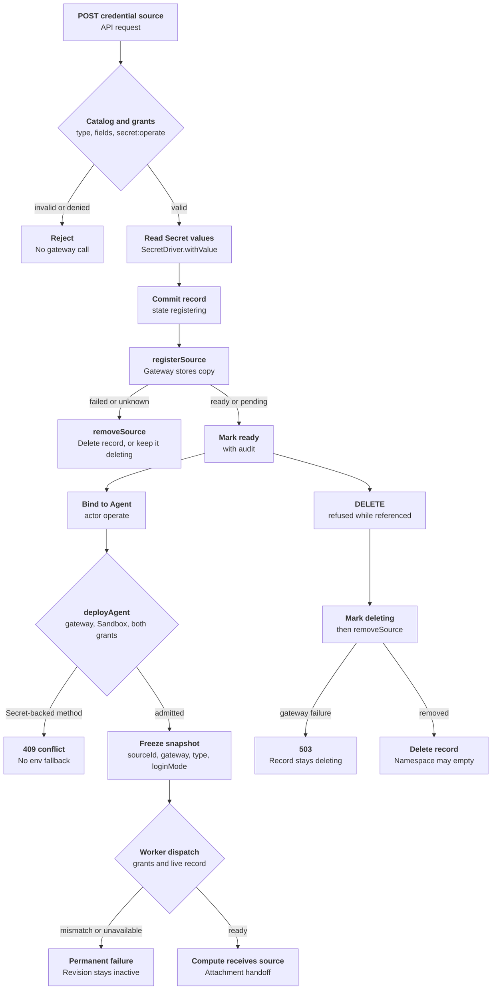

# Credential source lifecycle Flow

## Overview

An authorized caller registers a Namespace Secret with the Credential Gateway,
binds it to an Agent, deploys, updates or withdraws it, and deletes the source.
The gateway holds Secret values; OCC stores metadata and references. Admission
freezes identity in the AgentRevision; the worker passes the live record to Compute.
[OpenShell Sandbox provisioning](openshell-sandbox-provisioning.md) covers attachment and readiness.

## Entry Points

- Trigger: `POST`, `PATCH`, or `DELETE /namespaces/:namespaceId/credential-sources[/:credentialSourceId]`,
  Agent create or PATCH and `POST …/agents/:agentId/deploy`, and
  `POST …/agents/:agentId/credential-sources/:credentialSourceId/withdraw`.
- Source: `apps/controller/src/http/credential-sources.ts:createCredentialSource`
- Source: `packages/occ/src/index.ts:createCredentialSource`
- Source: `packages/occ/src/index.ts:deleteCredentialSource`
- Assumptions: the Installation selected a Credential Gateway that belongs to an
  `openshell` Backend, a Sandbox, and bundled Kubernetes Compute; the Namespace
  is `ready`; the caller holds the grants named in each phase.

## Flow

## Execution Trace

Registration and deletion reject an active or stale inherited transaction from the same controller
instance with `ResourceConflictError` before effects. OCC commits the
intermediate State record before calling `registerSource` or `removeSource`.

### 1. Admit the registration request

`apps/controller/src/http/credential-sources.ts:createCredentialSource`,
`packages/occ/src/index.ts:createCredentialSource`

The route accepts `name`, `type`, optional `config`, and lowercase `secrets`
fields. In one transaction, OCC locks the Namespace, authorizes
`credential_source:create`, returns
`409 CREDENTIAL_GATEWAY_NOT_CONFIGURED` when the Installation selects no
Credential Gateway, and requires a `ready` Namespace. It asks the selected gateway for `listSourceTypes`. Before any Secret
read or gateway write, it rejects a type the catalog lacks with
`CredentialSourceTypeNotOfferedError` (`409`), and an unknown or missing field
with `ScopeViolationError` (`404`).
It then calls the Driver's side-effect-free
`validateSourceConfig`. Invalid values return `CredentialSourceConfigError`
(`400 INVALID_REQUEST`) before any Secret read, record creation, or gateway write.
The shared `apps/controller/src/drivers/openai-endpoint.ts:normalizeOpenAiBaseUrl`
parses URLs before rejecting wildcard hostnames (including decoded percent
escapes), wildcard paths, and port `0`. OpenShell additionally uses
`apps/controller/src/drivers/credential-gateway/openshell.ts:normalizedSourceBaseUrl`
to reject bracketed IPv6 hosts: its profile matcher interprets brackets as
character classes, not literal URI syntax. Compute URL validation still accepts
IPv6. Registration and attachment require the OpenShell-safe representation;
status and deletion retain the no-guessed-owner behavior for invalid stored sources.

### 2. Read Secret values

`packages/occ/src/index.ts:createCredentialSource`

OCC first rejects any Secret reference to another Namespace with
`SecretBindingValidationError` (`400 INVALID_REQUEST`, "Credential source
Secrets cannot cross Namespaces."). For each Secret reference, it then authorizes
`secret:operate`, locks the Secret (a Secret the Namespace does not hold is
`404`), and calls the owning Driver's optional
`withValue`. The Kubernetes Secret Driver verifies the stored object's ownership
labels, UID, and key before decoding it. A Driver without `withValue` returns `503`. Values remain in memory for the gateway call.

### 3. Register with the gateway and commit

`packages/occ/src/index.ts:createCredentialSource`,
`packages/occ/src/index.ts:abandonCredentialRegistration`,
`apps/controller/src/drivers/credential-gateway/openshell.ts:registerSource`

The transaction inserts a `registering` `credential_sources` row with a new
`cs_` ID and gateway Driver ID, plus `credential_source_secrets` rows. The
OpenShell provider name derives from that ID. Compute's `resolveSandboxNamespace`
supplies the paired Sandbox's runtime placement. OCC calls `registerSource` with
a 30-second timeout; the Driver ensures the Workspace profile and creates an
OCC-labeled provider with that `profile_workspace`. Retries adopt only matching labels.

For terminal `failed` or `absent` results, `abandonCredentialRegistration`
removes the provider and record, retaining a `deleting` record if removal fails.
Thrown calls always retain `deleting` after cleanup: a timed-out create may still
land, requiring another DELETE. Success commits `ready` and the mutation audit
together. A failed commit or process exit leaves `registering`, ineligible for
binding or admission but deletable. If concurrent DELETE already removed the
record, OCC repeats remote removal and returns `409`.

### 4. Bind the source to an Agent

`packages/occ/src/index.ts:authorizeHarnessAuthSource`

PATCH first authorizes `credential_source:operate` on each already-bound
source, without a lookup (`authorizeBoundCredentialSources`), so an
update can drop sources after a gateway change. Create and PATCH then authorize
`operate` on each requested source; before any lookup, an Installation without
a Credential Gateway fails with `CredentialGatewayNotConfiguredError` (`409`),
so source existence never changes the answer. The source must be
`ready` in the exact Namespace and owned by the selected gateway. The generated
`agents.harness_auth_credential_source_id` column references the source, so the
database rejects deleting a source an Agent draft still uses.

Every entry of `credentialSources` follows the same checks
(`packages/occ/src/index.ts:authorizeAgentCredentialSources`), which also
requires a credential-source `harnessAuth` to name a listed entry
(`assertHarnessSourceListed`, `AgentCredentialSourceBindingError`, `400`). That
rule runs after every source check, so a caller without `operate` gets `403`
first. The list is stored in
`agents.credential_sources`; the constraint
`agents_harness_credential_source_listed` enforces the same rule, and the trigger
`agent_credential_sources_are_synchronized` mirrors the list into
`agent_credential_sources`, whose foreign key restricts source deletion.

### 5. Admit the deployment

`packages/occ/src/index.ts:deployAgent`, `packages/occ/src/index.ts:admitHarnessAuth`

`assertCredentialGatewayDelivery` rejects `api_key` and both sources of
`codex_pat` with `409` while a gateway is selected. For
`credential_source`, `admitHarnessAuth` authorizes the Agent service principal's
`operate`, requires a `ready` source, and reads its catalog type, which must
declare `harnessAuth`. The frozen snapshot is `{ method, sourceId,
credentialGatewayId, sourceType, loginMode }`. `admittedCredentialSourceType`
requires a selected Sandbox, and Compute `validateHarnessAuth` requires
a dedicated Codex or native OpenClaw Harness, the paired Sandbox and gateway,
and an `openai`/`api_key` type. Compute renders no model Secret for either
Harness and passes the resolved source to Sandbox provisioning.
`admitCredentialSources` refuses a list without a selected Sandbox Driver
(`409` with its message), rechecks the caller's binding grants, then authorizes
the Agent principal's `operate` on every listed source, including the Harness source, checks each type against the
catalog, and freezes `{ sourceId, credentialGatewayId, sourceType }` entries in
the revision's `credential_sources`.

### 6. Resolve the source at dispatch

`apps/controller/src/worker.ts:authorizeRevision`,
`apps/controller/src/worker.ts:resolveRevisionSecretContext`

The worker rechecks `credential_source:operate` for the deploying actor and the
service principal; a denial ends the work item with `AUTHORIZATION_DENIED`. It
then compares the snapshot's gateway ID with its selected Driver
(`CREDENTIAL_GATEWAY_MISMATCH` on a difference) and loads the current record. A
missing or `deleting` source, or one whose Driver or type differs, returns
`HARNESS_AUTH_SOURCE_UNAVAILABLE`. Otherwise it passes the snapshot plus the
record to Compute, which rechecks the match in `harnessAuthForRevision`. It
loads each other listed source the same way, skips the Harness source and any
source withdrawn from the revision, and returns `CREDENTIAL_SOURCE_UNAVAILABLE`
for one that is missing or changed.
Compute checks the list in `credentialSourcesForRevision` and attaches it after
the model source. The next owner is the [OpenShell Sandbox provisioning flow](openshell-sandbox-provisioning.md#2-derive-the-provider-owned-harness-request).

### 7. Delete the source

`packages/occ/src/index.ts:deleteCredentialSource`,
`apps/controller/src/drivers/credential-gateway/openshell.ts:removeSource`

OCC authorizes `delete`, requires a selected gateway (`409`), and locks the
source. It returns `409` for draft, active-revision, or pending-deployment
references, `CREDENTIAL_WITHDRAWAL_IN_PROGRESS` for withdrawal-only holds, or `503` if another driver registered it. Only then does it commit
`deleting`; database triggers prevent backward transitions. The Driver removes
the owned provider, confirms absence, then deletes its profile after the last
user. Invalid endpoints permit no profile removal and succeed only if the provider
is absent. Unverifiable ownership, unknown type, or gateway read failure never
counts as absence; failures return `503`, retaining `deleting`.

Even successful removal retains the record with `503` until
`CREDENTIAL_REGISTRATION_FENCE_MS` (70 seconds) after `createdAt`: registration
effects must finish within 30 seconds of abort, and Backend calls have 30-second
deadlines. The final transaction deletes the record and appends its audit;
audit failure leaves `deleting` for retry. Namespace deletion returns
`NAMESPACE_NOT_EMPTY` while any record remains.

### 8. Update a source

`packages/occ/src/index.ts:updateCredentialSource`,
`apps/controller/src/drivers/credential-gateway/openshell.ts:updateSource`

OCC authorizes `credential_source:update`, reads the Namespace and locks only the
source. It requires `ready` and an offered type (`409` otherwise), validates
replacement references against catalog Secret fields, authorizes `secret:operate`,
and reads values with `withValue`. Under the source lock, `updateSource` uses
Compute placement; OpenShell requires the owned provider and calls `UpdateProvider`.
References and success audit commit together. Failure after the gateway call rolls
back references, leaves newer gateway values for a repeated request to converge,
and records a `failure` audit. `absent` or `failed` returns `503`. OpenShell rejects
empty values because `UpdateProvider` merges them; only subsequently started
processes receive updates.

### 9. Withdraw a source from an Agent

`packages/occ/src/index.ts:withdrawAgentCredentialSource`,
`apps/controller/src/worker.ts:processCredentialWithdrawal`,
`apps/controller/src/drivers/compute/kubernetes/index.ts:withdrawCredentialSource`,
`apps/controller/src/drivers/credential-gateway/openshell.ts:withdraw`

The API authorizes `agent:operate` and requires the active revision to list the
source in `credential_sources`. For that revision, each later revision
admitted with the source, and each earlier one not yet retired, it inserts a `pending` `credential_withdrawals` row keyed by revision
and source unless one exists. It makes the caller `requested_by` of
each pending row and queues revision-scoped work with target `credentials_withdrawn`
(`packages/occ/src/state/controller-work.ts:credentialWithdrawalWorkKey`) or
expedites outstanding work. That work never deploys the revision.

The worker rechecks `agent:operate` for each pending withdrawal's
`requested_by` and calls Compute's
`withdrawCredentialSource` for each authorized one in admission order. The work retries while an authorized withdrawal is unconfirmed;
otherwise a denied requester fails it after the others are revoked, unless a
replay reassigned it. Each
revocation is audited for its requester in the pass that confirms it; each
denial or failure, once when the claim ends. The OpenShell Driver calls `DetachSandboxProvider`
on the `harnessResource` Sandbox and reads the receipt's status. Each
attempt records `last_reason` and `last_attempt_at` when its claim ends. `revoked` or `absent`
also marks the row `revoked` and appends
`openclaw.agents.lifecycle.credentials_withdraw`. Other states retry with
backoff. The read
(`packages/occ/src/index.ts:readAgentCredentialWithdrawal`) prefers these
revisions' exhausted rows, then `pending` ones, the active revision's first. Without Compute maintenance, failing the work queues
a bounded later series (`apps/controller/src/worker.ts:scheduleCredentialWithdrawalRecovery`). `withdrawalInProgress` reflects outstanding
work, so `false` means only a replay or maintenance queues another attempt.

Maintenance of the active revision (scheduled only when Compute or repository
credentials set an interval) stops preparing it once its Harness source is
withdrawn
(`apps/controller/src/worker.ts:completeWithdrawnRevisionMaintenance`). While
any withdrawal is `pending`, the pass keeps the chain; once all are `revoked`, it stops. Deploy and repair work never re-attach a withdrawn source:
a Harness source fails them with `CREDENTIAL_WITHDRAWN`. Either maintenance pass re-queues
pending withdrawals with no work outstanding, the other revisions' too
(`apps/controller/src/worker.ts:recoverPendingCredentialWithdrawals`); one denied
or refused waits for a replay. `authorizeRevision` skips the
`operate` recheck for withdrawn sources, so removing their grants cannot end
maintenance.

A withdrawal that finds no Sandbox records `revoked`, yet a create OpenShell
accepted before its worker lost the claim can land later with the source. So
every preparation, and every pass of a Harness-withdrawn revision,
rechecks `revoked` rows
(`apps/controller/src/worker.ts:recheckRevokedCredentialSources`): the OpenShell
Driver detaches the provider again only if `SandboxSpec.providers` lists it.

## Debugging and Verification

- `node --test tests/conformance/credential-source-occ.test.mjs` covers catalog
  validation, grants, registration compensation and recovery, audit, deletion,
  Namespace gating, admission snapshots, and Secret-backed method rejection,
  with an in-process gateway double.
- `node --test tests/integration/credential-source-api.test.mjs` exercises
  Fastify, IAM, OCC, and the OpenShell Driver: invalid endpoint rejection without
  residual records, invalid-row deletion recovery, profile isolation, and custom
  endpoint lifecycle. Gateway storage and Compute placement are test doubles;
  this does not prove OpenShell runtime execution.
- `node --test tests/conformance/openshell-gateway-wire.test.mjs` checks the
  provider, profile, update, detach, and recheck RPCs against the pinned `v0.1.3-pre.2`
  wire fixture.
- The credential withdrawal cases in
  `tests/integration/postgres-worker-agent-revision.test.mjs` run the real queue
  and worker against PostgreSQL with a Compute double: retries, outages, replays,
  refusals, maintenance, denials, other revisions, lost grants, and late creates.
- The real OpenShell test updates the source and withdraws a `bearer-token`
  source (its placeholder stops reaching an echo service), then the model
  source (the next model turn fails).
- `OCC_TEST_OPENSHELL_K3D_REAL=1 node --env-file="$TEST_ENV_FILE" --test tests/integration/sandbox-driver-openshell-k3d-real.test.mjs`
  registers an `openai` source through the production API against a real
  gateway and reads its live `ready` status. See [OpenShell tests](../testing/openshell.md).
- A source stuck in `deleting` returns `503` on delete until the gateway is
  reachable; `GET` shows its live `status`.
- Worker reason codes `CREDENTIAL_GATEWAY_MISMATCH` and
  `HARNESS_AUTH_SOURCE_UNAVAILABLE` mean a changed selection or an unavailable
  source; `CREDENTIAL_WITHDRAWN` a withdrawn revision source, and
  `CREDENTIAL_WITHDRAWAL_PENDING` an unconfirmed revocation. `CREDENTIALS_WITHDRAWN` and `WITHDRAWAL_REVISION_RETIRED` complete the work,
  and `CREDENTIAL_WITHDRAWAL_UNSUPPORTED`, `COMPUTE_DRIVER_MISMATCH`,
  `CREDENTIAL_WITHDRAWAL_MISCONFIGURED`, `CREDENTIAL_WITHDRAWAL_OWNERSHIP_CONFLICT`,
  and `AUTHORIZATION_DENIED` fail it at once.

## Related docs

- [Credential sources](../reference/credential-sources.md)
- [CredentialGatewayDriver contract](../reference/drivers/credential-gateway.md)
- [OpenShell Credential Gateway](../reference/drivers/openshell-credential-gateway.md)
- [Secret storage and delivery](secret-storage-and-delivery.md)
- [OpenShell Sandbox provisioning](openshell-sandbox-provisioning.md)

## Manual Notes

[keep this for the user to add notes. do not change between edits]

## Changelog

- 2026-10-10 04:53: Reconcile credential refresh; report invalid offered-source values as field-specific 400 before effects. (agent:roboclaw:dashboard:9d0532e1-befb-4fc3-935e-7cd2a0c72110 - 90268463bbd255c3c13a0e0bdeb437728189eb1a)

- 2026-10-09 20:27: Integrate main lifecycle, native workspace and readiness contracts without dropping endpoint safeguards. (agent:roboclaw:dashboard:9d0532e1-befb-4fc3-935e-7cd2a0c72110 - 90268463bbd255c3c13a0e0bdeb437728189eb1a)

- 2026-10-09 08:30: Replays take over withdrawal work. (fix-892-894)
- 2026-10-09 06:00: Exhausted withdrawals retry later without Compute maintenance. (fix-887)
- 2026-10-08 20:30: Maintenance leaves denied withdrawals for a replay. (fix-853)
- 2026-10-08 17:30: Withdrawal covers unretired predecessors. (fix-816-819)
- 2026-10-08 16:00: Preparation rechecks revoked withdrawals against a late Sandbox create. (fix-790)
- 2026-10-08 14:00: An unoffered source type is a `409` naming the fix, not `404`; worker credential codes have their own status messages. (fix-821-824)
- 2026-10-08 12:00: A withdrawal also covers later revisions admitted with the source. (fix-810)
- 2026-10-08 11:45: DELETE checks gateway ownership before `deleting`. (fix-811-812 - e461e1621)
- 2026-10-08 11:42: Reconciled binding and withdrawal behavior with endpoint validation; trimmed repeated lifecycle detail. (agent:roboclaw:dashboard:9d0532e1-befb-4fc3-935e-7cd2a0c72110 - 1eceea5dfb864ff469dce04a42fe3cce9c7f5f75)

- 2026-10-08 10:00: Replays take over stranded withdrawals; withdrawn sources skip the grant recheck. (fix-787-788)
- 2026-10-08 09:30: Agent PATCH needs only `operate` on already-bound sources. (fix-782)
- 2026-10-08 09:00: Deploying listed sources without a Sandbox Driver returns `409` with its message, not the generic "already exists". (fix-786)
- 2026-10-08 08:30: Agent binding reports a missing Credential Gateway as `409 CREDENTIAL_GATEWAY_NOT_CONFIGURED` and an unlisted Harness source as `400`, after the caller's `operate` checks. (fix-783-784)

- 2026-10-08 04:40: Reconciled OpenAI endpoint validation with the new tool-token source lifecycle. (authoring-run/02228d02-e16c-4a55-9a43-16b9efb35ebe - 31b1b6a9ab59f219d0fbe3d44b1550f8c8f2fe4a)

- 2026-10-07 18:00: Unified binding: one `credentialSources` list holds every source, and a credential-source `harnessAuth` names a listed entry. (claude-code/session_014fi7Uq1LyofgqwLrLoQ3yY - ee950468c)
- 2026-10-07 12:07: Unify imported and managed PAT authentication while preserving source ownership and existing OAuth behavior. (01a0e5ec-d802-7800-9eb6-8022c1ac0d06 - be5006e62)
- 2026-10-06 21:30: Keep tool-withdrawal recovery scheduled after model revocation without preparing the revision again. (pr-851-rebase - bb6c7449b)
- 2026-10-06 16:12: Reject normalized hostname stars, zero ports, and OpenShell bracket hosts before credential-source persistence. (agent:roboclaw:dashboard:9d0532e1-befb-4fc3-935e-7cd2a0c72110 - 129b9b98812a861cfbdcec386daf5258902ebba8)
- 2026-10-05 11:36: Validate source configuration before persistence and recover invalid rows without guessing remote ownership. (agent:roboclaw:dashboard:9d0532e1-befb-4fc3-935e-7cd2a0c72110 - 9958ef0412565864efba7b13995536d7c2a51d22)

- 2026-10-03 18:00: Registration and update reject a Secret reference to another Namespace as an invalid request instead of not-found, as Secret bindings do. (binding-400b)
- 2026-10-03 16:00: Report `withdrawalInProgress` so an exhausted withdrawal no longer reads as in progress; maintenance re-queues only where it is scheduled. (fix-withdrawal-exhausted)
- 2026-10-02 10:00: Authorized each batched withdrawal by its own requester and recovered pending non-model withdrawals during maintenance. (claude-code/session_014fi7Uq1LyofgqwLrLoQ3yY - 92e33389d)

- 2026-10-01 21:30: Added non-model sources bound through `credentialSources`, their admission, dispatch and withdrawal. (claude-code/session_014fi7Uq1LyofgqwLrLoQ3yY - 9a202599b)
- 2026-10-01 20:30: Report a missing Credential Gateway as `409 CREDENTIAL_GATEWAY_NOT_CONFIGURED` at registration. (fix-d93-d100)
- 2026-10-01 11:37: Updated the OpenShell wire-fixture pin to v0.1.3-pre.2. (authoring-run/f1f395c4-2594-4b07-9e92-ae829a5b5dd4 - f22a584e6ce21d505b40a72fdb5ae1c6e74c1c84)
- 2026-09-30 21:14: Updated the independent OpenShell wire-contract verification pointer to v0.1.3-pre.1. (authoring-run/b158c89c-3010-42ae-95b4-350b05de7441 - 37bbee705ea3808ad000413dd54bdcc718980179)

- 2026-09-30 04:00: Recorded withdrawal attempt reasons, replay deduplication, and maintenance of a withdrawn revision; corrected the update ordering. (pr-553-alignment - 3a5e48035)
- 2026-09-28 18:00: Added source update and per-Agent withdrawal through worker-executed revocation. (claude-code/session_014fi7Uq1LyofgqwLrLoQ3yY - 7cd4a210)
- 2026-09-28 05:13: Documented the controller transaction boundary for credential source writes. (authoring-run/5da74b2e-b249-44da-87e4-ca85f018c832 - 646b067220f6b7f8f3059eaa0710db2654b61499)
- 2026-09-27 22:51: Extended credential-source Harness delivery to dedicated native OpenClaw without projecting the model Secret. (authoring-run/88764ea7-c6bb-4ac8-919f-c21071946c37 - 859c0b11e5f1c350acda231c89ad3573504324eb)
- 2026-09-26 14:29: Documented credential source registration, Agent binding, admission, dispatch resolution, and retried deletion for the uncommitted Credential Gateway change. (claude-code/session_014fi7Uq1LyofgqwLrLoQ3yY - 849b2b24111fe237b12da5be1d4b411d3146cefb)
