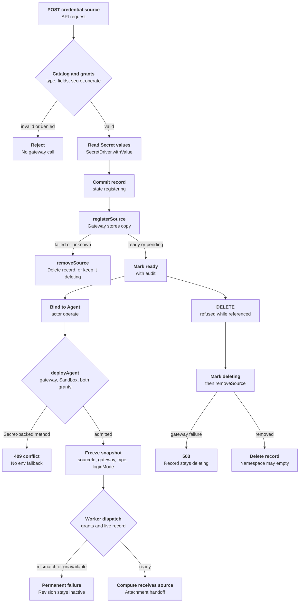

# Credential source lifecycle Flow

## Overview

An authorized caller registers a Namespace Secret with the selected Credential
Gateway, binds the resulting credential source to an Agent, deploys it, and
later deletes the source. The API copies the Secret value into the gateway once,
at registration; OCC stores only metadata and Secret references. Admission
freezes the source identity in the AgentRevision, and the worker hands the live
source record to Kubernetes Compute. This flow stops when Compute receives the
resolved source; the
[OpenShell Sandbox provisioning flow](openshell-sandbox-provisioning.md) covers
attachment, provisioning, and attachment readiness.

## Entry Points

- Trigger: `POST` or `DELETE /namespaces/:namespaceId/credential-sources[/:credentialSourceId]`,
  then Agent create or PATCH and `POST …/agents/:agentId/deploy`.
- Source: `apps/controller/src/http/credential-sources.ts:createCredentialSource`
- Source: `packages/occ/src/index.ts:createCredentialSource`
- Source: `packages/occ/src/index.ts:deleteCredentialSource`
- Assumptions: the Installation selected a Credential Gateway that belongs to an
  `openshell` Backend, a Sandbox, and bundled Kubernetes Compute; the Namespace
  is `ready`; the caller holds the grants named in each phase.

## Flow

## Execution Trace

### 1. Admit the registration request

`apps/controller/src/http/credential-sources.ts:createCredentialSource`,
`packages/occ/src/index.ts:createCredentialSource`

The route schema accepts `name`, `type`, optional `config`, and optional
`secrets` keyed by lowercase field names. Inside one transaction, OCC locks the
Namespace, authorizes `credential_source:create` on it, and requires a `ready`
Namespace. It asks the selected gateway for `listSourceTypes` and rejects an
unknown type, an unknown field, or a missing required field with
`ScopeViolationError` (`404`) before any Secret read or gateway write.

### 2. Read Secret values

`packages/occ/src/index.ts:createCredentialSource`

For each Secret reference, OCC rejects a foreign Namespace, authorizes
`secret:operate`, locks the Secret, and calls the owning Driver's optional
`withValue`. The Kubernetes Secret Driver verifies the stored object's ownership
labels, UID, and key before decoding it. A Driver without `withValue` fails the
request with `503`. The values exist only in memory for the next call.

### 3. Register with the gateway and commit

`packages/occ/src/index.ts:createCredentialSource`,
`packages/occ/src/index.ts:abandonCredentialRegistration`,
`apps/controller/src/drivers/credential-gateway/openshell.ts:registerSource`

The same transaction inserts the `credential_sources` row with a new `cs_` ID,
the gateway's Driver ID, and state `registering`, plus one
`credential_source_secrets` row per field, then commits. The OpenShell provider
name derives from that ID, so the record identifies any copy the gateway stores.
OCC asks Compute's `resolveSandboxNamespace` for the Namespace's runtime
placement, the same name the paired Sandbox receives, and calls `registerSource`
with a 30-second timeout. The OpenShell Driver ensures the Workspace's provider
profile and creates an OCC-labeled provider whose `profile_workspace` is that
Workspace; a retried create adopts only a provider with matching labels.

A `failed` or `absent` result is terminal: `abandonCredentialRegistration` calls
`removeSource` and deletes the record, or moves it to `deleting` when removal
fails. A thrown call is not terminal, because a timed-out create may still land
after cleanup. OCC calls `removeSource` but always keeps the record `deleting`,
so a later DELETE repeats the removal. On success a second transaction moves the
record from `registering` to `ready` and appends the handler's mutation audit
event. If that transaction fails or the process exits, the record stays
`registering`; admission and binding require `ready`, and DELETE removes the
copy. If a concurrent DELETE already removed the record, OCC removes the copy
again and returns `409`.

### 4. Bind the source to an Agent

`packages/occ/src/index.ts:authorizeHarnessAuthSource`

Agent create and PATCH authorize the caller's `credential_source:operate` on the
requested source and, for PATCH, on the current source. The source must be
`ready` in the exact Namespace and owned by the selected gateway. The generated
`agents.harness_auth_credential_source_id` column references the source, so the
database rejects deleting a source an Agent draft still uses.

### 5. Admit the deployment

`packages/occ/src/index.ts:deployAgent`, `packages/occ/src/index.ts:admitHarnessAuth`

`assertCredentialGatewayDelivery` rejects `api_key`, `codex_pat`, and
`chatgpt_service_account` with `409` while a gateway is selected. For
`credential_source`, `admitHarnessAuth` authorizes the Agent service principal's
`operate`, requires a `ready` source, and reads its catalog type, which must
declare `harnessAuth`. The frozen snapshot is `{ method, sourceId,
credentialGatewayId, sourceType, loginMode }`. `admittedCredentialSourceType`
requires a selected Sandbox, and Compute `validateHarnessAuth` requires
dedicated Codex, the paired Sandbox and gateway, and an `openai`/`api_key` type.

### 6. Resolve the source at dispatch

`apps/controller/src/worker.ts:authorizeRevision`,
`apps/controller/src/worker.ts:resolveRevisionSecretContext`

The worker rechecks `credential_source:operate` for the deploying actor and the
service principal; a denial ends the work item with `AUTHORIZATION_DENIED`. It
then compares the snapshot's gateway ID with its selected Driver
(`CREDENTIAL_GATEWAY_MISMATCH` on a difference) and loads the current record. A
missing or `deleting` source, or one whose Driver or type differs, returns
`HARNESS_AUTH_SOURCE_UNAVAILABLE`. Otherwise it passes the snapshot plus the
record to Compute, which rechecks the match in `harnessAuthForRevision`. The
next owner is the [OpenShell Sandbox provisioning flow](openshell-sandbox-provisioning.md#2-derive-the-provider-owned-harness-request).

### 7. Delete the source

`packages/occ/src/index.ts:deleteCredentialSource`,
`apps/controller/src/drivers/credential-gateway/openshell.ts:removeSource`

The first transaction authorizes `delete`, locks the source, and returns `409`
while an Agent draft, active revision, or pending deployment references it. It
moves a `registering` or `ready` record to `deleting`; database triggers prevent
leaving `deleting` and returning to `registering`. Outside the transaction, OCC calls `removeSource`. The OpenShell Driver
deletes the owned provider, confirms it is gone, and deletes the profile when no
provider of its type remains. A gateway failure returns `503` and leaves the
record `deleting` for the caller to retry. Until
`CREDENTIAL_REGISTRATION_FENCE_MS` (70 seconds) after `createdAt`, OCC keeps the
record and returns `503` even after a successful removal: a Driver finishes an
aborted registration's effects within 30 seconds of the abort, and the Backend
caps each gateway call's deadline at 30 seconds. A second transaction deletes the
record and appends the handler's audit event, so a completed deletion is always
audited; if the append fails, the record stays `deleting` for a retry. Namespace deletion returns
`NAMESPACE_NOT_EMPTY` while any record remains.

## Debugging and Verification

- `node --test tests/conformance/credential-source-occ.test.mjs` covers catalog
  validation, Secret `operate`, registration compensation, recovery of an
  uncertain registration, audit commit with the final state change, deletion
  refusal and retry, Namespace gating, admission snapshots, and rejection of Secret-backed
  methods with a gateway selected. It uses an in-process gateway double, not
  OpenShell.
- `node --test tests/conformance/openshell-gateway-wire.test.mjs` checks the
  provider and profile RPC encoding against the pinned `v0.1.0` wire fixture.
- `OCC_TEST_OPENSHELL_K3D_REAL=1 node --env-file="$TEST_ENV_FILE" --test tests/integration/sandbox-driver-openshell-k3d-real.test.mjs`
  registers an `openai` source through the production API against a real
  gateway and reads its live `ready` status. See [OpenShell tests](../testing/openshell.md).
- A source stuck in `deleting` returns `503` on delete until the gateway is
  reachable; `GET` shows its live `status`.
- Worker reason codes `CREDENTIAL_GATEWAY_MISMATCH` and
  `HARNESS_AUTH_SOURCE_UNAVAILABLE` identify a changed selection or an
  unavailable source.

## Related docs

- [Credential sources](../reference/credential-sources.md)
- [CredentialGatewayDriver contract](../reference/drivers/credential-gateway.md)
- [OpenShell Credential Gateway](../reference/drivers/openshell-credential-gateway.md)
- [Secret storage and delivery](secret-storage-and-delivery.md)
- [OpenShell Sandbox provisioning](openshell-sandbox-provisioning.md)

## Manual Notes

[keep this for the user to add notes. do not change between edits]

## Changelog

- 2026-09-26 14:29: Documented credential source registration, Agent binding, admission, dispatch resolution, and retried deletion for the uncommitted Credential Gateway change. (claude-code/session_014fi7Uq1LyofgqwLrLoQ3yY - 849b2b24111fe237b12da5be1d4b411d3146cefb)
