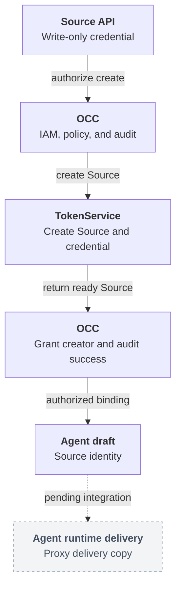

# Credential source lifecycle flow

## Overview

OpenClaw Control Plane (OCC) authorizes Source operations and governs IAM, Agent bindings, policy, and audit. The selected TokenService creates and owns [managed static Sources](token-service-static-custody.md), including their metadata and credentials. A caller supplies the credential through write-only Source registration; the caller does not create a separate Namespace Secret. Enrollment, update, and retirement are available, but managed Agent deployment and native delivery are not yet integrated.

## Entry Points

- Trigger: CredentialSource create, update, or delete; Agent draft binding or deployment.
- Source: `apps/controller/src/http/credential-sources.ts:createCredentialSource`
- Source: `packages/occ/src/managed-credential-sources.ts:createManagedCredentialSource`
- Source: `packages/occ/src/agent-credential-access.ts:authorizeAgentCredentialSources`
- Context: a ready Namespace, selected owner Driver, and grants for the exact source operation.

## Flow

```mermaid
graph TD
  API["<b>Source API</b><br/>Write-only credential"] -->|authorize create| OCC["<b>OCC</b><br/>IAM, policy, and audit"]
  OCC -->|create Source| Owner["<b>TokenService</b><br/>Create Source and credential"]
  Owner -->|return ready Source| Grants["<b>OCC</b><br/>Grant creator and audit success"]
  Grants -->|authorized binding| Draft["<b>Agent draft</b><br/>Source identity"]
  Draft -. pending integration .-> Delivery["<b>Agent runtime delivery</b><br/>Proxy delivery copy"]
  classDef pending fill:#F3F4F6,stroke:#98A2AE,color:#44505F,stroke-dasharray:4 4
  class Delivery pending
```

Solid arrows show implemented enrollment and draft binding. The dashed edge marks the missing managed Agent delivery integration.

## Execution Trace

### 1. Register a source

`apps/controller/src/http/credential-sources.ts:createCredentialSource`, `packages/occ/src/managed-credential-sources.ts:createManagedCredentialSource`

The caller sends the credential in the write-only `secret` field of Source POST. OCC authorizes `credential_source:create` on the ready Namespace, validates approved destination policy, and records the request audit. It calls `TokenServiceDriver.createSource`; TokenService assigns the ID, creates the canonical Source and credential, and returns the ready Source. TokenService commits independently; OCC grants the creator access and records success in a separate transaction. Responses contain sanitized metadata and never return the credential.

A failure can leave orphaned credential material or a committed Source without its creator IAM grant. OCC reports failure and retains the request audit; the current private Secret store does not provide orphan inventory. See the [managed static reference](../reference/credential-sources/managed-static.md) for inputs and the [custody flow](token-service-static-custody.md) for execution.

The deprecated `CredentialGatewayDriver` and transitional protected Source forms are deferred to separate cutovers.

### 2. Update a source

`packages/occ/src/credential-source-operations.ts:credentialSourceUpdateIdentity`, `packages/occ/src/managed-credential-sources.ts:updateManagedCredentialSource`

OCC authorizes exact `credential_source:update` and dispatches PATCH by the locked Source owner. For a managed static Source, TokenService replaces material from the write-only `secret` field; omitted fields retain their values. A provider-preset change or removal requires an unbound Source and a separate request from credential replacement. OCC commits policy-only changes itself; credential updates go through TokenService in its own transaction before OCC records completion. See the [managed static reference](../reference/credential-sources/managed-static.md) for PATCH rules.

### 3. Bind and admit an Agent revision

`packages/occ/src/harness-auth.ts:authorizeHarnessAuthSource`

OCC requires exact `credential_source:operate` for a new binding to a ready Source in the same Namespace. A caller can remove an obsolete binding without looking up its Source. A managed static Source can be saved for Harness authentication in the Agent draft, but deployment refuses it before creating a revision or queuing work. PostgreSQL records references and prevents deletion while the Source is bound.

### 4. Resolve the source at dispatch

`apps/controller/src/worker.ts:authorizeRevision`, `apps/controller/src/worker.ts:resolveRevisionSecretContext`

For source types supported by deployment, the worker rechecks actor and Agent grants, selected Driver identity, source ownership, and withdrawal state before Compute prepares the Sandbox. Kubernetes checks supported source types and deployment restrictions before release. The managed Source path does not reach this worker dispatch yet.

#### Pending native integration

The staged native Proxy can accept an admitted binding and deliver a credential copy to OpenShell, but the regular Agent workflow does not call it. Status fails closed until source-version authority and exact native executable enforcement are qualified. See the [native credential delivery flow](native-service-account-credential-delivery.md) for the staged boundary.

### 5. Retire a source

`packages/occ/src/managed-credential-sources.ts:deleteCredentialSource`

DELETE requires exact `credential_source:delete` and rejects blocking Agent, revision, deployment, provisioning, or withdrawal references. OCC commits `deleting` and retirement intent, then calls TokenService without holding a transaction. TokenService independently removes custody, the Source, and its IAM bindings. OCC records completion separately. Uncertain removal can leave `deleting` for retry; if removal committed, a later audit failure cannot restore the Source.

## Debugging and Verification

Run the [managed PostgreSQL integration](../../tests/integration/postgres-staged-agent-credential-binding.test.ts) with the [PostgreSQL test environment](../testing/postgresql.md#postgresql-test-environment). It covers real Fastify routes, PostgreSQL, Native IAM, TokenService custody, sanitized reads, update and denial audit, retirement, Agent draft binding, and pre-revision deployment refusal. Kubernetes API transport is simulated; this does not prove runtime delivery or a model turn. The [custody flow](token-service-static-custody.md#debugging-and-verification) owns detailed Source verification.

## Related docs

- [Credential sources](../reference/credential-sources.md)
- [Managed static Sources](../reference/credential-sources/managed-static.md)
- [Secret storage and delivery](secret-storage-and-delivery.md)
- [Managed static TokenService custody](token-service-static-custody.md)

## Manual Notes

[keep this for the user to add notes. do not change between edits]

## Changelog

- 2026-11-21 21:14: Describe independently committed TokenService operations and partial outcomes. (authoring-run/e9a8f5b4-f521-4f22-ab7b-1639413a47a4 - f7a5c4b60d7902f6d13a41faaf13386931648795)

- 2026-11-21 20:34: Move Source creation and lifecycle ownership to TokenService. (authoring-run/8bfb022d-2367-4ffc-b161-e5ea19cb7a80 - 55c444f3735a372e9f76a8f7e85a8ec4396ef7c7)

- 2026-11-21 20:12: Limit the lifecycle to managed enrollment and the pending Agent delivery boundary. (authoring-run/06394127-de30-40bc-9196-521c3f9e710a - 0d3f97e68830607320a3bfe6a781d38539a26fbe)

- 2026-11-21 11:54: Lead the lifecycle with managed TokenService enrollment and mark old custody paths as transitional. (authoring-run/22722819-a3e4-4a6e-ae08-9e23bde479dd - 15794c3860bcf982b500774d8c700fbcd19aaf71)

- 2026-11-21 11:45: Reconcile enrollment status with the extracted source flow. (authoring-run/16cfa409-7c14-4f52-9167-3e897f919125 - 7533013d1061c433e27883818cf69f955239c43f)

- 2026-11-20 19:04: Refresh sources. (authoring-run/8a8bde8b-71de-4de5-80bf-e32f0e335c34 - 220f62d86ceb3dfc6f66dbee7c6f86cda50e5d05)
- 2026-11-20 16:33: Point Harness binding and snapshot checks to their source module. (authoring-run/5406c3c6-28fa-42a9-a7a7-4afa642738f1 - 56b116735a3a38a48eff35bf36152d3032b1d7d3)

- 2026-11-20 16:18: Link managed enrollment. (authoring-run/9bb61048-2680-4355-9169-bd7a6dd316af - 27b47ccbf7223c303b844af151c9712082380919)

- 2026-11-20 10:13: Name the serving protected source owner as the legacy egress Driver. (01a1f7ec-0d9e-7803-96c3-eb88548e3788 - b02e93892)
- 2026-11-20 08:10: Clarify serving and internal custody, registration checks, dispatch, and deletion retry behavior. (01a1eae9-8497-74d2-a9c7-9bc93809e94a - 6c7aeed58)
- 2026-11-20 07:59: Rewrite the serving lifecycle around source ownership, Agent delivery, and staged native limits. (01a1eae9-8497-74d2-a9c7-9bc93809e94a - e76d323cb)

[Earlier documentation history](credential-source-lifecycle/history.md) preserves the previous dated entries.
