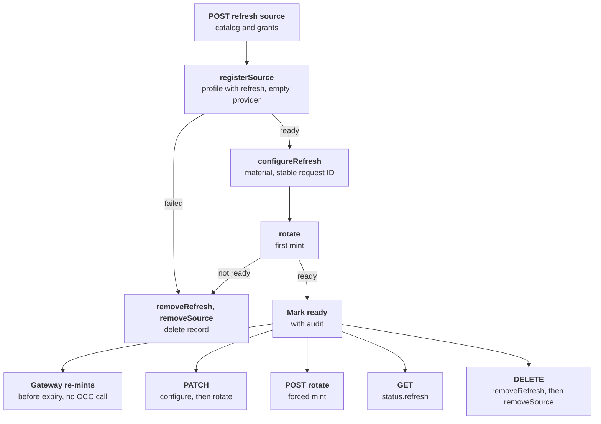

# Credential source refresh Flow

## Overview

A `refresh`-type credential source, such as `oauth2-client-credentials`, holds
issuer material instead of a static value. The API registers it with the
selected Credential Gateway, then asks the paired Credential Refresh Driver to
store the material and mint the first token. Afterwards the gateway re-mints
tokens before expiry without OCC, and the Agent keeps one stable placeholder.
OCC calls the refresh role again only to update material, force a rotation,
read status, or delete the source. This flow covers those calls; the
[credential source lifecycle flow](credential-source-lifecycle.md) owns
binding, admission, dispatch, and withdrawal, which are the same for every type.

## Entry Points

- Trigger: `POST /namespaces/:namespaceId/credential-sources` with a `refresh`
  type, `PATCH`, `GET`, or `DELETE …/credential-sources/:credentialSourceId`,
  and `POST …/credential-sources/:credentialSourceId/rotate`.
- Source: `packages/occ/src/index.ts:createCredentialSource`
- Source: `packages/occ/src/index.ts:rotateCredentialSource`
- Source: `apps/controller/src/drivers/credential-refresh/openshell.ts:OpenShellCredentialRefreshDriver`
- Assumptions: the OpenShell Backend declares both `credential_gateway` and
  `credential_refresh`, and both Drivers are selected; the gateway's
  `toolBinaries` are configured, so the catalog lists the OAuth2 types; the
  OpenShell gateway trusts and reaches the issuer's `token_url`.

## Flow

## Execution Trace

### 1. Registration

`packages/occ/src/index.ts:createCredentialSource`

The API validates the request against the gateway catalog. A type whose
`rotation` is `refresh` resolves the selected Credential Refresh Driver inside
the first transaction, so a missing selection fails before any gateway call.
The API reads the Secret values, commits the record as `registering`, and calls
the gateway's `registerSource` with config only: a refresh type's Secret values
are issuer material, so only the refresh Driver receives them.

`apps/controller/src/drivers/credential-gateway/openshell.ts:registerSource`
imports a per-source OpenShell profile whose `access_token` credential declares
the OAuth2 strategy, `token_url`, and refresh-material names. It creates the
provider without a credential value, because OpenShell resolves a
gateway-mintable credential at runtime.

### 2. First mint

`packages/occ/src/index.ts:mintFirstRefreshToken`

OCC calls `configureRefresh` with the source config and resolved Secret values,
then `rotate`. Both request IDs are name-based UUIDs derived from the source ID
and step, so a replay is not applied twice. The OpenShell Driver sends
`ConfigureProviderRefresh` with `client_id`, `scope`, and the secrets as
material, and `RotateProviderCredential`; OpenShell calls the issuer and stores
the access token on the provider. A thrown call leaves the outcome unknown, and
OCC keeps the record `deleting` after cleanup. A definite non-`ready` mint is
terminal: OCC removes the refresh material and provider, deletes the record, and
returns `503` with the Driver's failure code. Otherwise the second transaction
marks the source `ready` with its audit event.

### 3. Background refresh

`apps/controller/src/drivers/credential-refresh/openshell.ts:refreshStatus`

OpenShell re-mints the token before it expires and writes it to the provider.
The Sandbox proxy substitutes the current token for the stable placeholder on
each request, so a running Harness needs no restart. OCC makes no call.
`GET` on the source adds `refreshStatus` to the gateway status; OpenShell's
`refreshed` state reports `ready`, its error states report `failed` with a
recovery action, and missing refresh state reports `failed`. OCC finds the
type through `refreshDriverForSource`, which tolerates a type the catalog no
longer offers: that source keeps its gateway status without `refresh`.

### 4. Update and rotation

`packages/occ/src/index.ts:updateCredentialSource`

`PATCH` locks the source, reads its current or replacement Secrets, and checks
the gateway status. For a `refresh` type it calls `configureRefresh` with a new
request ID, then `rotate`, instead of the gateway's `updateSource`. A
non-`ready` mint returns `503` before OCC replaces the Secret references, but
OpenShell keeps the new material, and the next `GET` reports the failed mint.
An update without `secrets` re-applies the recorded references. OpenShell
starts a new authorization epoch on each reconfiguration, even one whose mint
fails, which revokes the stable placeholders of running Sandboxes, so Agents
need a redeploy.

`packages/occ/src/index.ts:rotateCredentialSource`

`POST …/rotate` requires `credential_source:update`, a `ready` source, and a
`refresh` type; a static type returns `409`. It calls `rotate` and returns the
new status. The HTTP handler commits the audit event in the same transaction.

### 5. Deletion

`packages/occ/src/index.ts:deleteCredentialSource`

After the usual reference check and `deleting` mark, OCC calls `removeRefresh`,
which sends `DeleteProviderRefresh` with `allow_missing`, and then the gateway's
`removeSource`. A failure leaves the record `deleting` for retry.

## Debugging and Verification

- Read the source: `status.refresh.state`, `lastRefreshAt`, `failureCode`, and
  `recoveryAction` explain the last mint without exposing a token.
- `oauth_token_endpoint_unavailable` means the OpenShell gateway Pod could not
  reach `token_url`; check its NetworkPolicy and trust of the issuer's CA.
- `reauthorize` follows a revoked refresh token; supply new material with `PATCH`.
- `tests/integration/sandbox-driver-openshell-k3d-real.test.mjs` proves minting,
  background re-minting, forced rotation, reauthorization, a failed update, and deletion against
  a real Keycloak. `tests/conformance/credential-source-occ.test.mjs` covers OCC
  ordering and cleanup.

## Related docs

- [CredentialRefreshDriver contract](../reference/drivers/credential-refresh.md)
- [OpenShell Credential Gateway](../reference/drivers/openshell-credential-gateway.md#oauth2-refresh-sources)
- [Credential sources](../reference/credential-sources.md#rotate-a-refresh-source)
- [Credential source lifecycle flow](credential-source-lifecycle.md)

## Manual Notes

[keep this for the user to add notes. do not change between edits]

## Changelog

- 2026-10-08 16:19: Registration sends the gateway no refresh secrets; a failed update keeps the new material. (claude-code/session_014fi7Uq1LyofgqwLrLoQ3yY - f79f896b3)
- 2026-10-08 11:46: Reading a source no longer needs its type in the current catalog. (claude-code/session_014fi7Uq1LyofgqwLrLoQ3yY - 3ce93bfda)
- 2026-10-08 00:00: Created for OAuth2 refresh sources and the Credential Refresh Driver. (claude-code/session_014fi7Uq1LyofgqwLrLoQ3yY - 4151882d2)
