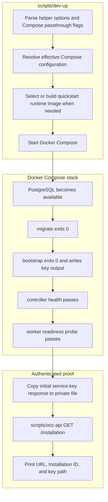

# Development Startup Flow

## Overview

`scripts/dev-up` starts the supported local OpenClaw Control Center (OCC)
environment. The helper wraps Docker Compose, waits for PostgreSQL migration,
Installation bootstrap, API health, and worker readiness, then proves
authenticated access with the copied bootstrap service key. This flow ends when
`GET /installation` succeeds and the Docker-backed worker is polling durable
work.

For the operator procedure, use the [quickstart](../guides/quickstart.md) or
[deployment guide](../guides/deploy.md). Docker Compose still owns service
ordering; `dev-up` owns preflight, bounded waits, key-copy delivery, and the
final API proof.

## Entry Points

- Trigger: Run `./scripts/dev-up [--key-output PATH] [-- COMPOSE_GLOBAL_OPTIONS...]`
  from the repository root.
- Source: `scripts/dev-up:1`, `compose.yaml:62`, and
  `apps/controller/src/worker.ts:312`.
- Assumptions: Docker Engine, Bash, `curl`, Python 3, Compose access, loopback
  API exposure, persistent named volumes, and either a configured runtime image
  or permission to build the quickstart runtime image.

## Flow

## Execution Trace

### 1. Resolve options and Compose configuration

`scripts/dev-up:50`

The helper runs from the checkout root. It accepts an optional absent
`--key-output` destination and forwards arguments after `--` to Docker Compose,
so native Compose project names, profiles, and override files keep their normal
precedence. It validates the effective Compose configuration without printing
expanded credentials and does not source `.env` as shell.

If neither a shared runtime image nor separate gateway/Agent images are set,
the helper selects `openclaw-enterprise-runtime:quickstart` for this invocation.
It builds that default image from `deploy/runtime` only when the image is
missing. Custom image references must already exist; an incomplete custom
selection fails before startup is reported successful.

### 2. Start the Compose-owned initialization graph

`compose.yaml:17`, `compose.yaml:62`

The helper calls Compose to run the supported development graph. Compose starts
PostgreSQL, runs the migration service with the isolated migrator role, then
runs the bootstrap service with the lower-privilege application role. The helper
does not invoke migration or bootstrap directly.

Fresh bootstrap creates the development human administrator, the non-Agent
service administrator, the singleton Installation, native IAM seed, audit
evidence, and the initial service-key response. Existing Installations retain
their accounts, keys, IAM policy, configuration, and revision history. Missing,
expired, or revoked keys do not trigger another bootstrap issue.

### 3. Wait for API and worker readiness

`apps/controller/src/server.mjs:138`, `apps/controller/src/worker.ts:312`

After `bootstrap` exits `0`, Compose starts the API and worker. The API loads
the persisted singleton Installation, Better Auth settings, native IAM,
PostgreSQL state, and filesystem Configuration rooted in the controller-only
configuration volume. It publishes the controller on host loopback.

The worker independently opens the same application-role database, selects the
Docker Compute Driver, validates persisted IAM, emits `worker.started`, and
begins polling durable Namespace and AgentRevision work. Only the worker mounts
the Docker socket. Runtime containers receive neither the controller
configuration volume nor the bootstrap-output volume.

### 4. Copy the initializer-owned key response

`scripts/dev-up:385`

Once startup is confirmed, the helper copies
`/var/lib/openclaw/bootstrap/initial-admin-service-key.json` from the stopped
bootstrap container into a new owner-only file. `--key-output` must name an
absent destination in a private operator-owned directory; otherwise the helper
creates a private temporary directory and prints only the file path.

The copy preserves initializer-owned output. The helper never overwrites an
existing local file, never prints `data.key`, and never reruns bootstrap to
replace a missing key. If copying fails, preserve the bootstrap container output
for recovery.

### 5. Prove authenticated Installation access

`scripts/dev-up:432`, `scripts/occ-api:23`

The helper sets the effective loopback `OCC_URL` and invokes `scripts/occ-api
GET /installation` with `OCC_SERVICE_KEY_FILE` pointing at the copied response.
`scripts/occ-api` reads `data.key`, sends it as `x-api-key`, and validates the
controller response without exposing the key in process arguments or terminal
output.

Startup succeeds only when the response returns HTTP `200` and `data.id` matches
the copied key response's `meta.installationId`. The printed URL, Installation
ID, private key-file path, and one-line environment-qualified `scripts/occ-api`
command are the handoff to later API, Agent, and TUI procedures. The helper
cannot export variables into the caller's shell.

## Debugging and Verification

- `docker compose ps -a` should show `migrate` and `bootstrap` exited `0`, with
  PostgreSQL, controller, and worker available.
- The API should emit `listening`; the worker should emit `worker.started`
  followed by `worker.health`.
- `scripts/production-healthcheck.mjs` runs inside the worker container as the
  helper's readiness proof.
- `scripts/occ-api GET /installation` must return HTTP `200` with
  `data.id == meta.installationId` from the copied key file.
- `startup-error`, `worker.startup-error`, failed one-shot service status,
  failed key copy, rejected API key, or mismatched Installation ID makes
  `dev-up` exit nonzero with the failed stage.
- Recovery preserves successfully copied keys and initializer output. Manual
  bootstrap repair is owned by
  [the deployment guide](../guides/deploy.md#recover-an-incomplete-bootstrap).

## Related docs

- [Quickstart](../guides/quickstart.md)
- [Deployment guide: development](../guides/deploy.md#development)
- [Docker Compose development flow](docker-compose-development.md)
- [Controller worker execution flow](controller-worker.md)
- [Local password authentication flow](local-password-authentication.md)
- [Settings reference](../reference/settings.md)

## Manual Notes

[keep this for the user to add notes. do not change between edits]

## Changelog

- 2026-09-01 12:58: Trace the helper-driven development startup path and authenticated Installation proof. (codex/01a05e87-6c64-7960-b9c2-f444d4a3d737 - bdb846c38d5dae6085a8841f720c93068ba8ad15)
- 2026-08-31 22:29: Remove automatic bootstrap recovery; preserve artifacts after any error and require manual repair. (01a05a3d-526f-7553-8cd8-070bd1847acb - 94a5440898bf331987148d7733f0075506af64a6)
- 2026-08-31 17:43: Document fresh human/service administrator bootstrap, private key delivery, and operator recovery. (codex/01a05a69-3fbe-7441-9e6d-20394758cf94 - 0797098646028ac00cb26cd4afcbc9b2cf8bcb24)
- 2026-08-26 23:13: Replaced the removed in-memory path with PostgreSQL-only Docker Compose startup, automatic Installation bootstrap, filesystem configuration, and Docker-backed worker ownership. (01a036f4-cf1d-7cc1-bbc1-000879038ac8 - 02638f10ed52b413d41378ae0f6b45ca19b8b149)
- 2026-08-25 03:43: Added the development API, Better Auth sign-in, Installation bootstrap, persistence selection, and independent worker startup flow. (01a036f4-cf1d-7cc1-bbc1-000879038ac8 - 2e9769c751d7)
