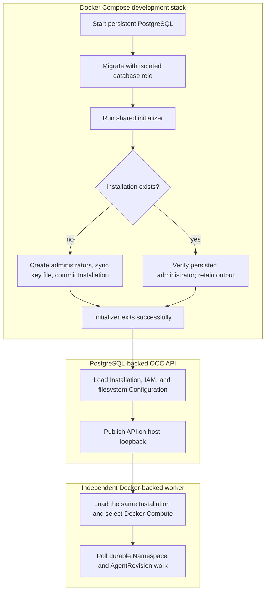

# Development Startup Flow

## Overview

Start the supported OpenClaw Control Center (OCC) development environment with
Docker Compose. Compose starts PostgreSQL, migrates the database, initializes
the singleton Installation, launches the API, and starts the independent
controller worker. PostgreSQL is required; there is no in-memory development
mode. This flow ends when the loopback-published API accepts authenticated
requests and the Docker-backed worker begins polling durable work.

For prerequisites, startup commands, and production differences, use the
[deployment guide](../guides/deploy.md). The [quickstart](../guides/quickstart.md)
owns the first model-backed TUI conversation. The [setup flow](setup.md) wraps
this startup with credential retrieval, provisioning, and TUI attachment.

## Entry Points

- Trigger: Run `docker compose up --build` from the repository root.
- Source: `compose.yaml`, `scripts/bootstrap-installation.mjs`, and
  `apps/controller/src/composition/development-postgres.ts:composePostgresDevelopment`.
- Assumptions: Docker Engine, existing approved gateway/Codex runtime images,
  a provider credential for real model turns, persistent PostgreSQL and
  configuration volumes, and an API published only on host loopback.

## Flow

## Execution Trace

### 1. Compose supplies the process environments and network boundary

`compose.yaml:services.controller`, `compose.yaml:services.worker`,
`apps/controller/src/server.mjs:configuration`

[`compose.yaml`](../../compose.yaml) supplies separate API and worker
process environments and publishes the controller only on
`127.0.0.1:${OPENCLAW_DEV_PORT:-3000}`. The API binds to `0.0.0.0` inside the
private Compose bridge only when `OCC_DEVELOPMENT_TRUSTED_BRIDGE_CIDR` is
explicit; direct host-process debugging must bind `127.0.0.1` or `::1`.
Forwarded identity headers, bearer credentials, and non-local clients remain
rejected.

The worker receives the configured gateway/Codex image references and the
existing provider credential. These are inputs to later authorized runtime
creation; starting the control plane alone does not launch an Agent workload.

### 2. Migrate, then initialize the Installation

`compose.yaml:services.migrate`, `compose.yaml:services.bootstrap`,
`scripts/bootstrap-installation.mjs`

PostgreSQL retains controller metadata in `occ_postgres_data`. The one-shot
`migrate` service uses the isolated migrator role; only after it exits `0` does
`bootstrap` run the shared initializer with `NODE_ENV=development` and the
lower-privilege application-role connection.

Fresh initialization provisions `OPENCLAW_DEV_EMAIL`/`OPENCLAW_DEV_PASSWORD`,
adds a non-Agent service administrator to the native IAM seed, issues its
initial key, syncs private output, and commits Installation/IAM/audit directly.
The [bootstrap flow](local-password-authentication.md) owns commit, concurrency,
and manual repair after a failed attempt. Existing Installations retain accounts, credentials,
output, IAM policy, and revision history; missing or expired keys never trigger
regeneration.

Only `bootstrap` mounts `occ_bootstrap_data` at `/var/lib/openclaw/bootstrap`.
The development image prepares this directory for UID/GID 1000 with mode
`0700`; the key file uses `0600`. After confirmed initializer exit `0`, operators
copy from the stopped bootstrap container using `docker compose cp`.
Direct development runs the same initializer with an explicit private absolute
key-file path before the API or worker.

### 3. Load initialized state and compose authentication and configuration

`apps/controller/src/server.mjs:start`,
`apps/controller/src/composition/development-postgres.ts:composePostgresDevelopment`

Compose starts the API only after the initializer exits successfully. The
development composition opens PostgreSQL and requires the singleton
Installation and its current IAM identity. It creates Better Auth using the
configured secret and loopback origin; it does not create credentials or call
its own HTTP routes.

Without `OCC_CONFIG_PATH`, it selects native IAM, Docker Compute, and filesystem
Configuration rooted at `/app/.development/configurations`. Only the API mounts
`occ_configuration_data`; PostgreSQL owns platform metadata, audit, IAM,
sessions, and durable work. The worker and workloads receive neither this
configuration volume nor the bootstrap-output volume.

### 4. Become ready and start the independent worker

`apps/controller/src/worker.mjs:configuration`

The API registers its existing Fastify routes, binds inside the private Compose
network, and becomes reachable at `http://127.0.0.1:3000` by default. Compose
starts the worker only after the controller health check succeeds.

The [worker entrypoint](../../apps/controller/src/worker.mjs) independently
opens the same application-role PostgreSQL database and selects
`compute-docker-development` when no trusted `OCC_CONFIG_PATH` overrides the
Driver bundle. It validates the persisted Installation and IAM policy, emits
`worker.started`, and begins polling durable Namespace and AgentRevision work.

Only the worker receives the Docker Engine socket. It creates an isolated
Docker network for each Namespace and starts the selected embedded OpenClaw or
dedicated Codex runtime only after an authorized deployment. The Docker socket,
provider credential, and configuration volume never appear together in the
API or Agent-owned workload containers.

### 5. Hand off to authenticated requests and durable reconciliation

`apps/controller/src/index.ts:createFastifyApp`

After initialization and listening complete, clients can use the initial service
key or sign in through Better Auth to receive the controller session cookie.
The Installation already exists;
normal clients do not bootstrap it again. Protected OCC requests resolve the
credential and separately authorize the requested operation through IAM. Follow
the [quickstart](../guides/quickstart.md) for both procedures.

The worker does not receive the administrator password or Better Auth secret
and does not open an HTTP listener. Accepted lifecycle operations continue
through the [controller worker flow](controller-worker.md); their Docker
infrastructure effects are traced in the
[Docker Compose development flow](docker-compose-development.md).

## Debugging and Verification

- Run `docker compose ps -a` and confirm PostgreSQL, the controller, and the
  worker are available after both `migrate` and `bootstrap` exit `0`.
- Expect the API to emit `listening` and the worker to emit
  `{"event":"worker.started","computeDriverId":"compute-docker-development"}`,
  followed by `worker.health`.
- The quickstart's authenticated `GET /installation` must return the persisted
  Installation. A missing, invalid, expired, or revoked session returns `401`; an
  authenticated Principal without the required IAM permission returns `403`.
- `startup-error` identifies invalid API mode, listener, authentication, or
  database settings. `OCC_DATABASE_URL must be explicitly configured in
development.` means the application-role PostgreSQL connection is missing.
- `worker.startup-error` identifies an invalid worker mode, missing PostgreSQL
  URL, absent Installation, unavailable Docker Engine, or rejected Driver
  configuration. Never mount the Docker socket into the API as a workaround.
- Run the focused source-backed startup check with
  `node --test tests/integration/configuration-startup.test.mjs`. This does not
  prove a real Docker model turn; the
  [Docker Compose development flow](docker-compose-development.md) owns the
  full runtime verification boundary.

## Related docs

- [Deployment guide: development and production](../guides/deploy.md)
- [Quickstart](../guides/quickstart.md)
- [Controller worker execution flow](controller-worker.md)
- [Controller and Installation configuration](../reference/settings.md)
- [Controller worker operation](../reference/controller.md)
- [Docker Compose development flow](docker-compose-development.md)
- [Docker Compute Driver](../reference/drivers/docker-compute.md)
- [Authentication](../reference/authentication.md)
- [Shared platform startup flow](platform-startup.md)
- [Production startup flow](production-startup.md)
- [Installation Driver package loading flow](driver-plugin-loading.md)
- [Authoritative platform design](../design.md)

## Manual Notes

[keep this for the user to add notes. do not change between edits]

## Changelog

- 2026-08-31 22:29: Remove automatic bootstrap recovery; preserve artifacts after any error and require manual repair. (01a05a3d-526f-7553-8cd8-070bd1847acb - 94a5440898bf331987148d7733f0075506af64a6)

- 2026-08-31 20:33: Trace the shared installation initializer, startup ordering, and initializer-owned credential delivery. (01a05a3d-526f-7553-8cd8-070bd1847acb - b6f213cbcee11ba3dd69886c936c7e5abe233eb3)

- 2026-08-31 17:43: Document fresh human/service administrator bootstrap, private key delivery, and operator recovery. (codex/01a05a69-3fbe-7441-9e6d-20394758cf94 - 0797098646028ac00cb26cd4afcbc9b2cf8bcb24)

- 2026-08-28 17:54: Separated startup execution from operator setup and sign-in instructions, linking the deployment guide and quickstart. (01a036f4-cf1d-7cc1-bbc1-000879038ac8 - 4270aa29b7015562049f46c6027962fd85b584a9)
- 2026-08-26 23:13: Replaced the removed in-memory path with PostgreSQL-only Docker Compose startup, automatic Installation bootstrap, filesystem configuration, and Docker-backed worker ownership. (01a036f4-cf1d-7cc1-bbc1-000879038ac8 - 02638f10ed52b413d41378ae0f6b45ca19b8b149)
- 2026-08-25 03:43: Added the development API, Better Auth sign-in, Installation bootstrap, persistence selection, and independent worker startup flow. (01a036f4-cf1d-7cc1-bbc1-000879038ac8 - 2e9769c751d7)
