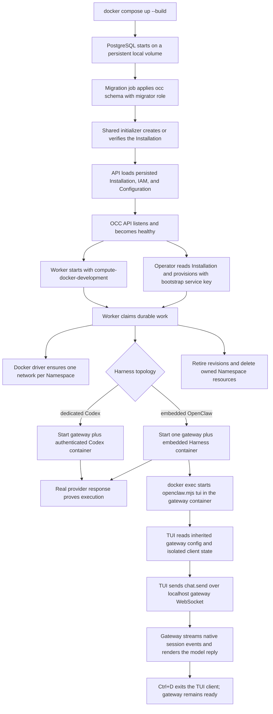

# Docker Compose Development Flow

## Overview

`docker compose up --build` starts the supported local OpenClaw Enterprise
development environment. Compose owns PostgreSQL, migrations, idempotent
shared initialization for fresh databases, the OCC API with a
filesystem-backed Configuration Driver, and the worker. The worker selects the
Docker Compute Driver and starts real OpenClaw/Codex runtime containers for
authorized Namespace and AgentRevision work. The development TUI path attaches
inside the Agent-owned gateway container and uses that container's inherited
gateway configuration to reach the live Agent runtime. This flow stops after the
worker has reconciled Docker-backed runtimes, the TUI client has exited, and
cleanup for development resources is understood.

Use the [deployment guide](../guides/deploy.md) for setup and shutdown and the
[quickstart](../guides/quickstart.md) for setup and the first TUI conversation. The
[development startup flow](development-startup.md) ends at control-plane
readiness; this trace continues through Docker workload creation and cleanup.

## Entry Points

- Trigger: `docker compose up --build`
- Source: `compose.yaml`, `apps/controller/src/server.mjs:start`,
  `apps/controller/src/drivers/compute/docker/index.ts:DockerComputeDriver`
- Assumptions: Docker Engine is available; PostgreSQL can write
  `occ_postgres_data`; the controller can write `occ_configuration_data` at
  `/app/.development/configurations`; runtime images are supplied through
  `OCC_DOCKER_GATEWAY_IMAGE` and `OCC_DOCKER_AGENT_IMAGE` or shared
  `OCC_DOCKER_RUNTIME_IMAGE`; `OPENAI_API_KEY` is present in the
  Compose-starting environment or protected `.env` before the worker starts;
  the API is published only on host loopback; the TUI runs from an interactive
  terminal attached with `docker exec -it`.

## Flow

## Execution Trace

### 1. compose.yaml:services.postgres and services.migrate

`compose.yaml:services.postgres`, `compose.yaml:services.migrate`

Compose starts PostgreSQL first and keeps its data in the local
`occ_postgres_data` volume. Compose also declares `occ_configuration_data`, but
mounts it only into the controller for development Configuration documents. The
PostgreSQL service uses local-only administrator credentials to initialize the
database and the checked-in local SQL to create the less-privileged
`occ_migrator` and `occ_app` roles.

The migration service waits for PostgreSQL, connects with
`OCC_MIGRATION_DATABASE_URL`, and applies Drizzle migrations. The API and
worker never use the migrator or PostgreSQL administrator URL.

### 2. Initialize before starting the API or worker

`compose.yaml:services.bootstrap`, `scripts/bootstrap-installation.mjs`

After migration exits `0`, Compose runs the shared initializer with development
inputs. It creates fresh human/service administrators, writes the initial key
to its private volume, and commits the singleton Installation, IAM, and audit.
Existing Installations retain their credentials and output. Only the initializer
mounts `occ_bootstrap_data`; the API and worker load committed state after
initializer success. The [development startup flow](development-startup.md)
owns startup ordering and the [bootstrap flow](local-password-authentication.md)
owns credentials, concurrent attempts, and failure recovery.

### 3. The API admits only local development traffic

`apps/controller/src/server.mjs:start`,
`apps/controller/src/composition/development-postgres.ts:createDevelopmentConfigurationDriver`,
`apps/controller/src/drivers/configuration/filesystem/index.ts:FilesystemConfigurationDriver`

The API starts in `NODE_ENV=development`, binds inside the Compose network, and
publishes its host port only on `127.0.0.1`. `OCC_AUTH_SECRET` signs Better Auth
sessions and `OCC_AUTH_BASE_URL` fixes the cookie origin.

Development accepts the explicitly configured Compose bridge CIDR as local
control-plane traffic, while non-loopback clients, forwarded headers,
caller-supplied identity headers, bearer credentials, and trusted-proxy claims
remain rejected. The API uses the application-role PostgreSQL URL and never
receives the Docker socket.

After successful bootstrap, the operator retrieves the private service-key JSON
from the bootstrap-only volume and reads `/installation` with `x-api-key` before
provisioning. `apps/controller/src/auth/index.ts:ControllerAdmissionVerifier.verify`
validates that key and maps it to the Installation-scoped service administrator;
current IAM policy still authorizes each resource operation. An invalid, expired,
or revoked key fails with `401` without cookie fallback. The
[service-key flow](service-api-keys.md) owns admission details.

When `OCC_CONFIG_PATH` is absent, PostgreSQL-backed development selects the
filesystem Configuration Driver from `OCC_DEVELOPMENT_CONFIGURATION_ROOT`.
Compose sets that root to `/app/.development/configurations` and backs it with
the `occ_configuration_data` named volume. PostgreSQL remains the OCC metadata
system of record; native Configuration documents live in that driver-owned
volume.

### 4. The worker selects Docker compute and claims durable work

`apps/controller/src/worker.mjs:configuration`

The worker starts after the controller is healthy with the same
application-role `OCC_DATABASE_URL`. When `OCC_CONFIG_PATH` is absent in
development, it selects `compute-docker-development` with implementation
`docker-local`. Setting `OCC_CONFIG_PATH` explicitly selects the trusted Driver
set described by that file instead.

The worker loads the singleton Installation, validates persisted IAM policy,
and polls the PostgreSQL work queue. Every claimed operation reauthorizes the
original actor before calling Compute. The worker is the only Compose service
with Docker Engine access. It does not mount the configuration volume.

### 5. Docker creates Namespace networks and Agent runtimes

`apps/controller/src/drivers/compute/docker/index.ts:DockerComputeDriver`

For Namespace provisioning, the Docker driver creates or verifies one labeled
Docker network for the exact Namespace. The network is not the Compose
management network, and creating it does not start a gateway.

For revision preparation, the driver validates the immutable Harness identity
and mode. Embedded OpenClaw starts one Agent-owned gateway container that also
runs the Harness. Dedicated Codex starts one gateway container plus one
exact-revision Codex container connected by authenticated `APP_SERVER_URL` and
`APP_SERVER_TOKEN` transport.

Runtime images come from `OCC_DOCKER_GATEWAY_IMAGE` and
`OCC_DOCKER_AGENT_IMAGE`, or from `OCC_DOCKER_RUNTIME_IMAGE` when one supplied
image contains both entrypoints. The driver does not build or pull a hidden
runtime image.

### 6. Credential placement follows the Harness topology

`apps/controller/src/drivers/compute/docker/index.ts:DockerComputeDriver`

`OPENAI_API_KEY` is inherited from the developer environment only for the
container that performs the model call. Embedded OpenClaw receives it in the
combined gateway/Harness container. Dedicated Codex receives it only in the
Codex app-server container; the separate gateway never receives it.

The key is not stored in the Installation snapshot, native configuration,
audit events, Docker labels, API responses, command-line arguments, or sibling
Agent containers. Workload containers do not receive the Docker socket,
controller credentials, host homes, SSH-agent sockets, or another Namespace's
network.

### 7. The TUI client starts inside the embedded gateway container

`apps/controller/src/drivers/compute/docker/index.ts:GATEWAY_RUNTIME_ENTRYPOINT`,
`apps/controller/src/drivers/compute/docker/index.ts:DockerComputeDriver`,
`tests/integration/docker-compute-real.test.mjs:tuiDockerCommand`

The [setup command](setup.md) retrieves the private service credential,
provisions the Agent, and selects the container for its current active revision.
`docker exec -it` starts `node /app/openclaw.mjs tui` in that gateway container.
The private key copy remains in the setup state directory for reconnect.

The Docker driver has already written the gateway configuration to
`OPENCLAW_CONFIG_PATH`, started `/app/openclaw.mjs gateway` on
`OPENCLAW_GATEWAY_PORT`, and injected `OPENCLAW_GATEWAY_TOKEN` into the gateway
container. The TUI process inherits those values. The OCC service key stays
with the operator and never enters the workload or TUI. The guide overrides only
`OPENCLAW_STATE_DIR` so the client uses temporary container-local state instead
of the gateway's persisted `/home/node/.openclaw` state.

### 8. The TUI turn travels through the local gateway session

`tests/integration/docker-compute-real.test.mjs:assertInteractiveTuiConversation`,
`tests/integration/harness-topology-k3d-real.test.mjs:gatewayCall`,
`tests/integration/harness-topology-k3d-real.test.mjs:transcript_events`

From inside the gateway container, the TUI authenticates to the gateway over the
container-local gateway endpoint. The TUI sends the first prompt as a native
session message; the gateway handles it through the same `chat.send` path used
by the runtime proof hooks, streams session events, persists transcript rows,
and renders the model-backed assistant reply in the terminal.

The same TUI process accepts the follow-up prompt in the same session. Ctrl+D
closes the client process after the second rendered reply. It does not stop the
gateway process, delete the Agent runtime, or retire the AgentRevision; the
Docker integration asserts the gateway remains ready after client exit.

### 9. Cleanup removes only owned development resources

`apps/controller/src/drivers/compute/docker/index.ts:DockerComputeDriver`

Revision retirement removes only the exact revision's owned runtime and
preserves another active Agent or replacement runtime. Namespace deletion
removes only containers and the network labeled for that exact Namespace.
Foreign resources with colliding names but different ownership labels are not
adopted or deleted.

If provisioning fails after creating partial resources, the driver compensates
resources created for that failed attempt. Interrupted work remains durable in
PostgreSQL and can be retried by the worker.

## Debugging and Verification

- `docker compose up --build` should show PostgreSQL readiness, migration
  completion, API listening on `127.0.0.1:${OPENCLAW_DEV_PORT:-3000}`,
  fresh-database initialization, and `worker.started` with
  `computeDriverId` set to `compute-docker-development`.
- `docker network ls --filter label=org.openclaw.enterprise.compute-driver=docker`
  should show one owned network for each ready development Namespace.
- `docker ps --filter label=org.openclaw.enterprise.compute-driver=docker`
  should show one embedded gateway container or a dedicated gateway plus Codex
  container for deployed revisions.
- The setup command owns gateway discovery and retains the private service-key copy
  before TUI attach; this flow records the selected container's runtime path after that
  operator procedure completes.
- `tests/integration/docker-compute-real.test.mjs:assertInteractiveTuiConversation`
  should reject an invalid gateway token, produce two model-backed replies in
  one TUI session, exit the client with Ctrl+D, and leave the gateway ready.
- The Docker Compose integration test must read the singleton Installation and
  perform API deployment with the bootstrap service administrator key through the worker and receive a real provider response containing
  a fresh nonce for both embedded and dedicated topologies. It may invoke the
  gateway through the Namespace network or through the Docker-published
  `127.0.0.1` gateway port.
- After Namespace deletion, the matching labeled containers and network should
  be absent while unrelated Namespaces remain.

## Related docs

- [Deployment guide: development and production](../guides/deploy.md)
- [Deployment guide: development end-to-end TUI](../guides/deploy.md#development)
- [Quickstart](../guides/quickstart.md)
- [Development startup flow](development-startup.md)
- [Controller worker execution flow](controller-worker.md)
- [Docker Compute Driver](../reference/drivers/docker-compute.md)
- [Controller worker](../reference/controller.md)
- [Configuration reference](../reference/settings.md)
- [ComputeDriver contract](../reference/drivers/compute.md)
- [Harness execution topology flow](harness-execution-topology.md)
- [Platform startup flow](platform-startup.md)

## Manual Notes

[keep this for the user to add notes. do not change between edits]

## Changelog

- 2026-08-31 20:33: Trace the shared installation initializer, startup ordering, and initializer-owned credential delivery. (01a05a3d-526f-7553-8cd8-070bd1847acb - b6f213cbcee11ba3dd69886c936c7e5abe233eb3)

- 2026-08-31 19:14: Document bootstrap service-key API access and operator credential cleanup for the TUI path. (codex/01a05a3d-526f-7553-8cd8-070bd1847acb - 06c4bccb95543d3d545d011e72074f805f339aa8)

- 2026-08-31 17:45: Align bootstrap identity and protected service-key storage with the current startup path. (codex/01a05a69-3fbe-7441-9e6d-20394758cf94 - 0797098646028ac00cb26cd4afcbc9b2cf8bcb24)
- 2026-08-31 15:40: Added the compact development TUI runtime trace and two-turn verification boundary. (01a059f9-e5cc-7b01-9479-0c5087f5e58f - 3a04cee)
- 2026-08-28 17:54: Clarified the Docker workload execution boundary and linked operator setup, quickstart, and worker traces. (01a036f4-cf1d-7cc1-bbc1-000879038ac8 - 4270aa29b7015562049f46c6027962fd85b584a9)
- 2026-08-25 10:13: Removed the deleted bootstrap sidecar/script from the Compose flow and documented controller-owned fresh-database self-bootstrap. (01a03630-cd9f-7352-9e64-1d30de98c7dd - c56867448b187304723d20043dd5a0e184736ef2)
- 2026-08-25 08:46: Clarified that Docker E2E verification may invoke gateways through Namespace networking or published loopback ports. (01a03630-cd9f-7352-9e64-1d30de98c7dd - 949e57ba008486c7ad60978df79dc53cce31bee9)
- 2026-08-24 22:43: Added API-only filesystem Configuration Driver volume boundaries and removed stale Docker subnet knobs. (01a03630-cd9f-7352-9e64-1d30de98c7dd - 63890cf94cfc15f848f62f8f957eb766d2101f55)
- 2026-08-24 21:40: Documented Docker Compose development startup and Docker Compute Driver runtime flow. (01a03630-cd9f-7352-9e64-1d30de98c7dd - 63890cf94cfc15f848f62f8f957eb766d2101f55)
