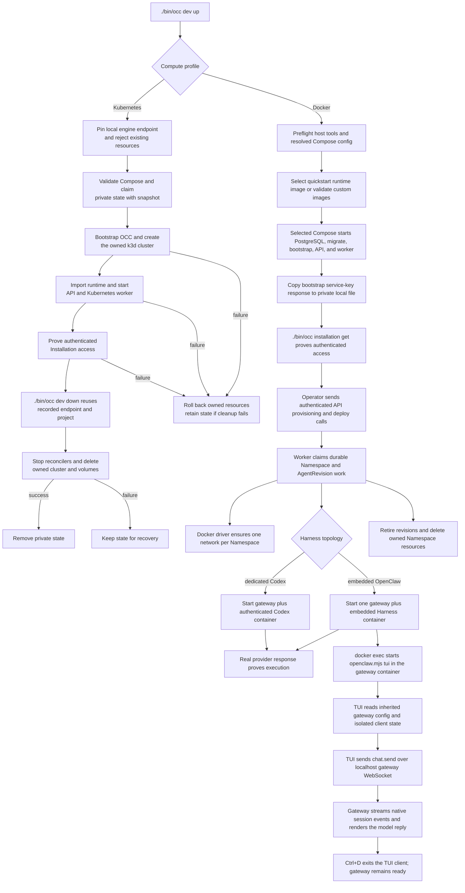

# Compose development flow

## Overview

`./bin/occ dev up` starts local OpenClaw Enterprise development from a checkout.
The `scripts/dev-up` entry point selects the same profile. Setting
`OCC_DEVELOPMENT_COMPUTE_DRIVER=kubernetes` keeps OCC in Compose but dispatches
Compute to the [local k3d profile](../guides/deploy/local-kubernetes-development.md).
The Kubernetes branch stops after authenticated API and worker readiness;
Agent execution continues through the selected Kubernetes Compute Driver.
For Docker Compute, the helper performs host preflight, selects Docker Engine
or Podman, selects or verifies runtime images, wraps the selected Compose
implementation, waits for PostgreSQL migration, Installation bootstrap,
API health, and worker readiness, then proves authenticated `/installation`
access with a protected local copy of the bootstrap service key. That startup
proof does not create an Agent, deploy an AgentRevision, or start a TUI. The
Podman real-runtime proof continues through isolated Namespace creation, one
embedded OpenClaw Agent, dedicated Codex recovery, and provider-backed nonce
responses. Interactive TUI execution remains Docker-verified.

After startup, the operator uses authenticated API calls to select a Namespace,
create a Configuration and Agent, then deploy it. The worker then claims durable
work, invokes the Docker Compute Driver, and starts real OpenClaw/Codex runtime
containers with the independently supplied provider key. The development TUI
path attaches with `docker exec` inside the Agent-owned embedded gateway
container and uses that container's inherited gateway configuration to reach the
live Agent runtime. This flow stops after the worker has reconciled
Docker-backed runtimes, the TUI client has exited, and cleanup for development
resources is understood.

Use the [deployment guide](../guides/deploy.md) for setup, API provisioning,
TUI attachment, and shutdown, and the [quickstart](../guides/quickstart.md) for
the first authenticated development API checks.

## Entry Points

- Trigger: `./bin/occ dev up [--key-output PATH] [-- COMPOSE_GLOBAL_OPTIONS...]`
  from the repository root, followed by authenticated API calls and Agent
  provisioning. Interactive `docker exec -it` TUI attachment remains
  Docker-only.
- Source: `scripts/dev-up:require_command`, `internal/occdev/up.go:Up`, and
  `internal/occdev/down.go:Down`.
- Assumptions: Docker Engine with Docker Compose, or Podman with
  `podman-compose` and `yq` v4, is available; Bash, `curl`, and Python 3 are
  available for the Docker profile; `pnpm cli:build` has created executable
  `bin/occ`; PostgreSQL can write `occ_postgres_data`; the controller can write
  `occ_configuration_data` at `/app/.development/configurations`; runtime
  images are supplied through `OCC_DOCKER_GATEWAY_IMAGE` and
  `OCC_DOCKER_AGENT_IMAGE`, shared `OCC_DOCKER_RUNTIME_IMAGE`, or the helper's
  default quickstart runtime image; `OPENAI_API_KEY` is present in the
  Compose-starting environment or protected `.env` before the worker starts;
  the API is published only on host loopback; the TUI runs from an interactive
  terminal attached with `docker exec -it`.

The Kubernetes profile additionally uses `compose.kubernetes.yaml`,
`internal/occdev`, k3d, and kubectl. `./bin/occ dev down` owns profile cleanup;
`scripts/dev-down` dispatches to it. The local Kubernetes development guide
owns the operator procedure and destructive cleanup boundary.

## Flow

## Execution Trace

### 1–5. Start and initialize the local stack

`scripts/dev-up:require_command`, `compose.yaml:services.postgres`.

[Docker or Podman Compose startup](docker-compose-development/startup.md) covers engine and image selection, PostgreSQL/migration/bootstrap ordering, local API admission, and worker startup.

### 6–11. Deploy an Agent, run the TUI, and clean up

`apps/controller/src/worker.ts:ControllerWorker`,
`apps/controller/src/drivers/compute/docker/index.ts:DockerComputeDriver`.

[Docker-compatible Agent execution and cleanup](docker-compose-development/agent-execution.md) continues through authenticated deployment, network/container ownership, credential placement, TUI dispatch, and resource removal.

### 12. Start and clean up Kubernetes development

`internal/occdev/up.go:Up`, `internal/occdev/down.go:Down`.

[The Kubernetes startup and cleanup trace](docker-compose-development/startup.md#12-select-kubernetes-development-and-preserve-cleanup-ownership)
follows profile selection, the private Compose snapshot, k3d creation, runtime
import, authenticated readiness, and cleanup through the recorded engine.

## Debugging and Verification

- `./scripts/dev-up` should show PostgreSQL readiness, migration completion,
  API listening on `127.0.0.1:${OPENCLAW_DEV_PORT:-3000}`,
  fresh-database initialization, `worker.started` with `computeDriverId` set to
  `compute-docker-development`, a private copied service-key path, and a
  successful authenticated `/installation` proof.
- With `OCC_DEVELOPMENT_COMPUTE_DRIVER=kubernetes`, startup should instead
  report Kubernetes Compute, a private kubeconfig, and the disposable k3d
  context; it does not mount the engine socket into the Kubernetes worker.
- Podman startup verification should show Podman as the selected engine, mount
  only its reported API socket into the worker, and complete the same
  authenticated Installation proof without a `docker` alias.
- `<engine> network ls --filter label=org.openclaw.enterprise.compute-driver=docker`
  should show one owned network for each ready development Namespace.
- `<engine> ps --filter label=org.openclaw.enterprise.compute-driver=docker`
  should show one embedded gateway container or a dedicated gateway plus Codex
  container for deployed revisions.
- The deployment guide owns authenticated API provisioning, gateway discovery,
  and local service-key copy cleanup before TUI attach; this flow records the
  selected container's runtime path after that operator procedure completes.
- `tests/integration/docker-compute-real.test.mjs:assertInteractiveTuiConversation`
  should reject an invalid gateway token, produce two model-backed replies in
  one TUI session, exit the client with Ctrl+D, and leave the gateway ready.
- The Docker Compose integration test must read the singleton Installation and
  perform API deployment with the bootstrap service administrator key through the worker and receive a real provider response containing
  a fresh nonce for both embedded and dedicated topologies. It may invoke the
  gateway through the Namespace network or through the Docker-published
  `127.0.0.1` gateway port.
- With `OCC_TEST_PODMAN_COMPUTE_REAL=1`, that same test file runs the embedded
  and dedicated recovery journeys and must receive real nonce responses before exact resource
  teardown passes.
- After Namespace deletion, the matching labeled containers and network should
  be absent while unrelated Namespaces remain.

## Related docs

- [Deployment guide: development and production](../guides/deploy.md)
- [Deployment guide: development end-to-end TUI](../guides/deploy/local-operations.md#development-end-to-end-tui)
- [Local Kubernetes development](../guides/deploy/local-kubernetes-development.md)
- [Quickstart](../guides/quickstart.md)
- [Controller worker execution flow](controller-worker.md)
- [Docker Compute Driver on Docker or Podman](../reference/drivers/docker-compute.md)
- [Controller worker](../reference/controller.md)
- [Configuration reference](../reference/settings.md)
- [ComputeDriver contract](../reference/drivers/compute.md)
- [Harness execution topology flow](harness-execution-topology.md)
- [Platform startup flow](platform-startup.md)

## Manual Notes

[keep this for the user to add notes. do not change between edits]

## Changelog

- 2026-09-17 16:47: Merge current main's Podman dedicated recovery proof and checkout-local CLI requirement while preserving the Kubernetes lifecycle trace. (01a0ae15-3bad-7d92-92b7-f8be208cbb49 - b13b2f479f824891ab3c5bf71e6851d704dba458)

- 2026-09-17 06:42: Trace the accompanying Go CLI development lifecycle, Kubernetes startup and cleanup ownership, and retained Docker startup path. (01a0ae15-3bad-7d92-92b7-f8be208cbb49 - 14ad14c04deeeaa79f325b14d492ab13730adc7f)

- 2026-09-09: Added automatic Podman selection, API socket delivery, Podman
  status and bootstrap-copy handling, and the Docker-only Fluentd and Agent
  runtime verification boundaries while retaining the Docker Compose path.

- 2026-09-01 22:09: Document explicit runtime image rebuilding and link packaged-plugin and Codex compatibility checks. (01a05f89-ff1c-7643-a77f-7e1e3aed9e5f - 5fa47a6)

- 2026-09-01 19:09: Merge the development startup trace into the canonical Docker Compose flow and clarify the `dev-up` readiness proof versus later API deployment and TUI attachment. (01a05f95-dd80-7011-990f-d1c46b5bb3cc - aa366c49c44834d59f74994c5fd37fb8096f169f)
- 2026-08-31 20:33: Trace the shared installation initializer, startup ordering, and initializer-owned credential delivery. (01a05a3d-526f-7553-8cd8-070bd1847acb - b6f213cbcee11ba3dd69886c936c7e5abe233eb3)

- 2026-08-31 19:14: Document bootstrap service-key API access and operator credential cleanup for the TUI path. (codex/01a05a3d-526f-7553-8cd8-070bd1847acb - 06c4bccb95543d3d545d011e72074f805f339aa8)

- 2026-08-31 17:45: Align bootstrap identity and protected service-key storage with the current startup path. (codex/01a05a69-3fbe-7441-9e6d-20394758cf94 - 0797098646028ac00cb26cd4afcbc9b2cf8bcb24)
- 2026-08-31 15:40: Added the compact development TUI runtime trace and two-turn verification boundary. (01a059f9-e5cc-7b01-9479-0c5087f5e58f - 3a04cee)
- 2026-08-28 17:54: Clarified the Docker workload execution boundary and linked operator setup, quickstart, and worker traces. (01a036f4-cf1d-7cc1-bbc1-000879038ac8 - 4270aa29b7015562049f46c6027962fd85b584a9)
- 2026-08-25 10:13: Removed the deleted bootstrap sidecar/script from the Compose flow and documented controller-owned fresh-database self-bootstrap. (01a03630-cd9f-7352-9e64-1d30de98c7dd - c56867448b187304723d20043dd5a0e184736ef2)
- 2026-08-25 08:46: Clarified that Docker E2E verification may invoke gateways through Namespace networking or published loopback ports. (01a03630-cd9f-7352-9e64-1d30de98c7dd - 949e57ba008486c7ad60978df79dc53cce31bee9)
- 2026-08-24 22:43: Added API-only filesystem Configuration Driver volume boundaries and removed stale Docker subnet knobs. (01a03630-cd9f-7352-9e64-1d30de98c7dd - 63890cf94cfc15f848f62f8f957eb766d2101f55)
- 2026-08-24 21:40: Documented Docker Compose development startup and Docker Compute Driver runtime flow. (01a03630-cd9f-7352-9e64-1d30de98c7dd - 63890cf94cfc15f848f62f8f957eb766d2101f55)
