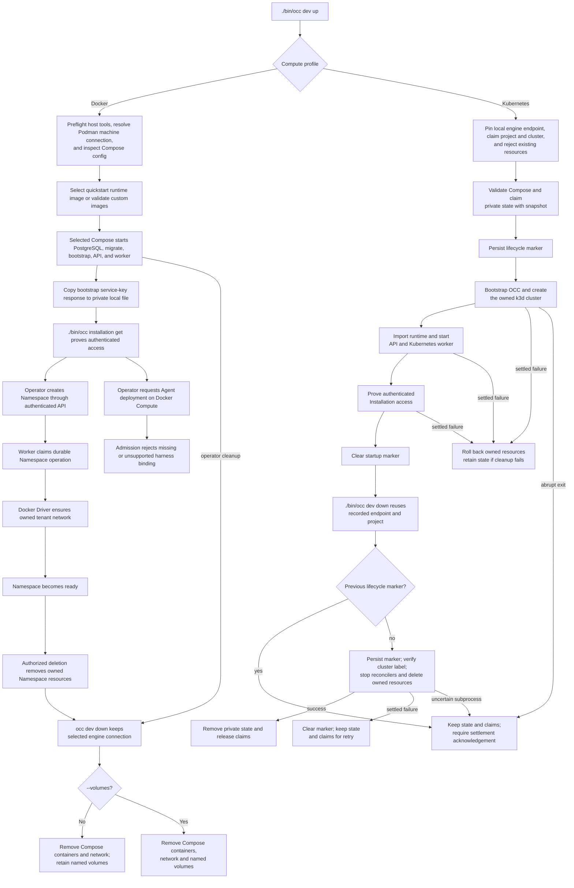

# Compose development flow

## Overview

`./bin/occ dev up` starts local OpenClaw Enterprise development from a checkout.
The `scripts/dev-up` entry point selects the same profile. Docker Compute is
selected by default. Setting `OCC_DEVELOPMENT_COMPUTE_DRIVER=kubernetes` keeps
OCC in Compose but dispatches Compute to the
[local k3d profile](../guides/deploy/local-kubernetes-development.md).
Both profiles perform host preflight, select Docker Engine or Podman, prepare
runtime images, start Compose, and wait for PostgreSQL migration, Installation
bootstrap, API health, and worker readiness. Startup proves authenticated
Installation access with a protected local bootstrap service key; it does not
create an Agent or prove model execution.

For Docker Compute, the worker can reconcile Namespace infrastructure, but
Agent deployment stops at harness authentication admission because Docker
Compute rejects bindings. Kubernetes Agent execution continues through the
selected Kubernetes Compute Driver and the
[authenticated Agent deployment procedure](../guides/deploy/production-agents.md).

## Entry Points

- Trigger: `./bin/occ dev up [--key-output PATH] [-- COMPOSE_GLOBAL_OPTIONS...]`
  from the repository root, followed by authenticated Namespace operations.
- Source: `scripts/dev-up:require_command`, `internal/occdev/up.go:Up`, and
  `internal/occdev/down.go:Down`.
- Assumptions: Docker Engine with Compose, or Podman with `podman-compose`;
  Bash, curl, Python 3, and `yq` v4 for the Docker profile; writable PostgreSQL
  and Configuration volumes; loopback API publication; executable `bin/occ`
  built with `pnpm cli:build`. Startup needs no model credential.

The Kubernetes profile additionally uses `compose.kubernetes.yaml`,
`internal/occdev`, k3d, and kubectl. `./bin/occ dev down` owns profile cleanup;
`scripts/dev-down` dispatches to it. The local Kubernetes development guide
owns the operator procedure and destructive cleanup boundary.

## Flow

## Execution Trace

### 1. Start and initialize the local stack

`scripts/dev-up`, `apps/controller/src/server.mjs:start`

[Docker or Podman Compose startup](docker-compose-development/startup.md) owns
engine selection, database initialization, local API admission and worker startup.

### 2. Prepare Namespace infrastructure and enforce Agent admission

`apps/controller/src/drivers/compute/docker/index.ts:DockerComputeDriver`

[Namespace execution and Agent admission](docker-compose-development/agent-execution.md)
traces API authorization, durable work, tenant network ownership, unsupported
Agent authentication and exact resource removal.

### 3. Clean up Docker or Podman Compose

`internal/occdev/down.go:Down`, `internal/occdev/down.go:podmanComposeArgs`

`occ dev down` uses the selected engine and forwarded Compose project and file
options, including after partial startup. Podman retains the caller's selected
connection. Its reported API socket supplies `OCC_CONTAINER_ENGINE_SOCKET` only
to resolve the worker mount; a socket inside a macOS VM is not substituted for
the host connection. An unavailable engine or invalid socket fails cleanup.
Docker selection checks the required engine and Compose capabilities; missing
optional version metadata does not prevent the printed cleanup command from working.

Compose removes its project containers and network. Named database,
Configuration, and bootstrap volumes remain unless `--volumes` is explicit.
Agent-owned containers and Namespace networks remain the responsibility of
their platform deletion workflows; follow [safe development shutdown](../guides/deploy/local-operations.md#stop-development-safely).

### 4. Start and clean up Kubernetes development

`internal/occdev/up.go:Up`, `internal/occdev/down.go:Down`.

[The Kubernetes startup and cleanup trace](docker-compose-development/startup.md#12-select-kubernetes-development-and-preserve-cleanup-ownership)
follows profile selection, the private Compose snapshot, k3d creation, runtime
import, authenticated readiness, and cleanup through the recorded engine.
`internal/occdev/up.go:Up` validates an explicit immutable K3s image and the 32-character cluster-name
limit before acquiring claims or mutating resources; otherwise k3d resolves `+v1.35`.
`internal/occdev/kubernetes.go:writeKubeconfigs` checks the actual server belongs
to the tested 1.35 series before runtime import or controller startup. A version
failure follows the existing owned-resource rollback.

## Debugging and Verification

- `./scripts/dev-up` should show PostgreSQL readiness, migration completion,
  API listening on `127.0.0.1:${OPENCLAW_DEV_PORT:-3000}`,
  fresh-database initialization, `worker.started` with `computeDriverId` set to
  `compute-docker-development`, a private copied service-key path, and a
  successful authenticated `/installation` proof.
- With `OCC_DEVELOPMENT_COMPUTE_DRIVER=kubernetes`, startup should instead
  report Kubernetes Compute, a private kubeconfig, and the disposable k3d
  context; it does not mount the engine socket into the Kubernetes worker.
- Docker Compute on Podman startup verification should show Podman as the
  selected engine, mount only its reported API socket into the worker, and
  complete the same authenticated Installation proof without a `docker` alias.
  The [startup flow](docker-compose-development/startup.md) documents the macOS
  prerequisite.
- `<engine> network ls --filter label=org.openclaw.enterprise.compute-driver=docker`
  should show the owned network for a ready development Namespace.
- Docker Compute Agent deployment must reject a missing or unsupported harness binding before
  workload creation. A worker `OPENAI_API_KEY` cannot make it supported.
- Retained Docker/Podman model suites currently cannot pass through this admission
  boundary. See [Docker test status](../testing/docker.md); old model-turn evidence
  does not establish current support.
- Namespace deletion removes its owned resources while preserving unrelated ones.
- The [real Compose cleanup case](../testing/docker.md#verify-compose-cleanup)
  verifies the compiled CLI against a partially started project, including volume
  retention and explicit deletion on the selected engine connection.

## Related docs

- [Development and production deployment](../guides/deploy.md)
- [Local Kubernetes development](../guides/deploy/local-kubernetes-development.md)
- [Quickstart](../guides/quickstart.md)
- [Docker Compute Driver](../reference/drivers/docker-compute.md)
- [Kubernetes Agent deployment and TUI](../guides/deploy/production-agents.md)
- [Controller worker flow](controller-worker.md)

## Manual Notes

[keep this for the user to add notes. do not change between edits]

## Changelog

- 2026-09-23 06:45: Add immutable node-image selection and running-server validation to the Kubernetes development lifecycle. (authoring-run/9a6190e4-c1e1-4558-9d33-f1f607e97ed9 - 9fd571c903db203a231823c9d49597d0d0702f85)

- 2026-09-22 23:45: Require successful mutating helpers and independently drained captured output before clearing lifecycle protection. (843154d6710e1e572263be15637e18f8ca5d51f1)

- 2026-09-22 23:14: Persist lifecycle markers before Kubernetes resource mutations and require settlement after abrupt CLI death. (authoring-run/fb7eab38-3647-49c9-af80-7d3a90173b7f - a44c467b2807e1c9b7b6e1aad26cc38b9ab26108)

- 2026-09-22 22:42: Bind Kubernetes cleanup to durable resource claims and native cluster ownership, preserve uncertain subprocess recovery, and align Docker capability selection. (authoring-run/6e5d1288-491b-499b-8597-47a5787fba27 - f0147ea18a4d46f69580ffc83b8b296ca835775b)

- 2026-09-17 17:42: Pin Kubernetes development to the supported 1.35 family and emit only runtime settings accepted by the current Kubernetes Compute Driver schema. (authoring-run/b044b43c-e713-4006-93a0-c129cdf5578e - 9310d5b025e84f885e4f7facae2e2906b50d58f8)

- 2026-09-17 16:21: Preserve Podman's host connection during Compose cleanup and verify explicit volume deletion with the real CLI and engine. (authoring-run/566921ff-3342-4dec-aa19-110acc8aa1e4 - 58ead9943ee6b2560eea2c327967b50a30f7644e)

- 2026-09-17 16:47: Merge current main's Podman dedicated recovery proof and checkout-local CLI requirement while preserving the Kubernetes lifecycle trace. (01a0ae15-3bad-7d92-92b7-f8be208cbb49 - b13b2f479f824891ab3c5bf71e6851d704dba458)

- 2026-09-17 14:32: Resolve the effective macOS Podman machine connection, trust its private gateway only for rootful Compose, and retain bridge-CIDR admission for rootless Compose. (authoring-run/07150374-b371-440a-92f7-9d53dedb9512 - 309c5c38702d026e09df703d7e79c2c9eb2d570c)

- 2026-09-17 06:42: Trace the accompanying Go CLI development lifecycle, Kubernetes startup and cleanup ownership, and retained Docker startup path. (01a0ae15-3bad-7d92-92b7-f8be208cbb49 - 14ad14c04deeeaa79f325b14d492ab13730adc7f)

- 2026-09-17 00:48: Correct current harness admission and metadata-only dispatch boundaries after implementation review. (01a0acbf-4d5a-7413-9411-dce911f3ad23 - 107900e9551b90c3e9ac24d30f8ea866f17e5dbb)

- 2026-09-09: Added automatic Podman selection, API socket delivery, Podman
  status and bootstrap-copy handling, and the Docker-only Fluentd and Agent
  runtime verification boundaries while retaining the Docker Compose path.

- 2026-09-01 22:09: Document explicit runtime image rebuilding and link packaged-plugin and Codex compatibility checks. (01a05f89-ff1c-7643-a77f-7e1e3aed9e5f - 5fa47a6)

- 2026-09-01 19:09: Merge the development startup trace into the canonical Docker Compose flow and clarify the `dev-up` readiness proof versus later API deployment and TUI attachment. (01a05f95-dd80-7011-990f-d1c46b5bb3cc - aa366c49c44834d59f74994c5fd37fb8096f169f)
- 2026-08-31 20:33: Trace the shared installation initializer, startup ordering, and initializer-owned credential delivery. (01a05a3d-526f-7553-8cd8-070bd1847acb - b6f213cbcee11ba3dd69886c936c7e5abe233eb3)

- 2026-08-31 19:14: Document bootstrap service-key API access and operator credential cleanup for the TUI path. (codex/01a05a3d-526f-7553-8cd8-070bd1847acb - 06c4bccb95543d3d545d011e72074f805f339aa8)

- 2026-08-31 17:45: Align bootstrap identity and protected service-key storage with the current startup path. (codex/01a05a69-3fbe-7441-9e6d-20394758cf94 - 0797098646028ac00cb26cd4afcbc9b2cf8bcb24)
- 2026-08-31 15:40: Added the compact development TUI runtime trace and two-turn verification boundary. (01a059f9-e5cc-7b01-9479-0c5087f5e58f - 3a04cee)
- 2026-08-28 17:54: Clarified the Docker workload execution boundary and linked operator setup, quickstart, and worker traces. (01a036f4-cf1d-7cc1-bbc1-000879038ac8 - 4270aa29b7015562049f46c6027962fd85b584a9)
- 2026-08-25 10:13: Removed the deleted bootstrap sidecar/script from the Compose flow and documented controller-owned fresh-database self-bootstrap. (01a03630-cd9f-7352-9e64-1d30de98c7dd - c56867448b187304723d20043dd5a0e184736ef2)
- 2026-08-25 08:46: Clarified that Docker E2E verification may invoke gateways through Namespace networking or published loopback ports. (01a03630-cd9f-7352-9e64-1d30de98c7dd - 949e57ba008486c7ad60978df79dc53cce31bee9)
- 2026-08-24 22:43: Added API-only filesystem Configuration Driver volume boundaries and removed stale Docker subnet knobs. (01a03630-cd9f-7352-9e64-1d30de98c7dd - 63890cf94cfc15f848f62f8f957eb766d2101f55)
- 2026-08-24 21:40: Documented Docker Compose development startup and Docker Compute Driver runtime flow. (01a03630-cd9f-7352-9e64-1d30de98c7dd - 63890cf94cfc15f848f62f8f957eb766d2101f55)
