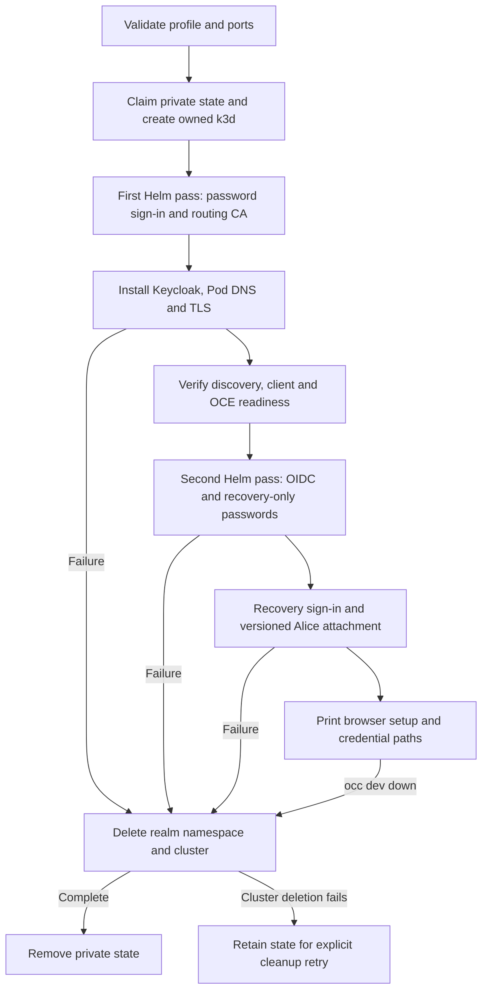

# Local Keycloak startup and teardown

## Overview

Trace `occ dev up` with the optional Keycloak profile through OIDC administrator
sign-in, then startup rollback or `occ dev down`. This is a disposable development
Installation; see the [operator procedure](../../guides/deploy/local-kubernetes-development.md#sign-in-through-keycloak).

## Entry Points

- `internal/occdev/up.go:Up`: selects the validated Kubernetes-only profile.
- `internal/occdev/openshell_k3d.go:upK3d`: owns provisioning and failure cleanup.
- `internal/occdev/down.go:Down`: validates private state before teardown.

## Flow

## Execution Trace

### 1. Validate before claiming resources

`internal/occdev/openshell_k3d.go:upK3d`.

`OCC_DEVELOPMENT_SIGN_IN=keycloak` requires Kubernetes compute and control plane
with sandbox `none`. Before claiming state, startup rejects another publication
on reserved port 443 and checks that no listener already serves it. The engine
must also be able to bind and forward that port. k3d publishes
`127.0.0.1:443` to NodePort 30443; the dedicated Envoy listener forwards to
Keycloak on port 8080. The API's NetworkPolicy permits the Envoy Pod's post-DNAT
port 10443 without opening general egress.

### 2. Provision the realm and its network path

`internal/occdev/keycloak_k3d.go:installDevelopmentKeycloak`.

The first Helm pass installs OCE with password sign-in and its gateway-routing
CA. Startup then installs the pinned Keycloak image and shared realm in
`occ-development-keycloak`, storing generated credentials in private state files.
A local-path volume preserves the realm across Pod restarts. A CoreDNS rewrite
maps the Keycloak hostname to the Envoy Service, and startup restarts CoreDNS to
load it; the launcher prints the host's manual hosts-file entry separately.
It waits for the routing CA's listener certificate, copies the TLS Secret into
the Keycloak namespace once, and writes `gateway-ca.crt` for browser trust.
HTTPS discovery through the host publication and admin-API client-secret and
redirect-URI readback must succeed. The installation-time realm-hash warning
is not continuous drift detection; ordinary `up` rejects existing state/clusters.

### 3. Enable OIDC and attach the administrator

`internal/occdev/keycloak_k3d.go:signInDevelopmentKeycloak`.

After OCE readiness, the launcher signs in through the verified Console HTTPS
endpoint with the bootstrap password and reads the administrator's ID. It
reads the dedicated Envoy Service through the owned kubeconfig and context.
The Service identity, Gateway ownership labels and selectors, TLS ports and
ClusterIP addresses must validate before any second-pass change. Startup sets
`auth.oidc.egressCidrs` to those exact IPv4 `/32` hosts, retaining the
selector-scoped post-DNAT 10443 rule; an absent or invalid Service fails closed. The existing chart accepts IPv4
CIDRs only, so an IPv6 Service is rejected before the second pass.
It replaces `helm-values.json` with complete second-pass values, applies the OIDC
client Secret, and runs Helm again. That pass enables OIDC and recovery-only
passwords and disables native Agent browser administration for host-only cookies.
Once the API advertises OIDC, the launcher obtains a fresh recovery session and
reads the account version. It attaches Alice's fixed subject through the real
account API with `expectedVersion`; attachment invalidates existing account
sessions. The launcher does not retry the identity mutation. Startup then prints
the Console URL, credential paths, both CAs and hosts instructions. See the
[operator procedure](../../guides/deploy/local-kubernetes-development.md#sign-in-through-keycloak).

### 4. Remove owned state or retain it for recovery

`internal/occdev/down.go:Down`, `internal/occdev/down.go:cleanup`.

Startup failure and `occ dev down` use the recorded engine endpoint, private
kubeconfig and exact context. Cleanup deletes the Keycloak namespace and realm
volume first, then the cluster. Namespace deletion failure warns; cluster
deletion failure preserves private state for `occ dev down` recovery. Successful
cleanup removes the state directory. Teardown is destructive to the realm;
manual host entries and browser CA imports remain the operator's responsibility.
Certificate renewal is not propagated to the copied Secret by this launcher.

## Debugging and Verification

Run the [real launcher cases](../../testing/keycloak.md#local-launcher-coverage)
only with their owned disposable fixture. They cover browser login, recovery,
realm persistence, second-pass failure and cleanup. After the OIDC upgrade, API
probes must reach Keycloak and reject unrelated HTTPS between successful
listener controls; automated certificate pins
do not verify a human browser's CA import. The realm-hash warning runs only at
installation. A retained-state error names the directory needed by `occ dev down`;
repair access to its recorded engine and cluster before retrying cleanup.

## Related docs

- [Development startup](startup.md).
- [Local Kubernetes development](../../guides/deploy/local-kubernetes-development.md).
- [OIDC sign-in](../../guides/deploy/oidc-sign-in.md).

## Manual Notes

[keep this for the user to add notes. do not change between edits]

## Changelog

- 2026-10-08 09:57: Documented Keycloak egress repair and manual qualification. (authoring-run/e5c12029-7b1c-4214-a4b9-bde04d03ab41 - 12719f1d366291b774eb9d4948be451c9dd7d805)

- 2026-10-07 23:35: Traced optional Keycloak startup and cleanup. (authoring-run/aaa97aa0-d766-4366-af99-089d183c088a - c14b315969527a4e1f3fc3bd525e54d2ed5ec030)
