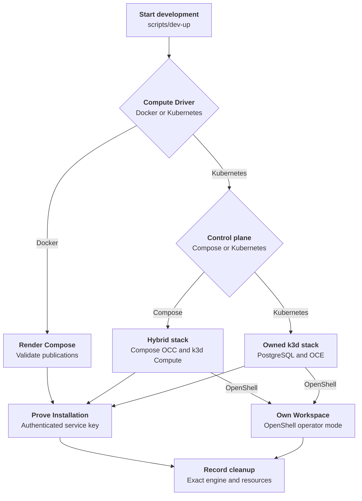

# Compose development startup

Trace host preflight, database initialization, and API/worker startup. See the [parent flow](../docker-compose-development.md) for its context and overall sequence.

## Overview

`scripts/dev-up` selects Docker or Kubernetes Compute and starts the requested
development topology from a checkout. Docker Compute and Compose-backed
Kubernetes profiles run PostgreSQL, migration, bootstrap, the API, and the
worker in Compose. The explicitly selected Kubernetes-only profile runs those
services in the owned k3d cluster. This flow ends after authenticated Installation and
bootstrap Namespace readiness; OpenShell also requires Workspace readiness.

## Entry Points

- Trigger: `./scripts/dev-up [--key-output PATH] [-- COMPOSE_GLOBAL_OPTIONS...]`.
- Source: `scripts/dev-up:require_command`
- Source: `internal/occdev/up.go:Up`
- Source: `internal/occdev/openshell_k3d.go:upK3d`
- Assumptions: the checkout-local OCC CLI is built; the selected container
  engine is running; Kubernetes profiles also have k3d and kubectl; Kubernetes-only and OpenShell
  profiles require Helm, and OpenShell requires its pinned or selected assets.

## Flow

## Execution trace

### 1. scripts/dev-up: host preflight and runtime image selection

`scripts/dev-up:require_command`, `internal/occdev/compose.go:AnalyzeCompose`,
`deploy/runtime/Dockerfile`

The helper requires the checkout-local `bin/occ` from `pnpm cli:build`, accepts
`--key-output`, and forwards arguments after `--` to Compose. This section traces
the default `OCC_DEVELOPMENT_COMPUTE_DRIVER=docker`. OpenShell requires
Kubernetes Compute. Kubernetes Compute also defaults to the Compose control
plane; explicitly select `OCC_DEVELOPMENT_CONTROL_PLANE=kubernetes` for
[local Kubernetes-only development](../../guides/deploy/local-kubernetes-development.md).

The Docker Compute path first probes a running Docker Engine and the JSON
configuration capability required from Docker Compose. If that probe fails, it
selects `podman` directly; a `docker` compatibility alias is neither required
nor treated as Docker merely because of its name. Podman requires the standalone
`podman-compose` provider and `yq` v4; the helper pins that provider so status
and stopped one-shot container behavior stay consistent.

Docker Compose supplies resolved JSON directly. Podman Compose supplies YAML,
which `dev-up` converts to JSON inside its private temporary directory before
passing it to `./bin/occ dev analyze-compose`. The shared Go analyzer enforces
loopback controller and database publications and resolves the Docker runtime
image selection. The helper appends
`compose.podman.yaml` last so the worker receives Podman's reported API socket
at `/var/run/docker.sock`. The base Docker Compute worker disables SELinux
process labeling because relabeling a host engine socket is unsafe; other
services retain SELinux confinement.
The override also gives migration, bootstrap, API, and worker one shared
development image. Because podman-compose otherwise rebuilds that identical
target once per service, `dev-up` builds it once through the migration service
and starts the stack with `--no-build`. Docker keeps its native `up --build`
path. Expanded configuration and credentials are never printed.

On macOS, run `podman` as your normal host user, without `sudo`. The k3d
workflow requires a rootful Podman machine; rootful describes the VM, not
running `podman` as root on the host.

If neither a shared runtime image nor separate gateway/Agent images are set,
the helper selects `openclaw-enterprise-runtime:quickstart` for this invocation.
It builds that default image with `deploy/runtime/Dockerfile` and the repository-root context only when the image is
missing. Custom image references must already exist; an incomplete custom
selection fails before startup is reported successful.

Existing tags are reused even after the runtime recipe changes. Operators
[rebuild and verify the image](../../../deploy/runtime/README.md#rebuild-an-existing-image)
explicitly to pick up package changes. The runtime recipe owns packaged channel
plugins and gateway/Codex compatibility checks; `dev-up` does not install
missing plugins or verify a model turn.

### 2. compose.yaml:services.postgres and services.migrate

`compose.yaml:services.postgres`, `compose.yaml:services.migrate`

Compose starts PostgreSQL first and keeps its data in the local
`occ_postgres_data` volume. Compose also declares `occ_configuration_data`, but
mounts it only into the controller for development Configuration documents. The
PostgreSQL service uses local-only administrator credentials to initialize the
database and the checked-in local SQL to create the less-privileged
`occ_migrator` and `occ_app` roles.

The migration service waits for PostgreSQL, connects with
`OCC_MIGRATION_DATABASE_URL`, and applies Drizzle migrations. The API and
worker never use the migrator or PostgreSQL administrator URL. `dev-up` invokes
this through Compose; it does not run migration directly.

### 3. Initialize before starting the API or worker

`compose.yaml:services.bootstrap`, `scripts/bootstrap-installation.mjs`

After migration exits `0`, Compose runs the shared initializer with development
inputs. Fresh bootstrap creates the development human administrator, the
non-Agent service administrator, the singleton Installation, native IAM seed,
audit evidence, and the initial service-key response. It also creates the
initial `default` Namespace in `provisioning` state and queues worker
reconciliation; the worker later provisions its backing Docker boundary.
Existing Installations retain their Namespaces, accounts, keys, IAM policy,
configuration, and revision history. Missing, expired, or revoked keys do not
trigger another bootstrap issue.

Only the initializer mounts `occ_bootstrap_data`; the API and worker load
committed state after initializer success. The
[bootstrap flow](../local-password-authentication.md) owns credentials, concurrent
attempts, and failure recovery.

### 4. The API admits only local development traffic

`apps/controller/src/server.mjs:start`,
`apps/controller/src/composition/development-postgres.ts:createDevelopmentConfigurationDriver`,
`apps/controller/src/drivers/configuration/filesystem/index.ts:FilesystemConfigurationDriver`

The API starts in `NODE_ENV=development`, binds inside the Compose network, and
publishes its host port only on `127.0.0.1`. `OCC_AUTH_SECRET` signs user
sessions and `OCC_AUTH_BASE_URL` fixes the cookie origin.

Development accepts the explicitly configured Compose bridge CIDR as local
control-plane traffic, while non-loopback clients, forwarded headers,
caller-supplied identity headers, bearer credentials, and trusted-proxy claims
remain rejected. The API uses the application-role PostgreSQL URL and never
receives the container-engine socket.

After the controller health check passes, `dev-up` waits for the worker
readiness probe before copying the initializer-owned service-key JSON from the
stopped bootstrap container. Docker Compose performs the Docker copy. Because
`podman-compose` has no `cp` command, the helper identifies exactly one scoped
bootstrap container from Compose status labels and invokes `podman cp` by ID.
`--key-output` must name an absent destination in a private operator-owned
directory; otherwise the helper creates a private temporary directory. The
helper never overwrites an existing local file, never prints `data.key`, and
never reruns bootstrap to replace a missing key.

`dev-up` then reads the Installation with `./bin/occ installation get` and the
copied service-key response. `apps/controller/src/auth/index.ts:ControllerAdmissionVerifier.verify`
validates the `x-api-key` and maps it to the Installation-scoped service
administrator; current IAM policy still authorizes each resource operation. The
startup proof succeeds only when the returned resource ID matches the copied
key response's `meta.installationId`. An invalid, expired,
or revoked key fails with `401` without cookie fallback. The
[service-key flow](../service-api-keys.md) owns admission details.

When `OCC_CONFIG_PATH` is absent, PostgreSQL-backed development selects the
filesystem Configuration Driver from `OCC_DEVELOPMENT_CONFIGURATION_ROOT`.
Compose sets that root to `/app/.development/configurations` and backs it with
the `occ_configuration_data` named volume. PostgreSQL remains the OCC metadata
system of record; native Configuration documents live in that driver-owned
volume.

### 5. The worker selects Docker compute and claims durable work

`apps/controller/src/worker.mjs:configuration`

The worker starts after the controller is healthy with the same
application-role `OCC_DATABASE_URL`. When `OCC_CONFIG_PATH` is absent in
development, it selects `compute-docker-development` with implementation
`docker-local`. Setting `OCC_CONFIG_PATH` explicitly selects the trusted Driver
set described by that file instead.

The worker loads the singleton Installation, validates persisted IAM policy,
and polls the PostgreSQL work queue. Startup readiness means the worker can
claim durable work; it does not mean an Agent, AgentRevision, or TUI exists.
Every claimed operation reauthorizes the original actor before calling Compute.
The worker is the only Compose service with Docker-compatible engine access. It
does not mount the configuration volume.

### Kubernetes-only startup

`internal/occdev/openshell_k3d.go:upK3d`,
`internal/occdev/gateway_k3d.go:installDevelopmentRoutingControllers`,
`internal/occdev/repository_k3d.go:enableDevelopmentRepository`.

The Kubernetes-only profile creates its owned k3d cluster in K3s legacy
iptables mode, imports matching OCE images, and runs PostgreSQL, migration,
bootstrap, API, and
worker inside Kubernetes. An explicitly selected IPv4 resolver replaces k3d's
node DNS rewriting; the host resolver is unchanged.

Without OpenShell, it verifies the pinned cert-manager and Envoy Gateway
manifests. It waits for the k3s-owned Gateway API CRDs to be created and
established before installing Envoy, and prints k3s add-on status before rollback
if that wait fails. Before configuring gateway proxy trust,
`internal/occdev/network_k3d.go:verifyDevelopmentNetworkPolicy`
checks allowed and denied direct Pod traffic with credential-free Pods and a
temporary policy. After bootstrap creates the initial Gateway Namespace, it
repeats the checks against the Driver's actual policies. Probe Pods use short
graceful shutdowns and are deleted with UID preconditions. Cleanup waits for
the selector-matching Pods before removing their egress policy; any failed
probe or cleanup prevents startup success. This is a point-in-time, single-node
check, not continuous enforcement.

Before writing the Installation, `scripts/prepare-development-codex-seccomp.mjs`
probes the imported runtime in a credential-free Pod on the owned node. If
`RuntimeDefault` blocks the sandbox, the shared reviewed generator derives a
content-addressed Localhost profile from that node's effective policy. Startup
verifies the loaded policy, workspace and outside-write behavior, and missing
profile failure before selecting it for dedicated Codex containers. Failure
rolls back the owned cluster; the state directory records nonsecret provenance.

Startup waits for the Gateway, certificate, and proxy Pods before reporting
success. Envoy source addresses must fall inside the selected node's Pod CIDR;
the tenant ingress policy must still admit only the Gateway's exact proxy peer.

The loopback development proxy also terminates browser HTTPS using a private
per-installation CA and a leaf limited to that installation's console and Agent
hosts. The API and browser NodePorts are published only to host loopback. The
bootstrap administrator password, service key, and CA private key remain in the
private state directory. Browser CA trust is an explicit operator action.

If repository inputs are selected, startup creates the scoped broker after the
actual initial Namespace exists and waits for authenticated repository-option
discovery. This does not prove a model turn, native sandbox, or Git operation.

### 12. Select Kubernetes development and preserve cleanup ownership

`internal/occdev/command.go:selectEngine`,
`internal/occdev/command.go:pinEndpoint`,
`internal/occdev/command.go:podmanEndpoint`,
`internal/occdev/up.go:Up`.

The ordinary Kubernetes lifecycle, with no Sandbox Driver selected, chooses
Docker or Podman and resolves a host-reachable Unix socket: Docker from the
active context, and Podman from `podman machine inspect` whenever its reported
socket exists only inside a virtual machine. It records that socket with the
Compose project and generated `occ-dev-*` cluster name in a private state
directory. Cleanup validates that state and
reuses the recorded endpoint. Changing the active Docker context after startup
does not redirect cleanup to another engine.

Startup refuses existing cluster or project resources, validates the resolved
Compose publications through `internal/occdev/compose.go:AnalyzeCompose`, and
rejects external or unscoped networks and volumes through
`internal/occdev/up.go:validateResourceOwnership`. It then claims the state directory with an exclusive `0700` creation. It writes the
rendered Compose snapshot privately before creating resources.
`setKubernetesBridgeGateway` preserves an explicit development-network gateway
or derives the first usable address from its rendered subnet before saving the
snapshot. This supplies the bridge gateway k3d requires, including when the
operator overrides the subnet. Startup and
cleanup both use that snapshot, so later `.env` edits cannot change the saved
project configuration.

With `OCC_DEVELOPMENT_CONTROL_PLANE=kubernetes`, Kubernetes Compute branches
before Compose rendering into
`internal/occdev/openshell_k3d.go:upK3d`. That profile uses the engine
only for k3d and image operations, and adds OpenShell only when selected.
Without OpenShell, the Installation selects the bundled Presets and curated
Codex Plugin Driver. Startup copies the generated administrator password and
service key into the private state directory.

When repository inputs are selected, `internal/occdev/repository_k3d.go` first
validates their private directory, explicit Namespace placeholder, profiles, App
key, and approved egress IPv4 `/32` endpoints. After authenticated bootstrap and Namespace
readiness, it substitutes the server-assigned Namespace ID into the immutable
registry, generates a CA and exact-host certificate, creates separate Kubernetes
inputs, and upgrades Helm with the selected Repo Driver and worker sidecar.
Startup compares authenticated repository discovery with the approved references
and profiles. It does not perform Git operations; see the
[local repository procedure](../../guides/deploy/local-repository-credentials.md).

The default `OCC_DEVELOPMENT_CONTROL_PLANE=compose` continues through the
Compose snapshot and startup sequence. An unsupported control-plane value fails
before resource creation. The
[OpenShell provisioning flow](../openshell-sandbox-provisioning.md#0-create-the-development-control-plane)
owns both OpenShell control-plane sequences.

### 13. Bootstrap OCC, create k3d, and prepare runtime configuration

`internal/occdev/up.go:Up`, `internal/occdev/up.go:waitCompleted`,
`internal/occdev/kubernetes.go:writeKubeconfigs`,
`internal/occdev/kubernetes.go:importRuntime`,
`internal/occdev/kubernetes.go:writeInstallation`,
`internal/occdev/openshell.go:prepareOpenShell`.

Compose starts PostgreSQL, migration, and bootstrap. The lifecycle waits for
successful migration and bootstrap exits before creating the dedicated k3d
cluster on the Compose network. With the default Sandbox profile,
`OCC_DEVELOPMENT_K3S_IMAGE` selects the node image; its default `+v1.35`
resolves the latest K3s patch in the 1.35 family. An explicit image avoids the
channel lookup. OpenShell uses its pinned image in both control-plane modes.
The cluster API binds host loopback; creation leaves the default kubeconfig and
current context unchanged.

The host kubeconfig remains owner-readable. The container kubeconfig uses the
cluster's internal load-balancer hostname with TLS verification. The lifecycle
imports the selected local runtime image, resolves its in-cluster digest, and
writes Installation configuration selecting Kubernetes Compute, Configuration,
and Secret Drivers with native IAM. Its runtime section configures the transport
Secret prefix and gateway storage class accepted by the current Compute Driver
schema. Generated Gateway and Harness resource limits allow 2 GiB of memory per
workload; the current runtime can exceed the former 1 GiB limit during startup.
The container configuration and kubeconfig are individually readable by
non-root containers, behind the private host directory, and mounted read-only
into the API and Kubernetes worker. Neither service receives the engine socket.

When Compose mode also selects OpenShell, startup installs the pinned Agent
Sandbox controller and OpenShell Gateway in k3d before starting the API and
worker. The Gateway uses `openshell-system` and a fixed NodePort reachable from
the private Compose network. The generated Sandbox Driver configuration selects
operator workspace mode and includes the rendered workspace-chart resources
that `ensureNamespace` applies for each OCC Namespace.

### 14. Prove readiness and clean up the owned Kubernetes profile

`internal/occdev/up.go:waitReady`, `internal/occdev/up.go:copyAndVerifyKey`,
`internal/occdev/down.go:Down`, `internal/occdev/down.go:cleanup`,
`internal/occdev/state.go:readState`.

The lifecycle starts the API and Kubernetes worker, waits for API health and
worker readiness, copies bootstrap output to a private temporary file, and
uses `occclient` to read the Installation. Its ID must match the bootstrap
response before the final key file is written exclusively. With OpenShell,
startup also waits for the bootstrap Kubernetes Namespace and then for OCC to
report that Namespace ready, which establishes that the Sandbox Driver created
or adopted its operator-mode Workspace.

On failure, startup attempts resource cleanup. Explicit Kubernetes shutdown
validates the marker, state, and Compose snapshot before using the recorded
engine endpoint. Cleanup stops the API and worker before deleting the named
k3d cluster and Compose project volumes. It continues cleanup after individual
errors and retains state when any cleanup step fails. Complete cleanup removes
the state directory and its helper-owned key. A successfully returned external
`--key-output` file remains operator-owned; startup removes a newly written
external key if a later OpenShell readiness step fails.

## Debugging and Verification

- `node --test tests/integration/dev-up.test.mjs` exercises profile selection,
  generated configuration, authenticated readiness, rollback, and cleanup with
  inert external engine and cluster commands.
- `OCC_TEST_DEV_UP_OPENSHELL_REAL=1 node --test tests/integration/dev-up-openshell-k3d-real.test.mjs`
  selects the Kubernetes-only real-cluster proof.
- `OCC_TEST_DEV_UP_OPENSHELL_COMPOSE_REAL=1 node --test tests/integration/dev-up-openshell-k3d-real.test.mjs`
  selects the Compose-backed real-cluster proof.
- A successful startup does not prove Agent creation, model credentials, or a
  model turn. Follow the owning runtime integration procedure for those claims.

## Related docs

- [Return to the parent flow](../docker-compose-development.md).
- [OpenShell Sandbox provisioning](../openshell-sandbox-provisioning.md).
- [Local Kubernetes development](../../guides/deploy/local-kubernetes-development.md).

## Manual Notes

[keep this for the user to add notes. do not change between edits]

## Changelog

- 2026-09-28 00:34: Restored Compose defaults and explicit Kubernetes-only startup. (01a0e441-02f9-70b2-ad45-0a1a5049954a - 201f31d511464133f06e0526bb5545ed1cb27e25)

- 2026-09-27 21:52: Waited for k3s Gateway API CRD creation and establishment before Envoy setup and preserved add-on diagnostics on failure. (01a0e441-02f9-70b2-ad45-0a1a5049954a - 181b0472f9a5a9d422035edf5121d3a15c200cb5)
- 2026-09-27 20:39: Added node-local legacy firewall selection, optional DNS configuration, and startup network-policy enforcement probes. (01a0e441-02f9-70b2-ad45-0a1a5049954a - 181b0472f9a5a9d422035edf5121d3a15c200cb5)
- 2026-09-25 12:23: Added the selectable Compose-backed OpenShell topology and brought the existing startup trace into the current flow-document structure. (authoring-run/a81f3e71-1c8e-4692-8e2e-d462ddacc10b - 64ab72aed5c4926e4a2080ade91d785e531801a2)
