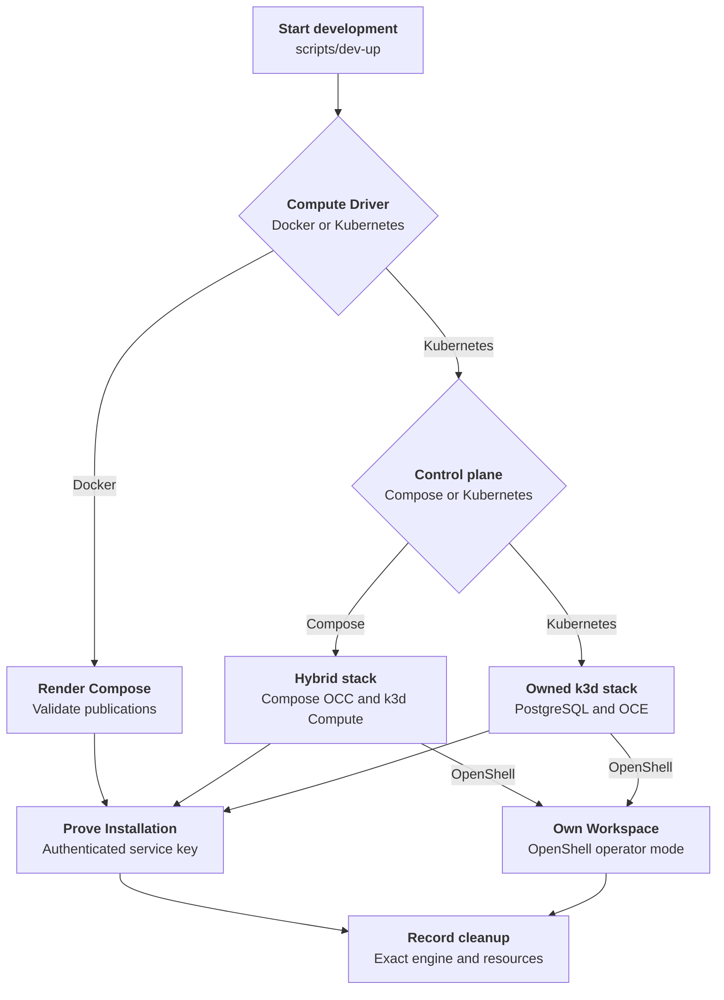

# Compose development startup

Trace host preflight, database initialization, and API/worker startup for the [Compose development flow](../docker-compose-development.md).

## Overview

`scripts/dev-up` selects Docker or Kubernetes Compute and starts the requested
development topology. Docker Compute and Compose-backed
Kubernetes profiles run PostgreSQL, migration, bootstrap, API, and worker in
Compose. The explicitly selected Kubernetes-only profile runs them in the owned
k3d cluster. This flow ends after authenticated Installation and bootstrap
Namespace readiness; OpenShell also requires Workspace readiness.

## Entry Points

- Trigger: `./scripts/dev-up [--key-output PATH] [-- COMPOSE_GLOBAL_OPTIONS...]`.
- Source: `scripts/dev-up:require_command`
- Source: `internal/occdev/up.go:Up`
- Source: `internal/occdev/openshell_k3d.go:upK3d`
- Assumptions: the checkout-local OCC CLI is built; the selected container
  engine is running; Kubernetes profiles also have k3d, kubectl, and, on Podman, root or a
  [rootful machine](../../guides/deploy/local-kubernetes-development.md#start-the-profile); Kubernetes-only and OpenShell
  profiles require Helm, and OpenShell requires its pinned or selected assets.

## Flow

## Execution trace

### 1. scripts/dev-up: host preflight and runtime image selection

`scripts/dev-up:require_command`, `internal/occdev/up.go:Up`,
`internal/occdev/compose.go:AnalyzeCompose`,
`deploy/runtime/Dockerfile`

The helper requires `bin/occ` (`pnpm cli:build`), accepts `--key-output`, and
forwards arguments after `--` to Compose. This section traces Docker Compute;
[step 12](#12-select-kubernetes-development-and-preserve-cleanup-ownership)
selects Kubernetes Compute, which OpenShell requires. Without a Sandbox Driver, Compose Kubernetes startup requires Node before creating resources.

Docker Compute probes Docker Engine and Compose JSON configuration support.
On failure it selects `podman`; a `docker` compatibility alias is neither
required nor sufficient. Podman requires `yq` v4 and the standalone
`podman-compose` provider, which the helper pins so status and stopped one-shot
container behavior stay consistent.

Docker Compose supplies resolved JSON; `dev-up` converts Podman Compose YAML
to JSON in its private temporary directory. The Go analyzer,
`./bin/occ dev analyze-compose`, enforces loopback controller and database
publications and resolves the Docker runtime image selection.
The helper appends
`compose.podman.yaml` last so the worker receives Podman's reported API socket
at `/var/run/docker.sock`. The base Docker Compute worker disables SELinux
process labeling because relabeling a host engine socket is unsafe; other
services retain SELinux confinement.
The override shares one development image across migration, bootstrap, API,
and worker, so `dev-up` builds it once through migration and starts with
`--no-build`; Docker uses `up --build`. Expanded
configuration and credentials are never printed.

If neither a shared runtime image nor separate gateway/Agent images are set,
the helper selects `openclaw-enterprise-runtime:quickstart` for this invocation,
building it with `deploy/runtime/Dockerfile` and the repository-root context
only when missing. Custom image references must already exist; an incomplete
custom selection fails before startup is reported successful.

Existing tags are reused even after the runtime recipe changes;
[rebuild and verify the image](../../../deploy/runtime/README.md#rebuild-an-existing-image)
to pick up package changes. The runtime recipe owns packaged channel
plugins and gateway/Codex compatibility checks; `dev-up` does not install
missing plugins or verify a model turn.

### 2. compose.yaml:services.postgres and services.migrate

`compose.yaml:services.postgres`, `compose.yaml:services.migrate`

Compose starts PostgreSQL first and keeps its data in the local
`occ_postgres_data` volume. PostgreSQL uses local-only administrator credentials
to initialize the database and checked-in local SQL to create the
less-privileged `occ_migrator` and `occ_app` roles.

The migration service waits for PostgreSQL, connects with
`OCC_MIGRATION_DATABASE_URL`, and applies Drizzle migrations. The API and
worker never use the migrator or PostgreSQL administrator URL. `dev-up` invokes
migration through Compose, not directly.

### 3. Initialize before starting the API or worker

`compose.yaml:services.bootstrap`, `scripts/bootstrap-installation.mjs`

After migration exits `0`, Compose runs the shared initializer with development
inputs. Fresh bootstrap creates the human and non-Agent service
administrators, singleton Installation, native IAM seed, audit evidence, and
initial service-key response. It also creates the `default` Namespace in `provisioning` state; worker reconciliation later
provisions its backing Docker boundary. Existing Installations retain their
Namespaces, accounts, keys, IAM policy, configuration, and revision history; a
missing, expired, or revoked key never triggers reissue.

Only the initializer mounts `occ_bootstrap_data`; the API and worker load
committed state after initializer success. The
[bootstrap flow](../local-password-authentication.md) owns credentials, concurrent
attempts, and failure recovery.

### 4. The API admits only local development traffic

`apps/controller/src/server.mjs:start`,
`apps/controller/src/composition/development-postgres.ts:composePostgresDevelopment`,
`apps/controller/src/drivers/configuration/filesystem/index.ts:FilesystemConfigurationDriver`

The API starts in `NODE_ENV=development`, binds inside the Compose network, and
publishes its host port only on `127.0.0.1`. `OCC_AUTH_SECRET` signs user
sessions and `OCC_AUTH_BASE_URL` fixes the cookie origin.

Development accepts the explicitly configured Compose bridge CIDR as local
control-plane traffic, while non-loopback clients, forwarded headers,
caller-supplied identity headers, bearer credentials, and trusted-proxy claims
remain rejected.

After the controller health check passes, `dev-up` waits for the worker
readiness probe before copying the initializer-owned service-key JSON from the
stopped bootstrap container; Docker uses `compose cp`. Because `podman-compose`
has no `cp` command, the helper identifies exactly one scoped bootstrap container from
Compose status labels and invokes `podman cp` by ID.
`--key-output` must name an absent destination in a private operator-owned
directory; otherwise the helper creates a private temporary directory. The
helper never overwrites an existing local file, never prints `data.key`, and
never reruns bootstrap to replace a missing key.

`dev-up` then reads the Installation with `./bin/occ installation get` and the
copied key. `apps/controller/src/auth/index.ts:ControllerAdmissionVerifier.verify`
maps the `x-api-key` to the Installation-scoped service administrator. The
startup proof succeeds only when the returned resource ID matches the copied
key response's `meta.installationId`. The
[service-key flow](../service-api-keys.md#3-verify-the-credential-and-enforce-its-fixed-identity-scope)
owns admission and `401` rejection without cookie fallback; current IAM policy
still authorizes each resource operation.

When `OCC_CONFIG_PATH` is absent, PostgreSQL-backed development selects the
filesystem Configuration Driver from `OCC_DEVELOPMENT_CONFIGURATION_ROOT`.
Compose sets that root to `/app/.development/configurations` and backs it with
the `occ_configuration_data` named volume, mounted only into the controller.
PostgreSQL remains the OCC metadata system of record.

### 5. The worker selects Docker compute and claims durable work

`apps/controller/src/worker.mjs:configuration`

After the controller is healthy, the worker starts with the same
application-role `OCC_DATABASE_URL`. Without `OCC_CONFIG_PATH`, development
selects `compute-docker-development` with implementation `docker-local`;
otherwise it uses the trusted Driver set in that file.

The worker loads the singleton Installation, validates persisted IAM policy,
and polls the PostgreSQL work queue. Readiness means it can claim durable work;
it does not mean an Agent, AgentRevision, or TUI exists. Each claimed operation
reauthorizes the original actor before calling Compute. The worker is the only
Compose service with Docker-compatible engine access.

### Kubernetes-only startup

`internal/occdev/openshell_k3d.go:upK3d`,
`internal/occdev/gateway_k3d.go:installDevelopmentRoutingControllers`,
`internal/occdev/repository_k3d.go:enableDevelopmentRepository`.

Before tool discovery or state creation, `upK3d` requires the platform Namespace
name to match a DNS label of at most 63 characters. Cleanup accepts the historical
Namespace syntax in recorded state, including longer names, and deletes only the
validated recorded cluster through its recorded engine endpoint. All other state
validation and ownership checks still apply.

Both k3d profiles use legacy iptables and honor an explicit IPv4 node resolver
without changing host DNS.
Linux Docker's automatic host resolver selection ignores trailing nameserver
fields, matching glibc parsing.
`internal/occdev/node_dns_k3d.go:checkDevelopmentNodeDNS` fails startup on
refused node DNS. Kubernetes-only startup imports matching OCE images into the
cluster.

Without OpenShell, it verifies the pinned cert-manager and Envoy Gateway
manifests and waits for the k3s-owned Gateway API CRDs before installing Envoy,
printing k3s add-on status before rollback on failure.
`internal/occdev/gateway_k3d.go:waitForCRDEstablished` polls each CRD every
second until `Established`, stopping on a `kubectl` error or startup
timeout. Before configuring gateway proxy trust,
`internal/occdev/network_k3d.go:verifyDevelopmentNetworkPolicy`
checks allowed and denied Pod traffic with credential-free Pods and a temporary
policy, then rechecks the Driver's policies once bootstrap creates the initial
gateway Namespace. Probe Pods use short graceful shutdowns and
UID-preconditioned deletes. Cleanup waits for the selector-matching Pods before
removing their egress policy; any probe or cleanup failure fails startup. The
checks are point-in-time and single-node.

Before writing the Installation, `scripts/prepare-development-codex-seccomp.mjs`
probes the imported runtime in a credential-free Pod on the owned node. If
`RuntimeDefault` blocks the sandbox, the shared reviewed generator derives a
content-addressed Localhost profile from the node's policy and verifies it for
dedicated Codex containers; failure rolls back the owned cluster. The
[local Kubernetes guide](../../guides/deploy/local-kubernetes-development.md#start-the-profile)
owns the verified boundaries and provenance.

Startup waits for the Gateway, certificate, and proxy Pods before reporting
success. Envoy source addresses must fall inside the selected node's Pod CIDR;
the tenant ingress policy must still admit only the Gateway's exact proxy peer.

The loopback development proxy also terminates browser HTTPS using a private
per-installation CA and a leaf limited to that installation's console and Agent
hosts. The API and browser NodePorts publish only to host loopback. The CA private
key stays in the private state directory; browser CA trust is an explicit
operator action.

### 12. Select Kubernetes development and preserve cleanup ownership

`internal/occdev/command.go:selectEngine`,
`internal/occdev/command.go:pinEndpoint`,
`internal/occdev/command.go:podmanEndpoint`,
`internal/occdev/up.go:Up`.

Without a Sandbox Driver, Kubernetes startup selects Docker or Podman and
resolves its host socket from Docker's active context or `podman machine inspect`.
Private state records the socket, Compose project, and `occ-dev-*` cluster.
Cleanup validates and reuses those records, regardless of later context changes.

Startup refuses existing cluster or project resources, validates the resolved
Compose publications through `internal/occdev/compose.go:AnalyzeCompose`, and
rejects external or unscoped networks and volumes through
`internal/occdev/up.go:validateResourceOwnership`. It then claims the state
directory with an exclusive `0700` creation and privately writes the rendered
Compose snapshot before creating resources. Before saving,
`setKubernetesBridgeGateway` preserves an explicit development-network gateway
or derives the first usable address from the rendered subnet, supplying the
bridge gateway k3d requires even when the operator overrides the subnet. Startup
and cleanup both use that snapshot, so later `.env` edits cannot change it.

With `OCC_DEVELOPMENT_CONTROL_PLANE=kubernetes`, Kubernetes Compute branches
into `internal/occdev/openshell_k3d.go:upK3d` before Compose rendering, uses the
engine only for k3d and image operations, and adds OpenShell only when selected.
Without OpenShell, the Installation selects the bundled Presets and curated
Codex Plugin Driver, and startup copies the generated administrator password and
service key into the private state directory.

When repository inputs are selected, `internal/occdev/repository_k3d.go` first
validates them. After authenticated bootstrap and Namespace readiness, it
substitutes the server-assigned Namespace ID into the immutable registry,
generates a CA and exact-host broker certificate, creates separate Kubernetes
inputs, and upgrades Helm with the selected Repo Driver and worker sidecar.
Startup fails unless authenticated repository discovery matches the approved
references and profiles; it proves no model turn, native sandbox, or Git
operation. The
[local repository procedure](../../guides/deploy/local-repository-credentials.md#prepare-the-approved-inputs)
owns the required inputs.

The default `OCC_DEVELOPMENT_CONTROL_PLANE=compose` continues through the
Compose snapshot and startup sequence. An unsupported control-plane value fails
before resource creation. The
[OpenShell provisioning flow](../openshell-sandbox-provisioning.md#0-create-the-development-control-plane)
owns both OpenShell control-plane sequences.

### 13. Bootstrap OCC, create k3d, and prepare runtime configuration

`internal/occdev/up.go:Up`, `internal/occdev/up.go:waitCompleted`,
`internal/occdev/kubernetes.go:writeKubeconfigs`,
`internal/occdev/kubernetes.go:importRuntime`,
`internal/occdev/kubernetes.go:writeInstallation`,
`internal/occdev/openshell.go:prepareOpenShell`.

Compose starts PostgreSQL, migration, and bootstrap. After both one-shot
services exit successfully, startup creates the dedicated k3d cluster on the
Compose network.
With the default Sandbox profile, `OCC_DEVELOPMENT_K3S_IMAGE` selects the node
image; its default `+v1.35` resolves the latest K3s 1.35 patch. An explicit
image skips lookup. OpenShell uses its pinned image in both control-plane modes.
The cluster API binds host loopback; creation leaves the default kubeconfig and
current context unchanged.

The host kubeconfig remains owner-readable. The container kubeconfig uses the
cluster's internal load-balancer hostname with TLS verification. It and the
container configuration are individually readable by non-root containers,
behind the private host directory, and mounted read-only into the API and
Kubernetes worker. Neither service receives the engine socket.

The lifecycle imports the runtime and OpenShell images under engine-recorded
names, including Podman's `localhost/` tags and Docker Hub's familiar names. For
an omitted tag, `internal/occdev/kubernetes.go:engineImageReference` matches
`:latest` and rejects missing or ambiguous matches. It then resolves the
in-cluster digest and writes Installation configuration selecting Kubernetes
Compute, Configuration, and Secret Drivers with native IAM; without OpenShell,
it adds both bundled Presets and the Codex Plugin Driver after the shared Codex
sandbox check. Its runtime section sets the transport Secret prefix and gateway
storage class that the current Compute Driver schema accepts, and memory limits
of 3 GiB per gateway and 6 GiB per Harness.

When Compose mode also selects OpenShell, startup installs the pinned Agent
Sandbox controller and OpenShell Gateway in k3d before starting the API and
worker, and configures the Sandbox Driver for operator workspace mode. The
[OpenShell provisioning flow](../openshell-sandbox-provisioning.md#0-create-the-development-control-plane)
owns OpenShell Gateway placement and per-Namespace workspace resources.

### 14. Prove readiness and clean up the owned Kubernetes profile

`internal/occdev/up.go:waitReady`, `internal/occdev/up.go:copyAndVerifyKey`,
`internal/occdev/down.go:Down`, `internal/occdev/down.go:cleanup`,
`internal/occdev/state.go:readState`.

Startup launches the API and Kubernetes worker, waits for API health and worker
readiness, copies bootstrap output to a private temporary file, and reads the
Installation with `occclient`. Its ID must match the bootstrap response before
the final key file is written exclusively. With OpenShell, startup waits for the
bootstrap Kubernetes Namespace and for OCC to report it ready, proving the
Sandbox Driver created or adopted its operator-mode Workspace.
Namespace readiness and repository discovery bind each OCC request to the
polling deadline and caller cancellation via `occclient.Client.WithContext`.
The original client remains available for later startup operations.

Both Kubernetes profiles pass `OCC_DEVELOPMENT_STARTUP_TIMEOUT_SECONDS` to
`k3d cluster create --timeout`, so a node that never becomes ready fails startup
instead of waiting indefinitely.

On failure, startup attempts resource cleanup. Explicit Kubernetes shutdown
validates the marker, state, and Compose snapshot before using the recorded
engine endpoint. Cleanup stops the API and worker, then deletes the named k3d
cluster and Compose project volumes. It continues past individual errors and
retains state if any step fails; complete cleanup removes the state directory
and its helper-owned key. A successfully returned external
`--key-output` file remains operator-owned; startup removes a newly written
external key if a later OpenShell readiness step fails.

## Debugging and Verification

- `node --test tests/integration/dev-up.test.mjs` exercises profile selection,
  generated configuration, authenticated readiness, rollback, and cleanup with
  inert external engine and cluster commands.
- `OCC_TEST_DEV_UP_OPENSHELL_REAL=1 node --test tests/integration/dev-up-openshell-k3d-real.test.mjs`
  selects the Kubernetes-only real-cluster proof.
- `OCC_TEST_DEV_UP_OPENSHELL_COMPOSE_REAL=1 node --test tests/integration/dev-up-openshell-k3d-real.test.mjs`
  selects the Compose-backed real-cluster proof.
- A successful startup does not prove Agent creation, model credentials, or a
  model turn. Follow the owning runtime integration procedure for those claims.

## Related docs

- [Return to the parent flow](../docker-compose-development.md).
- [OpenShell Sandbox provisioning](../openshell-sandbox-provisioning.md).
- [Local Kubernetes development](../../guides/deploy/local-kubernetes-development.md).

## Manual Notes

[keep this for the user to add notes. do not change between edits]

## Changelog

- 2026-10-04 01:12: Pointed the API startup step at the existing composition function. (authoring-run/286855f7-c7cb-43b6-ba19-419a20192f76 - 7a8a64046ac8ef3e7b5a4ed46b1d4cef9f1573f3)

- 2026-10-02 11:01: Polled CRD status instead of `kubectl wait`. (authoring-run/20771b6e-d59b-4737-8a63-cb33c420218e - 67302dd99e03d28053dbb72ba2569418f6aca1d0)

- 2026-09-30 00:26: Tightened startup prose without changing its behavior. (authoring-run/6c4c7a4c-4674-456a-b1c4-69cec0c52c70 - 282ab1031ff2dd86af00c0c3ff304c9ad442fec1)

- 2026-09-30 00:10: Matched qualified Docker Hub references to recorded familiar names. (authoring-run/b1f9b6de-7c4e-4931-af56-d7be91056814 - 9ec7ad6944f6cad953e4b1e8284bc3e3faf28378)

- 2026-09-30 00:00: Matched implicit image tags and rejected ambiguous names. (authoring-run/bbaa0733-5942-49d5-8bff-1b5354c10117 - 421e85b24aa3a29c5748dde951224082b2c39d71)

- 2026-09-29 20:40: Bound k3d startup timeouts and preflight Node for Compose sandbox preparation. (89a4ccd7-3974-43c6-b08a-be02269a8d01 - cc96e34f33868555d4a89cb44bc022859d76c815)

- 2026-09-28 00:34: Restored Compose defaults and explicit Kubernetes-only startup. (01a0e441-02f9-70b2-ad45-0a1a5049954a - 201f31d511464133f06e0526bb5545ed1cb27e25)

- 2026-09-27 21:52: Waited for k3s Gateway API CRD creation and establishment before Envoy setup and preserved add-on diagnostics on failure. (01a0e441-02f9-70b2-ad45-0a1a5049954a - 181b0472f9a5a9d422035edf5121d3a15c200cb5)
- 2026-09-27 20:39: Added node-local legacy firewall selection, optional DNS configuration, and startup network-policy enforcement probes. (01a0e441-02f9-70b2-ad45-0a1a5049954a - 181b0472f9a5a9d422035edf5121d3a15c200cb5)
- 2026-09-25 12:23: Added the selectable Compose-backed OpenShell topology and brought the existing startup trace into the current flow-document structure. (authoring-run/a81f3e71-1c8e-4692-8e2e-d462ddacc10b - 64ab72aed5c4926e4a2080ade91d785e531801a2)
