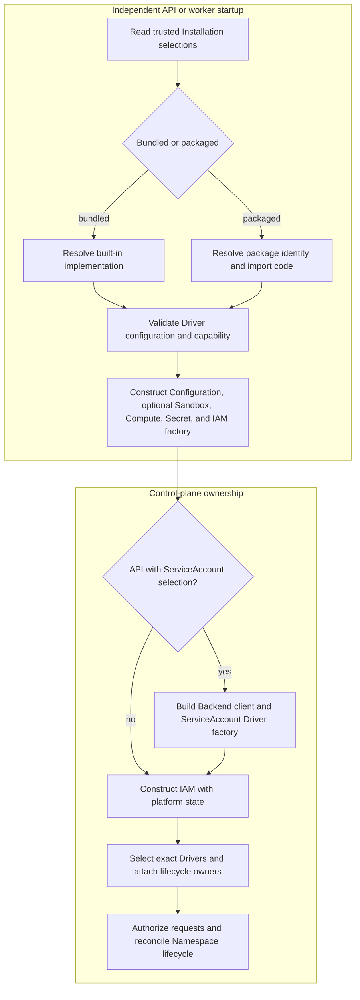

# Installation Driver Package Loading Flow

## Overview

The API and worker independently load trusted Installation YAML and construct
their selected IAM, Compute, Configuration, Secret, and optional Sandbox
capabilities. Only the API constructs the optional Backend client and
ServiceAccount Driver. This trace follows package resolution through process
composition and stops at request serving or worker reconciliation. Development
without startup YAML uses the defaults traced in [platform startup](platform-startup.md).

## Entry Points

- Trigger: Start `apps/controller/src/server.mjs` or
  `apps/controller/src/worker.mjs` with trusted Installation configuration.
- Source:
  `apps/controller/src/composition/installation-config.ts:loadInstallationConfiguration`,
  `apps/controller/src/composition/driver-packages.ts:loadDriverPackage`,
  `apps/controller/src/composition/production.ts:composeProduction`.
- Assumptions: An operator has installed and selected the reviewed package;
  [Install Driver packages](../reference/drivers/selection.md) owns installation,
  package formats, configuration examples, private registries, and deployment.

## Flow

## Execution Trace

### 1. Resolve and validate selected Driver implementations

`apps/controller/src/composition/installation-config.ts:loadInstallationConfiguration`,
`apps/controller/src/composition/driver-packages.ts:loadDriverPackage`

Each process reads the same trusted startup YAML. Configuration, IAM, Compute,
and optional Sandbox selections may name an operator-installed package;
implementation identity comes from its installed metadata. The installed root
`package.json` accepts one leading UTF-8 byte order mark, as Node does; remaining
text must still be a JSON object with the selected name and exact version. Secret selection is
required in this YAML path and accepts only bundled Kubernetes Secrets.
Optional `service_account` selection identifies the bundled Backend member;
it has no package-loading path. The
[operator installation guide](../reference/drivers/selection.md) defines the package,
pinning, registry, and configuration contract. TypeBox checks each selected
Driver's closed schema before implementation-owned semantic validation;
invalid package exports, identity, capability, or lifecycle wiring reject
startup without fallback. The package root export resolver follows Node's
`import()` resolution: `"."` selects a subpath only at the top level (nested, it
is an unmatched condition name), conditions are Node's defaults (`node`,
`import`, `module-sync`, `node-addons`, `default`) in key order, and mixed
subpath and condition keys or numeric keys are invalid. Invalid targets and
unmatched conditions can select a later array entry; a matched null condition
ends that condition branch. The selected target is resolved as a URL inside the
package and percent-decoded; it must name an existing file exactly, with no
extension, directory index or `main` lookup, and an encoded separator or
directory is refused. Package containment, the compiled ESM check, and import
must then succeed before Driver construction. The entry must be `.mjs`, or `.js`
whose nearest `package.json` (searched from the entry's directory up to the
package root, stopping at a `node_modules` directory, as Node's import does)
declares `"type": "module"`. The refusal names that `package.json`, or says the
entry is neither `.mjs` nor `.js`. Unlike Node, the check never detects ESM
syntax in a `.js` file outside a module scope. Missing files and import failures
do not select another target.

For packageless Compute, the exact id `compute-ssh` selects `SshComputeDriver`
with implementation `occ/ssh`. Every other packageless id retains Kubernetes
selection. The [SSH reference](../reference/drivers/ssh-compute.md) owns the host
contract. Its helper is read at module import and sent through bounded SSH
operations; `bindAgent` supplies authoritative Namespace and ServicePrincipal
identity before revision operations.

Installed packages run arbitrary, unsandboxed code with controller database,
credential, Kubernetes, tenant, and authorization authority. An untrusted or
malicious package can violate authorization and tenant isolation; package
validation and lockfile integrity do not establish publisher trust.

### 2. Construct the single authoritative runtime bundle

`apps/controller/src/composition/installation-config.ts:loadInstallationConfiguration`,
`apps/controller/src/composition/driver-packages.ts:createExternalDriver`

The loader constructs Configuration, optional Sandbox, Compute, and Secret
Drivers and returns them with the validated Installation and required
`createIAMDriver(state)` function. A selected Sandbox Driver is passed to bundled
Kubernetes Compute; selecting it with SSH or packaged Compute rejects startup. Bundled and
packaged IAM receive the same controller-owned platform state. The bundled IAM
Driver loads current policy for each identity lookup and authorization decision;
packaged Drivers must do the same, which operator review verifies because the
runtime cannot enforce package internals. Packaged factories must return their exact server-owned capability
and identity.

Kubernetes-specific image and projected-credential requirements apply only to
bundled Kubernetes Compute. SSH preflight verifies local SSH files and probes
each configured host. Startup enforces the
[production revision-stage contract](../reference/drivers/compute.md#production-revision-stages)
before returning any production runtime; development can use a four-operation
Driver, and the worker still fails closed if a required stage becomes unavailable.

### 3. Construct the API-only Backend branch

[`server.mjs:start`](../../apps/controller/src/server.mjs) handles a selected
ServiceAccount Driver after loading the common bundle. It requires PostgreSQL,
Compute credential-storage methods, and an owning Backend definition. It reads
that Backend's `apiKeyPath`, constructs `ChatGPTClient`, and supplies the
ServiceAccount Driver factory to controller composition. The worker keeps only
nonsecret Backend metadata; it constructs neither the client nor this Driver.
The [managed credential flow](service-account-driver-credential-delivery.md)
continues through account creation, issuance, and deployment checks.

### 4. Load current policy and hand off lifecycle ownership

`apps/controller/src/worker.ts:ControllerWorker.start`

API and worker construct separate process-local Driver instances. Production
composition validates persisted policy, creates the selected IAM Driver with
platform state, and selects the exact common Driver identities with OCC. The API
also registers its selected ServiceAccount Driver after composition. Worker
startup checks persisted identities, including Secret and optional Sandbox,
and attaches selected lifecycle owners once.
The bundled IAM Driver loads current policy for identity lookup and
authorization; installed IAM Drivers must honor the same contract. Neither is
rebuilt or replaced after account or policy changes.

OCC owns exact-resource authorization and invokes Compute only during Namespace
or AgentRevision reconciliation. Embedded OpenClaw and dedicated Codex retain
their existing Harness-owned runtime topology.

## Debugging and Verification

- Run `node --test tests/integration/driver-plugin-installation.test.mjs` for
  real installed IAM, Compute, and Configuration packages; production admission;
  IAM allow/deny evidence; Configuration CRUD; and OCC provisioning of
  `/tmp/local-test`.
- Startup failures emit `startup-error` or `worker.startup-error`; inspect
  Driver identity, persisted policy, capability contracts, and lifecycle stages.
- The integration uses `InMemoryPlatformState`; it does not prove a running
  PostgreSQL worker, live Kubernetes, private registry, gateway, or model turn.

## Related docs

- [Install Driver packages](../reference/drivers/selection.md)
- [Platform startup flow](platform-startup.md)
- [Configuration Driver and Agent Revision flow](configuration-driver.md)
- [Compute Driver lifecycle-hook flow](compute-driver-lifecycle-hooks.md)
- [ComputeDriver contract](../reference/drivers/compute.md)

## Manual Notes

[keep this for the user to add notes. do not change between edits]

## Changelog

- 2026-10-10 11:34: Read installed Driver root manifests with Node-compatible leading UTF-8 byte order marks. (authoring-run/cda14eba-9150-4d7e-9956-e276bfed4c64 - f8a837e33b5c03bc0c92065e979485ee06960150)

- 2026-10-09 17:39: Name the deciding `package.json` in the compiled ESM refusal. (fix-962-964)

- 2026-10-09 16:21: Decide a `.js` Driver entry is ESM from its nearest `package.json` scope, as Node's import does, instead of the package root manifest. (fix-956)

- 2026-10-09 15:42: Resolve the Driver package root export as Node's `import()` does (top-level `"."` only, default conditions, exact existing file) and restore the worker entry in Source. (fix-949-950)

- 2026-10-09 22:04: Admit compiled Driver export target arrays through startup and preserve selected-file failure boundaries. (authoring-run/480d2d81-8f6a-43f5-854d-6ce9ee130ea5 - dc95c2261d4b46cff8aca703e13e43cdd71d153e)

- 2026-09-01 19:09: Include Secret and Sandbox construction and the API-only Provider/ServiceAccount branch in the current loading trace. (01a05f95-dd80-7011-990f-d1c46b5bb3cc - aa366c49c44834d59f74994c5fd37fb8096f169f)
- 2026-08-28 17:58: Updated moved feature-reference links for the documentation organization. (01a036f4-cf1d-7cc1-bbc1-000879038ac8 - 4270aa29b7015562049f46c6027962fd85b584a9)
- 2026-08-24 19:46: Pass controller-owned platform state directly to bundled and installed IAM Drivers. (01a036c0-9a0e-7ee0-8428-17824f5172a0 - 786b7ce)
- 2026-08-24 17:12: Documented the controller-owned current-policy loader supplied to bundled and installed IAM Drivers. (01a0352c-debe-73b1-baa6-379855af874f - 4502d7e)
- 2026-08-24 17:12: Removed IAM policy snapshots and Driver rebuilding; bundled and installed IAM Drivers load current policy for every authorization decision. (01a0352c-debe-73b1-baa6-379855af874f - 4502d7e) (NOT_IN_SPEC)
- 2026-08-21 20:53: Consolidated startup phases, linked canonical package and Compute contracts, and clarified unsandboxed authorization and tenant-isolation risk. (01a0269c-0551-7f01-9dfc-ffb2a0896c94 - f6491502262d6190c95d2a910ee46283c30244f9)
- 2026-08-21 20:12: Required both typed Compute revision stages before production startup while preserving four-method development Drivers. (01a0269c-0551-7f01-9dfc-ffb2a0896c94 - b651c4ae38310032f8cda47c868a9b282fb12ff3)
- 2026-08-21 20:05: Consolidated the package flow into runtime order and linked canonical operator guidance; clarified metadata identity, TypeBox, required IAM factory, and unsandboxed authority. (01a0269c-0551-7f01-9dfc-ffb2a0896c94 - b651c4ae38310032f8cda47c868a9b282fb12ff3)
- 2026-08-21 19:28: Enabled all reviewed Driver capabilities in both modes and documented state-aware IAM, structural production Compute, and honestly scoped production-admission proof. (01a0269c-0551-7f01-9dfc-ffb2a0896c94 - a45b01d258c6a6b10db2301cad3303e2fa520f09)
- 2026-08-21 17:28: Consolidated startup into one async Driver bundle, removed hidden module-cache state, and preserved fail-closed factory and integration proof. (01a0269c-0551-7f01-9dfc-ffb2a0896c94 - d17a87541cbebc8e333bd00bd90c42e734d91a80)
- 2026-08-21 16:27: Recorded exact dependency pins, conditional ESM exports, isolated tarball exception, simplified factories, and frozen production installation proof. (01a0269c-0551-7f01-9dfc-ffb2a0896c94 - 4fe8091c5f7faa1a56445beb022e075b59787bee)
- 2026-08-21 16:19: Documented trusted Driver package startup, capability restrictions, isolated installation, and real development Namespace provisioning. (01a0269c-0551-7f01-9dfc-ffb2a0896c94 - 9e356f7228c51fe68d85327cf7b47dbd04e420a4)
