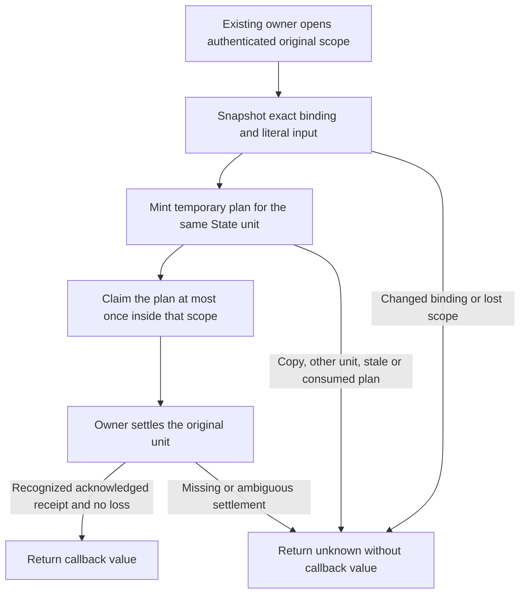

# Conditional event operation plans

## Overview

The internal event plan adapter binds a temporary plan to an existing owner's
original request scope and the same State unit. It prevents copied plans,
changed bindings, repeated consumption and results escaping a lost scope.

This is a source component with no production caller or selected custody
implementation. Calling it without that implementation returns unknown. It does
not authenticate requests, issue durable operations, persist a journal, send
messages, set cookies or provide a State-to-Gateway effect fence. Production
event dispatch remains unavailable until the actual owners supply and review
those boundaries. The adapter does not select a cross-process protocol, literal
text policy, session representation or retirement policy.

## Entry Points

- Trigger: an internal State consumer calls `createEventOperationPlanAdapter`.
- Source: `packages/occ/src/state/event-operation-plan.ts:createEventOperationPlanAdapter`.
- Required supplier: the existing request issuer and original-operation journal
  must recognize opaque witnesses, protected scopes and settlement/status receipts
  under `SelectedEventOriginalCustody`. A JSON object or Boolean verifier is not
  that supplier. Its field projections are comparison data only.

## Flow



## Execution Trace

### 1. Enter the selected original scope

`packages/occ/src/state/event-operation-plan.ts:createEventOperationPlanAdapter`

`withPlan` accepts a witness selector and expected original binding. It marks the
witness attempted before entering the selected owner. A failed or ambiguous
attempt cannot be retried with that witness in this adapter. This ephemeral set
is not the durable duplicate-dispatch journal and does not survive restart.

The selected owner's `withOriginalRequest` must recognize the witness, hold the
actual protected unit and current authority, and call the adapter with its
opaque scope. The adapter independently requires that exact unit identity and a
matching snapshot of every binding field and the original literal string. It
never normalizes text or recomputes an owner's input commitment. The actual
issuer/Gateway owners must still agree on their text bounds, provisional
command/stop rejection, digest semantics and authenticated request provenance.

The scope-loss signal is negative evidence only. It can close access; a signal
that has not fired cannot establish authority. Missing custody, malformed
projections, getters in comparison fields, wrong identities or an unavailable
scope fail closed without invoking the component callback.

### 2. Consume one temporary plan

`packages/occ/src/state/event-operation-plan.ts:claimEventOperation`

The adapter recognizes plans in its private map. A copied object, another
adapter's handle, a different unit, or a previously consumed plan is refused.
It checks the selected scope again before exposing the frozen binding. The
plan expires when its callback ends; retaining the object does not retain
permission.

The binding includes the owner-selected Installation, person/account, participant,
session, event, grant, Agent and conversation identities/incarnations, selected
entry/generation, target session, original operation/request and input commitment.
These values are exact comparisons, not a replacement authorization policy.
The callback belongs to the State unit. It must not use this component as
permission for an independent network send or browser effect.

### 3. Receive physical settlement and exact-original status

`packages/occ/src/state/event-operation-plan.ts:originalStatus`

Callback completion is not COMMIT evidence. The existing owner must recognize
its original settlement receipt. Unknown COMMIT, premature callback detachment,
duplicate callbacks, missing receipts or scope loss return unknown and suppress
the callback value. Scope loss during settlement inspection also suppresses it.

For status, the same owner authenticates the current requester and selects the
exact original record. Reauthentication may use a new session of the same
account incarnation only when that owner authorizes it; the record retains its
original session and full binding. The adapter reads no second journal. It
requires an owner-recognized status receipt, exact original binding/literal,
acknowledged original settlement and acknowledged lookup-unit settlement.
Absent rows, mismatched records, revoked scope or ambiguous results remain
unknown without protected status disclosure.

A returned known outcome is status data, never a safe-replay receipt or permission
for a new operation. Excluding late effects and authorizing a later intentional
operation remain with the actual invocation/journal and Gateway owners.

## Debugging and Verification

Run the dependency-independent component controls from the repository root:

```sh
node --test tests/conformance/event-operation-plan.test.mjs
```

They execute the real adapter against a deliberately limited opaque-scope
protocol fixture. They cover per-field/literal mismatch, forgery/copy, scope loss,
unit substitution, repeated consumption, ambiguous settlement, malformed owner
execution and exact-original status filtering. A settlement-loss regression was
observed failing before the final return guard was added. These are not
PostgreSQL, authentication, revocation-race, Gateway or installed-runtime proof.

Full type/lint and real same-State issuer/journal integration still need the
qualified dependency/source graph and selected suppliers. Real restricted-role
PostgreSQL, withdrawal/dispatch races, provider and browser qualification require
separate owned fixtures. Never replace that evidence with this protocol fixture.
No request input, commitments or protected status should be placed in routine
logs or URLs.

## Related docs

- [Platform design](../design.md)
- [Testing guide](../testing/README.md)
- [Invocation and content proposal](../../specs/31-basic-rbac/invocation-and-content.md)

## Manual Notes

[keep this for the user to add notes. do not change between edits]

## Changelog

- 2026-09-29 21:30: Document the internal conditional plan adapter and its unprovided production suppliers. (authoring-run/56b309b0-7373-4b17-b756-5cbd10f3be54 - afb96eec06558462eade80c95924ce6bc262d3f6)
