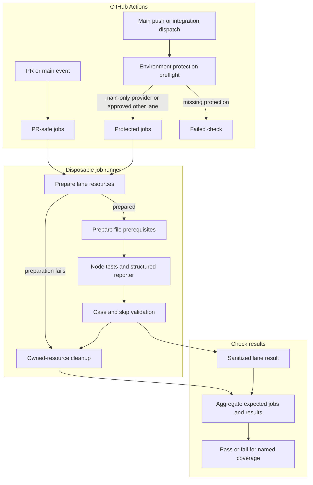

# GitHub Actions testing flow

## Overview

GitHub Actions selects explicit test lanes, prepares disposable resources, runs the real Node test runner, and rejects missing or skipped required coverage. This flow ends at the aggregate check and resource cleanup. A PR check proves its five selected noncredentialed lanes, including the logging collector lane; it does not establish that protected model or service integrations passed.

## Entry Points

- `.github/workflows/ci.yml:jobs`: PR, main push, merge-group and manual checks on ephemeral runners.
- `.github/workflows/full-integration.yml:jobs`: automatic `provider-account` on every main push, plus manual main-only integration, bound to the event commit.
- `scripts/ci/run-tests.mjs:main`: local or workflow `audit`, `run` and `aggregate` commands; the suite map is the coverage owner.

## Flow

## Execution Trace

### 1. Select one source revision and coverage group

`.github/workflows/ci.yml:jobs`, `.github/workflows/full-integration.yml:jobs`, and
`scripts/ci/full-integration-preflight.mjs:validateFullIntegrationPreflight`

The PR workflow uses the event checkout and supplies no external service credentials. Its aggregate requires exactly five lanes: `checks-baseline`, `postgres`, `images-packaging`, `k3d-fixture-configuration`, and `logging-collector`. Full Integration admits only `refs/heads/main`, checks configured environment protection, and checks out the immutable event SHA. A main push selects only `provider-account`; a manual dispatch selects its requested lane or `all`. Automatic runs use distinct concurrency groups so every push is retained. The provider environment must allow exactly the `main` branch and needs no per-run reviewer approval. Other credentialed environments still require reviewers with self-review prevention. No PR event enters this credentialed workflow. A targeted integration run has a narrower claim than a full inventory run.

Both workflows call the shared [run-ci-lane action](../../.github/actions/run-ci-lane/action.yml) after checkout. It owns tool and dependency setup, baseline checks when selected, lane preparation, execution, unconditional cleanup, and sanitized result upload. Callers keep the source revision, timeout, protected environment and explicit credentials.

Ordinary PR dependency caches may be restored and saved within GitHub's PR merge-ref scope. Main jobs use main-scoped caches. Test results and credential-bearing state are not dependency caches, and protected jobs do not promote PR build artifacts.

The provider job selects the shared `blacksmith-8vcpu-ubuntu-2404` runner for disk headroom during runtime image build and k3d import. The standard Ubuntu runner reached `DiskPressure` and evicted the seccomp probe before it could start. The repository must retain access to this organization runner label. Image preparation uses k3d's direct archive transport; the default tools-container transport reported success without registering the image on Blacksmith. The imported manifest and CRI checks remain required before any test starts.

### 2. Prepare resources under the job owner

`scripts/ci/prepare.mjs:prepareFile`

The preparation CLI records run-owned resources in a private state file before creating them. GitHub Actions passes that file under `RUNNER_TEMP`; it is available to later steps in the same job and is not uploaded as an artifact. Database tests receive a fresh migrated database per file and use the limited application role. Failure and Kubernetes database names satisfy the existing test admission guards. A cluster lane selects an explicit loopback k3d context. External images are pulled by their approved registry digest and exported for the selected platform; built and external images receive a run-owned reference at the imported platform manifest digest. Preparation records the original source image and checks Kubernetes CRI resolution before passing the immutable runtime reference to tests. Preparation failures still enter job cleanup.

The runtime image recipe pins compatible OpenClaw, Codex-plugin and Slack-plugin releases together with the Codex app-server version required by the plugin. Image startup smoke verifies fresh-home plugin loading, actual app-server initialization, and nested Codex home ownership for generated images and credential files before credentialed tests. Routing additionally requires the Gateway identity-scope contract; embedded continuity requires outgoing media to remain visible through history and artifact APIs across Pod replacement. A successful image build alone establishes none of those live outcomes.

For dedicated Codex preparation, each owned node supplies its actual `RuntimeDefault` syscall profile from a restricted probe Pod. In the same command path, preparation first verifies that `RuntimeDefault` denies the pinned Codex Bubblewrap sandbox, then preserves that baseline, adds the version-pinned Bubblewrap calls, installs the resulting Localhost profile, verifies its hash and effective OCI policy, and requires actual sandbox execution through the profile. A missing profile must prevent container creation. The selected relative profile path is passed to the live fixture as `runtime.codexSeccompProfile`; only the dedicated Codex container uses it. Node profile files belong to the disposable cluster, and temporary probe resources are cleaned before model tests. The live fixture checks the effective configured model before paid model turns. OpenShell continues to own containment for its provider-created Harness.

The suite map owns fixed selection flags, required input names, and the resources each lane needs. Preparation consumes those descriptors instead of maintaining parallel lane lists. External model, ChatGPT and Slack credentials come only from the selected protected environment. Missing selected inputs fail rather than turning the lane into a skipped success.

Current setup contract: routing preparation installs pinned Gateway API, cert-manager v1.18.4, and Envoy Gateway v1.6.7 controllers and creates a private test CA. Routing uses separate image identities for separate owners: Kubernetes Pods receive the prepared k3d-imported runtime digest reference, while the host TCP publisher receives `OCC_TEST_KUBERNETES_GATEWAY_DOCKER_IMAGE`, the Docker-local immutable image ID for the prepared gateway source image. OpenShell preparation uses the digest-pinned K3s v1.36.4 image with its `runc` handler, installs a matched kubectl, verifies the selected RuntimeClass with a smoke Pod, installs Agent Sandbox resources, acquires the OpenShell CLI/chart, and imports gateway and supervisor images. The RuntimeClass smoke proves runtime availability; the full OpenShell lane must prove the supervisor enforces approved filesystem access, process privileges, and endpoint/L7 network policy. The existing sidecar configuration keeps binary-aware policy disabled and grants neither `SYS_PTRACE` nor `DAC_READ_SEARCH`. Before creating the OpenShell cluster, preparation writes a private admission config under the owned cluster directory and mounts that exact file read-only into its server. Only the selected RuntimeClass is exempt; namespace and username exemptions remain empty. The API server must reject a violating ordinary Pod in a restricted namespace and admit the same Pod with the selected class before the RuntimeClass availability smoke runs. Logging preparation starts an owned OpenTelemetry Collector backend and passes JSONL evidence to selected tests. The Collector and Docker-model jobs use the shared [setup-test-docker action](../../.github/actions/setup-test-docker/action.yml) to pin Docker 29.4.0, which supports the production `fluentd-write-timeout` logging option. The action stops the preinstalled daemon on the ephemeral runner, installs Docker 29.4.0 through the SHA-pinned official Docker setup action, and points `/var/run/docker.sock` at the action socket so the CLI, production Compose, and Driver use one daemon. Other jobs keep the runner Docker daemon. Full-suite acceptance remains incomplete until main-only protected hosted execution records every selected lane. The [delivery status](../../specs/19-github-actions-test-coverage.md#delivery-status) owns current proof boundaries and live gaps.

The OpenShell test owns its management port-forwards for the full test lifetime. Teardown stops the worker before draining those forwards, then attempts the remaining app, database, namespace, and directory cleanup even if an earlier step fails. Forward shutdown waits for child exit and uses a bounded kill fallback; cleanup errors fail the test.

### 3. Execute and account for actual cases

`scripts/ci/run-tests.mjs:main` and `scripts/ci/reporter.mjs:jsonLinesReporter`

The runner discovers active test files and verifies that the map assigns each file to exactly one lane. Tests with different prerequisites live in separate files. The runner invokes whole files with invocation-scoped environment inputs. A custom Node reporter exposes case names, locations and outcomes; arbitrary test output and credential-bearing error payloads are excluded from published results.

Required named cases must pass. Every skip or TODO fails the selected lane; there are no counterpart-skip lists or CI name filters. A synthetic file-wrapper success, missing result output, zero executed cases or an interrupted run without final reporter output cannot establish coverage. The runner retains failure, timeout and cleanup outcomes in the lane result.

### 4. Clean up and publish the bounded result

`scripts/ci/cleanup.mjs:main` and `scripts/ci/run-tests.mjs:main`

Per-file cleanup releases its disposable database. Job cleanup removes only the state-owned resources. A whole owned `k3d-cluster` resource owns Kubernetes API object deletion for its Collector Namespace and RBAC. Logging cleanup cleans the local Docker backend container and JSONL/config directory independently, so a dead Kubernetes API does not block local log backend teardown. Cleanup failure fails the check and keeps the private state file usable only while that runner host and path remain available. User databases, contexts, unrelated containers and global images remain outside that ownership.

The aggregate runs after success or failure and checks expected job outcomes plus same-revision lane results. Case validation belongs to the runner; the aggregate checks lane identity and success, required evidence, and cleanup outcomes without interpreting cases again. Missing, failed, cancelled or skipped selected jobs cannot pass. A full-suite result accounts for every lane selected by the `full` group. The explicitly selected `ssh-host` lane remains outside the automatic groups until an operator prepares its disposable host; see [SSH raw-host testing](../testing.md#ssh-raw-hosts). Abrupt hosted-runner loss can prevent teardown and also loses the private `RUNNER_TEMP` state at job end. External resource reconciliation is deferred until an approved resource ledger exists.

## Debugging and Verification

- `node scripts/ci/run-tests.mjs audit` checks the actual checkout inventory against the suite map.
- `node --test tests/integration/ci-runner.test.mjs` exercises the runner with real child Node processes and controlled pass/fail/skip cases.
- Use the failing test's file, name and location in the sanitized result to reproduce its exact invocation with approved local prerequisites. Treat the named aggregate as its coverage boundary.
- On local Docker Desktop or equivalent VM-backed Docker hosts, run one Kubernetes lane at a time when disk or network pressure has caused measured instability. GitHub Actions still runs the configured matrix; this local guidance is for reproducible operator runs.
- Missing protected environments, tools, images or credentials are setup failures. Configure the approved resource; do not mark its required test skipped or replace it with a fixture.
- Retain sanitized results for seven days. Keep private cleanup state and credential files outside uploaded artifacts. On local runs, follow the run-owned state when recovering a failed teardown while that host and state path still exist.

## Related docs

- [Testing guide](../testing.md)
- [CI suite map](../../scripts/ci/test-suites.json)
- [Integration implementation specification](../../specs/19-github-actions-test-coverage.md)
- [Upstream infrastructure report](../../specs/reports/openclaw-testing-infrastructure.md)

## Manual Notes

[keep this for the user to add notes. do not change between edits]

## Changelog

- 2026-09-09: Run provider-account automatically for every main push, preserve main-only credentials, and retain per-run approvals for other credentialed lanes.

- 2026-09-08 07:42: Distinguish the explicit SSH host lane from automatic CI and full-group coverage. (01a07d92-d866-7731-afe5-abab67d8966c - 4d83087229961f3665b923d2581c0b71b988cc9c)

- 2026-09-05: Documented whole-file selection, centralized lane prerequisites, shared workflow execution and aggregate boundaries.

- 2026-09-04 22:40: Added the real-image nested Codex home ownership startup-smoke regression boundary. (01a06dd0-9fff-7e90-aae3-4e7099a6d154 - 216260fc902d43e99d6f7513d8c0f962c63f44f5)

- 2026-09-04 21:44: Documented the separate Docker-local gateway publisher image ID required by routing proof. (01a06dd0-9fff-7e90-aae3-4e7099a6d154 - e491e7618ee894e6cf0c2336e5d16081be512b73)

- 2026-09-04 21:04: Clarified that interrupted runs without final reporter output are not completed lane results. (01a06dd0-9fff-7e90-aae3-4e7099a6d154 - 87234e1766e5802b45424523246a52a4b2d45590)

- 2026-09-04 20:44: Clarified the dedicated Codex seccomp preparation order and the effective-model guard before live turns. (01a06dd0-9fff-7e90-aae3-4e7099a6d154 - d189689018ab11faa9b97d01d9c1310b597482f0)

- 2026-09-04 20:04: Documented runtime package compatibility, startup smoke and distinct routing/media acceptance gates. (01a06dd0-9fff-7e90-aae3-4e7099a6d154 - f7a85e72d70c46d05022aa0877665514d2cfd84d)

- 2026-09-04 13:52: Documented explicit CI selection, disposable resource ownership, Node outcome accounting and aggregate boundaries. (01a06dd0-9fff-7e90-aae3-4e7099a6d154 - f0b17b79e25b020e7cf1adb5ed143ef8adc502c2)
- 2026-09-04 14:13: Corrected hosted-runner cleanup-state limits and named the PR-safe logging collector lane. (01a06e43-6504-7810-9f09-4dd31b2e9681 - f0b17b79e25b020e7cf1adb5ed143ef8adc502c2)
- 2026-09-04 15:10: Clarified independent logging backend cleanup and local one-Kubernetes-lane-at-a-time guidance after measured Docker VM pressure.
- 2026-09-04 15:35: Documented the shared Docker 29.4.0 setup action for Collector and Docker-model compatibility.
- 2026-09-04 16:00: Pointed evolving proof status to spec19 after PR #23 head `27bd0e9` passed the hosted PR lanes and local live Docker-model execution passed.
