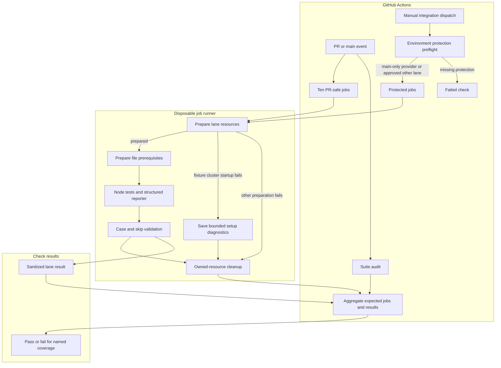

# GitHub Actions testing flow

## Overview

GitHub Actions selects explicit test lanes, prepares disposable resources, runs the real Node test runner, and rejects missing or skipped required coverage. This flow ends at the aggregate check and resource cleanup. A PR check proves its ten selected noncredentialed lanes; it does not establish that protected model or service integrations passed.

## Entry Points

- `.github/workflows/ci.yml:jobs`: PR, main push, merge-group and manual checks on ephemeral runners.
- `.github/workflows/full-integration.yml:jobs`: manual integration from main or an explicitly approved Kubernetes model branch, bound to the dispatched commit.
- `scripts/ci/run-tests.mjs:main`: local or workflow `audit`, `run` and `aggregate` commands; the suite map is the coverage owner.

## Flow

## Execution Trace

### 1. Select one source revision and coverage group

`.github/workflows/ci.yml:jobs`, `.github/workflows/full-integration.yml:jobs`,
`scripts/ci/full-integration-preflight.mjs:validateFullIntegrationPreflight`, and
`scripts/ci/test-suites.mjs:loadTestSuites`

The suite index, `scripts/ci/test-suites.json`, holds ordered lane references and
coverage groups. `loadTestSuites` loads each referenced
`scripts/ci/test-suites/<lane>.json` into the shared suite map. Each lane file owns
its test inventory, environment, required inputs, and preparation settings. The
runner and preparation tools consume the assembled map.

The PR workflow uses the event checkout and supplies no external service credentials. Suite Audit and all ten lanes start independently on ephemeral runners. Kubernetes fixture lanes use `ubuntu-22.04` for bridge netfilter support; other lanes and the audit use `blacksmith-8vcpu-ubuntu-2404`. Its aggregate uses `ubuntu-22.04` and requires a successful audit plus `checks-baseline`, `postgres`, `postgres-application`, `images-packaging`, `k3d-fixture-configuration`, `k3d-fixture-state`, `k3d-fixture-plugins`, `logging-collector`, `repository-credentials-container`, and `repository-credentials-platform`. A failed audit still fails CI Required even when the lanes pass. Full Integration checks configured environment protection and checks out the immutable event SHA. It admits `refs/heads/main` for every lane. Only `k3d-model` may use another branch: preflight requires an exact branch rule in `integration-model`, and GitHub still requires reviewer approval with self-review prevention. Wildcards, tags, and other non-main lanes are rejected. The administrator removes the temporary branch rule after verification. A manual dispatch selects its requested lane or `all`; pushes and merges do not start this workflow. Manual runs share one concurrency group and do not cancel an in-progress run. The provider environment must allow exactly the `main` branch and needs no per-run reviewer approval. Other credentialed environments still require reviewers with self-review prevention. No PR event enters this credentialed workflow. A targeted integration run has a narrower claim than a full inventory run.

PostgreSQL migration and application suites own separate servers. Each of the three Kubernetes fixture files owns a separate cluster and PostgreSQL server. For these Kubernetes fixture lanes, the shared action enables bridge netfilter on the ephemeral runner before creating k3d nodes, which share its kernel. Missing bridge filtering fails setup rather than running with unenforced Pod network policies. The repository credential platform lane uses Blacksmith for its full-image HTTP, PostgreSQL, Unix-control and credential-material proof; NetworkPolicy enforcement remains the fixture lanes' separate responsibility. Lane state and cleanup stay local to its runner; files within each lane remain sequential. The suite map retains one owner per file in both workflow groups.

Both workflows call the shared [run-ci-lane action](../../.github/actions/run-ci-lane/action.yml) after checkout. It owns tool and dependency setup, baseline checks when selected, lane preparation, execution, unconditional cleanup, and sanitized result upload. Callers keep the source revision, timeout, protected environment and explicit credentials.

Ordinary PR dependency caches may be restored and saved within GitHub's PR merge-ref scope. Main jobs use main-scoped caches. Test results and credential-bearing state are not dependency caches, and protected jobs do not promote PR build artifacts.

The provider job selects the shared `blacksmith-8vcpu-ubuntu-2404` runner for disk headroom during runtime image build and k3d import. The standard Ubuntu runner reached `DiskPressure` and evicted the seccomp probe before it could start. The repository must retain access to this organization runner label. Image preparation copies the saved archive into each owned k3d node and runs node-local `ctr image import`; k3d `tools-node` can log per-node import failures while returning success. The imported manifest and CRI checks remain required before any test starts.

### 2. Prepare resources under the job owner

`scripts/ci/prepare.mjs:main` and `scripts/ci/prepare.mjs:ensureK3dCluster`

[CI resource preparation](github-actions-testing/preparation.md) traces tool setup, image and cluster preparation, protected credentials, and resource ownership. Continue below when preparation has produced the lane state.

For the three Kubernetes fixture lanes, cluster startup records phase timings
and host snapshots. On failure, bounded diagnostic reads save
`<state-file>.diagnostics.json` outside the cluster directory before cleanup.
Creation uses `--no-rollback` for these lanes so the workflow owns teardown after
capture; local callers still invoke cleanup with their failed run's state file.
Collection preserves the original error, including when an observation fails or
times out. The [CI guide](../testing/ci.md) describes the retained evidence.

Dedicated Codex preparation and the operator's offline profile generator share
`scripts/lib/codex-seccomp-profile.mjs:deriveCodexBwrapProfile`. Preparation
requires an actual workspace write and denied write to a container-writable
outside path before publishing the selected Localhost profile to the live suite.
Native runtime-image tests trust a dynamic Codex Docker seccomp profile only when
`OPENCLAW_ENTERPRISE_CI_STATE` records the exact prepared
`cluster.codexDockerSeccompProfile` path and SHA. A self-hashed profile without
that state is not CI proof; the standalone fallback remains the pinned reviewed
manual profile. Production node provisioning remains outside CI ownership; see
[Codex sandbox setup](../guides/deploy/codex-sandbox.md).

### 3. Execute and account for actual cases

`scripts/ci/run-tests.mjs:main` and `scripts/ci/reporter.mjs:jsonLinesReporter`

The runner discovers active test files and verifies that the map assigns each file to exactly one lane. Tests with different prerequisites live in separate files. The runner invokes whole files with invocation-scoped environment inputs. A custom Node reporter exposes case names, locations and outcomes; arbitrary test output and credential-bearing error payloads are excluded from published results. Failed provider-test HTTP assertions also retain numeric actual and expected status codes, an allowlisted OCC error code, and the upstream ChatGPT operation and status when available. Denied-traffic failures retain only an allowlisted traffic category, without target addresses or response data. Plugin-status fixture failures retain an allowlisted readiness or rollout stage. Rollout diagnostics include bounded Pod phases, readiness and scheduling flags, container restart counts and exit codes, and allowlisted reasons. Response bodies, credentials, and identities remain excluded.

Required named cases must pass. Every skip or TODO fails the selected lane; there are no counterpart-skip lists or CI name filters. A synthetic file-wrapper success, missing result output, zero executed cases or an interrupted run without final reporter output cannot establish coverage. The runner retains failure, timeout and cleanup outcomes in the lane result.

### 4. Clean up and publish the bounded result

`scripts/ci/cleanup.mjs:main` and `scripts/ci/run-tests.mjs:main`

`.github/actions/run-ci-lane/action.yml` uploads one sanitized result artifact
per lane and workflow run. A job retry replaces that lane's earlier artifact;
other lanes retain their results. This prevents aggregation from selecting a
stale failed result after a successful retry. The earlier job logs remain the
failure record; retain a result separately before retrying when needed.

For `images-packaging`, `scripts/ci/export-image-reconciliation.mjs` attempts
to retain attempt-specific cleanup records for the two controller and runtime
tags prepared by the lane. A planned record does not prove an image was created.
The run-and-attempt component of each tag name is metadata, not authentication
or permission to delete an image. Missing state is reported as unavailable;
neither that result nor an empty inventory proves cleanup. The separate tag
created by the runtime-images test, other resource kinds, and private environment
values are excluded. Export or upload failure and runner loss can prevent retention.

Fixture bootstrap failures also upload `diagnostics-<artifact-prefix>-<lane>`
separately from test results. Cleanup removes the cluster and its private state;
the diagnostic file remains available for upload and does not satisfy the
aggregate's required test results.

Per-file cleanup releases its disposable database. Job cleanup removes only the state-owned resources. A whole owned `k3d-cluster` resource owns Kubernetes API object deletion for its Collector Namespace and RBAC. Logging cleanup cleans the local Docker backend container and JSONL/config directory independently, so a dead Kubernetes API does not block local log backend teardown. Cleanup failure fails the check and keeps the private state file usable only while that runner host and path remain available. User databases, contexts, unrelated containers and global images remain outside that ownership.

The aggregate runs after success or failure and checks expected job outcomes plus same-revision lane results. Case validation belongs to the runner; the aggregate checks lane identity and success, required evidence, and cleanup outcomes without interpreting cases again. Missing, failed, cancelled or skipped selected jobs cannot pass. A full-suite result accounts for every lane selected by the `full` group. The explicitly selected `ssh-host` lane remains outside the automatic groups until an operator prepares its disposable host; see [SSH raw-host testing](../testing/ssh.md#ssh-raw-hosts). Abrupt hosted-runner loss can prevent teardown and also loses the private `RUNNER_TEMP` state at job end. External resource reconciliation is deferred until an approved resource ledger exists.

## Debugging and Verification

- `node scripts/ci/run-tests.mjs audit` checks the actual checkout inventory against the suite map.
- `node --test tests/integration/ci-runner.test.mjs` exercises the runner with real child Node processes and controlled pass/fail/skip cases.
- Use the failing test's file, name and location in the sanitized result to reproduce its exact invocation with approved local prerequisites. Treat the named aggregate as its coverage boundary.
- On local Docker Desktop or equivalent VM-backed Docker hosts, run one Kubernetes lane at a time when disk or network pressure has caused measured instability. GitHub Actions still runs the configured matrix; this local guidance is for reproducible operator runs.
- Missing protected environments, tools, images or credentials are setup failures. Configure the approved resource; do not mark its required test skipped or replace it with a fixture.
- Retain sanitized results for seven days. Keep private cleanup state and credential files outside uploaded artifacts. On local runs, follow the run-owned state when recovering a failed teardown while that host and state path still exist.

## Related docs

- [Testing guide](../testing/README.md)
- [CI suite map](../../scripts/ci/test-suites.json)
- [Integration implementation specification](../../specs/19-github-actions-test-coverage.md)
- [Upstream infrastructure report](../../specs/reports/openclaw-testing-infrastructure.md)

## Manual Notes

[keep this for the user to add notes. do not change between edits]

## Changelog

- 2026-09-27 03:44: Retain bounded CI image cleanup evidence. (authoring-run/9266dd42-e257-4e84-b7ac-d6c87ba3ed23 - 3a1acc0db234f8d018593ea3a8b2fd59ad94a4da)

- 2026-09-26: Recorded the PR #445 Images and Packaging failure as a stale native-smoke seccomp hash, rejected the self-hash-only repair, and bound dynamic Docker seccomp profiles to the prepared CI state path/SHA. Local validation covered the helper case (1 pass, 11 image-dependent skips); earlier native image proof remains distinct from the changed harness.

- 2026-09-24 13:09: Document the shared offline seccomp generator and meaningful outside-workspace denial probe in the accompanying changes. (01a0d502-6efc-7063-a88c-4f1739da163c - b4b6a0e0d8700930f21d58b3724c055f8249c486)

- 2026-09-23 23:07: Document lane-owned suite definitions and the shared loader; retain workflow selection, preparation, and result accounting. (01a0d075-a358-7620-8c16-fd4290acddf1 - 4df9f9800836dc1c2b57afd5f8af4d91f55088d5)
- 2026-09-24: Trace fixture-cluster startup metrics and bounded failure diagnostics saved before cleanup.

- 2026-09-23 06:35: Start the audit and required lanes independently on the existing ephemeral Blacksmith pool; split PostgreSQL and Kubernetes fixtures across owned runners and retain the final coverage gate. (01a0ccf5-96e4-7541-9845-c9a6443fa7b2 - 3ac9d07a4d7ede8c4e1c010f598ef67673f97b74)

- 2026-09-21 01:50: Replace earlier lane result artifacts on retry so aggregation reads current evidence. (01a0c179-19f7-7111-8bb4-fc7680da5545 - e836c3f9ec002d91d6f26c6ca49a08345a8c9f4f)

- 2026-09-18 00:00: Bound plugin-status rollout diagnostics to allowlisted Pod and container state. (codex/01a0b0fc-4a24-76c0-8fb7-f3a3a434d464 - 18d8ef0d)

- 2026-09-17 23:40: Retain closed plugin-status wait stages in sanitized CI results. (codex/01a0b0fc-4a24-76c0-8fb7-f3a3a434d464 - 6ef5ff74)

- 2026-09-17 22:59: Gate fixture inputs on storage readiness after image import and expose bounded storage scheduling diagnostics. (codex/01a0b0fc-4a24-76c0-8fb7-f3a3a434d464 - a5a11ad1)

- 2026-09-17 20:55: Trace two-node plugin status fixture preparation, precise proxy ingress sources, shared test storage, and image verification on both nodes. (codex/01a0b0fc-4a24-76c0-8fb7-f3a3a434d464 - 7771526d)

- 2026-09-17 17:18: Allow manual Kubernetes model proof on an explicitly granted branch while retaining independent environment review and immutable checkout. (01a0acbf-4d5a-7413-9411-dce911f3ad23 - d5e41d93d601a0349d7d551ff45b50f7580d72f3)

- 2026-09-09: Restore manual-only Full Integration dispatch because the configured provider admin credential cannot authenticate from the hosted runner.

- 2026-09-09: Run provider-account automatically for every main push, preserve main-only credentials, and retain per-run approvals for other credentialed lanes.

- 2026-09-08 07:42: Distinguish the explicit SSH host lane from automatic CI and full-group coverage. (01a07d92-d866-7731-afe5-abab67d8966c - 4d83087229961f3665b923d2581c0b71b988cc9c)

- 2026-09-05: Documented whole-file selection, centralized lane prerequisites, shared workflow execution and aggregate boundaries.

- 2026-09-04 22:40: Added the real-image nested Codex home ownership startup-smoke regression boundary. (01a06dd0-9fff-7e90-aae3-4e7099a6d154 - 216260fc902d43e99d6f7513d8c0f962c63f44f5)

- 2026-09-04 21:44: Documented the separate Docker-local gateway publisher image ID required by routing proof. (01a06dd0-9fff-7e90-aae3-4e7099a6d154 - e491e7618ee894e6cf0c2336e5d16081be512b73)

- 2026-09-04 21:04: Clarified that interrupted runs without final reporter output are not completed lane results. (01a06dd0-9fff-7e90-aae3-4e7099a6d154 - 87234e1766e5802b45424523246a52a4b2d45590)

- 2026-09-04 20:44: Clarified the dedicated Codex seccomp preparation order and the effective-model guard before live turns. (01a06dd0-9fff-7e90-aae3-4e7099a6d154 - d189689018ab11faa9b97d01d9c1310b597482f0)

- 2026-09-04 20:04: Documented runtime package compatibility, startup smoke and distinct routing/media acceptance gates. (01a06dd0-9fff-7e90-aae3-4e7099a6d154 - f7a85e72d70c46d05022aa0877665514d2cfd84d)

- 2026-09-04 13:52: Documented explicit CI selection, disposable resource ownership, Node outcome accounting and aggregate boundaries. (01a06dd0-9fff-7e90-aae3-4e7099a6d154 - f0b17b79e25b020e7cf1adb5ed143ef8adc502c2)
- 2026-09-04 14:13: Corrected hosted-runner cleanup-state limits and named the PR-safe logging collector lane. (01a06e43-6504-7810-9f09-4dd31b2e9681 - f0b17b79e25b020e7cf1adb5ed143ef8adc502c2)
- 2026-09-04 15:10: Clarified independent logging backend cleanup and local one-Kubernetes-lane-at-a-time guidance after measured Docker VM pressure.
- 2026-09-04 15:35: Documented the shared Docker 29.4.0 setup action for Collector and Docker-model compatibility.
- 2026-09-04 16:00: Pointed evolving proof status to spec19 after PR #23 head `27bd0e9` passed the hosted PR lanes and local live Docker-model execution passed.
