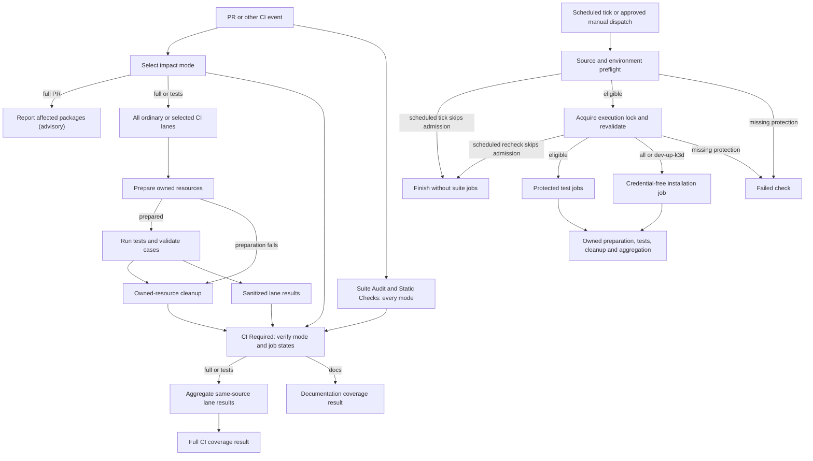

# GitHub Actions testing flow

## Overview

The [ordinary CI lanes](../testing/ci/required-checks.md) reject missing or skipped coverage. Docs-only runs execute Suite Audit and Static Checks. Neither proves credentialed integrations.

## Entry Points

- `.github/workflows/ci.yml:jobs`: PR, main push, merge-group and manual checks on ephemeral runners.
- `.github/workflows/qa-advisory.yml:jobs`: 6-hourly QA on `main`, and post-merge QA when `QA_ADVISORY_ON_PUSH` is `true`; trusted pull requests select [full or focused advisory QA](../testing/ci/qa-advisory.md).
- `.github/workflows/full-integration.yml:jobs`: scheduled and approved manual main integrations, pinned to `github.sha`.
- `.github/workflows/full-integration-execution.yml:jobs`: same-source revalidation and execution.

## Flow

```mermaid
graph TD
  A["PR or other CI event"] --> S["Select impact mode"]
  A --> N["Suite Audit and Static Checks: every mode"]
  S -->|full PR| Q["Report affected packages (advisory)"]
  S -->|full or tests| B["All ordinary or selected CI lanes"]
  B --> F["Prepare owned resources"]
  F -->|prepared| H["Run tests and validate cases"]
  F -->|preparation fails| J["Owned-resource cleanup"]
  H --> J
  H --> K["Sanitized lane results"]
  J --> G["CI Required: verify mode and job states"]
  S --> G
  N --> G
  K --> G
  G -->|full or tests| L["Aggregate same-source lane results"]
  G -->|docs| M["Documentation coverage result"]
  L --> R["Full CI coverage result"]
  C["Scheduled tick or approved manual dispatch"] --> P["Source and environment preflight"]
  P -->|scheduled tick skips admission| D["Finish without suite jobs"]
  P -->|eligible| V["Acquire execution lock and revalidate"]
  V -->|scheduled recheck skips admission| D
  V -->|eligible| E["Protected test jobs"]
  V -->|all or dev-up-k3d| U["Credential-free installation job"]
  U --> T
  P -->|missing protection| X["Failed check"]
  V -->|missing protection| X
  E --> T["Owned preparation, tests, cleanup and aggregation"]
```

## Execution Trace

### 1. Select one source commit and coverage group

`.github/workflows/ci.yml:jobs`, `.github/workflows/full-integration.yml:jobs`,
`.github/workflows/full-integration-execution.yml:jobs`,
`scripts/ci/full-integration-preflight.mjs:validateFullIntegrationPreflight`, and
`scripts/ci/test-suites.mjs:loadTestSuites`

`loadTestSuites` assembles `scripts/ci/test-suites.json` and ordered
`scripts/ci/test-suites/<lane>.json` references. Lanes own tests, environments,
inputs and preparation.

`run-tests.mjs:selectLane` and the action validate lane-owned focused paths before setup.
Focused results retain expected cases, environment and cleanup;
`validateLaneEvidence` rejects them for full-lane aggregation, including one-file lanes.

`CI Impact` selects coverage; `Suite Audit and Static Checks` verifies checkout identity in every mode. Ordinary CI uses the event checkout without external service credentials. The [coverage map](../testing/ci/required-checks.md#scenarios) lists lanes and `runtime-image-fixture`. Workflows select runners; Kubernetes requires a NetworkPolicy-enforcing kernel.

Pull requests compare the verified merge with its first parent using that parent’s
policy; the second parent must match the event head. Canonical main pushes use `before` policy
for the complete `before`→verified `after` diff. Missing history,
forced pushes, and older policies retain full CI.
Decoding preserves leading UTF-8 BOMs.
`scripts/ci/impact.mjs:documentationPath` admits allowlisted Markdown, `docs/docs.json`
and `specs/rfcs/**/*.png`. Generated API references, other images, executables and
symlinks require full CI.

Registered test changes may include docs and their own lane-manifest entries. CI runs
the owning lanes from either tree, adds `checks-baseline-2` for TypeScript, and uses
`checks-baseline-1` if only the fixture job would run. Test-only main pushes, other changes, and remaining event types select full CI. Missing policy or unverifiable source selects full or fails closed.

`CI Required` rechecks the mode and selected lanes. Impact, the combined static-checks job, and selected lanes must
succeed; other jobs must be skipped. Full and tests modes aggregate results from the same
source. Docs mode produces no test artifacts. The impact summary reports mode, fixed reason and accepted lanes, excluding paths and
raw output. Selector errors fail the job; missing evidence is unavailable.

For full-mode PRs, `affected-packages` verifies the checkout and reports dependents; it does not select tests or gate CI. Base-loaded policy cannot prevent PR changes to the workflow itself.

Full Integration checks out `github.sha`. [Scheduled admission](../testing/ci/full-integration.md#trigger)
checks the current main commit, cadence and exact execution receipts before the
automatic execution queue. The reusable workflow rechecks after acquiring the
queue. Manual dispatch retains dispatcher, team and environment checks and a
separate execution queue. Slack Live serializes channel/app access. Installation
and installed Skipper Git serialize per branch. Retry through a new
[approved dispatch](../testing/ci/configuration.md#environments).

`all` selects every suite. QA waits for Slack even after failure. Cancellation
stops QA. Aggregation requires the selected results.

PostgreSQL migration and application suites own separate servers; each Kubernetes fixture lane owns a separate cluster and PostgreSQL server. Before creating k3d nodes that share the runner kernel, the shared action enables bridge netfilter; missing filtering fails setup rather than leaving Pod network policies unenforced. The repository credential platform lane uses Blacksmith for full-image HTTP, PostgreSQL, Unix-control and credential-material proof; NetworkPolicy enforcement remains the fixture lanes' responsibility. State and cleanup stay on each runner; within a lane, `scripts/ci/run-tests.mjs:runLane` runs files sequentially except audited `parallelFiles`.

The application lane gives the native IAM barrier test its own migrated PostgreSQL database; only that test receives its application and migrator connection details, which the CLI keeps out of `GITHUB_ENV`. Its unregistered supplier stays in that disposable database. This fixture does not establish production writer participation in the barrier.

`runtime-artifact` supplies CI `image-lanes`, Full Integration's `image-lanes-same-sha`
and Docker Model Runtime, and First Agent Smoke. Aggregates check producer and consumers.

The [run-ci-lane action](../../.github/actions/run-ci-lane/action.yml) prepares, runs, and cleans up lanes and uploads sanitized results. Callers set the commit, environment, credentials, and timeout. Tests stop five minutes early.

PR dependency caches stay within GitHub's PR merge-ref scope; main caches stay main-scoped. Results and credential-bearing state are not caches; protected jobs do not promote PR artifacts.

### 2. Prepare resources under the job owner

`scripts/ci/prepare.mjs:main` and `scripts/ci/prepare.mjs:ensureK3dCluster`

[CI resource preparation](github-actions-testing/preparation.md) traces tool setup, image and cluster preparation, protected credentials, and resource ownership. Continue below when preparation has produced the lane state.

For `logging-collector`, `scripts/ci/prepare.mjs:prepareLane` pre-pulls the pinned Collector, Node, Prometheus and Grafana images before publishing lane inputs. The metrics test and preparation share the digests in `scripts/ci/metrics-monitoring-images.mjs:metricsMonitoringImages`. `scripts/ci/prepare.mjs:ensureDockerSourceImage` reuses a verified local repository digest or pulls through `scripts/ci/image-pull.ts:pullImage`, then verifies that digest before tests start containers. Registry 5xx and rate limits retry within the shared pull budget; missing manifests and authorization refusals fail preparation immediately. Explicit unpinned Node overrides keep the existing test-owned pull behavior.

`scripts/ci/prepare.mjs:imageBuildArgs` restores scoped BuildKit caches for hosted image jobs. Only the [CI Image Cache workflow](../../.github/workflows/ci-image-cache.yml) calls `warmImageCache` to export the shared controller/runtime cache. Full OpenShell lanes retain this builder and `SOURCE_DATE_EPOCH=0` through
[source-build tests](../testing/ci/openshell-execution.md#hosted-preparation).
Cache credentials stay in preparation.

Kubernetes preparation records host snapshots. Failed reads, bounded
by time and size, save `<state-file>.diagnostics.json` outside the cluster directory.
These lanes use `--no-rollback`; workflows own teardown after capture, while
local callers use the failed state file. Observation failures preserve the original error. `nodeLogExcerpt` orders Docker streams
and retry summaries by full UTC timestamp precision using locale-independent ASCII comparison ([CI guide](../testing/ci.md)).

`scripts/ci/run-tests.mjs:runFile` watches Compute-managed Pods and namespace
events in ready k3d clusters before tests delete them. On pass or failure,
`scripts/ci/k3d-diagnostics.mjs:projectAgentNamespaceActivity` records
`agentNamespaces`: up to 200 Pod and 200 event records per file and cluster, retaining 40
entries. Messages are redacted and truncated; Pod specs are omitted. Raw watches
use separate files in the cluster directory and are removed on completion.
Cluster-wide watches can include sibling namespaces under `fileConcurrency`.
Failed starts log `Agent namespace activity unavailable`. Each producing lane
uploads the artifact.

API or worker Deployment readiness can fail before any Agent Pod exists.
`tests/helpers/kubernetes-real.mjs:waitForDeploymentAvailable` captures logs
and Pod/event snapshots; the artifact retains the last eight `containerLogs`
records. Without configured runner capture, it emits a projected test diagnostic.
Snapshots marked `unavailable` are failed observations; missing records do not
prove healthy startup.

Dedicated Codex preparation and the operator's offline profile generator share
`scripts/lib/codex-seccomp-profile.mjs:deriveCodexBwrapProfile`. Preparation
requires an actual workspace write and denied write to a container-writable
outside path before publishing the selected Localhost profile to the live suite.
Native runtime-image tests trust a dynamic Codex Docker seccomp profile only when
`OPENCLAW_ENTERPRISE_CI_STATE` records the exact prepared
`cluster.codexDockerSeccompProfile` path and SHA. A self-hashed profile without
that state is not CI proof; the standalone fallback remains the pinned reviewed
manual profile. Production node provisioning remains outside CI ownership; see
[Codex sandbox setup](../guides/deploy/codex-sandbox.md).

`scripts/ci/staging-qualification.ts:pull` verifies release metadata and
[isolates pull credentials](../release/staging-qualification.md).
`smoke` runs trusted workflow code against the release images. Results identify
both commits.

### 3. Execute and account for actual cases

`scripts/ci/run-tests.mjs:main`, `scripts/ci/reporter.mjs:jsonLinesReporter` and `scripts/ci/failure-redaction.mjs:redactFailure`

Whole files run with scoped environments and one owning lane each; differing prerequisites require separate files. The reporter records case names, locations and outcomes. Results and logs retain failure messages (600 characters) and top frames (240). Redaction removes repository paths, replaces nonpublic job/child environment values (8+ characters) with `[env:NAME]`, and masks token/key shapes, URL passwords and `password=` values as `[redacted]`; generated values require a matching shape.

HTTP diagnostics retain numeric actual/expected statuses, allowlisted OCC codes and available ChatGPT operation/status. Denied traffic retains an allowlisted category and plugin failures an allowlisted readiness/rollout stage. Rollouts retain allowed Pod phases, readiness/scheduling flags, restart counts, exit codes and allowlisted reasons.

For captured Skipper failures, `skipper-release.ts:runSkipperOperation` provides the reporter and `skipperFailureSummary` with an operation label, bounded exit code and allowlisted signal/error code. Structured diagnostics exclude response bodies, credentials and identities.

`scripts/ci/openshell-progress.mjs:emitOpenShellProgress` emits fixed lifecycle
categories; `run-tests.mjs:runNode` adds lane/file labels. Installation ordinals
and millisecond offsets enter [file receipts](../testing/ci/openshell-execution.md#interpret-timing-and-proof),
not live logs. Readers bound partial records; parent byte limits apply first.
Markers and separators stay out of failure tails. Timing and case accounting remain separate.

For placement and proof observations available after a native first-Agent proof
failure, see
[interpret timing and proof](../testing/ci/openshell-execution.md#interpret-timing-and-proof).

Required cases must pass; every skip or TODO fails the lane. There are no counterpart-skip lists or CI name filters. Synthetic file-wrapper success, missing output, zero cases, or interruption without final reporter output cannot establish coverage. Lane results retain failure, timeout and cleanup outcomes.

### 4. Clean up and report results

`scripts/ci/cleanup.ts:main` and `scripts/ci/run-tests.mjs:main`

`.github/actions/run-ci-lane/action.yml` uploads one sanitized result artifact
per lane and run. A retry replaces that lane's artifact, preventing aggregation
of a stale result; other lanes retain theirs. Each attempt also uploads the same
file as `attempt-<run attempt>-<artifact-prefix>-<lane>`, which no aggregate
pattern matches, so a failed attempt's cases survive a `--failed` rerun.

`scripts/ci/memory-sampler.sh` samples memory pressure, RSS, process IDs,
containers and disk every 15 seconds, excluding arguments and environment.
`k3d-fixture-configuration` samples during tests and logs live summaries for
runner-loss diagnosis. Runtime startup and browser lanes sample from before
preparation through cleanup, then print summaries.

Each attempt uploads `memory-<artifact-prefix>-<lane>-attempt-<run attempt>`
(about 1 MiB maximum). Sampler and upload errors do not fail the lane.
Only live summaries survive runner loss.

For `images-packaging`, `scripts/ci/export-image-reconciliation.mjs` attempts to
retain attempt-specific cleanup records for prepared controller and runtime tags.
Planned records do not prove image creation; tag names confer no authentication
or deletion authority. Missing state is unavailable, and empty inventories do not
prove cleanup. The separate runtime-images test tag, other resource kinds and
private environment values are excluded. Export, upload or runner failure can
prevent retention.

Fixture bootstrap diagnostics upload separately as `diagnostics-<artifact-prefix>-<lane>-attempt-<N>`.
They survive cluster/private-state cleanup but cannot satisfy required test results.

Per-file cleanup releases its database; job cleanup removes owned resources. Deleting the
owned k3d cluster removes Collector RBAC and Namespace. Logging cleanup removes its Docker
backend and JSONL/config directory without Kubernetes. Cleanup errors fail the check except
for [hosted QA image warnings](github-actions-testing/preparation.md). Private state stays
on its original runner and path. User databases, contexts, unrelated containers and other
image references remain untouched.

`scripts/ci/cleanup.ts:execFile` awaits exit and drained output. On POSIX,
`scripts/ci/cleanup-command.ts` kills its group on caller IPC closure, including caller SIGKILL.
Completion drains output, kills grouped descendants and returns command status.
At [timeout](../testing/ci/configuration.md#runner-overrides), TERM then KILL still apply after
direct-child exit. Escaped groups are unsignaled; retained streams close after grace.
Windows bounds streams and terminates only the direct child.

`scripts/ci/run-tests.mjs:killDescendants` stops cleanup groups before sweeping descendants.
`tests/helpers/postgres-worker-revision-fixture.mjs:disposeStep` records timeouts and continues.
Root hooks allow two seconds for reports, immediately on cleanup failure; skipped hooks have a
60-second backstop. The runner reports failures; failed resources stay recorded.

`scripts/ci/run-tests.mjs:aggregateGroup` checks SHA, ownership, jobs and execution.
Reused lanes retain separate owners; fresh lanes retain matrix parents.
`scripts/ci/cleanup.ts:main` records final cleanup; missing state cannot clear failure.
Installed Skipper records its own. [Execution evidence](../testing/ci/full-integration.md#results-and-limits)
requires every lane's required cleanup to pass. Later delivery failures
keep checks red; missing artifacts cannot qualify.
`ssh-host` needs a [disposable host](../testing/ssh.md#ssh-raw-hosts).
Runner loss can prevent teardown and erase private `RUNNER_TEMP` state; external reconciliation
awaits an approved resource ledger.

## Debugging and Verification

- `node scripts/ci/run-tests.mjs audit` checks the actual checkout inventory against the suite map.
- `node --test tests/integration/ci-runner.test.mjs` exercises the runner with real child Node processes and controlled pass/fail/skip cases.
- Reproduce the reported case with approved prerequisites. The named aggregate bounds coverage.
- After measured disk or network instability on local VM-backed Docker hosts, run Kubernetes lanes sequentially. GitHub Actions retains its configured matrix.
- Missing protected environments, tools, images or credentials are setup failures. Configure the approved resource; do not mark its required test skipped or replace it with a fixture.
- Retain sanitized results for seven days; exclude private state and credentials from uploads. Recover local teardown using run-owned state on its original host and path.

## Related docs

- [Testing guide](../testing/README.md)
- [CI suite map](../../scripts/ci/test-suites.json)
- [Integration implementation specification](../../specs/plans/19-github-actions-test-coverage/index.md)
- [Upstream infrastructure report](../../specs/plans/19-github-actions-test-coverage/source-audit.md)

## Manual Notes

[keep this for the user to add notes. do not change between edits]

## Changelog

- 2026-11-10 19:00: Classify RFC PNG illustrations as documentation. (authoring-run/320d719f-dd4a-44fd-968c-59c377d1a5bc - b3f542cdf738ffcbc4c351e7c9123228ae76a415)

- 2026-11-10 18:32: Preserve safe Installed Skipper operation details for asynchronous failures. (authoring-run/0336b456-2d89-4535-9e04-eeb36c2970d9 - b4528e53458339a1df59473f068142675b1982a5)

- 2026-11-10 17:37: Admit eligible Full Integration work before acquiring its execution lock. (authoring-run/9f72faf1-4740-48d3-8519-5d38e749b961 - c6541831756ae40d0485d16d8f0ffeab9851372d)

- 2026-11-10 16:48: Consolidate native proof diagnostics and clarify observation limits. (authoring-run/62ff26b1-e2b9-4035-a938-e86a07a423b7 - faf4426fba16f164353970c5eaebd4b6b41b60f4)

- 2026-11-10 16:26: Reconcile installation receipts and cleanup coverage. (authoring-run/b99ad0c3-5ba1-40a6-8719-e0216a7c49a8 - 9641a352044b81f1f00afc40870ba54cccdefa75)

- 2026-11-10 16:05: Preserve cleanup failures across missing-state retries. (authoring-run/9259c9bd-8e96-4172-ba73-d945dedd0c0e - ef14f2ab13e47d703fd4bddac3c1862de65b0092)

- 2026-11-10 16:02: Document installation receipt retention. (authoring-run/a06db5de-e6ec-40b7-811e-7f04ff14b7e2 - 242eed4481d16c13227383acd8b58c4d8757ae1f)

- 2026-11-10 15:47: Require final lane cleanup evidence for execution coverage. (authoring-run/8af45432-2706-4ed9-aafd-7750cfea1905 - 60dba17cf36b796aee257e61499803b5dacc5a8c)

- 2026-11-10 13:06: Admit navigation in docs-only CI. (authoring-run/3fcf2723-e440-4ce4-8994-00066241bc2b - 554857e441d9348adfac651bd382c17ffef67c8d)

- 2026-11-10 12:53: Trace cache observations. (authoring-run/9ff30b3c-1145-4acb-9fa3-8a4eb3a5e594 - dd7a47c0e1d7428068bdc79d311ceb07fbea767f)

- 2026-11-10 10:38: Reconcile builder reuse and live progress documentation. (authoring-run/d839dc55-f4be-4689-85a1-3ab9527ad4c4 - 280ae7e6db4b38b68bd76bd7aefdd7d874d28bbd)

- 2026-11-10 10:19: Trace portable, bounded OpenShell progress through the reporter and runner. (authoring-run/d839dc55-f4be-4689-85a1-3ab9527ad4c4 - 1af8c3c4f21c6fe1c8b36ef9545e9e4754e74de6)

- 2026-11-10 10:07: Preserve the builder and epoch for full OpenShell source-build tests. (authoring-run/0c79fd33-2fb7-4114-a408-f08f34d1048d - ce80e6a6b254add076625a1087d098327370672c)

- 2026-11-10 09:09: Document qualified registry-tool reuse and APT setup deadlines in the preparation flow. (authoring-run/dc4064e9-3291-42b3-aaf2-9c36fb81f1a6 - 49e3f601c762f94c8d7b97f594c4a342986d68bd)

- 2026-11-08 08:28: Preserve matrix failure attribution alongside admitted CI reuse. (authoring-run/7219e3b9-3091-4a5b-8712-c543ff5f0c68 - 006cf6288913ff8eb56d0fbc2283885bd551ecc9)

- 2026-11-08 16:09: Reuse admitted same-source ordinary CI results before fresh Full Integration execution. (authoring-run/d394120a-859d-45f1-ba62-9bf9dd9b66c1 - 832dbfca29eca2dd3cb98bd9dd5d803d9100911e)

- 2026-11-08 16:02: Select documentation-only main pushes from verified before-tree policy. (authoring-run/bafcfe3a-329e-4d07-8f36-f178b64e37d0 - ca3ad3c4f3ec8ec5660ec2909bd4673adf78ff90)

- 2026-11-04 12:10: Isolate the Codex Git proof queue without Slack. (authoring-run/14bcb9d6-2d4c-449d-8bbc-b64e3ef7e632 - aa60a72115e342ec020d1083fb5e30c139202c84)

- 2026-11-06 09:03: Validate lane identity before attributing outcomes from matrix results. (authoring-run/acefb857-8e57-4f00-b7f5-ed9224944d88 - 048b2cd25cc59087bcb2551fce03a39eef023340)

- 2026-11-04 10:07: Consolidate Full Integration policy and bound the cutover proof routes. (authoring-run/79147f32-199a-48ad-9b7e-fbdf94bf9d60 - 2628dba73edd44e4980711129e48fb7842828019)

- 2026-11-03 01:07: Bind staging tests to release source. (authoring-run/c1bf6b1d-bea1-4de7-b3af-4a2ea197ba06 - d2fc28e1d6d70292e462956cedef0dae9281c48c)

- 2026-11-02 23:56: Trace staging authentication. (authoring-run/5817dfd2-487d-44bc-a2f7-2d57659ea0fc - db2cc11c4fd767c47394d680ef46bf26e1202fbc)

- 2026-10-29 02:11: Add focused Compose OpenShell selection and sanitized native worker observations. (authoring-run/01a17fae-f253-7d71-af12-d3f259c4faf0 - aa2cfe543b3bba361679e7e1a3028c3327d2c388)

- 2026-10-23 07:40: Preserve upstream CI selection alongside locale-independent timestamp ordering after conflict resolution. (authoring-run/01a10a81-070c-7aa3-97d0-fbce8f285d4d - a6a49a5192fa1c9cc5035801eed7d64b03336491)

- 2026-10-23 03:43: Order Docker timestamps and retain twelve latest retry kinds independently of locale. (authoring-run/01a10a81-070c-7aa3-97d0-fbce8f285d4d - 9bca605f5175bb225a522c3d5537a7ee6e1a7751)

- 2026-10-21 04:42: Preserve submillisecond Docker event order. (authoring-run/458f4777-70d1-4992-a922-ab387c6a4aba - e8185dac805b737363c7178d3068b310a53a7c24)

- 2026-10-14 22:31: Complete all selection. (authoring-run/d5130a41-8ae6-4a80-aef3-32d61a53348c - 9b50982b75a578d6967ee12befb1fa3904e20a38)

- 2026-10-14 14:09: Remove environment approvals. (authoring-run/ff0eb53f-ceb9-43fc-a81a-c1bc88b5c9fb - 909b0b9d4)

- 2026-10-14 14:04: Scope PAT authentication and OpenShell prerequisites. (authoring-run/dba0a6cb-33d9-40fd-b38b-e20cddf4b75f - 96a2b79fa)

- 2026-10-14 16:37: Document hosted QA image cleanup. (authoring-run/0733d076-37af-4fd5-ade5-869487072f47 - 1c406aef)

[GitHub Actions testing documentation history](github-actions-testing/history.md) preserves the older dated entries.
