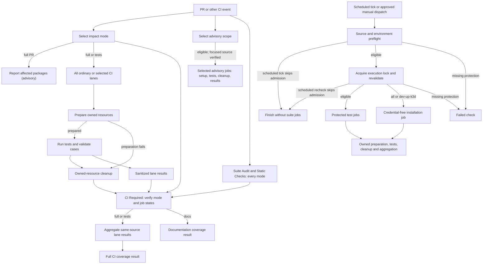

# GitHub Actions testing flow

## Overview

[Ordinary CI lanes](../testing/ci/required-checks.md) reject missing or skipped coverage. Docs-only static checks do not prove credentialed integrations.

## Entry Points

- `.github/workflows/ci.yml:jobs`: PR, main push, merge-group and manual checks on ephemeral runners.
- `.github/workflows/qa-advisory.yml:jobs`: 6-hourly QA on `main`, and post-merge QA when `QA_ADVISORY_ON_PUSH` is `true`; trusted pull requests select [full or focused advisory QA](../testing/ci/qa-advisory.md).
- `.github/workflows/full-integration.yml:jobs`: scheduled and approved manual main integrations, pinned to `github.sha`.

## Flow

```mermaid
graph TD
  A["PR or other CI event"] --> S["Select impact mode"]
  A --> AQ["Select advisory scope"]
  AQ -->|eligible; focused source verified| AJ["Selected advisory jobs: setup, tests, cleanup, results"]
  A --> N["Suite Audit and Static Checks: every mode"]
  S -->|full PR| Q["Report affected packages (advisory)"]
  S -->|full or tests| B["All ordinary or selected CI lanes"]
  B --> F["Prepare owned resources"]
  F -->|prepared| H["Run tests and validate cases"]
  F -->|preparation fails| J["Owned-resource cleanup"]
  H --> J
  H --> K["Sanitized lane results"]
  J --> G["CI Required: verify mode and job states"]
  S --> G
  N --> G
  K --> G
  G -->|full or tests| L["Aggregate same-source lane results"]
  G -->|docs| M["Documentation coverage result"]
  L --> R["Full CI coverage result"]
  C["Scheduled tick or approved manual dispatch"] --> P["Source and environment preflight"]
  P -->|scheduled tick skips admission| D["Finish without suite jobs"]
  P -->|eligible| V["Acquire execution lock and revalidate"]
  V -->|scheduled recheck skips admission| D
  V -->|eligible| E["Protected test jobs"]
  V -->|all or dev-up-k3d| U["Credential-free installation job"]
  U --> T
  P -->|missing protection| X["Failed check"]
  V -->|missing protection| X
  E --> T["Owned preparation, tests, cleanup and aggregation"]
```

## Execution Trace

### 1. Select one source commit and coverage group

`.github/workflows/ci.yml:jobs`, `.github/workflows/full-integration.yml:jobs`,
`.github/workflows/full-integration-execution.yml:jobs`,
`scripts/ci/full-integration-preflight.mjs:validateFullIntegrationPreflight`, and
`scripts/ci/test-suites.mjs:loadTestSuites`

`loadTestSuites` reads ordered `scripts/ci/test-suites.json` lanes: tests, inputs, preparation.

`run-tests.mjs:main` rejects noncanonical manifests before [complete attempts](../testing/ci/run-lanes.md#run-a-complete-local-attempt).

`runner-inputs.ts:parseArgs` rejects unknown options/repeated `--test-name` before effects. `--test-name=<literal>` accepts dashes. `selectLane` validates paths/names.
`runFile` requires one passing standalone case via an anchored, escaped pattern.
Preparation failures retain environment, cleanup and focus/name.
`validateLaneEvidence` rejects focused aggregation.

`CI Impact` selects coverage; `Suite Audit and Static Checks` verifies checkout identity.
[Ordinary CI](../testing/ci/required-checks.md#scenarios) uses the event checkout without external service credentials.
Workflows select runners. Kubernetes requires NetworkPolicy enforcement in the kernel.

Pull requests compare the verified merge to its first parent using that parent’s policy.
The second parent must match the event head. Main pushes use `before` policy for the
`before`→verified `after` diff. Missing history,
forced pushes, and older policies retain full CI.
Decoding preserves leading UTF-8 BOMs.
`scripts/ci/impact.ts:documentationPath` admits allowlisted Markdown, `docs/docs.json`
and `specs/rfcs/**/*.png`. Generated API references, other images, executables and
symlinks require full CI.

Registered test changes may include docs and their own lane-manifest entries. CI runs
the owning lanes from either tree, adds `checks-baseline-2` for TypeScript, and uses
`checks-baseline-1` if only the fixture job would run. Test-only main pushes, other changes, and remaining event types select full CI. Missing policy or unverifiable source selects full or fails closed.

`CI Required` rechecks mode and lanes: impact, static checks and selected lanes
must succeed; other jobs must skip. Full/tests modes aggregate same-source results;
docs emits no test artifacts. Impact summaries expose mode, fixed reason and
accepted lanes, excluding paths and raw output. Selector errors fail.

`affected-packages` verifies full-mode PR checkouts and reports dependents without
selecting tests or gating CI. Base-loaded policy cannot prevent PR workflow changes.

`.github/workflows/qa-advisory.yml:eligibility` selects fixed, nonempty scopes.
Focused jobs verify SHA and ordered PR parents. QA materializes only the
[selected credential](../testing/ci/qa-advisory.md#trigger).

Full Integration pins `github.sha`. [Scheduled admission](../testing/ci/full-integration.md#trigger)
rechecks main, cadence and receipts under lock.
`scripts/ci/full-integration-schedule-history.ts:readUnmarkedClock` requires explicit
targeting to ignore live shared work.
`scripts/ci/full-integration-preflight.mjs:fetchGithubJson` distinguishes malformed
JSON from request failures; diagnostics omit raw content.
Manual dispatch verifies dispatcher, team and environment.
Slack serializes channel/app access; installation and Skipper Git serialize per branch.
Retries require [approved dispatch](../testing/ci/configuration.md#environments).

First-attempt `all` reuse requires completed execution
(`scripts/ci/full-integration-reuse.ts:validateResults`). Success selects artifacts,
skipping lanes. Failure uses preflight’s fresh fallback.
QA awaits Slack despite failure, stops on cancellation, and requires selected results.

PostgreSQL migration and application suites own separate servers; each Kubernetes fixture lane owns its cluster and PostgreSQL server. Before creating k3d nodes, the shared action enables bridge netfilter in the shared runner kernel; missing filtering fails setup. The repository credential platform lane uses Blacksmith for full-image HTTP, PostgreSQL, Unix-control and credential-material proof; NetworkPolicy enforcement remains the fixture lanes' responsibility. State and cleanup stay runner-local; `scripts/ci/run-tests.mjs:runLane` runs files sequentially except audited `parallelFiles`.

Only the native IAM barrier test receives its migrated PostgreSQL database and both application and migrator connection details. The CLI excludes them from `GITHUB_ENV`. The unregistered supplier stays in this disposable database. Production writers still require separate barrier verification.

`runtime-artifact` supplies CI `image-lanes`, Full Integration's `image-lanes-same-sha`
and Docker Model Runtime, and First Agent Smoke. Aggregates check producer and consumers.

[run-ci-lane](../../.github/actions/run-ci-lane/action.yml) prepares and cleans resources, runs tests, and uploads sanitized results. Callers set source, credentials, environment and timeout; tests stop five minutes early.

Dependency caches stay scoped to GitHub PR merge-refs or main. Results and credential-bearing state are never cached; protected jobs never promote PR artifacts.

### 2. Prepare resources under the job owner

`scripts/ci/prepare.mjs:main` and `scripts/ci/prepare.mjs:ensureK3dCluster`

[Preparation](github-actions-testing/preparation.md) covers tools, images, clusters, credentials and ownership.

`scripts/ci/prepare.mjs:prepareLane` pre-pulls `logging-collector`’s configured
Collector and Node images and the shared Prometheus and Grafana pins.
`ensureDockerSourceImage` reuses verified local digests or verifies downloads from
`scripts/ci/image-pull.ts:pullImage` before publishing inputs. Registry 5xx/rate
limits retry within the shared budget; missing manifests/authorization refusals
fail immediately. Unpinned Node overrides retain test-owned pulls.

Full Integration requires [compatible cache exports](github-actions-testing/preparation.md)
before OpenShell source builds. These retain their builder and fixed epoch;
cache credentials stay in preparation. Mutable scopes make cache hits best effort.

`scripts/ci/k3d-preparation-diagnostics.ts` records Kubernetes host snapshots. Failed reads, bounded
by time and size, save `<state-file>.diagnostics.json` outside the cluster directory.
Fixture lanes use `--no-rollback` and registered teardown. Staged sign-in also
disables rollback, but unacknowledged creation requires reconciliation instead of
name-based deletion/retry. Observation failures preserve the original error.
`nodeLogExcerpt` orders streams and retry summaries by UTC timestamp and ASCII
comparison ([CI guide](../testing/ci.md)).

`scripts/ci/run-tests.mjs:runFile` watches Compute-managed Pods and namespace
events in ready k3d clusters before tests delete them. On pass or failure,
`scripts/ci/k3d-diagnostics.mjs:projectAgentNamespaceActivity` records
`agentNamespaces`: up to 200 Pod and 200 event records per file and cluster, retaining 40
entries. Messages are redacted and truncated; Pod specs are omitted. Raw watches
use separate files in the cluster directory and are removed on completion.
Cluster-wide watches can include sibling namespaces under `fileConcurrency`.
Failed starts log `Agent namespace activity unavailable`. Each producing lane
uploads the artifact.

Before Agent Pods exist, `tests/helpers/kubernetes-real.mjs:waitForDeploymentAvailable`
captures Deployment logs and Pod/events, retaining the last eight `containerLogs` records.
Without runner capture, it emits a projected diagnostic. `unavailable` means a
failed observation; missing records do not prove healthy startup.

Dedicated Codex preparation and the operator's offline profile generator share
`scripts/lib/codex-seccomp-profile.ts:deriveCodexBwrapProfile`. Preparation
requires an actual workspace write and denied write to a container-writable
outside path before publishing the selected Localhost profile to the live suite.
Native runtime-image tests trust a dynamic Codex Docker seccomp profile only when
`OPENCLAW_ENTERPRISE_CI_STATE` records the exact prepared
`cluster.codexDockerSeccompProfile` path and SHA. A self-hashed profile without
that state is not CI proof; the standalone fallback remains the pinned reviewed
manual profile. Production node provisioning remains outside CI ownership; see
[Codex sandbox setup](../guides/deploy/codex-sandbox.md).

`scripts/ci/staging-qualification.ts:prepare-signin` binds verified publications
to the reviewed v3 inputs and catalog; [staging qualification](../release/staging-qualification.md)
owns credential isolation and historical-pair limits.

### 3. Execute and account for actual cases

`scripts/ci/run-tests.mjs:main`, `scripts/ci/reporter.mjs:jsonLinesReporter` and `scripts/ci/failure-redaction.mjs:redactFailure`

`scripts/ci/runner-inputs.ts:normalizeFile` validates `file.env`.
`runFile` merges filtered inherited values, restored declared inputs, `lane.env`,
preparation defaults, `file.env`, then generated values; later values win.
`scripts/ci/prepare.mjs:prepareFile` separates defaults and outputs.
For OpenShell model selectors, `validateLaneInputsBeforeSideEffects` reads the
manifest entry; `runFile` forwards inputs with `file.env` precedence.
Unfocused `openshell`, `openshell-policy` and `openshell-installers` require both credentials before setup.
`scripts/k3d` scopes preparation with `--selected-file`.
Custom-destination/provider-file guards remain; other file values do not affect preparation.

The reporter retains names, locations, outcomes, failure messages (600 characters) and top frames (240). Redaction removes repository paths, substitutes nonpublic job/child values (8+ characters) with `[env:NAME]`, and masks token/key shapes, URL passwords and `password=` as `[redacted]`. Generated values require a matching shape.

HTTP diagnostics retain numeric actual/expected statuses, allowlisted OCC codes and available ChatGPT operation/status. Denied traffic retains an allowlisted category and plugin failures an allowlisted readiness/rollout stage. Rollouts retain allowed Pod phases, readiness/scheduling flags, restart counts, exit codes and allowlisted reasons.

`skipper-release.ts:runSkipperOperation` projects captured Skipper errors. After
failed installed proof, the workflow invokes `skipper-failure-receipt.ts` to publish
the wrapper's [checkpoints](../testing/ci/full-integration.md#results-and-limits).

`scripts/ci/openshell-progress.mjs:emitOpenShellProgress` emits fixed lifecycle
categories; `run-tests.mjs:runNode` adds lane/file labels. Installation ordinals
and millisecond offsets enter [file receipts](../testing/ci/openshell-execution.md#interpret-timing-and-proof),
not live logs. Readers bound partial records; parent byte limits apply first.
Markers and separators stay out of failure tails. Timing and case accounting remain separate.

Nested causes and AggregateError members match complete environment values and contextual assignments before raw credential-line filtering, token-shape replacement and head-and-tail windowing. Credential-bearing environment replacements keep a fixed marker until line filtering. Private keys are removed as whole blocks.

Required cases must pass; skips and TODOs fail. Synthetic wrappers, missing output, zero cases, or interruption without final reporter output cannot establish coverage. Results retain failure, timeout and cleanup outcomes.

The reporter projects `cause` and `AggregateError.errors` with context labels into
message/stack fields: at most 32 values/eight levels. It marks cycles/limits and
keeps shared siblings separate. `scripts/ci/failure-redaction.mjs:captureFailureText`
normalizes controls and contextual shapes before retaining complete leading/tail
lines within 16,384 JavaScript UTF-16 units, including omission markers.
Oversized lines may be omitted. Reporter flags preserve redacted tails; expanded
labels are re-budgeted. Artifacts omit flags. Top-frame and 600-character summary
limits remain. Integration covers Node events and diagnostic artifacts;
passing files gain no text.

### 4. Clean up and report results

`scripts/ci/cleanup.ts:main` and `scripts/ci/run-tests.mjs:main`

`.github/actions/run-ci-lane/action.yml` replaces only the retried lane’s sanitized result.
Separate `attempt-<run attempt>-<artifact-prefix>-<lane>` artifacts preserve failed
`--failed` attempts outside aggregation.

`scripts/ci/memory-sampler.sh` samples memory pressure, RSS, process IDs,
containers and disk every 15 seconds, excluding arguments and environment.
`k3d-fixture-configuration` samples during tests and logs live summaries for
runner-loss diagnosis. Runtime startup and browser lanes sample from before
preparation through cleanup, then print summaries.

Each attempt uploads `memory-<artifact-prefix>-<lane>-attempt-<run attempt>`
(about 1 MiB maximum). Sampler and upload errors do not fail the lane.
Only live summaries survive runner loss.

For `images-packaging`, `scripts/ci/export-image-reconciliation.ts` retains
prepared controller and runtime tag cleanup records when available.
Planned records do not prove creation; tags confer no authentication or deletion
authority. Missing state or empty inventories cannot prove cleanup. The runtime-images
test tag, other resources and private environment values are excluded.
Export, upload or runner failure can prevent retention.

Fixture bootstrap diagnostics upload separately as `diagnostics-<artifact-prefix>-<lane>-attempt-<N>`.
They survive cluster/private-state cleanup but cannot satisfy required test results.

Per-file cleanup releases databases; job cleanup removes owned resources,
including Collector objects and logging data.
Sign-in transitions and proof readers reject already-expired issuance observations.
Cleanup errors fail except [QA image warnings](github-actions-testing/preparation.md).
`cleanup-staged-signin.mjs` passes the prepared state digest and custody to
`scripts/ci/cleanup.ts:cleanupState`: locked validation precedes exact server/network
deletion and volume checks. A persisted mutation marker forbids fixture fallback
without completed cleanup; verified pre-mutation refusals retain fallback authority.
[Named-volume limits](../testing/local.md#staged-sign-in-cleanup) remain.

`scripts/ci/cleanup.ts:execFile` awaits exit and drained output. On POSIX,
`scripts/ci/cleanup-command.ts` kills its group on caller IPC closure, including caller SIGKILL.
Completion drains output, kills grouped descendants and returns command status.
At [timeout](../testing/ci/configuration.md#runner-overrides), TERM then KILL still apply after
direct-child exit. Escaped groups are unsignaled; retained streams close after grace.
Windows bounds streams and terminates only the direct child.

`scripts/ci/run-tests.mjs:killDescendants` stops cleanup groups before sweeping descendants.
`tests/helpers/postgres-worker-revision-fixture.mjs:disposeStep` records timeouts and continues.
Root hooks allow two seconds for reports (immediate on cleanup failure), with a
60-second skipped-hook backstop. Failed resources remain recorded.

`scripts/ci/run-tests.mjs:aggregateGroup` checks SHA, ownership, jobs and execution.
Reused lanes retain separate owners; fresh lanes retain matrix parents.
`scripts/ci/cleanup.ts:main` records final cleanup; missing state cannot clear failure.
Installed Skipper records its own. [Execution evidence](../testing/ci/full-integration.md#results-and-limits)
requires every lane's required cleanup to pass. Later delivery failures
keep checks red; missing artifacts cannot qualify.
`ssh-host` needs a [disposable host](../testing/ssh.md#ssh-raw-hosts).
Runner loss can prevent teardown and erase private `RUNNER_TEMP` state; external reconciliation
awaits an approved resource ledger.

## Debugging and Verification

- `node scripts/ci/run-tests.mjs audit` checks checkout inventory against the suite map.
- `node --test tests/integration/ci-runner.test.mjs 'tests/integration/ci-runner-{case-enforcement,file-outcomes,deadline,cleanup-allowance,preparation,failure-output,aggregate,scheduling,redaction,first-agent-startup,openshell-progress}.test.ts'` checks runner outcomes, preparation, redaction, startup, and OpenShell reporting.
- After measured local VM disk/network instability, serialize Kubernetes lanes; GitHub Actions keeps its matrix.
- Missing prerequisites fail setup; supply approved resources without skipping required tests or substituting fixtures.
- Retain sanitized results for seven days; exclude private state and credentials from uploads. Recover local teardown using run-owned state on its original host and path.

## Related docs

- [Testing guide](../testing/README.md)
- [CI suite map](../../scripts/ci/test-suites.json)
- [Integration implementation specification](../../specs/plans/19-github-actions-test-coverage/index.md)
- [Upstream infrastructure report](../../specs/plans/19-github-actions-test-coverage/source-audit.md)

## Manual Notes

[keep this for the user to add notes. do not change between edits]

## Changelog

- 2026-11-14 22:22: Preserve assignment and environment context before raw-line filtering. (authoring-run/6cc19f0f-1d72-4307-92f3-33db595ddbd0 - 1aaa74f56cee9e3232355e8f602a69f8ae9defa6)

- 2026-11-14 21:15: Filter raw credential lines before reporter capture. (authoring-run/43522968-bbfa-412f-b701-c1862347f735 - de8494ace762aa5903fd1119b67bb493b4faa579)

- 2026-11-14 13:17: Validate options. (authoring-run/d26b1f82-7e6f-460d-97d3-6a187c060e96 - cc06a6ec22b7071dc7913086a0d891da53d8f8be)

- 2026-11-12 11:00: Validate OpenShell cohort credentials. (authoring-run/2f421f2e-6313-4a70-a0e0-821995778b2f - 7040f7a648359a9c43d280b83efbc27be991049c)

- 2026-11-12 04:19: Reconcile admission history. (authoring-run/8af5a8e8-5e42-409d-b53e-989087ed46ce - e17d59871db7fbdf53543e055236a849d33f9efd)

- 2026-11-12 04:02: Repair admission diagnostics. (authoring-run/8403e2bb-cd27-449b-8ae7-ef78b7a05922 - 61ec16d5f18a8875213dd072b97384a880f82b25)

[GitHub Actions testing documentation history](github-actions-testing/history.md) preserves the older dated entries.
