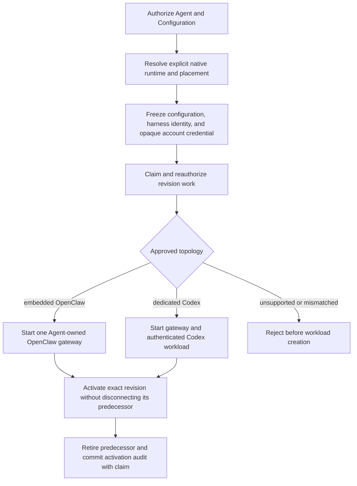

# Harness Execution Topology Flow

## Overview

An authorized deployment resolves its harness from native selected-model/provider policy, freezes
the Agent's explicit `embedded` or `dedicated` placement and provider-neutral account credential
in its AgentRevision, and asks Compute to start that topology. The flow ends after guarded route
publication, predecessor retirement, and exactly-once activation audit.

## Entry Points

- Trigger: exact-Agent `POST /namespaces/:namespaceId/agents/:agentId/deploy` and durable revision
  reconciliation.
- Source: `packages/occ/src/index.ts:OpenClawController.deployAgent` and
  `apps/controller/src/worker.ts:ControllerWorker`.
- Assumptions: authorized actor; ready Namespace; same-Namespace native agent Configuration;
  explicit Agent execution mode; and either operator-materialized API-key credentials or a
  Driver-issued, account-owned access-token Secret.

## Flow

## Execution Trace

### 1. Resolve and freeze the native harness

`packages/occ/src/index.ts:OpenClawController.deployAgent`

OCC authorizes and locks the exact Agent and Configuration. Selected-model/provider
`agentRuntime.id` explicitly selects `codex` or `openclaw`; only an unambiguous built-in
configuration defaults to embedded OpenClaw. Missing ambiguous/plugin runtime policy, conflicting
routes, unsupported IDs, and harness/mode mismatches fail closed. OCC validates each primary
and fallback model through the same resolver; fallbacks must keep the
primary provider and Harness. It preserves their order in the native configuration.
The admitted revision immutably
captures its native configuration, approved harness identity/version, explicit mode, Compute
selection, and Agent ServicePrincipal. Production admits both approved
`openclaw`/`embedded` and `codex`/`dedicated` combinations. An associated
`access_token` additionally requires dedicated Codex; the frozen account
contains only its OCC identity, credential kind, and opaque Secret reference.

### 2. Claim work and realize the approved topology

`apps/controller/src/worker.ts:ControllerWorker`

The worker claims exact revision work, reauthorizes its actor and ownership, revalidates its frozen
approved harness, and calls `ComputeDriver.prepareRevision`.

`apps/controller/src/drivers/compute/docker/index.ts:DockerComputeDriver.prepareRevision`

Docker embedded execution starts one Agent-owned OpenClaw gateway container. Dedicated
execution starts a separate Codex container before its gateway, using authenticated
`APP_SERVER_URL`/`APP_SERVER_TOKEN` WebSocket transport. Only the embedded gateway or
dedicated Codex container receives the provider key and workload-hook environment.

`apps/controller/src/drivers/compute/kubernetes/index.ts:KubernetesComputeDriver.prepareRevision`

Production dedicated workloads use separate Agent-owned gateway/Codex ServiceAccounts,
authenticated same-Agent transport, and default-deny NetworkPolicies. Native API-key execution
retains its independently materialized operator-owned model key. Provider-backed dedicated Codex
instead receives `CODEX_ACCESS_TOKEN` and `CODEX_CHATGPT_WORKSPACE_ID` directly from one
account-owned Secret; its separate gateway receives neither value. API-side Kubernetes Compute
creates that exact tenant Secret during credential issuance. The worker has no direct Secret API
permissions, although its trusted Deployment authority can indirectly project tenant Secrets.
Production embedded OpenClaw starts one combined gateway/Harness with the exact Agent
ServiceAccount, projected token, operator-materialized Agent-specific model key, and initially
nonserving gateway route; no Codex workload or app-server credential exists.

When a selected SandboxDriver provisions the dedicated Harness,
`providerHarnessReady` lists Pods using the same Agent/revision/role labels as
the active Service. It validates the complete observation and requires exactly
one nonterminating candidate with the supplied Harness labels and `Ready=True`.
An unready second live candidate blocks readiness even when the first is Ready.
Malformed or incomplete observations throw through the existing preparation
cleanup path. `activateRevision` repeats this check before changing routing.
See the [Kubernetes readiness contract](../reference/drivers/kubernetes-compute.md)
for candidate rules and the limits of this observation.

### 3. Publish safely and complete activation once

`apps/controller/src/worker.ts:ControllerWorker`

The predecessor's Kubernetes Service selector remains intact while
`prepareRevision` stages the replacement. The worker then commits the database
`activeRevisionId` with an exact compare-and-set before Kubernetes default
after-commit activation. During that cutover, `KubernetesComputeDriver.activateRevision`
can mutate the `Recreate` gateway Deployment and Service before the replacement
is ready. If activation, readiness, predecessor retirement, or audit completion
fails, the worker requeues the revision with `REVISION_FINALIZATION_INCOMPLETE`;
recovery retries activation and retirement for the already-active revision.
This path does not guarantee the previous route stays serving through every
failed cutover. Lost claims and foreign/stale workloads fail closed.

Kubernetes gateways in both modes mount their own persistent SQLite and media
directories. Embedded gateways also retain their attested default workspace on
the same private claim so continued turns survive Pod replacement. Dedicated
Codex receives only the shared workspace claim; the gateway's nested Codex home
remains ephemeral. The driver creates dedicated shared and private claims before
their consuming Pods and relies on workload readiness instead of waiting for
`Bound`, which would deadlock `WaitForFirstConsumer` storage classes. A nonroot
gateway-image init container prepares private SQLite and media directories
without credentials or elevated privileges.

For dedicated execution, the gateway entrypoint publishes bundled and plugin
skills into the shared runtime-assets tree before spawning OpenClaw, so Codex
sees the directional shared workspace, session, skill, and generated-image
mounts after the gateway has prepared them. Private gateway state, claim roots,
`CODEX_HOME`, tokens, and credentials remain outside the dedicated Harness.
For a selected Sandbox Driver, revision retirement always runs its required
cleanup after stopping a Compute-owned ordinary Harness, or delegates the
provider-owned Harness removal to that cleanup. A cleanup failure stops before
gateway teardown and remains retryable even when the ordinary Deployment is
already absent.
Predecessor retirement retains the current gateway and both owned claims; final
gateway teardown deletes the exact-owned private and shared claims by UID before
deleting the gateway. The [storage contract](../reference/drivers/kubernetes-compute/storage-and-credentials.md#gateway-storage)
owns claim sizes, mount paths, StorageClass requirements, and final teardown.

## Debugging and Verification

- Check placement, immutable policy, and conflicts:
  `node --test tests/conformance/configuration-occ.test.mjs`.
- Check guarded activation and recovery:
  `node --test tests/integration/postgres-worker-agent-revision.test.mjs` with its explicitly
  provisioned application-role PostgreSQL database.
- Run real disposable-k3d Kubernetes coverage for both production topologies, exact identity and
  model-key placement, authenticated dedicated transport, isolated networking, and active routing;
  an HTTP fixture or skipped cluster scenario is not model-turn proof.
- Run `node --test tests/integration/docker-compute-real.test.mjs` for real Docker Compose
  embedded and dedicated model turns, or
  `node --test tests/integration/harness-topology-k3d-real.test.mjs` for real Kubernetes
  model turns. Select each suite's runtime images, infrastructure, and credentials through the
  [test environment settings](../testing/docker.md#docker-compose-development-test-environment).
- Verify provider-backed dedicated Codex separately with
  `node --test tests/integration/service-account-driver-real.test.mjs`,
  `OCC_TEST_CHATGPT_SERVICE_ACCOUNT_REAL=1`, and an authorized mounted
  `OCC_TEST_CHATGPT_ADMIN_KEY_PATH`; this scenario does not use `OPENAI_API_KEY`.
- Treat unavailable credentials, runtime images, provider access, or either real model response as
  a verification failure. Never substitute a readiness probe, handshake, fixture, or skipped test.

## Related docs

- [Harness execution topology implementation specification](../../specs/.archive/07-harness-execution-topology.md)
- [Platform design](../design/workloads.md#openclaw-gateways)
- [Agent placement and deployment](../reference/agents/deployment.md#execution-mode)
- [Controller worker](../reference/controller/reconciliation.md#agentrevision-lifecycle)
- [Docker Compute Driver](../reference/drivers/docker-compute.md)
- [Kubernetes Compute Driver](../reference/drivers/kubernetes-compute.md)
- [Compute Driver lifecycle hooks flow](compute-driver-lifecycle-hooks.md)
- [Service Account Driver credential delivery flow](service-account-driver-credential-delivery.md)
- [Shared-drive specification](../../specs/.archive/12-dedicated-harness-shared-workspace-drive.md)

## Manual Notes

[keep this for the user to add notes. do not change between edits]

## Changelog

- 2026-09-01 19:09: Corrected Kubernetes after-commit activation semantics and merged the dedicated shared-workspace runtime ordering into this topology trace. (01a05f95-dd80-7011-990f-d1c46b5bb3cc - aa366c49c44834d59f74994c5fd37fb8096f169f)
- 2026-08-28 21:20: Removed host-process local-test topology coverage; document Docker and Kubernetes runtime execution and verification. (01a036f4-cf1d-7cc1-bbc1-000879038ac8 - 3ec166eb5fae39ed0f51ffb5ebd93338c4a2db94)
- 2026-08-28 17:58: Updated moved feature-reference links for the documentation organization. (01a036f4-cf1d-7cc1-bbc1-000879038ac8 - 4270aa29b7015562049f46c6027962fd85b584a9)
- 2026-08-27 00:05: Replaced the removed schema-contract suite with the authoritative harness-placement conformance test. (01a036f4-cf1d-7cc1-bbc1-000879038ac8 - ab560806dbd945436835ab092ebd10bf3e50d942)
- 2026-08-24 23:46: Distinguished operator-materialized API keys from API Compute-owned account Secrets, provider-neutral revision snapshots, direct dedicated-Codex token projection, and worker Secret authority. (01a03542-30ff-77a1-9967-587d55548ace - 51033bee121374332df2791e90e2290a5c892e5d)
- 2026-08-21 14:01: Consolidated explicit runtime selection, canonical approval, isolated dedicated credentials, predecessor-safe activation, and real dual model-turn proof. (01a021b2-292b-7ee1-ab55-4f8dc4f0ba7c - 8796ccc)
- 2026-08-21 12:43: Documented dedicated and embedded model execution, the supported shared model, isolated in-memory Codex authentication, managed execution policy, and bounded proxy propagation. (01a0119a-9843-7423-a4c6-955ff4187bd9 - be58d1b)
- 2026-08-21 19:17: Documented explicit placement, immutable native Harness resolution, embedded versus dedicated Compute ownership, existing production credential/transport boundaries, recoverable activation, and two real provider-turn integration scenarios. (01a021b2-292b-7ee1-ab55-4f8dc4f0ba7c - 149882c)
