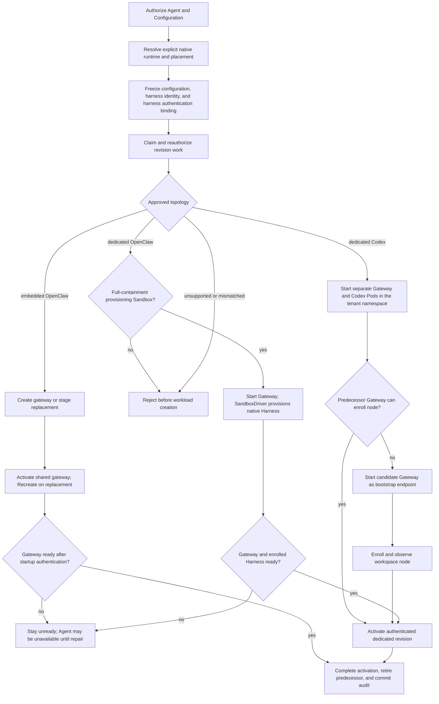

# Harness Execution Topology Flow

## Overview

Deployment freezes native Harness policy, placement and authentication in an
AgentRevision. Compute prepares its workloads, publishes guarded routes and
retires predecessors before exactly-once activation audit.

## Entry Points

- Trigger: exact-Agent `POST /namespaces/:namespaceId/agents/:agentId/deploy` and durable revision
  reconciliation.
- Source: `packages/occ/src/index.ts:OpenClawController.deployAgent` and
  `apps/controller/src/worker.ts:ControllerWorker`.
- Assumptions: authorized actor; ready Namespace; same-Namespace native agent Configuration;
  explicit Agent execution mode; and a supported `harnessAuth` binding. Managed methods reference an authorized OCC
  Secret API key or a Driver-issued account-owned access-token credential.

## Flow

## Execution Trace

### 1. Resolve and freeze the native harness

`packages/occ/src/index.ts:OpenClawController.deployAgent`

OCC authorizes and locks the exact Agent and Configuration. Selected-model/provider
`agentRuntime.id` explicitly selects `codex` or `openclaw`; only an unambiguous built-in
configuration defaults to embedded OpenClaw. Missing ambiguous/plugin runtime policy, conflicting
routes, unsupported IDs, and harness/mode mismatches fail closed. OCC validates each primary
and fallback model through the same resolver and preserves their native order;
fallbacks must keep the primary provider and Harness.
The admitted revision immutably
captures its native configuration, approved harness identity/version, explicit mode, Compute
selection, and Agent ServicePrincipal. Production admits approved
`openclaw`/`embedded` and `codex`/`dedicated`, and `openclaw`/`dedicated` only when
the selected SandboxDriver provisions Harnesses with networking, filesystem, and
process containment. An associated
`access_token` additionally requires dedicated Codex; the frozen account
contains only its OCC identity, credential kind, and opaque Secret reference.

### 2. Claim work and realize the approved topology

`apps/controller/src/worker.ts:ControllerWorker`

The worker claims exact revision work, reauthorizes its actor and ownership, revalidates its frozen
approved harness, and calls `ComputeDriver.prepareRevision`.

`apps/controller/src/drivers/compute/docker/index.ts:DockerComputeDriver.prepareRevision`

Docker starts an embedded gateway or dedicated Codex container but does not
support the harness-auth binding contract, so it has no currently deployable Agent
path; unsupported bindings fail before deployment.
In the underlying container path, `dockerGatewayConfigurationDocument` admits only
supported authentication fields and modes, and `reconcileGateway` generates the
managed `OPENCLAW_GATEWAY_PASSWORD` only for a new container. The
[Docker gateway authentication reference](../reference/drivers/docker-compute.md#gateway-authentication)
owns the mode and password rules.

Kubernetes supports managed bindings.
SSH supports `{ "method": "runtime" }` only for embedded OpenClaw: operator
credentials remain on the host and OCC checks gateway readiness without model
validation. See the [SSH flow](pr-24-ssh-compute.md).

`apps/controller/src/drivers/compute/kubernetes/index.ts:KubernetesComputeDriver.prepareRevision`

Kubernetes workload rendering calls `prepareHarnessAuth` once for the resolved
source. It projects the OCC Secret key only into embedded OpenClaw or a dedicated
Harness. Canonical sources live in the tenant storage target; Compute delivers selected fields into an
exact revision-owned Harness Secret, including the account token for ChatGPT.
Dedicated gateways receive neither model source. This namespace-local delivery
also applies to fixture images without native runtime configuration; only the
native dedicated transport token depends on that configuration.
See the [harness authentication flow](native-service-account-credential-delivery.md)
for admission, immutable source snapshots, and worker reauthorization.

Configured API composition, including development, and worker startup call
`KubernetesComputeDriver.preflight` through the optional Compute contract
before tenant reconciliation. In a single cluster it checks every page of storage
namespaces and refuses a legacy split target without altering its labels or state.
The [upgrade requirements](../reference/drivers/kubernetes-compute.md#existing-split-layout-installations)
own the operator boundary.

`ensureNamespace` prepares one single-cluster tenant namespace, including adopted
targets; its storage-role label enables discovery. Two-cluster Gateways retain
their control-cluster target. Dedicated Gateway and Harness Pods, identities,
and PVCs remain separate. `deliverGatewaySecrets` validates canonical sources;
`deliverHarnessAuth` creates selected model/transport projections.
Transport and Gateway passwords use separate sources across modes. Compute
retains legacy combined sources for older Pods and copies their password before
new templates reference the separate source. Concurrent creation adopts only an
exact-owned, identical password; foreign or conflicting sources fail.
[Namespaces and isolation](../reference/drivers/kubernetes-compute/networking-and-isolation.md#namespaces-and-isolation)
owns qualified DNS and exact NetworkPolicy/Service selectors. Harness selectors
include revision and network profile; Gateway selectors omit revision for stability.
`runtime.gatewayNodeSelector`
independently places the Gateway Pod and private-state initializer on trusted nodes.
After Harness readiness, preparation starts a candidate Gateway if its predecessor is stopped or unready. Activation waits for workspace node enrollment. Dedicated Codex keeps `agent-<agent digest>-workspace` across revisions.
`KubernetesComputeDriver.gatewayNativeHookRelayConfiguration` binds its callbacks to the Agent route; `AGENT_WITH_NODE_ENTRYPOINT` prepares private capability storage and TLS trust, and OpenClaw authorizes callbacks. See [native hook routing](../reference/gateway-routing.md#native-node-endpoint).

Dedicated Gateway and Harness ServiceAccounts remain separate. Compute owns the
Gateway Pod; the SandboxDriver owns the native Harness. OpenClaw enrolls from a
private one-use target, then reuses its persisted device token. Only the Harness
receives the model key. Compute pins it in a `dedicated-native` profile with
`inference: "worker"`: disconnection fails turns without Gateway inference.
Callbacks and session-bound admission scope transport to the Agent.
Embedded OpenClaw combines the workload, Agent identity, and model key.
The worker's scoped Secret and workload-writing permissions support delivery and
enrollment; Gateways receive no controller or Harness Kubernetes credentials.

The selected Sandbox consumes the same rendered projections and explicit login
mode in `HarnessWorkloadRequirements`. Unsupported upstream projection fails
without a test-only credential bridge.

Every Pod template Kubernetes Compute renders carries the ordinary
[network profile](../reference/drivers/kubernetes-compute/networking-and-isolation.md#explicit-network-profiles).
Ordinary allow policies and Gateway/Harness peers require it, and readiness
rejects a template without it.

When a selected SandboxDriver provisions the dedicated Harness,
`providerHarnessReady` lists Pods using the active Service's Agent/revision/role
labels and requires exactly one nonterminating `Ready=True` candidate with the
supplied Harness labels; malformed or incomplete observations throw through the
existing preparation cleanup path. `activateRevision` repeats this check before
changing routing. See the [Kubernetes readiness contract](../reference/drivers/kubernetes-compute.md#requirements)
for candidate rules and the limits of this observation.

### 3. Publish safely and complete activation once

`apps/controller/src/worker.ts:ControllerWorker`

Dedicated Compute declares `requiresStoppedPredecessors`: the worker stops all
predecessors, including Gateways, and waits for Pod termination before replacement.
Redeployment interrupts service, but both PVCs survive. Retry or a new revision
recovers a failed candidate. Recorded stops suppress repeated readiness/maintenance
calls. A returning predecessor makes its successor unready; the worker retries
its stop after one claim lease, then two, four, and so on. Failed preparation or
preparing/activating that predecessor clears its stop record. A newer exclusive revision supersedes old reconciliation and
maintenance, with no automatic rollback; see
[production revision stages](../reference/drivers/compute.md#production-revision-stages).
For dedicated Codex API-key auth, `pluginRuntimeSnapshot` in
`apps/controller/src/drivers/compute/kubernetes/index.ts` selects the bound source
endpoint before `runtime.codexModelBaseUrl`.
`apps/controller/src/drivers/openai-endpoint.ts:normalizeOpenAiBaseUrl` normalizes both sources.
`pluginRuntimeConfigMapData` in `apps/controller/src/drivers/compute/plugin-runtime.ts`
writes the HTTPS Responses endpoint/provider pair to the manifest and `config.toml`.
`apps/controller/src/drivers/compute/kubernetes/runtime-entrypoints.ts:probeCodexAuthentication`
passes it through CLI overrides because the probe ignores user configuration.
Account login modes and other Harnesses keep their endpoints; only the Harness holds model credentials.

For custom endpoints, `gatewayConfigurationDocument` calls
`apps/controller/src/drivers/compute/codex-model-configuration.ts:codexGatewayModelConfiguration`
to clone the admitted document. It qualifies parent and `subagents.model` selectors
under defaults and Agent entries, including primary/fallback objects, plus policy
keys and catalog IDs. Subagent-only selections enter the projected catalog; aliases
and omitted selectors retain their meaning. Full declared refs preserve native ID
namespaces, including `codex/`. OpenClaw separates the explicit provider for thread
start, resume, and turns; the Harness probe keeps the native ID. The admitted
Configuration remains unchanged.

Dedicated Codex and dedicated OpenClaw must complete a bounded native
authentication/model probe before their Harness becomes ready.
While first-deploy [workspace setup](workspace-files.md) is pending, embedded
preparation starts the replacement Gateway itself before activation. If the Gateway
of a revision that never served (its Service still selects no Pod) is unready,
for example after rejected model authentication, the next revision's preparation
repairs it with its own template instead of waiting on the failed predecessor.
The repair deletes an embedded predecessor's revision Secret and ConfigMap copies.

The worker commits the database `activeRevisionId` with an exact compare-and-set
before Kubernetes default after-commit activation.
`KubernetesComputeDriver.activateRevision` updates the shared gateway's `Recreate`
Deployment and Service. Embedded preparation does not validate the replacement's
credentials, so cutover can stop the serving gateway before the replacement
validates them in its own
[startup](native-service-account-credential-delivery.md#5-authenticate-during-runtime-startup).
The same bounded check
runs for initial and replacement gateways. A failed check, including a provider
timeout or rate limit, holds the gateway unready until repair and restart or a
new deployment. Readiness polling does not repeat model requests; worker retries
do not restart an unchanged Pod. No automatic rollback restores the predecessor.
Embedded activation also deletes embedded predecessor copies when it re-renders
the Gateway, even if the replacement never becomes ready.
For a dedicated predecessor, activation preserves copies while its Harness
Deployment or terminating Pod survives. Normal retirement stops the Harness
and removes the artifacts.

If activation, readiness, predecessor retirement, or audit completion fails,
the worker requeues the revision with `REVISION_FINALIZATION_INCOMPLETE`, or a
known wait's own [pending code](../reference/agents/deployment.md#pending-deployment-progress); recovery
retries activation and retirement for the already-active revision. Lost claims
and foreign/stale workloads fail closed. Dedicated activation waits for the
Gateway to report the workspace node it was handed; that wait is a 20-second
budget per revision and node across activation retries, then one status read per
retry, so a Gateway that never applies its node cannot hold the serial worker
on every retry. It and the pairing wait end early when other Work is claimable.

When stopping a revision, the Driver stops its Gateway within the pinned
runtime's 330-second stop budget and waits for Pod disappearance before stopping
the Harness, which stays available for active work. Idle shutdown, or one before
OpenClaw starts (wrappers run under `tini`), completes promptly. Forced
termination can delay the successor until the persistent owner lease expires.

Kubernetes gateways in both modes mount their own persistent SQLite and media
directories; embedded gateways also keep their attested default workspace on
that private claim so continued turns survive Pod replacement. Dedicated
Harnesses receive only the Harness workspace claim, which keeps the node
identity across Pod and revision replacement. The driver creates both claims
before their consuming Pods and relies on workload readiness instead of waiting
for `Bound`, which would deadlock `WaitForFirstConsumer` storage classes. The [Gateway storage](../reference/drivers/kubernetes-compute/storage-and-credentials.md#gateway-storage)
contract owns the ephemeral nested Codex home and the init container that
prepares private directories and `/tmp`.

Workspace-file access uses the enrolled Harness node; Gateway and Harness share
no workspace, session, skill, or image mounts. The [storage contract](../reference/drivers/kubernetes-compute/storage-and-credentials.md#harness-storage)
covers per-image assets and generated-image return.
The OpenClaw node host keeps Gateway-issued worker bundles in its own state and
workspaces below `/home/node/workspace`, away from gateway state, `CODEX_HOME`,
and credentials. A restart republishes image-owned
runtime assets and reconnects with the paired identity; readiness waits for the
bounded identity check. The compile cache and model-probe state stay in node
state and `TMPDIR`, which a Sandbox Driver can grant.

For a selected Sandbox Driver, stopping or retiring a revision always runs its
required cleanup after stopping a Compute-owned ordinary Harness, or delegates
provider-owned Harness removal to that cleanup. An absent ordinary Deployment
does not skip cleanup, so a cleanup failure remains retryable.
Revision retirement retains both owned claims even after stop removed the
gateway. When another revision's Gateway or route survives, retirement checks its exact
revision ownership before deleting resources. A successor in the shared namespace
keeps its Gateway Deployment, identity, Service and policies. `apps/controller/src/worker.ts:ControllerWorker.processAgentDeletion`
retires every revision before calling
`apps/controller/src/drivers/compute/kubernetes/index.ts:KubernetesComputeDriver.deleteAgentRuntimeCredentials`
to delete exact-owned private and shared claims by UID. Final deletion checks
all selected targets, independently of the Agent draft's current execution mode. Cleanup failures retry
before the worker removes the Agent's database identity. The [storage contract](../reference/drivers/kubernetes-compute/storage-and-credentials.md#gateway-storage)
owns claim sizes, mount paths, StorageClass requirements, and final teardown.

## Debugging and Verification

- Check placement, immutable policy, and conflicts:
  `node --test tests/conformance/configuration-occ.test.mjs`.
- Check guarded activation and recovery:
  `node --test tests/integration/postgres-worker-agent-revision.test.mjs` with its explicitly
  provisioned application-role PostgreSQL database.
- Check dedicated Gateway repair after an unready predecessor:
  `pnpm test:files --test-name-pattern='dedicated replacement starts a candidate Gateway' -- tests/conformance/kubernetes-compute.test.mjs`.
- Check embedded Gateway repair after a never-served unready predecessor:
  `pnpm test:files --test-name-pattern='never-served unready Gateway' -- tests/conformance/kubernetes-compute.test.mjs`.
- Run `node --test tests/integration/docker-compute-real.test.mjs` for real Docker Compose
  embedded and dedicated model turns, or
  `node --test tests/integration/harness-topology-k3d-real.test.mjs` for real Kubernetes
  model turns. Select each suite's runtime images, infrastructure, and credentials through the
  [test environment settings](../testing/docker.md#docker-compose-development-test-environment).
- Verify provider-backed dedicated Codex separately with
  `node --test tests/integration/service-account-driver-real.test.mjs`,
  `OCC_TEST_CHATGPT_SERVICE_ACCOUNT_REAL=1`, and an authorized mounted
  `OCC_TEST_CHATGPT_ADMIN_KEY_PATH`; this scenario does not use `OPENAI_API_KEY`.
- Treat unavailable credentials, runtime images, provider access, or either real model response as
  a verification failure. Never substitute a readiness probe, handshake, fixture, or skipped test.
- An HTTP 401 before worker admission means the callback missed the node-only
  worker ingress and fell through to the administrative route.

## Related docs

- [Harness execution topology implementation specification](../../specs/.archive/07-harness-execution-topology.md)
- [Platform design](../design/workloads.md#openclaw-gateways)
- [Agent placement and deployment](../reference/agents/deployment.md#execution-mode)
- [Controller worker](../reference/controller/reconciliation.md#agentrevision-lifecycle)
- [Docker Compute Driver](../reference/drivers/docker-compute.md)
- [Kubernetes Compute Driver](../reference/drivers/kubernetes-compute.md)
- [Compute Driver lifecycle hooks flow](compute-driver-lifecycle-hooks.md)
- [Service Account Driver credential delivery flow](service-account-driver-credential-delivery.md)
- [Shared-drive specification](../../specs/.archive/12-dedicated-harness-shared-workspace-drive.md)

## Manual Notes

[keep this for the user to add notes. do not change between edits]

## Changelog

- 2026-10-09 17:35: Qualify explicit subagent selectors; rename the Codex endpoint option. (agent:roboclaw:dashboard:9d0532e1-befb-4fc3-935e-7cd2a0c72110 - f9126efaada11f8cc18931aa8327f7e16cae59b6)

- 2026-10-08 04:40: Reconciled dedicated endpoint flow with current native callback routing. (authoring-run/02228d02-e16c-4a55-9a43-16b9efb35ebe - 31b1b6a9ab59f219d0fbe3d44b1550f8c8f2fe4a)

- 2026-10-07 12:07: Unify imported and managed PAT authentication while preserving source ownership and existing OAuth behavior. (01a0e5ec-d802-7800-9eb6-8022c1ac0d06 - be5006e62)
- 2026-10-06 11:17: Reconciled endpoint flow with current namespace and provider provisioning; condensed repeated prose. (agent:roboclaw:dashboard:9d0532e1-befb-4fc3-935e-7cd2a0c72110 - b6dc6b87a461ad33374e133d15cc739d8e074fea)
- 2026-10-05 14:24: Route dedicated Codex native hook callbacks with per-relay capabilities. (authoring-run/05067642-df93-4716-8f90-5b7430e50c41 - dfa091b6)
- 2026-10-05 11:36: Normalize runtime endpoints with the shared Driver validator; trim repeated topology narration. (agent:roboclaw:dashboard:9d0532e1-befb-4fc3-935e-7cd2a0c72110 - 9958ef0412565864efba7b13995536d7c2a51d22)
- 2026-10-05 00:06: Add custom Codex Responses endpoint selection and explicit native-provider rendering while preserving admitted model IDs and Harness-only credentials. (authoring-run/4e4824a1-f107-44c2-90bf-00fe13ff650c - d269c6d03)

- 2026-10-03 16:02: Run configured development API and worker Compute preflight before admitting work. (01a0fe72-58b2-7cc3-b770-7310f5401deb - c04093189f2ba6240f8dc431847c2f487afd11de)

- 2026-10-03 15:38: Refuse unsafe split-layout upgrades and converge concurrent legacy password creation. (01a0fe72-58b2-7cc3-b770-7310f5401deb - 94364ae9)

- 2026-10-02: Stabilize canonical credential layout across execution modes with legacy source compatibility. (01a0fe72-58b2-7cc3-b770-7310f5401deb)

- 2026-10-02: Retain dedicated predecessor projections during shared-namespace embedded cutover until Harness retirement. (01a0fe72-58b2-7cc3-b770-7310f5401deb)

- 2026-10-02: Share the single-cluster tenant namespace while preserving role-specific runtime delivery and revision cleanup. (01a0fe72-58b2-7cc3-b770-7310f5401deb)

- 2026-10-02 14:00: End node pairing and ack waits early for claimable Work. (r7-d221)

- 2026-10-02 12:00: Delete a replaced embedded predecessor's Secret and ConfigMap copies at activation re-render. (fix-d280-embedded-retire)

- 2026-10-02 06:00: Budget the workspace node binding ack wait per binding across activation retries. (fix-deploy-node-pairing)

- 2026-09-30 09:30: Include the Harness network profile in Service selectors for EKS policy resolution. (authoring-run/1373b7f3-e273-466a-b9da-bb197bdb469e - 0d00e8970b69)

- 2026-09-30 21:00: Delete a repaired embedded predecessor's Secret and ConfigMap copies at repair time. (fix/dogfood3b-1)

- 2026-09-30 10:30: Repair a never-served unready embedded Gateway during redeploy with pending workspace setup. (fix-dogfood-1)

- 2026-09-30 09:54: Correct dedicated replacement: the worker stops the predecessor Gateway before preparation, so redeploys interrupt service. (authoring-run/a37a9c9b-9e94-4bd2-88c5-dfa5c5f94d12 - 90899dc55ab7)

- 2026-09-28 02:55: Trace dedicated native OpenClaw on paired node hosts with full-facet Sandbox provisioning. (oce-pr-440-sync - e2b739f51f89)

- 2026-09-25 18:25: Document candidate Gateway bootstrap during dedicated recovery from an unready predecessor. (authoring-run/9b15ee1e-3767-4dd0-8d9a-56ad2087dcb5 - 7b2345a3cd6e78b9c7c8bae530f3379db56be443)

- 2026-09-24 11:28: Document exclusive dedicated preparation and durable RWO workspaces in the accompanying change. (01a0cf72-6985-7712-ba92-d8cc32470f24 - 14a4508baad876d3eea4e6fe6388f8d8a91559b7)

[Harness execution topology documentation history](harness-execution-topology/history.md) preserves the older dated entries.
